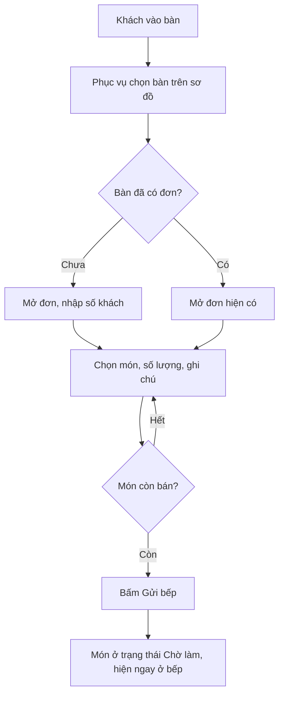
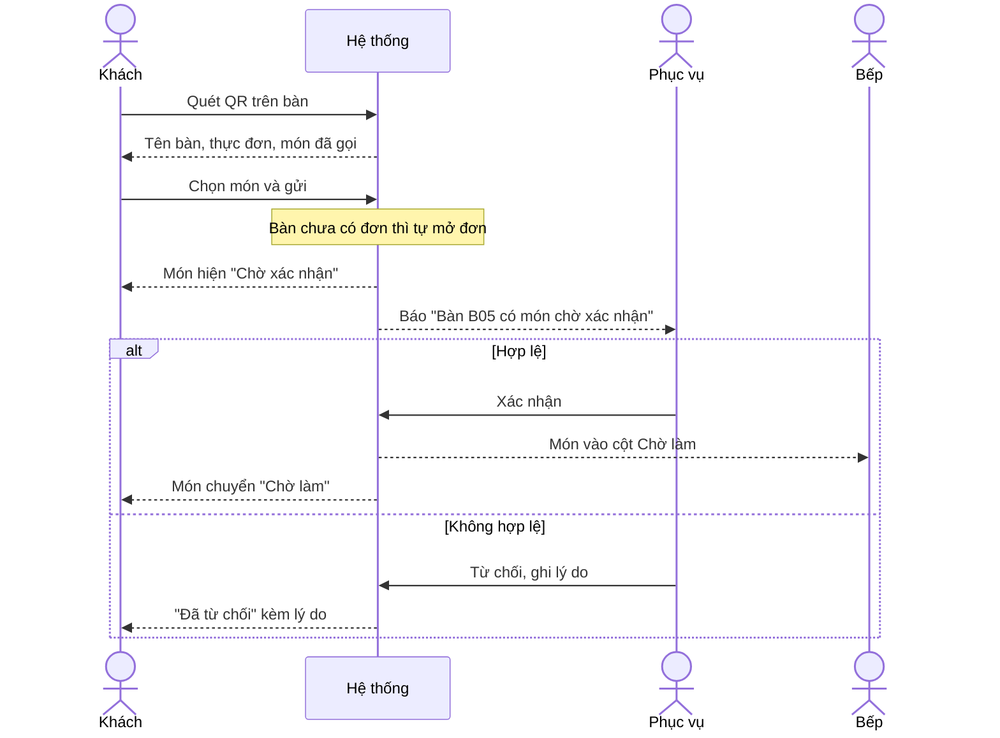
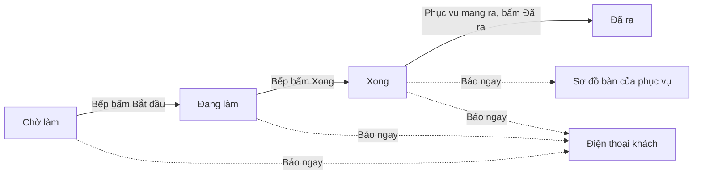
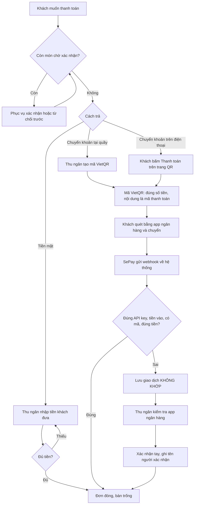
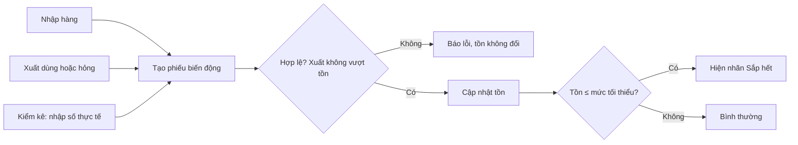

# 4. Quy trình nghiệp vụ

## 4.1 Trước và sau khi có hệ thống

| Việc | Hiện tại | Khi có hệ thống |
|---|---|---|
| Gọi món | Ghi giấy, chạy xuống bếp | Phục vụ gọi trên điện thoại, hoặc khách tự gọi bằng QR |
| Báo bếp | Đọc to hoặc ghim phiếu | Món hiện ngay trên màn hình bếp |
| Biết món xong | Bếp gọi to | Sơ đồ bàn và điện thoại khách tự cập nhật |
| Nhận chuyển khoản | Thu ngân dò app ngân hàng | Webhook tự xác nhận, màn hình tự báo |
| Kho | Sổ tay | Phiếu nhập, xuất, kiểm kê và cảnh báo sắp hết |
| Doanh thu | Cộng tay cuối ngày | Báo cáo theo ngày, phương thức, món |

## 4.2 P1 — Phục vụ gọi món

## 4.3 P2 — Khách gọi món qua QR, nhân viên xác nhận

## 4.4 P3 — Chế biến và ra món

## 4.5 P4 — Thanh toán

## 4.6 P5 — Kho nguyên liệu

