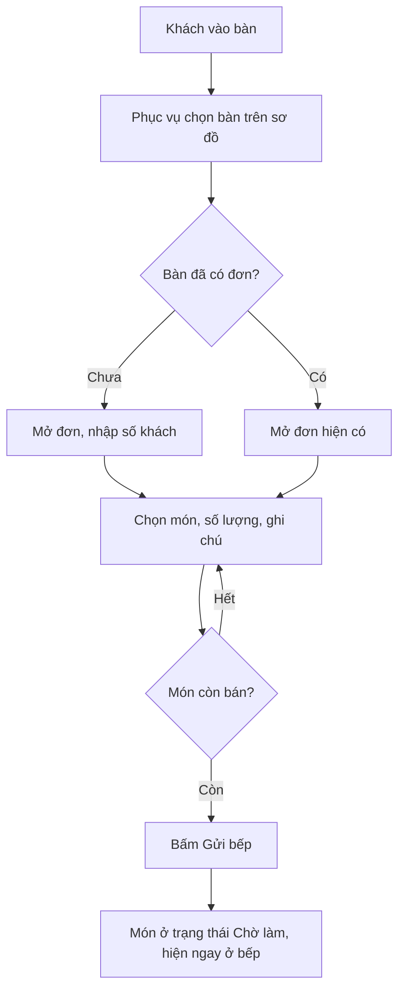
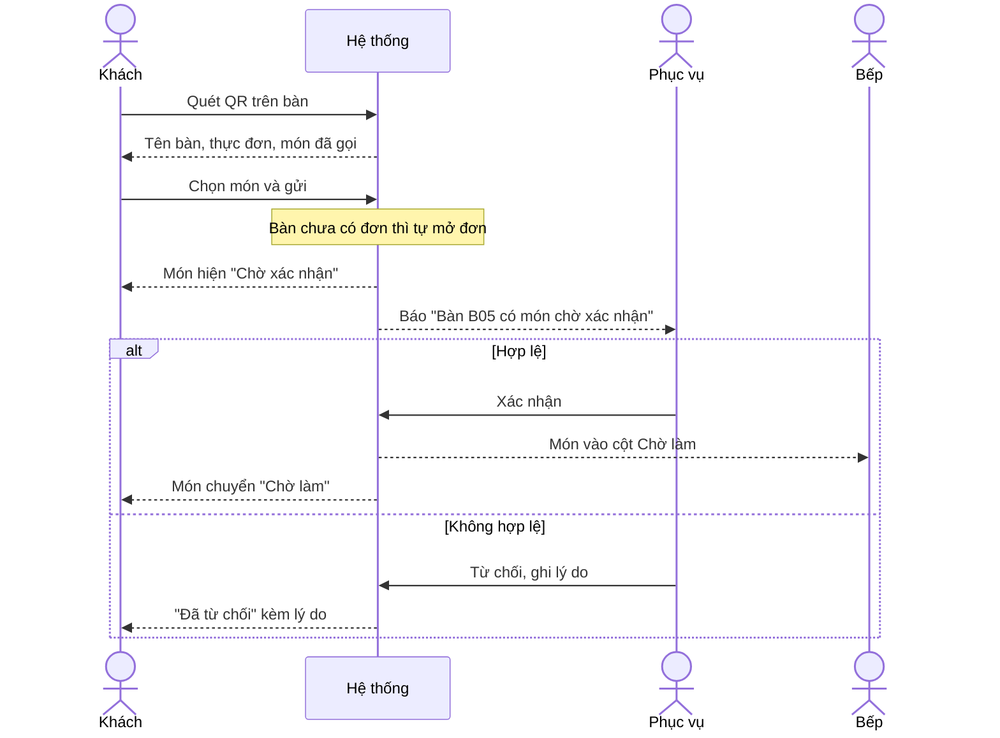
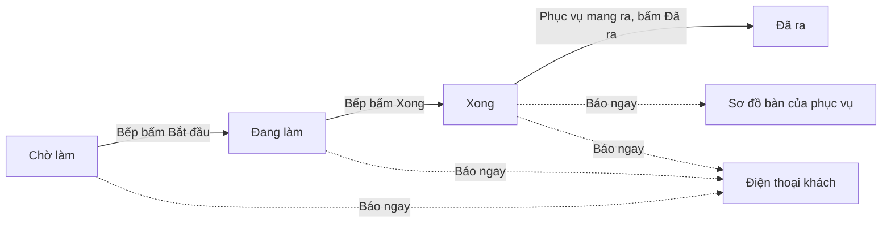
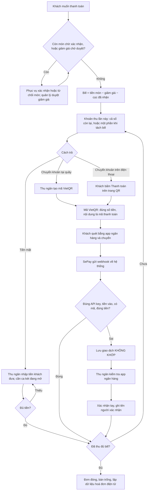
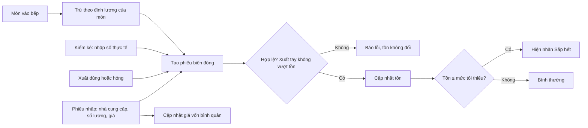
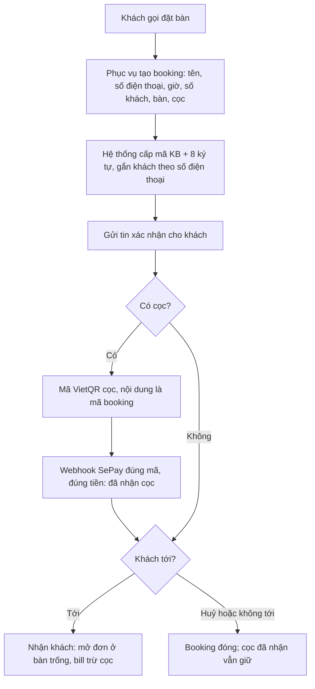
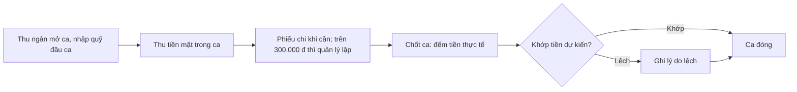
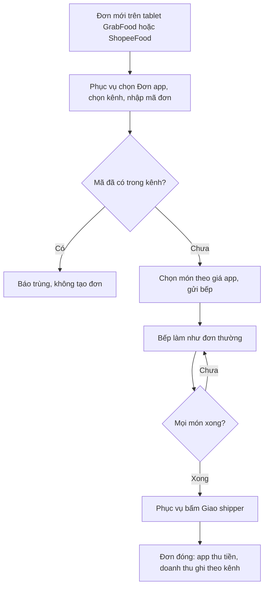
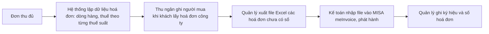
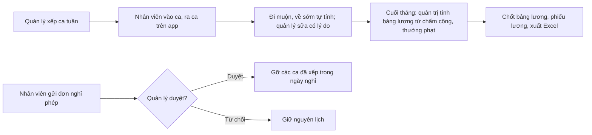

# 4. Quy trình nghiệp vụ

## 4.1 Trước và sau khi có hệ thống

| Việc | Hiện tại | Khi có hệ thống |
|---|---|---|
| Gọi món | Ghi giấy, chạy xuống bếp | Phục vụ gọi trên điện thoại, hoặc khách tự gọi bằng QR |
| Báo bếp | Đọc to hoặc ghim phiếu | Món hiện ngay trên màn hình bếp |
| Biết món xong | Bếp gọi to | Sơ đồ bàn và điện thoại khách tự cập nhật |
| Nhận chuyển khoản | Thu ngân dò app ngân hàng | Webhook tự xác nhận, màn hình tự báo |
| Kho | Sổ tay | Phiếu nhập, xuất, kiểm kê và cảnh báo sắp hết |
| Doanh thu | Cộng tay cuối ngày | Báo cáo theo ngày, phương thức, món |
| Giảm giá, tặng món | Tuỳ người thu, không ghi lại | Có lý do; vượt hạn mức thì quản lý duyệt; ghi nhật ký |
| Tiền trong két | Đếm cuối ngày, không biết lệch vì đâu | Mở ca, phiếu chi, chốt ca so tiền đếm với tiền dự kiến |
| Đặt bàn, cọc | Ghi sổ, dò app ngân hàng xem cọc | Booking có mã; cọc chuyển khoản tự xác nhận, tự trừ vào bill |
| Đơn app giao hàng | Xem trên tablet của app, dễ sót hoặc nhập trùng | Nhập theo mã đơn app, vào bếp như đơn thường, doanh thu theo kênh |
| Hoá đơn điện tử | Kế toán gõ lại từ bill giấy | Dữ liệu hoá đơn lập sẵn khi thu đủ, xuất file để nhập vào MISA |
| Ca làm, lương | Xếp ca trên giấy, chấm công tay | Xếp ca, chấm công vào ra, nghỉ phép, bảng lương tính từ chấm công |

## 4.2 P1 — Phục vụ gọi món

## 4.3 P2 — Khách gọi món qua QR, nhân viên xác nhận

## 4.4 P3 — Chế biến và ra món

## 4.5 P4 — Thanh toán

## 4.6 P5 — Kho nguyên liệu

## 4.7 P6 — Đặt bàn và cọc

## 4.8 P7 — Ca két

## 4.9 P8 — Đơn app giao hàng

## 4.10 P9 — Hoá đơn điện tử

## 4.11 P10 — Ca làm và lương

