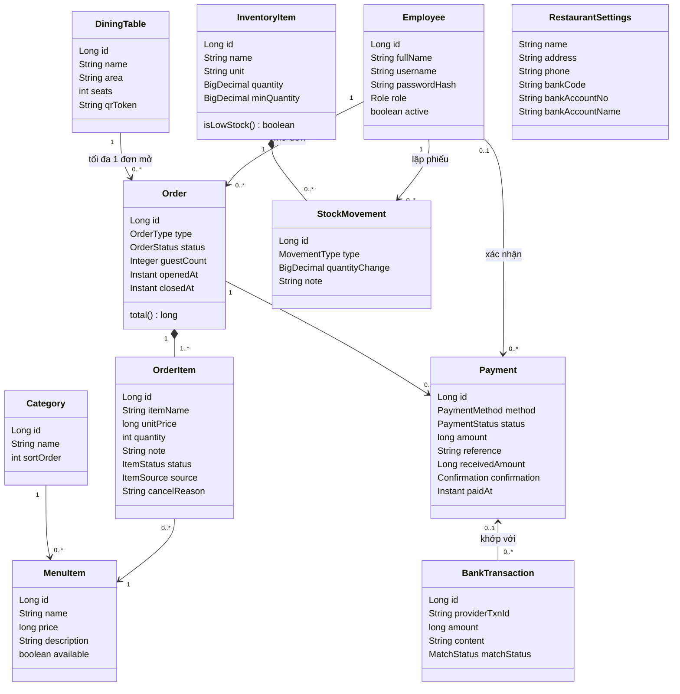
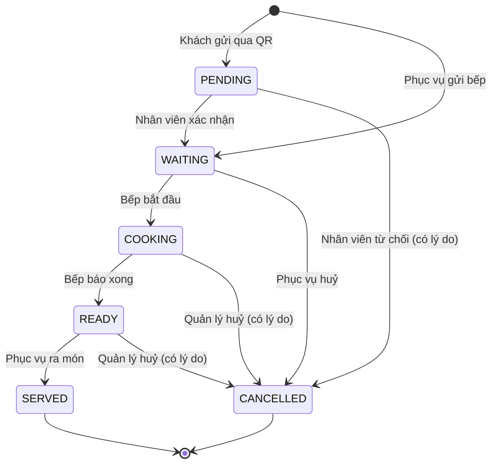
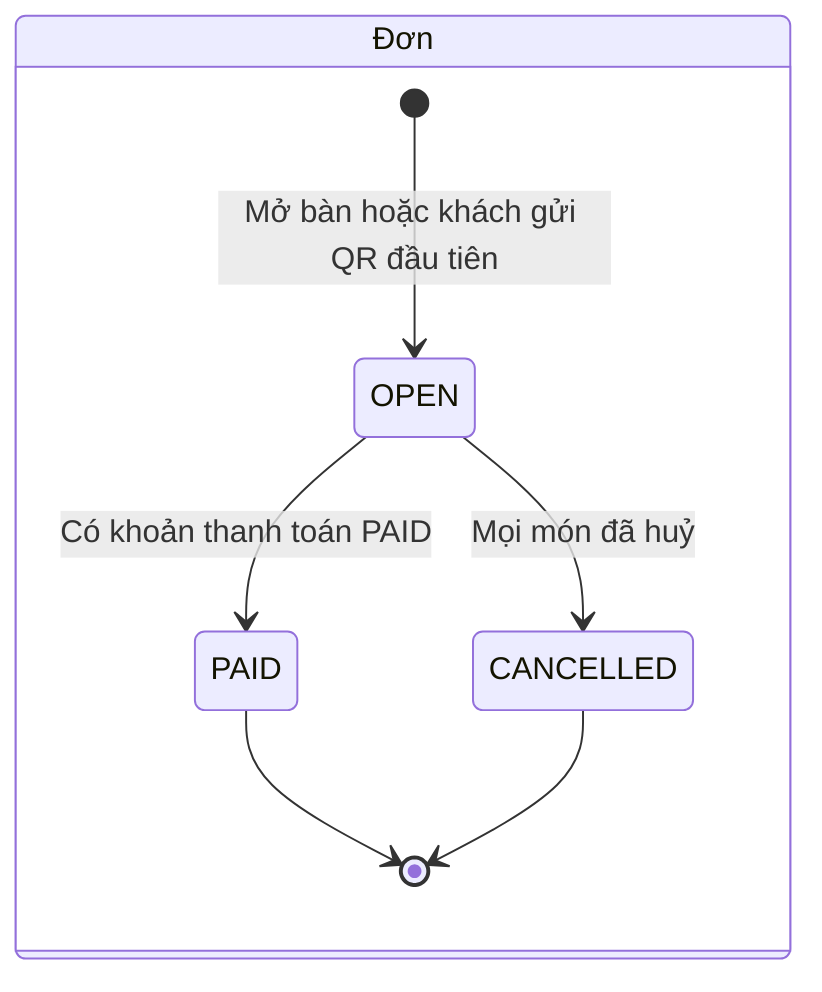
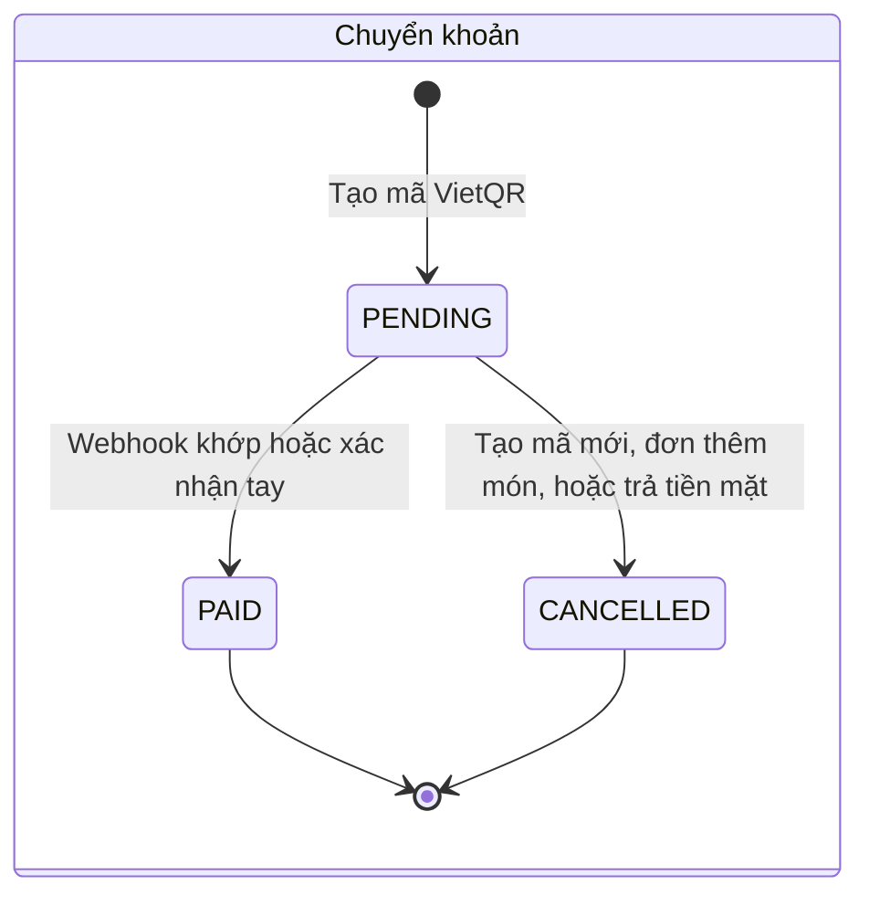

# 6. Mô hình miền

## 6.1 Sơ đồ lớp

Các kiểu liệt kê:

| Kiểu | Giá trị |
|---|---|
| `Role` | `ADMIN`, `MANAGER`, `WAITER`, `CHEF`, `CASHIER` |
| `OrderType` | `DINE_IN` (tại bàn), `TAKEAWAY` (mang về) |
| `OrderStatus` | `OPEN`, `PAID`, `CANCELLED` |
| `ItemStatus` | `PENDING` (chờ xác nhận), `WAITING` (chờ làm), `COOKING` (đang làm), `READY` (xong), `SERVED` (đã ra), `CANCELLED` |
| `ItemSource` | `STAFF` (phục vụ gọi), `GUEST` (khách gọi qua QR) |
| `PaymentMethod` | `CASH`, `BANK_TRANSFER` |
| `PaymentStatus` | `PENDING`, `PAID`, `CANCELLED` |
| `Confirmation` | `AUTO` (webhook), `MANUAL` (xác nhận tay) |
| `MatchStatus` | `MATCHED`, `UNMATCHED`, `IGNORED` (tiền ra) |
| `MovementType` | `IN` (nhập), `OUT` (xuất), `ADJUST` (kiểm kê) |
| `PayType` (nhân sự) | `HOURLY` (theo giờ), `MONTHLY` (theo tháng) |
| `LeaveType` (nhân sự) | `PAID` (có lương), `UNPAID` (không lương) |
| `LeaveStatus` (nhân sự) | `PENDING`, `APPROVED`, `REJECTED`, `CANCELLED` |
| `PayrollStatus` (nhân sự) | `DRAFT` (nháp), `FINALIZED` (đã chốt) |

Ghi chú thiết kế:
- **Trạng thái đặt ở từng món**, không đặt ở cả đơn, vì một bàn gọi nhiều lượt và mỗi món xong vào lúc khác nhau. Repo tham khảo đặt trạng thái ở cả đơn.
- `OrderItem` lưu **tên và đơn giá lúc gọi** (BR-05), nên báo cáo và bill không đổi khi thực đơn đổi.
- Trạng thái bàn **không lưu** mà tính từ đơn đang mở (BR-04), nên không bao giờ lệch.

## 6.2 Trạng thái món

## 6.3 Trạng thái đơn và thanh toán

Tiền mặt được ghi thẳng là `PAID` khi thu ngân xác nhận.

## 6.4 Ma trận quyền

| Chức năng | ADMIN | MANAGER | WAITER | CHEF | CASHIER |
|---|:-:|:-:|:-:|:-:|:-:|
| Quản lý nhân viên | ✅ | | | | |
| Sửa cài đặt nhà hàng | ✅ | | | | |
| Sửa thực đơn, bàn, tạo lại QR | ✅ | ✅ | | | |
| Báo hết món | ✅ | ✅ | | ✅ | |
| Xem sơ đồ bàn, mở đơn, gọi món | ✅ | ✅ | ✅ | | |
| Xác nhận hoặc từ chối món QR | ✅ | ✅ | ✅ | | |
| Màn hình bếp: Đang làm, Xong | ✅ | ✅ | | ✅ | |
| Ra món | ✅ | ✅ | ✅ | | |
| Huỷ món Chờ làm | ✅ | ✅ | ✅ | | |
| Huỷ món Đang làm hoặc Xong | ✅ | ✅ | | | |
| Xem bill | ✅ | ✅ | ✅ | | ✅ |
| Thu tiền, tạo VietQR, xác nhận tay | ✅ | ✅ | | | ✅ |
| Kho | ✅ | ✅ | | | |
| Báo cáo | ✅ | ✅ | | | |
| Hồ sơ, mức lương, bảng lương | ✅ | | | | |
| Ca mẫu, xếp ca, duyệt nghỉ, sửa chấm công | ✅ | ✅ | | | |
| Xem lịch, chấm công, xin nghỉ, xem phiếu lương của mình | ✅ | ✅ | ✅ | ✅ | ✅ |
