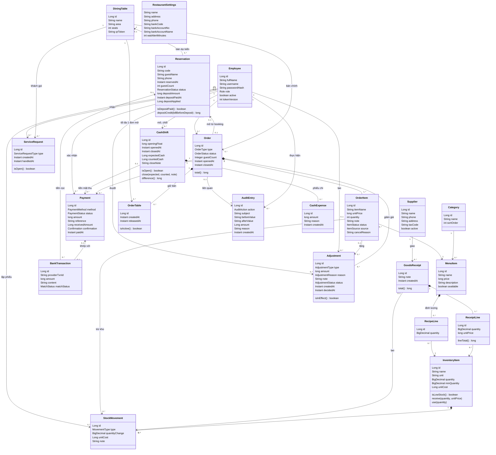
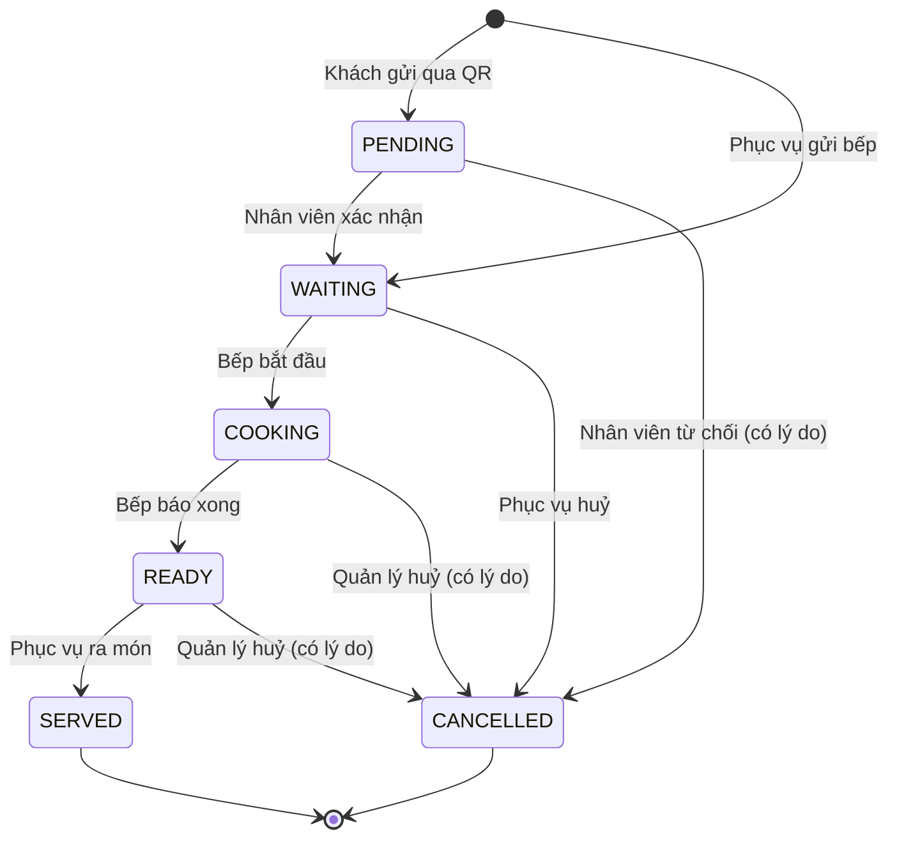
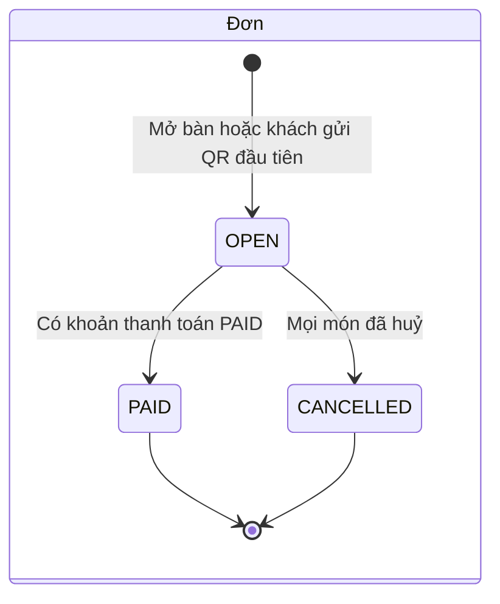
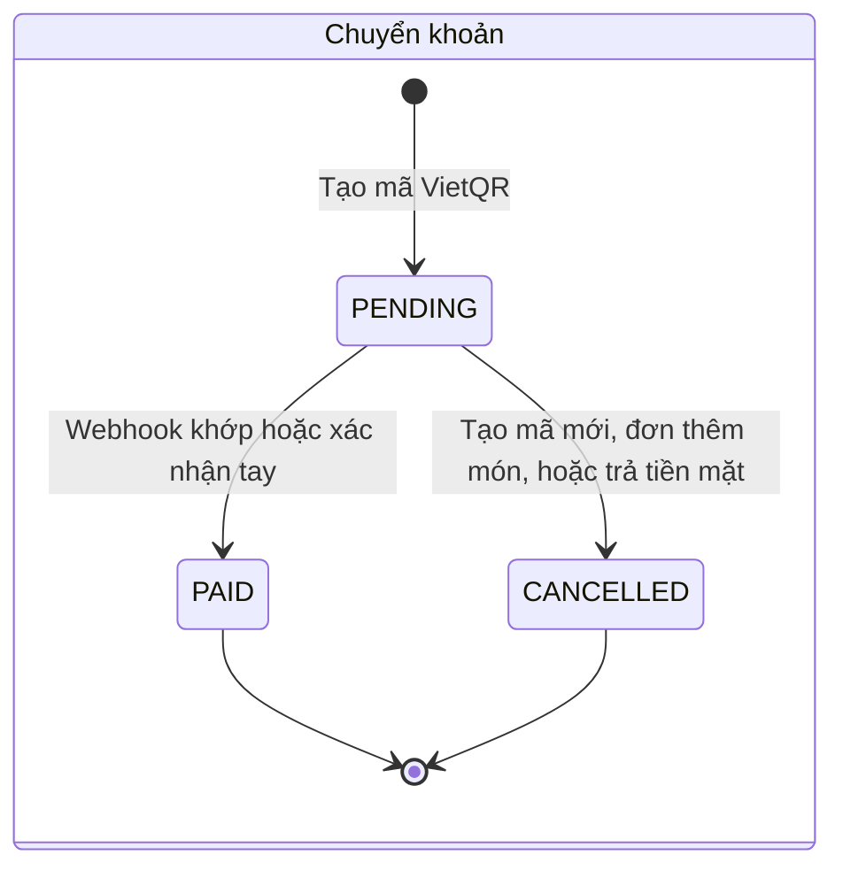

# 6. Mô hình miền

## 6.1 Sơ đồ lớp

Các kiểu liệt kê:

| Kiểu | Giá trị |
|---|---|
| `Role` | `ADMIN`, `MANAGER`, `WAITER`, `CHEF`, `CASHIER` |
| `OrderType` | `DINE_IN` (tại bàn), `TAKEAWAY` (mang về) |
| `OrderStatus` | `OPEN`, `PAID`, `CANCELLED` |
| `ItemStatus` | `PENDING` (chờ xác nhận), `WAITING` (chờ làm), `COOKING` (đang làm), `READY` (xong), `SERVED` (đã ra), `CANCELLED` |
| `ItemSource` | `STAFF` (phục vụ gọi), `GUEST` (khách gọi qua QR) |
| `PaymentMethod` | `CASH`, `BANK_TRANSFER` |
| `PaymentStatus` | `PENDING`, `PAID`, `CANCELLED` |
| `Confirmation` | `AUTO` (webhook), `MANUAL` (xác nhận tay) |
| `MatchStatus` | `MATCHED`, `UNMATCHED`, `IGNORED` (tiền ra) |
| `MovementType` | `IN` (nhập), `OUT` (xuất), `ADJUST` (kiểm kê), `SALE` (bán món: trừ theo định lượng khi món vào bếp, hoàn khi huỷ món Chờ làm) |
| `ServiceRequestType` | `CALL_STAFF` (gọi nhân viên), `BILL` (xin tính tiền) |
| `AuditAction` | `ITEM_CANCELLED` (huỷ hoặc từ chối món), `MANUAL_CONFIRMATION` (xác nhận tay chuyển khoản), `PRICE_CHANGED` (đổi giá món), `DISCOUNT_GIVEN` (giảm giá, tặng món có hiệu lực) |
| `AdjustmentType` | `DISCOUNT` (giảm một số tiền trên cả bill), `COMP` (tặng nguyên một dòng món) |
| `AdjustmentReason` | `WAIT` (chờ lâu), `FOOD_QUALITY` (lỗi món), `STAFF_ERROR` (lỗi nhân viên), `PROMOTION` (khuyến mãi), `OTHER` (khác, phải ghi chú) |
| `AdjustmentStatus` | `PENDING` (chờ duyệt), `APPLIED` (có hiệu lực), `REJECTED` (bị từ chối), `CANCELLED` (đã huỷ) |
| `ReservationStatus` | `BOOKED` (chờ khách tới), `SEATED` (đã nhận khách, mở đơn), `CANCELLED` (đã huỷ), `NO_SHOW` (không tới) |
| `PayType` (nhân sự) | `HOURLY` (theo giờ), `MONTHLY` (theo tháng) |
| `LeaveType` (nhân sự) | `PAID` (có lương), `UNPAID` (không lương) |
| `LeaveStatus` (nhân sự) | `PENDING`, `APPROVED`, `REJECTED`, `CANCELLED` |
| `PayrollStatus` (nhân sự) | `DRAFT` (nháp), `FINALIZED` (đã chốt) |

Ghi chú thiết kế:
- **Trạng thái đặt ở từng món**, không đặt ở cả đơn, vì một bàn gọi nhiều lượt và mỗi món xong vào lúc khác nhau. Repo tham khảo đặt trạng thái ở cả đơn.
- `OrderItem` lưu **tên và đơn giá lúc gọi** (BR-05), nên báo cáo và bill không đổi khi thực đơn đổi.
- Trạng thái bàn **không lưu** mà tính từ đơn đang mở (BR-04), nên không bao giờ lệch.
- `OrderTable` nối đơn với từng bàn nó giữ. Dòng còn hiệu lực (`releasedAt` rỗng) là bàn đang giữ; dòng đã trả là lịch sử chuyển bàn. `Order` vẫn giữ một **bàn chính** để in, báo cáo và chặn hai đơn cùng mở một bàn lúc khách quét QR.
- `Employee.tokenVersion` thu hồi token mà không cần danh sách token bị cấm: token mang số phiên bản lúc cấp, khác số hiện tại là bị từ chối (BR-41).
- `AuditEntry` lưu giá trị **thô**: trạng thái món là mã (`COOKING`), giá là số. Màn hình tự đổi sang chữ và định dạng tiền, còn báo cáo sau này đọc được ngay.
- Hoàn kho khi huỷ món đọc lại các biến động `SALE` đã ghi cho chính món đó (`StockMovement.orderItemId`), không tính lại theo định lượng hiện tại, nên sửa định lượng giữa chừng không làm lệch kho.
- Biến động `SALE` ghi lại **giá vốn một đơn vị lúc trừ** (`unitCost`), nên lãi gộp của món đã bán không đổi khi giá vốn nguyên liệu đổi sau đó (BR-40).
- `CashShift` chỉ ghi **tiền mặt dự kiến** lúc chốt, cạnh số đếm. Trong lúc ca mở, số dự kiến được tính từ quỹ đầu ca, các khoản tiền mặt gắn vào ca và phiếu chi, nên không bao giờ lệch với các khoản thật.
- Một đơn có thể có **nhiều khoản đã thu** (tách bill, BR-43). Số đã thu tính từ chính các khoản `PAID` của đơn (`Order.paidAmount`), không lưu riêng, nên không thể lệch với các khoản thật.
- Cọc của booking **không phải** khoản thanh toán: tiền cọc nằm ở `Reservation`, bill chỉ **trừ** nó (`Order.total`), và lúc thanh toán mới ghi phần đã trừ (`depositApplied`). Vì vậy két (BR-39) chỉ đếm tiền mặt thật, còn báo cáo cộng phần cọc đã trừ vào doanh thu (BR-21).

## 6.2 Trạng thái món

## 6.3 Trạng thái đơn và thanh toán

Tiền mặt được ghi thẳng là `PAID` khi thu ngân xác nhận.

## 6.4 Ma trận quyền

| Chức năng | ADMIN | MANAGER | WAITER | CHEF | CASHIER |
|---|:-:|:-:|:-:|:-:|:-:|
| Quản lý nhân viên | ✅ | | | | |
| Sửa cài đặt nhà hàng | ✅ | | | | |
| Sửa thực đơn, bàn, tạo lại QR | ✅ | ✅ | | | |
| Báo hết món | ✅ | ✅ | | ✅ | |
| Xem sơ đồ bàn, mở đơn, gọi món | ✅ | ✅ | ✅ | | |
| Chuyển bàn, ghép bàn | ✅ | ✅ | ✅ | | |
| Xác nhận hoặc từ chối món QR | ✅ | ✅ | ✅ | | |
| Nhận yêu cầu khách gọi | ✅ | ✅ | ✅ | | |
| Màn hình bếp: Đang làm, Xong | ✅ | ✅ | | ✅ | |
| Ra món | ✅ | ✅ | ✅ | | |
| Huỷ món Chờ làm | ✅ | ✅ | ✅ | | |
| Huỷ món Đang làm hoặc Xong | ✅ | ✅ | | | |
| Xem bill, in phiếu tạm tính | ✅ | ✅ | ✅ | | ✅ |
| Thu tiền, tạo VietQR, xác nhận tay, in phiếu thanh toán | ✅ | ✅ | | | ✅ |
| Mở ca, phiếu chi đến 300.000 đ, chốt ca | ✅ | ✅ | | | ✅ |
| Phiếu chi trên 300.000 đ, xem danh sách ca | ✅ | ✅ | | | |
| Đặt bàn, tin xác nhận, mã cọc VietQR, nhận khách, huỷ | ✅ | ✅ | ✅ | | |
| Xác nhận cọc tay | ✅ | ✅ | | | |
| Giảm giá, tặng món (trong hạn mức thì có hiệu lực ngay) | ✅ | ✅ | | | ✅ |
| Duyệt giảm giá vượt hạn mức | ✅ | ✅ | | | |
| Kho, nhà cung cấp, phiếu nhập có giá, định lượng món, tiêu hao | ✅ | ✅ | | | |
| Báo cáo | ✅ | ✅ | | | |
| Xem nhật ký thao tác | ✅ | ✅ | | | |
| Hồ sơ, mức lương, bảng lương | ✅ | | | | |
| Xem số liệu vận hành (Actuator) | ✅ | | | | |
| Ca mẫu, xếp ca, duyệt nghỉ, sửa chấm công | ✅ | ✅ | | | |
| Xem lịch, chấm công, xin nghỉ, xem phiếu lương của mình | ✅ | ✅ | ✅ | ✅ | ✅ |
