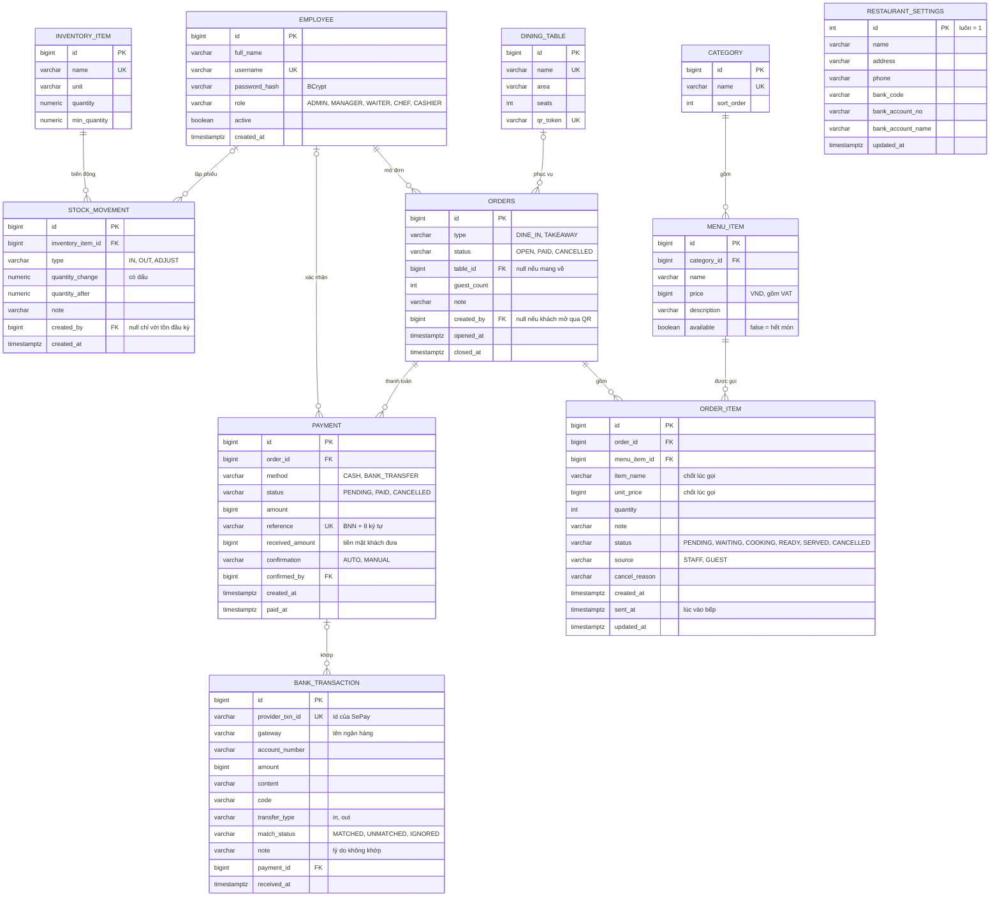

# 7. Thiết kế cơ sở dữ liệu (PostgreSQL)

Cách làm **database-first**:
- Lược đồ được thiết kế ở tài liệu này trước, rồi viết tay bằng SQL trong `backend/src/main/resources/db/migration/V1__init.sql`.
- **Flyway** chạy file SQL đó để tạo bảng.
- Hibernate đặt `ddl-auto: validate`, nghĩa là **không tạo hay sửa bảng**, chỉ kiểm tra entity Java có khớp lược đồ không. Lệch thì ứng dụng không khởi động.
- Muốn đổi lược đồ thì sửa tài liệu này, rồi viết migration mới (`V3__...sql`). **Không sửa** file migration đã chạy.

Quy ước:
- Khoá chính `bigint` tự tăng (`GENERATED BY DEFAULT AS IDENTITY`).
- Tiền là `bigint`, đơn vị VND. Thời gian là `timestamptz`.
- Trạng thái lưu `varchar` kèm `CHECK`.

## 7.1 ERD

## 7.2 Ràng buộc quan trọng

| Ràng buộc | Định nghĩa | Quy tắc |
|---|---|---|
| Một bàn một đơn mở | `CREATE UNIQUE INDEX ux_orders_open_table ON orders(table_id) WHERE status = 'OPEN'` | BR-04 |
| Đơn tại bàn phải có bàn | `CHECK (type = 'TAKEAWAY' OR table_id IS NOT NULL)` | BR-04 |
| Số lượng hợp lệ | `CHECK (quantity BETWEEN 1 AND 50)` trên `order_item` | BR-06 |
| Một yêu cầu chuyển khoản đang chờ mỗi đơn | `CREATE UNIQUE INDEX ux_payment_pending_order ON payment(order_id) WHERE status = 'PENDING'` | BR-14 |
| Không thu tiền hai lần | `CREATE UNIQUE INDEX ux_payment_paid_order ON payment(order_id) WHERE status = 'PAID'` | BR-13 |
| Mã thanh toán duy nhất | `UNIQUE (reference)` | BR-14 |
| Giao dịch ngân hàng xử lý một lần | `UNIQUE (provider_txn_id)` | BR-16 |
| Tồn không âm | `CHECK (quantity >= 0)` trên `inventory_item` | BR-19 |
| Không xoá dữ liệu đã dùng | Khoá ngoại **không** `ON DELETE CASCADE` từ `order_item` tới `menu_item`, từ `orders` tới `dining_table` | BR-18 |

## 7.3 Index cho màn hình

| Index | Phục vụ |
|---|---|
| `order_item(status) WHERE status IN ('PENDING','WAITING','COOKING','READY')` | Màn hình bếp, sơ đồ bàn |
| `order_item(order_id)` | Bill, trang khách |
| `payment(paid_at) WHERE status = 'PAID'` | Báo cáo doanh thu |
| `stock_movement(inventory_item_id, created_at DESC)` | Lịch sử kho |
| `bank_transaction(match_status)` | Danh sách không khớp |

## 7.4 Dữ liệu mẫu

`V2__demo_data.sql` tạo sẵn dữ liệu để demo:
- 4 danh mục, 16 món.
- 12 bàn ở 2 khu: "Tầng 1", "Sân trong".
- 6 nguyên liệu. Tồn đầu kỳ được ghi thành phiếu nhập, đúng BR-19.
- Thông tin nhà hàng.

Tài khoản demo cho 5 vai trò được tạo lúc khởi động khi bật `app.demo-accounts.enabled=true`. Mặc định cờ này **tắt** ở môi trường production.
