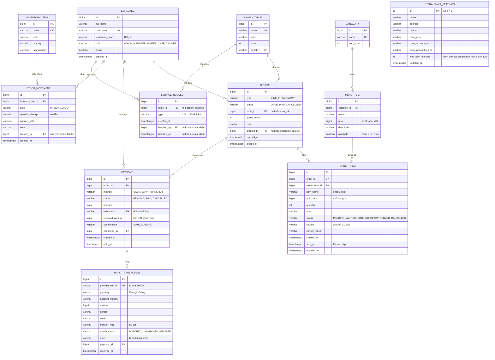

# 7. Thiết kế cơ sở dữ liệu (PostgreSQL)

Cách làm **database-first**:
- Lược đồ được thiết kế ở tài liệu này trước, rồi viết tay bằng SQL trong các migration ở `backend/src/main/resources/db/migration/`. `V1__init.sql` là lược đồ gốc, `V3` → `V7` là phần nhân sự (mục 7.5), `V8` thêm ngưỡng món chờ lâu (P1-06), `V9` thêm bảng `service_request` (P1-05).
- **Flyway** chạy các file SQL đó để tạo bảng.
- Hibernate đặt `ddl-auto: validate`, nghĩa là **không tạo hay sửa bảng**, chỉ kiểm tra entity Java có khớp lược đồ không. Lệch thì ứng dụng không khởi động.
- Muốn đổi lược đồ thì sửa tài liệu này, rồi viết migration mới (`V10__...sql` trở đi). **Không sửa** file migration đã chạy.
- Script `scripts/check-erd.mjs` so mọi sơ đồ ERD trong tài liệu này với mọi migration: bảng, cột, kiểu dữ liệu, và khoá của từng cột (`PK` khoá chính, `FK` khoá ngoại, `UK` duy nhất). CI chạy nó ở mỗi lần build, lệch thì build đỏ. `UNIQUE` trên nhiều cột và unique index một phần không gắn được vào một cột, nên được liệt kê ở mục 7.2.

Quy ước:
- Khoá chính `bigint` tự tăng (`GENERATED BY DEFAULT AS IDENTITY`).
- Tiền là `bigint`, đơn vị VND. Thời gian là `timestamptz`.
- Trạng thái lưu `varchar` kèm `CHECK`.

## 7.1 ERD

## 7.2 Ràng buộc quan trọng

| Ràng buộc | Định nghĩa | Quy tắc |
|---|---|---|
| Một bàn một đơn mở | `CREATE UNIQUE INDEX ux_orders_open_table ON orders(table_id) WHERE status = 'OPEN'` | BR-04 |
| Đơn tại bàn phải có bàn | `CHECK (type = 'TAKEAWAY' OR table_id IS NOT NULL)` | BR-04 |
| Số lượng hợp lệ | `CHECK (quantity BETWEEN 1 AND 50)` trên `order_item` | BR-06 |
| Một yêu cầu chuyển khoản đang chờ mỗi đơn | `CREATE UNIQUE INDEX ux_payment_pending_order ON payment(order_id) WHERE status = 'PENDING'` | BR-14 |
| Không thu tiền hai lần | `CREATE UNIQUE INDEX ux_payment_paid_order ON payment(order_id) WHERE status = 'PAID'` | BR-13 |
| Mã thanh toán duy nhất | `UNIQUE (reference)` | BR-14 |
| Giao dịch ngân hàng xử lý một lần | `UNIQUE (provider_txn_id)` | BR-16 |
| Tồn không âm | `CHECK (quantity >= 0)` trên `inventory_item` | BR-19 |
| Ngưỡng món chờ lâu hợp lệ | `CHECK (wait_alert_minutes BETWEEN 1 AND 120)` trên `restaurant_settings` | BR-28 |
| Mỗi bàn một yêu cầu đang chờ cho mỗi loại | `CREATE UNIQUE INDEX ux_service_request_open ON service_request(table_id, type) WHERE handled_at IS NULL` | BR-29 |
| Có người nhận thì có lúc nhận | `CHECK ((handled_by IS NULL) = (handled_at IS NULL))` trên `service_request` | BR-29 |
| Không xoá dữ liệu đã dùng | Khoá ngoại **không** `ON DELETE CASCADE` từ `order_item` tới `menu_item`, từ `orders` tới `dining_table` | BR-18 |

## 7.3 Index cho màn hình

| Index | Phục vụ |
|---|---|
| `order_item(status) WHERE status IN ('PENDING','WAITING','COOKING','READY')` | Màn hình bếp, sơ đồ bàn |
| `order_item(order_id)` | Bill, trang khách |
| `payment(paid_at) WHERE status = 'PAID'` | Báo cáo doanh thu |
| `stock_movement(inventory_item_id, created_at DESC)` | Lịch sử kho |
| `bank_transaction(match_status)` | Danh sách không khớp |

## 7.4 Dữ liệu mẫu

`V2__demo_data.sql` tạo sẵn dữ liệu để demo:
- 4 danh mục, 16 món.
- 12 bàn ở 2 khu: "Tầng 1", "Sân trong".
- 6 nguyên liệu. Tồn đầu kỳ được ghi thành phiếu nhập, đúng BR-19.
- Thông tin nhà hàng.

Tài khoản demo cho 5 vai trò được tạo lúc khởi động khi bật `app.demo-accounts.enabled=true`. Mặc định cờ này **tắt** ở môi trường production.

## 7.5 Nhân sự

Phần nhân sự (FR-12 → FR-15) được thiết kế ở đây **trước khi viết code**, rồi mới viết thành migration, mỗi việc một file:

| Migration | Việc | Bảng |
|---|---|---|
| `V3__ho_so_nhan_vien.sql` | P2-05 | Thêm 5 cột vào `employee` |
| `V4__xep_ca.sql` | P2-06 | `work_shift` (kèm 3 ca mẫu), `shift_assignment` |
| `V5__cham_cong.sql` | P2-07 | `attendance` |
| `V6__nghi_phep.sql` | P2-08 | `leave_request` |
| `V7__bang_luong.sql` | P2-09 | `payroll`, `payslip`, `pay_adjustment` |

Sơ đồ nhân sự để riêng cho dễ đọc. Script đối chiếu gộp mọi sơ đồ trước khi so với migration, nên `EMPLOYEE` ở đây chỉ ghi các cột thêm mới.

Ghi chú:
- `employee` thêm 5 cột. Cột mới có giá trị mặc định hoặc cho phép null, nên dữ liệu cũ vẫn hợp lệ.
- **Ca làm việc** (`work_shift`) là giờ đi làm của nhân viên. Nó khác **ca két** của thu ngân ở P2-01 (`cash_shift`), là phiên giữ tiền.
- Ngày và giờ ca tính theo giờ Việt Nam (NFR-08).

| Ràng buộc | Định nghĩa | Quy tắc |
|---|---|---|
| Mức lương không âm | `CHECK (pay_rate >= 0)` trên `employee` | BR-22 |
| Ca không qua nửa đêm | `CHECK (end_time > start_time)` trên `work_shift` | BR-23 |
| Không xếp trùng ca | `UNIQUE (employee_id, work_date, work_shift_id)` trên `shift_assignment` | BR-23 |
| Đơn nghỉ hợp lệ | `CHECK (to_date >= from_date)` trên `leave_request` | BR-24 |
| Một lượt chấm công đang mở mỗi người | `CREATE UNIQUE INDEX ux_attendance_open ON attendance(employee_id) WHERE check_out_at IS NULL` | BR-25 |
| Mỗi ca đã xếp chấm một lần | `CREATE UNIQUE INDEX ux_attendance_assignment ON attendance(shift_assignment_id) WHERE shift_assignment_id IS NOT NULL` | BR-25 |
| Giờ ra sau giờ vào | `CHECK (check_out_at IS NULL OR check_out_at > check_in_at)` trên `attendance` | BR-25 |
| Một bảng lương mỗi tháng | `UNIQUE (period)` trên `payroll` | BR-26 |
| Một phiếu mỗi người mỗi tháng | `UNIQUE (payroll_id, employee_id)` trên `payslip` | BR-26 |
| Thực nhận đúng và không âm | `CHECK (net_amount = base_amount + adjustment_amount AND net_amount >= 0)` trên `payslip` | BR-26 |
| Khoản thưởng phạt khác 0 | `CHECK (amount <> 0)` trên `pay_adjustment` | BR-26 |
| Không xoá nhân viên | Khoá ngoại tới `employee` **không** `ON DELETE CASCADE` | BR-03 |

| Index | Phục vụ |
|---|---|
| `shift_assignment(work_date)` | Lịch tuần |
| `attendance(employee_id, check_in_at)` | Bảng công tháng, tính lương |
| `leave_request(status) WHERE status = 'PENDING'` | Đơn chờ duyệt |
| `leave_request(employee_id, from_date)` | Đơn nghỉ của một người |
| `pay_adjustment(payslip_id)` | Thưởng, phạt của một phiếu lương |
