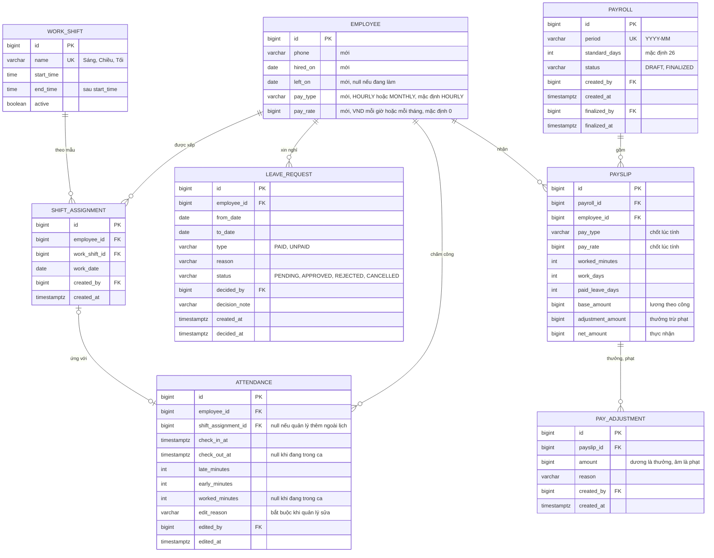

# 7. Thiết kế cơ sở dữ liệu (PostgreSQL)

Cách làm **database-first**:
- Lược đồ được thiết kế ở tài liệu này trước, rồi viết tay bằng SQL trong các migration ở `backend/src/main/resources/db/migration/`. `V1__init.sql` là lược đồ gốc, `V3` → `V7` là phần nhân sự (mục 7.5), `V8` thêm ngưỡng món chờ lâu (P1-06), `V9` thêm bảng `service_request` (P1-05), `V10` đổi tên quán mẫu thành "Khói Bếp" (chỉ đổi dữ liệu, không đổi lược đồ), `V11` thêm bảng `audit_entry` (P1-03), `V12` thêm bảng `adjustment` và loại nhật ký `DISCOUNT_GIVEN` (P1-04), `V13` thêm bảng `order_table` cho chuyển và ghép bàn, và chép bàn của mọi đơn cũ sang bảng này (P1-01), `V14` thêm nhà cung cấp, phiếu nhập có giá và giá vốn nguyên liệu (P2-03), `V15` thêm định lượng món (bảng `recipe_line`), loại biến động `SALE` và cột `stock_movement.order_item_id` để trừ kho khi món vào bếp, đồng thời bỏ ràng buộc tồn không âm (P2-02), `V16` thêm ca và két (bảng `cash_shift`, `cash_expense`, cột `payment.cash_shift_id`) (P2-01), `V17` thêm giá vốn lúc trừ kho (`stock_movement.unit_cost`) và view `v_order_item_cost` cho báo cáo lãi gộp (P2-04), `V18` thêm số phiên bản token của nhân viên để thu hồi token (P3-02), `V19` thêm đặt bàn và cọc (bảng `reservation`, cột `orders.reservation_id`, `bank_transaction.reservation_id`) (P4-01), `V20` bỏ index `ux_payment_paid_order` để một đơn thu được nhiều khoản (P1-07), `V21` thêm khách hàng (bảng `customer`, cột `orders.customer_id`, `reservation.customer_id`) (P4-02), `V22` thêm hoá đơn điện tử (bảng `tax_category`, `tax_rate`, `einvoice`, `einvoice_line`, cột `menu_item.tax_category_id`; món có tên bắt đầu bằng "Bia" hoặc "Rượu" vào loại thuế "Rượu, bia") (P4-03), `V23` thêm đơn app giao hàng (bảng `menu_item_app_price`, cột `orders.channel`, `orders.app_order_code`, phương thức thanh toán `GRABFOOD`, `SHOPEEFOOD`) (P4-04).
- **Flyway** chạy các file SQL đó để tạo bảng.
- Hibernate đặt `ddl-auto: validate`, nghĩa là **không tạo hay sửa bảng**, chỉ kiểm tra entity Java có khớp lược đồ không. Lệch thì ứng dụng không khởi động.
- Muốn đổi lược đồ thì sửa tài liệu này, rồi viết migration mới (`V24__...sql` trở đi). **Không sửa** file migration đã chạy.
- Script `scripts/check-erd.mjs` so mọi sơ đồ ERD trong tài liệu này với mọi migration: bảng, cột, kiểu dữ liệu, và khoá của từng cột (`PK` khoá chính, `FK` khoá ngoại, `UK` duy nhất). CI chạy nó ở mỗi lần build, lệch thì build đỏ. `UNIQUE` trên nhiều cột và unique index một phần không gắn được vào một cột, nên được liệt kê ở mục 7.2.

Quy ước:
- Khoá chính `bigint` tự tăng (`GENERATED BY DEFAULT AS IDENTITY`).
- Tiền là `bigint`, đơn vị VND. Thời gian là `timestamptz`.
- Trạng thái lưu `varchar` kèm `CHECK`.

## 7.1 ERD

```mermaid
erDiagram
    EMPLOYEE ||--o{ ORDERS : "mở đơn"
    EMPLOYEE |o--o{ PAYMENT : "xác nhận"
    EMPLOYEE |o--o{ STOCK_MOVEMENT : "lập phiếu"
    CATEGORY ||--o{ MENU_ITEM : "gồm"
    DINING_TABLE |o--o{ ORDERS : "bàn chính"
    ORDERS ||--o{ ORDER_TABLE : "giữ bàn"
    DINING_TABLE ||--o{ ORDER_TABLE : "được giữ"
    ORDERS ||--o{ ORDER_ITEM : "gồm"
    MENU_ITEM ||--o{ ORDER_ITEM : "được gọi"
    ORDERS ||--o{ PAYMENT : "thanh toán"
    PAYMENT |o--o{ BANK_TRANSACTION : "khớp"
    INVENTORY_ITEM ||--o{ STOCK_MOVEMENT : "biến động"
    SUPPLIER ||--o{ GOODS_RECEIPT : "giao"
    GOODS_RECEIPT ||--|{ RECEIPT_LINE : "gồm"
    INVENTORY_ITEM ||--o{ RECEIPT_LINE : "được nhập"
    GOODS_RECEIPT |o--o{ STOCK_MOVEMENT : "tạo"
    MENU_ITEM ||--o{ RECIPE_LINE : "định lượng"
    INVENTORY_ITEM ||--o{ RECIPE_LINE : "dùng trong"
    ORDER_ITEM |o--o{ STOCK_MOVEMENT : "trừ kho"
    EMPLOYEE ||--o{ CASH_SHIFT : "mở, chốt"
    CASH_SHIFT ||--o{ CASH_EXPENSE : "phiếu chi"
    EMPLOYEE ||--o{ CASH_EXPENSE : "lập"
    CASH_SHIFT |o--o{ PAYMENT : "thu tiền mặt"
    DINING_TABLE |o--o{ RESERVATION : "bàn dự kiến"
    RESERVATION |o--o| ORDERS : "nhận khách"
    RESERVATION |o--o{ BANK_TRANSACTION : "tiền cọc"
    EMPLOYEE ||--o{ RESERVATION : "tạo"
    CUSTOMER |o--o{ ORDERS : "ghé"
    CUSTOMER |o--o{ RESERVATION : "đặt bàn"
    TAX_CATEGORY ||--o{ MENU_ITEM : "loại thuế"
    MENU_ITEM ||--o{ MENU_ITEM_APP_PRICE : "giá app"
    TAX_CATEGORY ||--|{ TAX_RATE : "thuế suất theo ngày"
    ORDERS ||--o| EINVOICE : "dữ liệu hoá đơn"
    EINVOICE ||--|{ EINVOICE_LINE : "gồm"
    EMPLOYEE |o--o{ EINVOICE : "ghi số"
    EMPLOYEE ||--o{ GOODS_RECEIPT : "lập"
    DINING_TABLE ||--o{ SERVICE_REQUEST : "khách gọi"
    EMPLOYEE |o--o{ SERVICE_REQUEST : "nhận"
    EMPLOYEE ||--o{ AUDIT_ENTRY : "thực hiện"
    ORDERS |o--o{ AUDIT_ENTRY : "liên quan"
    ORDERS ||--o{ ADJUSTMENT : "giảm giá"
    ORDER_ITEM |o--o{ ADJUSTMENT : "tặng"
    EMPLOYEE ||--o{ ADJUSTMENT : "tạo"
    EMPLOYEE |o--o{ ADJUSTMENT : "duyệt"
    EMPLOYEE {
        bigint id PK
        varchar full_name
        varchar username UK
        varchar password_hash "BCrypt"
        varchar role "ADMIN, MANAGER, WAITER, CHEF, CASHIER"
        boolean active
        timestamptz created_at
        int token_version "tăng khi đổi, đặt lại mật khẩu hoặc đăng xuất mọi thiết bị"
    }
    CATEGORY {
        bigint id PK
        varchar name UK
        int sort_order
    }
    MENU_ITEM {
        bigint id PK
        bigint category_id FK
        varchar name
        bigint price "VND, gồm VAT"
        varchar description
        boolean available "false = hết món"
        bigint tax_category_id FK "loại thuế (BR-45)"
    }
    DINING_TABLE {
        bigint id PK
        varchar name UK
        varchar area
        int seats
        varchar qr_token UK
    }
    ORDERS {
        bigint id PK
        varchar type "DINE_IN, TAKEAWAY"
        varchar status "OPEN, PAID, CANCELLED"
        bigint table_id FK "bàn chính; null nếu mang về"
        int guest_count
        varchar note
        bigint created_by FK "null nếu khách mở qua QR"
        timestamptz opened_at
        timestamptz closed_at
        bigint reservation_id FK, UK "booking mở ra đơn; null khi không đặt trước"
        bigint customer_id FK "khách của đơn"
        varchar channel "GRABFOOD, SHOPEEFOOD; null nếu không phải đơn app"
        varchar app_order_code "mã đơn trên app, viết hoa"
    }
    ORDER_ITEM {
        bigint id PK
        bigint order_id FK
        bigint menu_item_id FK
        varchar item_name "chốt lúc gọi"
        bigint unit_price "chốt lúc gọi"
        int quantity
        varchar note
        varchar status "PENDING, WAITING, COOKING, READY, SERVED, CANCELLED"
        varchar source "STAFF, GUEST"
        varchar cancel_reason
        timestamptz created_at
        timestamptz sent_at "lúc vào bếp"
        timestamptz updated_at
    }
    PAYMENT {
        bigint id PK
        bigint order_id FK
        varchar method "CASH, BANK_TRANSFER, GRABFOOD, SHOPEEFOOD"
        varchar status "PENDING, PAID, CANCELLED"
        bigint amount
        varchar reference UK "KB + 8 ký tự"
        bigint received_amount "tiền mặt khách đưa"
        varchar confirmation "AUTO, MANUAL"
        bigint confirmed_by FK
        timestamptz created_at
        timestamptz paid_at
        bigint cash_shift_id FK "ca nhận tiền mặt; null với chuyển khoản và tiền mặt trước V16"
    }
    BANK_TRANSACTION {
        bigint id PK
        varchar provider_txn_id UK "id của SePay"
        varchar gateway "tên ngân hàng"
        varchar account_number
        bigint amount
        varchar content
        varchar code
        varchar transfer_type "in, out"
        varchar match_status "MATCHED, UNMATCHED, IGNORED"
        varchar note "lý do không khớp"
        bigint payment_id FK
        timestamptz received_at
        bigint reservation_id FK "booking nhận cọc qua giao dịch này"
    }
    INVENTORY_ITEM {
        bigint id PK
        varchar name UK
        varchar unit
        numeric quantity "có thể âm khi trừ theo định lượng (BR-38)"
        numeric min_quantity
        bigint unit_cost "giá vốn một đơn vị, VND; null khi chưa nhập theo phiếu"
    }
    STOCK_MOVEMENT {
        bigint id PK
        bigint inventory_item_id FK
        varchar type "IN, OUT, ADJUST, SALE"
        numeric quantity_change "có dấu"
        numeric quantity_after
        varchar note
        bigint created_by FK "null chỉ với tồn đầu kỳ"
        bigint goods_receipt_id FK "phiếu nhập tạo ra biến động; null khi nhập tay"
        bigint order_item_id FK "món vào bếp làm phát sinh; chỉ có với SALE"
        bigint unit_cost "giá vốn một đơn vị lúc trừ, VND; chỉ có với SALE, null khi nguyên liệu chưa có giá vốn"
        timestamptz created_at
    }
    RESTAURANT_SETTINGS {
        int id PK "luôn = 1"
        varchar name
        varchar address
        varchar phone
        varchar bank_code
        varchar bank_account_no
        varchar bank_account_name
        int wait_alert_minutes "món chờ lâu sau số phút này, 1 đến 120"
        timestamptz updated_at
    }
    SERVICE_REQUEST {
        bigint id PK
        bigint table_id FK "xoá bàn thì xoá theo"
        varchar type "CALL_STAFF, BILL"
        timestamptz created_at
        bigint handled_by FK "null khi chưa ai nhận"
        timestamptz handled_at "null khi chưa ai nhận"
    }
    AUDIT_ENTRY {
        bigint id PK
        varchar action "ITEM_CANCELLED, MANUAL_CONFIRMATION, PRICE_CHANGED, DISCOUNT_GIVEN"
        bigint employee_id FK "người làm"
        bigint order_id FK "null khi đổi giá món"
        varchar subject "món và số lượng, mã thanh toán, hoặc tên món"
        varchar before_value "mã trạng thái món hoặc giá cũ"
        varchar after_value "mã trạng thái mới hoặc giá mới"
        bigint amount "số tiền liên quan, VND"
        varchar reason
        timestamptz created_at
    }
    SUPPLIER {
        bigint id PK
        varchar name UK
        varchar phone
        varchar address
        varchar tax_code "mã số thuế"
        varchar note
        boolean active "false = ngừng giao dịch"
    }
    GOODS_RECEIPT {
        bigint id PK
        bigint supplier_id FK
        varchar note
        bigint created_by FK
        timestamptz created_at
    }
    RECEIPT_LINE {
        bigint id PK
        bigint receipt_id FK
        bigint inventory_item_id FK
        numeric quantity "lớn hơn 0"
        bigint unit_price "VND cho một đơn vị, không âm"
    }
    RECIPE_LINE {
        bigint id PK
        bigint menu_item_id FK
        bigint inventory_item_id FK
        numeric quantity "lượng cho một phần, theo đơn vị nguyên liệu; lớn hơn 0"
    }
    CASH_SHIFT {
        bigint id PK
        bigint opened_by FK
        timestamptz opened_at
        bigint opening_float "quỹ đầu ca, VND"
        bigint closed_by FK
        timestamptz closed_at "null khi ca đang mở"
        bigint expected_cash "tiền mặt dự kiến, ghi lúc chốt"
        bigint counted_cash "số đếm thực tế"
        varchar close_note "lý do chênh lệch"
    }
    RESERVATION {
        bigint id PK
        varchar code UK "KB + 8 ký tự, cũng là nội dung chuyển khoản cọc"
        varchar guest_name
        varchar phone
        timestamptz reserved_at "giờ khách tới"
        int guest_count "1 đến 200"
        bigint table_id FK "bàn dự kiến; có thể trống"
        varchar note
        varchar status "BOOKED, SEATED, CANCELLED, NO_SHOW"
        bigint deposit_amount "tiền cọc cần, VND; 0 là không cọc"
        timestamptz deposit_paid_at "lúc cọc về; null khi chưa"
        varchar deposit_confirmation "AUTO, MANUAL"
        bigint deposit_confirmed_by FK "quản lý xác nhận tay"
        bigint deposit_applied "phần cọc đã trừ vào bill lúc thanh toán"
        varchar confirmation_text "tin xác nhận đã gửi"
        timestamptz confirmation_sent_at
        bigint created_by FK
        timestamptz created_at
        bigint customer_id FK "khách cùng số điện thoại"
    }
    CUSTOMER {
        bigint id PK
        varchar phone UK "10 số, bắt đầu bằng 0"
        varchar name
        varchar note
        varchar consent_channel "ZALO, SMS; lần đồng ý gần nhất"
        timestamptz consent_at
        varchar consent_source "cách thu thập đồng ý"
        timestamptz opted_out_at "từ chối đang có hiệu lực; đồng ý lại thì xoá"
        timestamptz created_at
    }
    TAX_CATEGORY {
        bigint id PK
        varchar name UK
    }
    MENU_ITEM_APP_PRICE {
        bigint menu_item_id PK, FK
        varchar channel PK "GRABFOOD, SHOPEEFOOD"
        bigint price "VND, gồm VAT"
    }
    TAX_RATE {
        bigint id PK
        bigint tax_category_id FK
        int rate "0, 5, 8, 10 (%)"
        date effective_from "áp dụng từ ngày này, giờ Việt Nam"
    }
    EINVOICE {
        bigint id PK
        bigint order_id FK, UK "mỗi đơn đã thanh toán một hoá đơn"
        timestamptz invoice_date "lúc thanh toán đủ"
        varchar payment_method "TM, CK, TM/CK"
        varchar buyer_name "null là khách lẻ"
        varchar buyer_tax_code
        varchar buyer_address
        varchar buyer_email
        bigint before_tax "VND"
        bigint tax_amount "VND"
        bigint total "VND, bằng before_tax + tax_amount"
        timestamptz exported_at "lần xuất file gần nhất"
        varchar invoice_symbol "ký hiệu hoá đơn đã phát hành"
        varchar invoice_no "số hoá đơn"
        bigint issued_by FK "người ghi số"
        timestamptz issued_at
    }
    EINVOICE_LINE {
        bigint id PK
        bigint einvoice_id FK
        int line_no
        varchar kind "GOODS, DISCOUNT"
        varchar item_name
        varchar unit "null ở dòng chiết khấu"
        int quantity "null ở dòng chiết khấu"
        bigint unit_price "VND, gồm thuế; null ở dòng chiết khấu"
        int tax_rate
        bigint amount "VND, gồm thuế"
        bigint before_tax
        bigint tax_amount
    }
    CASH_EXPENSE {
        bigint id PK
        bigint cash_shift_id FK
        bigint amount "VND, lớn hơn 0"
        varchar reason
        bigint created_by FK
        timestamptz created_at
    }
    ORDER_TABLE {
        bigint id PK
        bigint order_id FK
        bigint table_id FK
        timestamptz created_at "lúc bắt đầu giữ bàn"
        timestamptz released_at "lúc trả bàn; null khi đang giữ"
    }
    ADJUSTMENT {
        bigint id PK
        bigint order_id FK
        bigint order_item_id FK "dòng món được tặng; null khi giảm cả bill"
        varchar type "DISCOUNT, COMP"
        bigint amount "VND, lớn hơn 0"
        varchar reason "WAIT, FOOD_QUALITY, STAFF_ERROR, PROMOTION, OTHER"
        varchar note "bắt buộc khi reason = OTHER"
        varchar status "PENDING, APPLIED, REJECTED, CANCELLED"
        bigint created_by FK
        timestamptz created_at
        bigint decided_by FK "quản lý duyệt hoặc từ chối"
        timestamptz decided_at
    }
```

## 7.2 Ràng buộc quan trọng

| Ràng buộc | Định nghĩa | Quy tắc |
|---|---|---|
| Một bàn thuộc tối đa một đơn mở | `CREATE UNIQUE INDEX ux_order_table_active ON order_table(table_id) WHERE released_at IS NULL` | BR-04, BR-36 |
| Một bàn chính một đơn mở | `CREATE UNIQUE INDEX ux_orders_open_table ON orders(table_id) WHERE status = 'OPEN'`; câu lệnh mở đơn khi khách quét QR dựa vào index này để hai điện thoại cùng bấm vẫn chỉ ra một đơn | BR-04 |
| Đơn tại bàn phải có bàn | `CHECK (type = 'TAKEAWAY' OR table_id IS NOT NULL)` | BR-04 |
| Số lượng hợp lệ | `CHECK (quantity BETWEEN 1 AND 50)` trên `order_item` | BR-06 |
| Một yêu cầu chuyển khoản đang chờ mỗi đơn | `CREATE UNIQUE INDEX ux_payment_pending_order ON payment(order_id) WHERE status = 'PENDING'` | BR-14 |
| Không thu quá bill | Từ `V20` không còn `ux_payment_paid_order`: một đơn có nhiều khoản `PAID` (tách bill). Tổng các khoản không vượt tổng bill, kiểm tra trong `PaymentService` khi đơn đang bị khoá | BR-13, BR-43 |
| Mã thanh toán duy nhất | `UNIQUE (reference)` | BR-14 |
| Giao dịch ngân hàng xử lý một lần | `UNIQUE (provider_txn_id)` | BR-16 |
| Tồn chỉ âm do trừ theo định lượng | Từ `V15` không còn `CHECK (quantity >= 0)` trên `inventory_item`; xuất tay và kiểm kê vẫn không làm tồn âm (`InventoryService`) | BR-19, BR-38 |
| Dòng phiếu nhập hợp lệ | `CHECK (quantity > 0)`, `CHECK (unit_price >= 0)` trên `receipt_line`; `CHECK (unit_cost >= 0)` trên `inventory_item` | BR-37 |
| Tên nhà cung cấp duy nhất | `UNIQUE (name)` trên `supplier` | BR-37 |
| Định lượng hợp lệ | `CHECK (quantity > 0)` và `CONSTRAINT ux_recipe_line_item UNIQUE (menu_item_id, inventory_item_id)` trên `recipe_line` | BR-38 |
| Loại biến động hợp lệ | `CONSTRAINT ck_stock_movement_type CHECK (type IN ('IN','OUT','ADJUST','SALE'))` trên `stock_movement`, thay ràng buộc của `V1` | BR-19, BR-38 |
| Số phiên bản token không âm | `CHECK (token_version >= 0)` trên `employee` | BR-41 |
| Mã booking duy nhất, mỗi booking một đơn | `UNIQUE (code)` trên `reservation`; `UNIQUE (reservation_id)` trên `orders` | BR-42 |
| Booking hợp lệ | `CHECK (guest_count BETWEEN 1 AND 200)`, `CHECK (deposit_amount >= 0)`, `CHECK (deposit_applied >= 0)`; `CONSTRAINT ck_reservation_deposit_paid CHECK ((deposit_paid_at IS NULL) = (deposit_confirmation IS NULL))`; `CONSTRAINT ck_reservation_deposit_due CHECK (deposit_paid_at IS NULL OR deposit_amount > 0)` | BR-42 |
| Mỗi số một khách, số hợp lệ | `UNIQUE (phone)`, `CHECK (phone ~ '^0[0-9]{9}$')` trên `customer` | BR-44 |
| Đồng ý nhận tin đủ thông tin | `CONSTRAINT ck_customer_consent CHECK ((consent_at IS NULL) = (consent_channel IS NULL) AND (consent_at IS NULL) = (consent_source IS NULL))` | BR-44 |
| Thuế suất hợp lệ, mỗi ngày một thuế suất | `CHECK (rate IN (0, 5, 8, 10))`, `UNIQUE (tax_category_id, effective_from)` trên `tax_rate` | BR-45 |
| Mỗi đơn một hoá đơn, tổng khớp | `UNIQUE (order_id)`, `CONSTRAINT ck_einvoice_total CHECK (before_tax + tax_amount = total)`, `CHECK (total >= 0)` trên `einvoice` | BR-46 |
| Người mua có tên, mã số thuế đúng dạng | `CONSTRAINT ck_einvoice_buyer CHECK (buyer_name IS NOT NULL OR (buyer_tax_code IS NULL AND buyer_address IS NULL AND buyer_email IS NULL))`, `CHECK (buyer_tax_code ~ '^([0-9]{10}(-[0-9]{3})?\|[0-9]{12})$')` | BR-46 |
| Đã có số thì đủ thông tin, không trùng số | `CONSTRAINT ck_einvoice_issued CHECK ((invoice_no IS NULL) = (invoice_symbol IS NULL) AND (invoice_no IS NULL) = (issued_by IS NULL) AND (invoice_no IS NULL) = (issued_at IS NULL))`, `CHECK (invoice_symbol ~ '^[1-9][CK][0-9]{2}[A-Z][A-Z0-9]{2}$')`, `CHECK (invoice_no ~ '^[1-9][0-9]{0,7}$')`, `CONSTRAINT ux_einvoice_number UNIQUE (invoice_symbol, invoice_no)` | BR-46 |
| Dòng hoá đơn khớp tiền, dòng món đủ thông tin | `CONSTRAINT ck_einvoice_line_amount CHECK (before_tax + tax_amount = amount)`, `CONSTRAINT ck_einvoice_line_goods CHECK ((kind = 'GOODS') = (quantity IS NOT NULL) AND (quantity IS NULL) = (unit_price IS NULL) AND (quantity IS NULL) = (unit IS NULL))`, `UNIQUE (einvoice_id, line_no)` | BR-46 |
| Đơn app có mã, không trùng trong một kênh | `CONSTRAINT ck_orders_app CHECK ((channel IS NULL) = (app_order_code IS NULL) AND (channel IS NULL OR type = 'TAKEAWAY'))`, `CREATE UNIQUE INDEX ux_orders_app_code ON orders(channel, app_order_code) WHERE channel IS NOT NULL AND status <> 'CANCELLED'` | BR-47 |
| Giá app hợp lệ | `PRIMARY KEY (menu_item_id, channel)`, `CHECK (price >= 0)` trên `menu_item_app_price`; xoá món thì xoá giá app (`ON DELETE CASCADE`) | BR-47 |
| Phương thức thanh toán hợp lệ | `CHECK (method IN ('CASH', 'BANK_TRANSFER', 'GRABFOOD', 'SHOPEEFOOD'))` trên `payment`; khoản thu của app không thuộc ca nào (`ck_payment_cash_shift`) | BR-47 |
| Một ca mở mỗi lúc | `CREATE UNIQUE INDEX ux_cash_shift_open ON cash_shift ((closed_at IS NULL)) WHERE closed_at IS NULL` | BR-39 |
| Ca chốt đủ thông tin, lệch có lý do | `CONSTRAINT ck_cash_shift_closed CHECK ((closed_at IS NULL) = (closed_by IS NULL) AND (closed_at IS NULL) = (expected_cash IS NULL) AND (closed_at IS NULL) = (counted_cash IS NULL))`, `CONSTRAINT ck_cash_shift_reason CHECK (counted_cash = expected_cash OR close_note IS NOT NULL)`; `CHECK (opening_float >= 0)`, `CHECK (counted_cash >= 0)` | BR-39 |
| Phiếu chi hợp lệ | `CHECK (amount > 0)` trên `cash_expense` | BR-39 |
| Chỉ tiền mặt thuộc ca | `CONSTRAINT ck_payment_cash_shift CHECK (cash_shift_id IS NULL OR method = 'CASH')` trên `payment` | BR-39 |
| Xoá món thì xoá định lượng | `recipe_line.menu_item_id` có `ON DELETE CASCADE`; món chỉ xoá được khi chưa từng được gọi | BR-18, BR-38 |
| Ngưỡng món chờ lâu hợp lệ | `CHECK (wait_alert_minutes BETWEEN 1 AND 120)` trên `restaurant_settings` | BR-28 |
| Mỗi bàn một yêu cầu đang chờ cho mỗi loại | `CREATE UNIQUE INDEX ux_service_request_open ON service_request(table_id, type) WHERE handled_at IS NULL` | BR-29 |
| Có người nhận thì có lúc nhận | `CHECK ((handled_by IS NULL) = (handled_at IS NULL))` trên `service_request` | BR-29 |
| Không xoá dữ liệu đã dùng | Khoá ngoại **không** `ON DELETE CASCADE` từ `order_item` tới `menu_item`, từ `orders` tới `dining_table` | BR-18 |
| Nhật ký chỉ thêm | Trigger `tr_audit_entry_append_only` (`BEFORE UPDATE OR DELETE`, từng dòng) và `tr_audit_entry_no_truncate` (`BEFORE TRUNCATE`) báo lỗi | BR-34 |
| Loại thao tác hợp lệ | `CONSTRAINT ck_audit_entry_action CHECK (action IN (...))` trên `audit_entry`; thêm loại mới thì thay ràng buộc này trong migration mới (`V12` thêm `DISCOUNT_GIVEN`) | BR-34 |
| Tặng món thì có dòng món, giảm bill thì không | `CONSTRAINT ck_adjustment_comp_item CHECK ((type = 'COMP') = (order_item_id IS NOT NULL))` | BR-35 |
| Lý do "khác" phải ghi chú | `CONSTRAINT ck_adjustment_other_note CHECK (reason <> 'OTHER' OR note IS NOT NULL)` | BR-35 |
| Mỗi dòng món tặng một lần | `CREATE UNIQUE INDEX ux_adjustment_comp_item ON adjustment(order_item_id) WHERE status IN ('PENDING','APPLIED')` | BR-35 |

## 7.3 Index cho màn hình

| Index | Phục vụ |
|---|---|
| `order_item(status) WHERE status IN ('PENDING','WAITING','COOKING','READY')` | Màn hình bếp, sơ đồ bàn |
| `order_item(order_id)` | Bill, trang khách |
| `payment(paid_at) WHERE status = 'PAID'` | Báo cáo doanh thu |
| `stock_movement(inventory_item_id, created_at DESC)` | Lịch sử kho |
| `bank_transaction(match_status)` | Danh sách không khớp |
| `audit_entry(created_at DESC)` | Tra cứu nhật ký theo ngày |
| `adjustment(order_id)` | Bill, tổng tiền |
| `order_table(order_id)` | Các bàn và lịch sử bàn của một đơn |
| `goods_receipt(created_at DESC)` | Danh sách phiếu nhập theo ngày |
| `receipt_line(receipt_id)` | Dòng của một phiếu nhập |
| `stock_movement(created_at)` | Tiêu hao theo khoảng ngày |
| `cash_shift(opened_at DESC)` | Danh sách ca theo ngày |
| `cash_expense(cash_shift_id)` | Phiếu chi của một ca |
| `payment(cash_shift_id) WHERE cash_shift_id IS NOT NULL` | Tiền mặt thu trong ca |
| `reservation(reserved_at)` | Danh sách đặt bàn theo ngày |
| `orders(customer_id) WHERE customer_id IS NOT NULL` | Lịch sử ghé của khách |
| `reservation(customer_id) WHERE customer_id IS NOT NULL` | Booking của khách |
| `einvoice(invoice_date)` | Hàng chờ hoá đơn theo ngày |
| `stock_movement(order_item_id) WHERE order_item_id IS NOT NULL` | Hoàn kho khi huỷ món |
| `adjustment(created_at) WHERE status = 'PENDING'` | Danh sách chờ duyệt của quản lý |

View cho báo cáo (không phải bảng, nên `check-erd` không so):

| View | Nội dung | Quy tắc |
|---|---|---|
| `v_order_item_cost` | Giá vốn của từng món trong đơn: cộng các biến động `SALE` của món đó, lượng × giá vốn lúc trừ, làm tròn tới đồng; cột `cost_complete` sai khi có nguyên liệu chưa có giá vốn | BR-40 |

## 7.4 Dữ liệu mẫu

`V2__demo_data.sql` tạo sẵn dữ liệu để demo:
- 4 danh mục, 16 món.
- 12 bàn ở 2 khu: "Tầng 1", "Sân trong".
- 6 nguyên liệu. Tồn đầu kỳ được ghi thành phiếu nhập, đúng BR-19.
- Thông tin nhà hàng. `V10__doi_ten_quan.sql` đổi tên quán mẫu thành "Khói Bếp", chỉ khi tên và chủ tài khoản vẫn là giá trị mẫu: quản trị đã sửa ở màn hình Cài đặt thì giữ nguyên.

Tài khoản demo cho 5 vai trò được tạo lúc khởi động khi bật `app.demo-accounts.enabled=true`. Mặc định cờ này **tắt** ở môi trường production; khi đó tài khoản quản trị đầu tiên lấy từ `APP_INITIAL_ADMIN_PASSWORD` (BR-48).

## 7.5 Nhân sự

Phần nhân sự (FR-12 → FR-15) được thiết kế ở đây **trước khi viết code**, rồi mới viết thành migration, mỗi việc một file:

| Migration | Việc | Bảng |
|---|---|---|
| `V3__ho_so_nhan_vien.sql` | P2-05 | Thêm 5 cột vào `employee` |
| `V4__xep_ca.sql` | P2-06 | `work_shift` (kèm 3 ca mẫu), `shift_assignment` |
| `V5__cham_cong.sql` | P2-07 | `attendance` |
| `V6__nghi_phep.sql` | P2-08 | `leave_request` |
| `V7__bang_luong.sql` | P2-09 | `payroll`, `payslip`, `pay_adjustment` |

Sơ đồ nhân sự để riêng cho dễ đọc. Script đối chiếu gộp mọi sơ đồ trước khi so với migration, nên `EMPLOYEE` ở đây chỉ ghi các cột thêm mới.

Ghi chú:
- `employee` thêm 5 cột. Cột mới có giá trị mặc định hoặc cho phép null, nên dữ liệu cũ vẫn hợp lệ.
- **Ca làm việc** (`work_shift`) là giờ đi làm của nhân viên. Nó khác **ca két** của thu ngân ở P2-01 (`cash_shift`), là phiên giữ tiền.
- Ngày và giờ ca tính theo giờ Việt Nam (NFR-08).

| Ràng buộc | Định nghĩa | Quy tắc |
|---|---|---|
| Mức lương không âm | `CHECK (pay_rate >= 0)` trên `employee` | BR-22 |
| Ca không qua nửa đêm | `CHECK (end_time > start_time)` trên `work_shift` | BR-23 |
| Không xếp trùng ca | `UNIQUE (employee_id, work_date, work_shift_id)` trên `shift_assignment` | BR-23 |
| Đơn nghỉ hợp lệ | `CHECK (to_date >= from_date)` trên `leave_request` | BR-24 |
| Một lượt chấm công đang mở mỗi người | `CREATE UNIQUE INDEX ux_attendance_open ON attendance(employee_id) WHERE check_out_at IS NULL` | BR-25 |
| Mỗi ca đã xếp chấm một lần | `CREATE UNIQUE INDEX ux_attendance_assignment ON attendance(shift_assignment_id) WHERE shift_assignment_id IS NOT NULL` | BR-25 |
| Giờ ra sau giờ vào | `CHECK (check_out_at IS NULL OR check_out_at > check_in_at)` trên `attendance` | BR-25 |
| Một bảng lương mỗi tháng | `UNIQUE (period)` trên `payroll` | BR-26 |
| Một phiếu mỗi người mỗi tháng | `UNIQUE (payroll_id, employee_id)` trên `payslip` | BR-26 |
| Thực nhận đúng và không âm | `CHECK (net_amount = base_amount + adjustment_amount AND net_amount >= 0)` trên `payslip` | BR-26 |
| Khoản thưởng phạt khác 0 | `CHECK (amount <> 0)` trên `pay_adjustment` | BR-26 |
| Không xoá nhân viên | Khoá ngoại tới `employee` **không** `ON DELETE CASCADE` | BR-03 |

| Index | Phục vụ |
|---|---|
| `shift_assignment(work_date)` | Lịch tuần |
| `attendance(employee_id, check_in_at)` | Bảng công tháng, tính lương |
| `leave_request(status) WHERE status = 'PENDING'` | Đơn chờ duyệt |
| `leave_request(employee_id, from_date)` | Đơn nghỉ của một người |
| `pay_adjustment(payslip_id)` | Thưởng, phạt của một phiếu lương |
