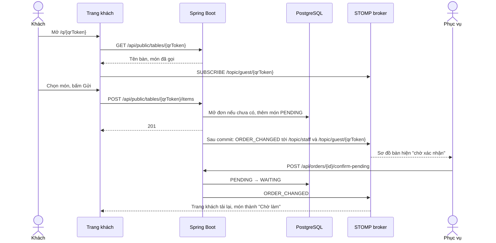
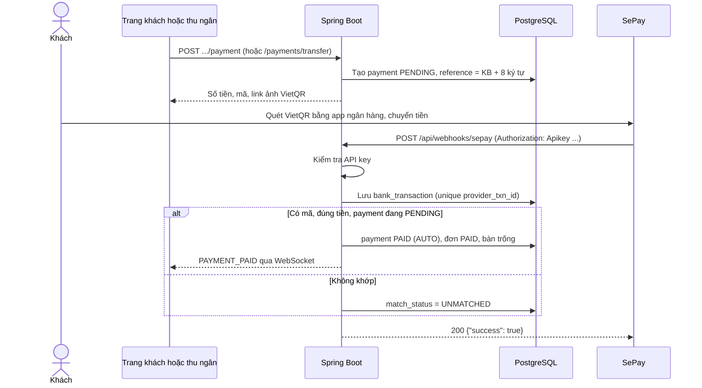

# 8. Thiết kế hệ thống

## 8.1 REST API

Tiền tố `/api`. Dữ liệu JSON. Lỗi trả theo chuẩn **Problem Details** (RFC 9457), ví dụ:

```json
{ "status": 409, "title": "Conflict", "detail": "Bàn đã có đơn đang mở" }
```

"NV" nghĩa là mọi nhân viên đã đăng nhập. `ADMIN` gọi được mọi API nên không ghi lại trong bảng.

| Nhóm | Method và đường dẫn | Quyền | Yêu cầu |
|---|---|---|---|
| Đăng nhập | `POST /auth/login` | Công khai | FR-01.1 |
| | `GET /auth/me` | NV | FR-01.1 |
| | `POST /auth/change-password` | NV | FR-01.4 |
| Nhân viên | `GET /employees`, `POST /employees`, `PUT /employees/{id}` | ADMIN | FR-02.1 |
| | `PATCH /employees/{id}/active` | ADMIN | FR-02.2 |
| | `POST /employees/{id}/reset-password` | ADMIN | FR-02.3 |
| | `PUT /employees/{id}/profile` (hồ sơ, mức lương) | ADMIN | FR-12.1, FR-12.2 |
| | `POST /employees/{id}/resign` (cho nghỉ việc) | ADMIN | FR-12.3 |
| Xếp ca | `GET /work-shifts`, `POST /work-shifts`, `PUT /work-shifts/{id}` | MANAGER | FR-13.1 |
| | `GET /schedule?from=`, `GET /schedule/staff`, `POST /schedule`, `DELETE /schedule/{id}` | MANAGER | FR-13.2 |
| | `POST /schedule/copy-week` | MANAGER | FR-13.3 |
| | `GET /me/schedule?from=&to=` | NV, lịch của mình | FR-13.4 |
| Nghỉ phép | `GET /me/leave-requests`, `POST /me/leave-requests`, `POST /me/leave-requests/{id}/cancel` | NV, đơn của mình | FR-13.5 |
| | `GET /leave-requests?status=`, `POST /leave-requests/{id}/approve`, `POST /leave-requests/{id}/reject` | MANAGER | FR-13.5, FR-13.6 |
| Chấm công | `GET /me/attendance/status`, `POST /me/attendance/check-in`, `POST /me/attendance/check-out` | NV | FR-14.1, FR-14.2 |
| | `GET /me/attendance?from=&to=` | NV, công của mình | FR-14.4 |
| | `GET /attendance?from=&to=&employeeId=`, `POST /attendance`, `PUT /attendance/{id}` | MANAGER | FR-14.3 |
| Lương | `GET /payrolls`, `POST /payrolls`, `GET /payrolls/{id}`, `POST /payrolls/{id}/recalculate` | ADMIN | FR-15.1 |
| | `POST /payslips/{id}/adjustments`, `DELETE /pay-adjustments/{id}` | ADMIN | FR-15.2 |
| | `POST /payrolls/{id}/finalize` | ADMIN | FR-15.3 |
| | `GET /me/payslips`, `GET /me/payslips/{id}` | NV, phiếu đã chốt của mình | FR-15.4 |
| Thực đơn | `GET /categories`, `GET /menu-items` | NV | FR-03 |
| | `POST`, `PUT /{id}`, `DELETE /{id}` trên `/categories` và `/menu-items` | MANAGER | FR-03.1, FR-03.2 |
| | `PATCH /menu-items/{id}/availability` | MANAGER, CHEF | FR-03.3 |
| Bàn | `GET /tables` (kèm trạng thái) | WAITER, MANAGER, CASHIER | FR-04.4 |
| | `POST /tables`, `PUT /tables/{id}`, `DELETE /tables/{id}` | MANAGER | FR-04.1 |
| | `POST /tables/{id}/qr-token` (tạo lại mã) | MANAGER | FR-04.3 |
| Đơn | `GET /orders?status=OPEN`, `GET /orders/{id}` | WAITER, MANAGER, CASHIER | FR-05, FR-08.1 |
| | `POST /orders` | WAITER, MANAGER | FR-05.1 |
| | `POST /orders/{id}/items` | WAITER, MANAGER | FR-05.2, FR-05.3 |
| | `POST /orders/{id}/confirm-pending` | WAITER, MANAGER | FR-06.3 |
| | `POST /orders/{id}/tables` (`tableIds`: 1 đến 10 bàn; đặt lại bàn của đơn: thêm là ghép, thay là chuyển) | WAITER, MANAGER | FR-04.5, FR-04.6 |
| | `POST /orders/{id}/cancel` | WAITER, MANAGER | FR-05.6 |
| | `PATCH /order-items/{id}/status` | CHEF (COOKING, READY), WAITER (SERVED), MANAGER | FR-07.2, FR-05.5 |
| | `POST /order-items/{id}/cancel` | WAITER, MANAGER (theo BR-08) | FR-05.4, FR-06.3 |
| Bếp | `GET /kitchen/items` | CHEF, MANAGER | FR-07.1 |
| Thanh toán | `POST /orders/{id}/payments/cash` | CASHIER, MANAGER | FR-08.2 |
| | `POST /orders/{id}/payments/transfer` | CASHIER, MANAGER | FR-08.3 |
| | `POST /payments/{id}/confirm` | CASHIER, MANAGER | FR-08.6 |
| | `GET /orders/{id}/payment` (khoản đã trả của đơn, để in phiếu thanh toán; chưa trả thì 404) | CASHIER, MANAGER | FR-08.9 |
| | `POST /orders/{id}/adjustments` (giảm một số tiền trên cả bill, hoặc tặng một dòng món; kèm lý do) | CASHIER, MANAGER | FR-08.10 |
| | `POST /adjustments/{id}/cancel` (huỷ khoản giảm khi đơn chưa trả) | CASHIER, MANAGER | FR-08.10 |
| | `GET /adjustments?status=PENDING`, `POST /adjustments/{id}/approve`, `POST /adjustments/{id}/reject` | MANAGER | FR-08.11 |
| | `GET /bank-transactions?status=UNMATCHED` | CASHIER, MANAGER | FR-08.7 |
| | `GET /bank-transactions/webhook-status` (webhook SePay có đang lỗi liên tiếp không) | CASHIER, MANAGER | FR-08.8 |
| | `POST /webhooks/sepay` | SePay (header API key) | FR-08.4 |
| Khách | `GET /public/tables/{qrToken}` | Công khai | FR-06.1, FR-06.4 |
| | `GET /public/menu` | Công khai | FR-06.1 |
| | `POST /public/tables/{qrToken}/items` | Công khai | FR-06.2, FR-06.5 |
| | `POST /public/tables/{qrToken}/payment` | Công khai | FR-08.5 |
| | `POST /public/tables/{qrToken}/requests` (`CALL_STAFF` hoặc `BILL`) | Công khai | FR-06.6 |
| Khách gọi | `GET /service-requests` (đang chờ, cũ nhất trước) | WAITER, MANAGER | FR-06.6 |
| | `POST /service-requests/{id}/take` (đã nhận) | WAITER, MANAGER | FR-06.7 |
| Kho | `GET /inventory-items`, `POST /inventory-items`, `PUT /inventory-items/{id}` | MANAGER | FR-09.1, FR-09.4 |
| | `POST /inventory-items/{id}/movements`, `GET /inventory-items/{id}/movements` | MANAGER | FR-09.2, FR-09.3 |
| Báo cáo | `GET /reports/summary?from=YYYY-MM-DD&to=YYYY-MM-DD` | MANAGER | FR-10 |
| Nhật ký | `GET /audit-entries?from=YYYY-MM-DD&to=YYYY-MM-DD` (mới nhất trước, tối đa 92 ngày). Không có API sửa, xoá | MANAGER | FR-16 |
| Cài đặt | `GET /settings` (bếp đọc ngưỡng món chờ lâu ở đây) | NV | FR-11, FR-07.4 |
| | `PUT /settings` | ADMIN | FR-11.1 → FR-11.3 |

Giới hạn tần suất (FR-01.5, FR-06.8):
- `POST /auth/login`: 10 lần mỗi phút cho mỗi tên đăng nhập (BR-31).
- Các `POST /public/tables/{qrToken}/...` (gửi món, gọi nhân viên, thanh toán): tính chung 10 lần mỗi phút cho mỗi bàn (BR-30).
- Quá giới hạn thì trả `429 Too Many Requests` kèm header `Retry-After` (số giây phải chờ). Lỗi có câu báo tiếng Việt trong `detail`, như mọi lỗi khác.

Tài liệu API chạy được (Swagger UI) nằm ở `/swagger-ui.html` khi chạy backend.

Ngoài `/api`, backend có `/actuator/health` (công khai, pipeline gọi để kiểm tra bản mới) và `/actuator/metrics` (chỉ ADMIN, NFR-11, xem [tài liệu 09 mục 9.5](09-kien-truc-va-cicd.md#95-triển-khai)).

## 8.2 Realtime (WebSocket STOMP)

| Kênh | Ai nghe | Xác thực | Sự kiện |
|---|---|---|---|
| Điểm kết nối `/ws` | — | JWT trong header `Authorization` của khung `CONNECT`. Khách kết nối không cần token | — |
| `/topic/staff` | Phục vụ, bếp, thu ngân, quản lý | Bắt buộc JWT | `ORDER_CHANGED`, `PAYMENT_PAID`, `MENU_CHANGED`, `TABLES_CHANGED`, `BANK_TRANSACTION` (có giao dịch không khớp), `REQUESTS_CHANGED` (khách gọi, hoặc có người nhận), `WEBHOOK_STATUS` (webhook SePay bắt đầu lỗi liên tiếp, hoặc chạy lại), `ADJUSTMENTS_CHANGED` (có khoản giảm giá mới, được duyệt, bị từ chối hoặc bị huỷ) |
| `/topic/guest/{qrToken}` | Điện thoại khách ở bàn đó | Không cần | `ORDER_CHANGED`, `PAYMENT_PAID`, `REQUESTS_CHANGED` |
| `/topic/menu` | Điện thoại khách | Không cần | `MENU_CHANGED` (có món vừa hết hoặc bán lại) |

Mỗi sự kiện rất nhỏ, ví dụ `{ "type": "ORDER_CHANGED", "orderId": 12, "tableId": 5, "alert": null }`. Khi nhận, giao diện **tải lại dữ liệu** qua REST, nên dữ liệu trên màn hình luôn khớp CSDL. Backend chỉ gửi sự kiện **sau khi giao dịch CSDL đã commit** (`@TransactionalEventListener(phase = AFTER_COMMIT)`).

Trường `alert` báo khi nào máy nhân viên cần **kêu** (FR-07.5, FR-06.6). Các thay đổi khác để `null`.

| `alert` | Khi nào | Màn hình kêu | Tiếng |
|---|---|---|---|
| `NEW_DISHES` | Phục vụ gửi món, hoặc xác nhận món QR (món vào bếp) | `/kitchen` | 2 tiếng, cao rồi thấp |
| `GUEST_DISHES` | Khách gửi món qua QR, chờ xác nhận | `/tables`, `/orders/:id` | 2 tiếng, thấp rồi cao |
| `DISH_READY` | Bếp bấm Xong | `/tables`, `/orders/:id` | 3 tiếng ngắn |
| `SERVICE_REQUEST` | Khách bấm Gọi nhân viên hoặc Yêu cầu tính tiền; bấm lại khi chưa ai nhận thì không kêu (BR-29) | `/tables`, `/orders/:id` | 3 tiếng đi lên |

Tiếng được tạo bằng Web Audio trên trình duyệt, không cần file âm thanh. Màn hình nào kêu thì đầu trang có nút bật, tắt âm báo; lựa chọn lưu trên từng máy. Trình duyệt không cho phát tiếng khi chưa ai chạm vào trang, nên lúc đó nút hiện "Chạm để bật âm báo".

## 8.3 Màn hình

| Đường dẫn | Vai trò | Nội dung | Yêu cầu |
|---|---|---|---|
| `/login` | Mọi nhân viên | Đăng nhập | FR-01.1 |
| `/tables` | WAITER, MANAGER | Sơ đồ bàn theo khu, màu theo trạng thái, nhóm bàn của đơn ghép; nút mở đơn và mang về; kêu khi có món xong, món QR mới | FR-04.4, FR-04.5, FR-05.1, FR-07.5 |
| `/orders/:id` | WAITER, MANAGER | Chọn món, giỏ, gửi bếp; danh sách món và trạng thái; xác nhận món QR; ra món; huỷ; chuyển, ghép bàn; in phiếu tạm tính; kêu như sơ đồ bàn | FR-04.5, FR-04.6, FR-05, FR-06.3, FR-07.5, FR-08.9 |
| `/kitchen` | CHEF, MANAGER | 3 cột Chờ làm, Đang làm, Xong; món chờ lâu tô đỏ; kêu khi có món mới; báo hết món | FR-07, FR-03.3 |
| `/cashier` | CASHIER, MANAGER | Đơn đang mở, bill, tiền mặt, VietQR, xác nhận tay, giao dịch không khớp; giảm giá, tặng món; in phiếu tạm tính và phiếu thanh toán; cảnh báo khi webhook SePay lỗi liên tiếp | FR-08 |
| `/admin/menu` | MANAGER | Danh mục và món | FR-03 |
| `/admin/tables` | MANAGER | Bàn, xem và in QR, tạo lại mã | FR-04.1 → FR-04.3 |
| `/admin/inventory` | MANAGER | Nguyên liệu, nhập, xuất, kiểm kê, lịch sử | FR-09 |
| `/admin/reports` | MANAGER | Doanh thu, theo phương thức, top món | FR-10 |
| `/admin/audit` | MANAGER | Nhật ký thao tác: chọn khoảng ngày, lọc theo người, loại thao tác, đơn hoặc bàn | FR-16 |
| `/admin/employees` | ADMIN | Nhân viên, hồ sơ và mức lương, cho nghỉ việc, khoá, đặt lại mật khẩu | FR-02, FR-12 |
| `/admin/schedule` | MANAGER | Lịch tuần theo người, xếp và gỡ ca, chép lịch tuần trước, ca mẫu | FR-13.1 → FR-13.3 |
| `/admin/attendance` | MANAGER | Bảng công theo ngày và người, sửa hoặc thêm bản ghi kèm lý do | FR-14.3 |
| `/admin/leave` | MANAGER | Đơn nghỉ chờ duyệt, duyệt, từ chối | FR-13.5, FR-13.6 |
| `/admin/payroll` | ADMIN | Bảng lương theo tháng, thưởng phạt, chốt, xuất Excel | FR-15.1 → FR-15.3, FR-15.5 |
| `/me` | Mọi nhân viên | Vào ca, ra ca; lịch làm; công tháng này; xin nghỉ; phiếu lương | FR-13.4, FR-13.5, FR-14.1, FR-14.4, FR-15.4 |
| `/admin/settings` | ADMIN | Nhà hàng, tài khoản nhận tiền, ngưỡng món chờ lâu | FR-11 |
| `/q/:qrToken` | Khách | Thực đơn, giỏ, món đã gọi và trạng thái, thanh toán VietQR, nút Gọi nhân viên và Yêu cầu tính tiền | FR-06, FR-08.5 |
| Đầu mọi trang nhân viên | WAITER, MANAGER | Nút chuông "Khách gọi": số bàn đang gọi; bấm vào thì hiện danh sách, số phút đã chờ, nút Đã nhận | FR-06.6, FR-06.7 |
| Đầu mọi trang nhân viên | MANAGER | Nút "Duyệt": số khoản giảm giá chờ duyệt; bấm vào thì thấy bàn, số tiền, lý do, người xin, nút Duyệt và Từ chối | FR-08.11 |

Phác thảo trang khách trên điện thoại:

```text
┌──────────────────────────────┐
│ Khói Bếp · Bàn B05           │
├──────────────────────────────┤
│ [Thực đơn]  [Món đã gọi (4)] │
│                              │
│ Món đã gọi                   │
│  Lẩu riêu cua x1   Đang làm  │
│  Nem rán x2        Xong      │
│  Trà đá x2         Chờ xác nhận│
│ ───────────────────────────  │
│ Tạm tính:          245.000 đ │
│ [ Thanh toán chuyển khoản ]  │
└──────────────────────────────┘
```

Phác thảo màn hình bếp:

```text
┌ Chờ làm (3) ───┬ Đang làm (2) ──┬ Xong (1) ───────┐
│ B05 Nem rán x2 │ B02 Lẩu riêu x1│ B07 Trà đá x2   │
│ 2 phút [Bắt đầu]│ 8 phút  [Xong] │ chờ phục vụ ra  │
│ B01 Phở bò x1  │ ...            │                 │
└────────────────┴────────────────┴─────────────────┘
```

Phác thảo phiếu tạm tính khổ 80 mm (FR-08.9). Trình duyệt chỉ in phần phiếu, rộng 72 mm, vừa vùng in của máy in nhiệt 80 mm:

```text
┌──────────────────────────────┐
│           KHÓI BẾP           │
│    Phường Đống Đa, Hà Nội    │
│        ĐT 0900000000         │
│        PHIẾU TẠM TÍNH        │
│ Bàn B05 · Đơn #128 · 2 khách │
│ Vào 18:05 · In 19:42 01/10   │
├──────────────────────────────┤
│ Lẩu riêu cua bắp bò          │
│   1 x 329.000 đ    329.000 đ │
│ Nem rán                      │
│   2 x 65.000 đ     130.000 đ │
├──────────────────────────────┤
│ TỔNG CỘNG          459.000 đ │
│ Giá đã gồm VAT. Phiếu này    │
│ không thay hoá đơn GTGT.     │
└──────────────────────────────┘
```

Phiếu thanh toán có thêm cách trả, tiền khách đưa và tiền thối (tiền mặt) hoặc mã chuyển khoản, giờ trả và lời cảm ơn. Đơn có giảm giá thì phiếu ghi tiền món, từng khoản giảm (món tặng ghi "Tặng"), rồi tổng sau giảm (FR-08.10).

## 8.4 Tuần tự: khách gọi món qua QR



## 8.5 Tuần tự: chuyển khoản tự xác nhận



Ảnh VietQR lấy từ dịch vụ công khai `img.vietqr.io` theo mẫu `https://img.vietqr.io/image/{bankCode}-{accountNo}-compact2.png?amount={amount}&addInfo={reference}&accountName={name}`.
