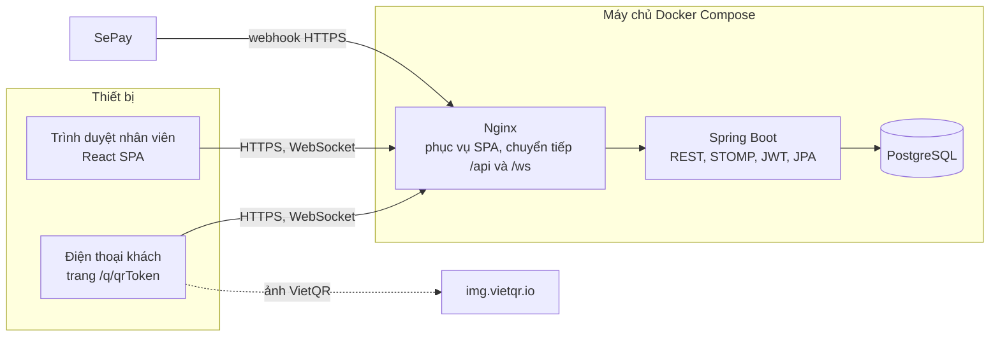
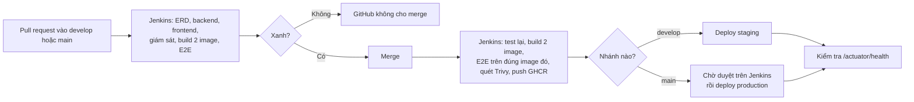
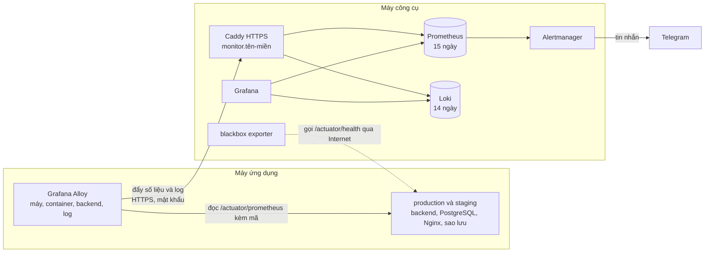

# 9. Kiến trúc và CI/CD

## 9.1 Kiến trúc tổng thể

Một ứng dụng **Spring Boot** duy nhất (monolith chia theo tầng, mục 9.3) và một ứng dụng **React** dùng chung cho nhân viên và khách. Không tách microservice, vì một nhà hàng không cần.



## 9.2 Công nghệ

| Lớp | Công nghệ | Dùng cho |
|---|---|---|
| Backend | **Java 21, Spring Boot 4.1**: Web MVC, Security, OAuth2 Resource Server (JWT), Data JPA, Validation, WebSocket, Actuator, AOP (AspectJ) | API, phân quyền, realtime, ghi log lời gọi chậm |
| Lược đồ CSDL | **Flyway** | Tạo và nâng cấp bảng theo phiên bản |
| Tài liệu API | springdoc-openapi (Swagger UI) | Xem và thử API |
| CSDL | **PostgreSQL 17** | Lưu dữ liệu, ràng buộc toàn vẹn |
| Frontend | **React 19, TypeScript, Vite**, Ant Design, React Router, TanStack Query, @stomp/stompjs | Giao diện nhân viên và khách |
| Test | JUnit 5, MockMvc, **Testcontainers (PostgreSQL)**; Vitest | Test tự động |
| Đóng gói | Docker (multi-stage), Docker Compose, Nginx | Chạy giống nhau ở máy dev và máy chủ |
| CI/CD | **Jenkins** (test mỗi PR, build, deploy), GitHub Container Registry (GHCR). GitHub Actions chỉ còn CodeQL và kiểm thử tải chạy tay | Build, test, đóng image, triển khai (mục 9.6) |
| Giám sát | **Prometheus**, **Loki**, **Grafana**, Alertmanager, blackbox exporter trên máy công cụ; **Grafana Alloy** trên máy ứng dụng; Micrometer trong backend | Số liệu, log, dashboard, cảnh báo Telegram (mục 9.8) |

## 9.3 Cấu trúc mã nguồn

```text
.
├── backend/                         Spring Boot (Maven Wrapper), một ứng dụng (monolith) chia theo tầng
│   └── src/main/java/vn/khoibep/rms/
│       ├── RmsApplication.java      điểm khởi động, quét mọi package bên dưới
│       ├── controller/              REST API, kiểm quyền
│       ├── service/                 quy tắc nghiệp vụ, giao dịch
│       ├── repository/              Spring Data JPA
│       ├── model/                   model (entity JPA), mỗi bảng một lớp
│       ├── dto/                     dữ liệu vào, ra của API
│       ├── enums/                   trạng thái và loại
│       ├── aspect/                  Spring AOP
│       ├── config/                  Security, JWT, WebSocket, OpenAPI, khởi tạo tài khoản
│       ├── common/                  exception/ (lỗi chung), realtime/ (sự kiện), security/ (người đăng nhập,
│       │                            giới hạn tần suất), util/
│       └── resources/db/migration/  Flyway V1 (bảng), V2 (dữ liệu mẫu), V3 → V7 (nhân sự), V8 (món chờ lâu), V9 (khách gọi nhân viên), V10 (đổi tên quán), V11 (nhật ký thao tác), V12 (giảm giá, tặng món), V13 (chuyển, ghép bàn), V14 (nhà cung cấp, phiếu nhập), V15 (định lượng, trừ kho tự động), V16 (ca và két), V17 (giá vốn lúc trừ kho, view báo cáo), V18 (thu hồi token), V19 (đặt bàn và cọc), V20 (tách bill), V21 (khách hàng), V22 (hoá đơn điện tử), V23 (đơn app giao hàng)
├── frontend/                        React + Vite
│   └── src/ app/ (định tuyến, khung trang), shared/ (API, realtime, định dạng), features/<module>/
├── scripts/check-erd.mjs            so ERD với migration (database-first)
├── perf/                            kiểm thử tải k6, dữ liệu bán hàng 6 tháng để thử
├── docker-compose.yml               chạy toàn bộ ở máy dev
├── deploy/docker-compose.prod.yml   chạy trên máy chủ bằng image từ GHCR
├── Jenkinsfile                      pipeline CI/CD; Jenkins và các tệp của nó ở deploy/ops/jenkins/
└── .github/                         codeql.yml, load-test.yml (chạy tay), dependabot.yml
```

Backend là **một ứng dụng Spring Boot (monolith) chia theo tầng** (P3-06). Mỗi tầng là một package dùng chung cho mọi nghiệp vụ:

| Package | Chứa | Ví dụ |
|---|---|---|
| `controller/` | Nhận request, kiểm quyền bằng `@PreAuthorize`, gọi service | `OrderController`, `PaymentController` |
| `service/` | Quy tắc nghiệp vụ, mở giao dịch (`@Transactional`). Các lớp tính toán thuần cũng nằm ở đây | `OrderService`, `PayCalculator`, `PaymentReference`, `VietQr`, `QrTokenGenerator` |
| `repository/` | Đọc ghi CSDL bằng Spring Data JPA | `OrderRepository` |
| `model/` | Model của ứng dụng: mỗi bảng một lớp `@Entity` (JPA); riêng bảng `menu_item_app_price` là `@ElementCollection` trong `MenuItem` | `Order`, `Payment` |
| `dto/` | Dữ liệu vào, ra của API (`record`), gom theo nghiệp vụ | `OrderDtos`, `PaymentDtos` |
| `enums/` | Trạng thái và loại | `OrderStatus`, `ItemStatus` |
| `aspect/` | Spring AOP | `LoggingAspect` |
| `config/` | Cấu hình Spring; thành phần chạy lúc khởi động | `SecurityConfig`, `DemoAccountsInitializer`, `InitialAdminInitializer` |
| `common/` | Dùng chung, không phải nghiệp vụ: lỗi (`exception/`), sự kiện realtime (`realtime/`), người đăng nhập và giới hạn tần suất (`security/`), tiện ích (`util/`) | `ApiException`, `RealtimeEvents`, `Money` |

**Vì sao chia theo tầng.** Nhiều bảng được nhiều nghiệp vụ dùng chung. Ví dụ bảng `orders` (`Order`) được gọi món, thanh toán, đặt bàn, báo cáo và hoá đơn điện tử cùng đọc ghi. Nếu chia theo nghiệp vụ, model đó "thuộc" package `order` dù không riêng của nghiệp vụ nào. Chia theo tầng thì mọi model nằm chung `model/`, mọi service chung `service/`, và chiều gọi giữa các tầng được kiểm bằng test kiến trúc (dưới). Package model chứa entity JPA nên lớp vẫn mang annotation `@Entity`; tên `model` là cách gọi chữ M trong MVC.

**AOP.** `aspect/LoggingAspect` (`@Aspect`) bọc mọi phương thức public của các lớp `@Service`:
- Lời gọi chậm hơn `app.slow-service-threshold` (mặc định 500 ms, bằng mục tiêu p95 của NFR-02) được ghi log `WARN` kèm tên lớp, tên phương thức và thời gian.
- Nhanh hơn thì chỉ ghi `DEBUG` (mặc định không hiện).
- Lỗi vẫn ném ra nguyên vẹn; aspect không đổi kết quả hay giao dịch.

Nhờ đó, khi cảnh báo `SlowResponses` (mục 9.8) báo một đường dẫn chậm, log chỉ ra đúng phương thức service gây chậm (NFR-11). Spring tạo proxy cho aspect theo cùng cơ chế đã dùng cho `@Transactional` và `@PreAuthorize` (thư viện `spring-boot-starter-aspectj`).

**Nghiệp vụ nằm ở lớp nào.** Mỗi nghiệp vụ có lớp ở nhiều tầng, đặt tên cùng gốc; repository, DTO và enum theo cùng tên (`OrderRepository`, `OrderDtos`, `OrderStatus`):

| Nghiệp vụ | Controller | Service | Model |
|---|---|---|---|
| Gọi món, bếp, QR, giảm giá | `OrderController`, `GuestOrderController`, `ServiceRequestController`, `AdjustmentController` | `OrderService`, `OrderItemService`, `GuestOrderService`, `ServiceRequestService`, `AdjustmentService` | `Order`, `OrderItem`, `OrderTable`, `ServiceRequest`, `Adjustment` |
| Bàn | `TableController` | `TableService`, `QrTokenGenerator` | `DiningTable` |
| Đặt bàn và cọc | `ReservationController` | `ReservationService` | `Reservation` |
| Thanh toán, ca két | `PaymentController`, `CashShiftController`, `SepayWebhookController` | `PaymentService`, `CashShiftService`, `SepayWebhookService`, `SepayWebhookMonitor`, `PaymentReference`, `VietQr` | `Payment`, `BankTransaction`, `CashShift`, `CashExpense` |
| Cài đặt | `SettingsController` | `SettingsService` | `RestaurantSettings` |
| Thực đơn, thuế | `MenuController`, `TaxController` | `MenuService`, `TaxService` | `Category`, `MenuItem`, `TaxCategory`, `TaxRate` |
| Kho, nhà cung cấp | `InventoryController`, `PurchaseController`, `RecipeController` | `InventoryService`, `SupplierService`, `GoodsReceiptService`, `RecipeService`, `StockUsageService` | `InventoryItem`, `Supplier`, `GoodsReceipt`, `ReceiptLine`, `RecipeLine`, `StockMovement` |
| Báo cáo | `ReportController` | `ReportService` | (không có model riêng) |
| Khách hàng | `CustomerController` | `CustomerService` | `Customer` |
| Hoá đơn điện tử | `EInvoiceController` | `EInvoiceService` | `EInvoice`, `EInvoiceLine` |
| Đăng nhập | `AuthController` | `AuthService` | (không có model riêng) |
| Nhân viên | `EmployeeController` | `EmployeeService` | `Employee` |
| Xếp ca | `ScheduleController` | `ScheduleService` | `WorkShift`, `ShiftAssignment` |
| Chấm công | `AttendanceController` | `AttendanceService` | `Attendance` |
| Nghỉ phép | `LeaveController` | `LeaveService` | `LeaveRequest` |
| Bảng lương | `PayrollController` | `PayrollService`, `PayCalculator`, `PayrollLock` | `Payroll`, `Payslip`, `PayAdjustment` |
| Nhật ký thao tác | `AuditController` | `AuditService` | `AuditEntry` |

**Test.** Test tích hợp (gọi API với PostgreSQL thật, kế thừa `IntegrationTest`) nằm ở `integration/`, ví dụ `integration/OrderFlowIntegrationTest`. Test đơn vị đặt cùng package với lớp nó kiểm tra, ví dụ `enums/ItemStatusTest`, `service/PayCalculatorTest`, `aspect/LoggingAspectTest`.

`ArchitectureTest` (ArchUnit, 11 quy tắc) giữ cấu trúc này khi cả nhóm cùng viết code; đặt sai chỗ thì CI đỏ, kèm tên class sai:
- Controller, service, repository, model, enum, DTO, aspect phải nằm đúng package của tầng mình.
- Chỉ gọi xuống: controller không dùng thẳng repository, không ai gọi controller, repository và model không gọi service.
- Model và enum không dùng DTO, vì dữ liệu không nên phụ thuộc vào cách API định dạng yêu cầu và trả lời.

Frontend vẫn chia theo tính năng (`features/<nghiệp vụ>`), mỗi thư mục ứng với một nghiệp vụ ở bảng trên:

```text
frontend/src/
├── main.tsx, index.css
├── app/          App.tsx (định tuyến), StaffLayout.tsx (khung trang nhân viên)
├── shared/       api/ (client, types), realtime/useRealtime, utils/format
├── test/         setup.ts
└── features/
    ├── order/    pages/ (OrderPage, KitchenPage, GuestPage), components/, hooks/useCart, utils/sound
    ├── payment/  pages/CashierPage, components/TransferQr, BillSlip
    ├── payroll/  pages/PayrollPage, utils/payroll
    └── ...       auth, table, settings, menu, inventory, report, employee, schedule, attendance, leave, audit
```

- Mỗi feature chỉ có các thư mục nó cần: `pages/`, `components/`, `hooks/`, `utils/`, `context/`.
- Import trong cùng feature dùng đường dẫn tương đối (`../utils/payroll`); import sang chỗ khác dùng alias `@/` trỏ vào `src/` (`@/shared/api/client`, `@/features/attendance/utils/attendance`).
- Test đặt cạnh file nó kiểm tra (`features/payroll/utils/payroll.test.ts`).

## 9.4 Bảo mật

- Mật khẩu băm **BCrypt**. Đăng nhập trả **JWT HS256** có hạn 12 giờ. Khoá bí mật lấy từ biến môi trường `APP_JWT_SECRET`.
- Mỗi request kiểm tra nhân viên **còn hoạt động** (BR-03), và token còn đúng **số phiên bản** của tài khoản (BR-41). Đổi mật khẩu hay đăng xuất mọi thiết bị là thu hồi mọi token cũ, không cần danh sách token bị cấm.
- API công khai chỉ gồm `/api/public/**`, `/api/auth/login`, `/api/webhooks/sepay`, `/ws`, `/actuator/health`.
- Actuator chỉ mở `health` (công khai), `info` và `metrics` (chỉ ADMIN), `prometheus` (chỉ trả khi header `Authorization: Bearer` mang đúng `APP_METRICS_TOKEN`, so bằng phép so sánh thời gian hằng; chưa đặt mã thì đóng hẳn). Nginx chỉ chuyển tiếp `/actuator/health`, nên từ Internet không gọi được các endpoint còn lại.
- Webhook kiểm tra `Authorization: Apikey <SEPAY_API_KEY>` bằng phép so sánh thời gian hằng.
- Giới hạn tần suất (Bucket4j, lưu trong bộ nhớ của server): mỗi tên đăng nhập thử tối đa 10 lần mỗi phút (BR-31); trang QR của mỗi bàn gửi tối đa 10 lần mỗi phút và giữ tối đa 30 món chờ xác nhận (BR-30). Quá giới hạn thì trả 429 kèm `Retry-After`. Không giới hạn theo IP: sau Nginx, IP đầu tiên trong `X-Forwarded-For` do client tự gửi được, còn khách trong quán lại dùng chung một IP Wi-Fi.
- Khi triển khai thật phải có **HTTPS**, vì SePay chỉ gọi địa chỉ HTTPS công khai. Một Caddy trên máy chủ (`deploy/caddy/`) nhận cổng 80, 443 cho cả production và staging, tự lấy và gia hạn chứng chỉ Let's Encrypt. Hai container web chỉ mở cổng trên `127.0.0.1`, nên từ Internet chỉ vào được qua Caddy.
- Jenkins (P0-08) chạy trên máy công cụ. Nếu bố trí một máy thì Jenkins chạy chung máy với app (mục 9.5):
  - Jenkins điều khiển Docker của máy nó chạy để build image và chạy test, tức là có quyền gần như root trên máy đó. Nếu bố trí một máy thì đó cũng là máy chứa dữ liệu thật.
  - Vì vậy Jenkins chỉ build PR mở từ chính repo, do thành viên có quyền push tạo ra. PR từ fork (người ngoài) không được build.
  - Jenkins vào máy ứng dụng bằng tài khoản `deploy` qua SSH, với khoá riêng.
  - Token GitHub của Jenkins chỉ có quyền `repo:status` và `write:packages`.
  - Trang Jenkins phải đăng nhập, không cho xem ẩn danh.
- Quét lỗ hổng tự động, kết quả ở tab **Security** của GitHub:
  - Dependabot mở PR cập nhật thư viện mỗi tuần vào `develop`. Riêng bản lớn của Java và Node (image `eclipse-temurin`, `node`) thì không: chúng phải lên cùng lúc với bản chạy test (`pom.xml`, `ci-cd.yml`, `Jenkinsfile`), để image chạy đúng thứ đã test.
  - CodeQL phân tích mã Java và TypeScript ở mỗi PR và mỗi tuần.
  - Trivy quét 2 image sau mỗi lần build của Jenkins. Kết quả in trong log build, không lên tab Security.
  - Trivy báo lỗ hổng trong một thư viện do Spring Boot quản lý mà Spring Boot chưa có bản mới thì ghi đè phiên bản trong `backend/pom.xml` (như `tomcat.version`). Bỏ dòng ghi đè khi Spring Boot đã quản lý phiên bản đó hoặc mới hơn.

## 9.5 Triển khai

| Môi trường | Nhánh | Cách chạy | Ghi chú |
|---|---|---|---|
| Máy dev | bất kỳ | `docker compose up --build` rồi mở `http://localhost:8080` | Có tài khoản demo |
| Staging | `develop` | `deploy/docker-compose.prod.yml` trong `~/khoibep-rms-staging`, image tag theo commit | Tự deploy, có thể bật tài khoản demo để cả nhóm thử |
| Production | `main` | `deploy/docker-compose.prod.yml` trong `~/khoibep-rms` | Deploy sau khi có người duyệt |

Staging và production chạy chung **máy ứng dụng**. Giám sát (mục 9.8) và Jenkins (mục 9.6) chạy trên **máy công cụ**. Có hai cách bố trí:
- **Một máy** (P0-09, chọn ngày 03/10/2026):
  - Một máy 8 vCPU, 16 GB RAM vừa là máy ứng dụng vừa là máy công cụ.
  - Một Caddy phục vụ cả 4 tên miền: production, staging, Grafana, Jenkins (`deploy/single/`).
  - Grafana, Jenkins, Prometheus, Loki chỉ mở cổng trên `127.0.0.1`.
  - Rẻ và gọn. Nhưng máy chết thì giám sát chết theo, nên phải có kiểm tra uptime từ bên ngoài và chép bản sao lưu ra ngoài máy.
- **Hai máy** (máy ứng dụng 2 vCPU, 4 GB; máy công cụ 4 vCPU, 8 GB), dùng khi quán dùng thật:
  - Máy ứng dụng chết thì máy công cụ vẫn báo động.
  - Build và test không giành tài nguyên với quán.
  - Jenkins không nằm chung máy với dữ liệu thật.

Bí mật để trong tệp `.env` trên máy chủ, **không đưa vào Git**. Biến chính: `POSTGRES_PASSWORD`, `APP_JWT_SECRET`, `SEPAY_API_KEY`, `APP_PUBLIC_BASE_URL` (địa chỉ in trong QR bàn), `HTTP_PORT` (cổng trên `127.0.0.1` mà Caddy chuyển tới: production 8081, staging 8080), `APP_DEMO_ACCOUNTS_ENABLED`, `APP_INITIAL_ADMIN_PASSWORD` (tài khoản quản trị đầu tiên, BR-48). Các bước dựng máy chủ ở [tài liệu 11](11-trien-khai-van-hanh.md).

**Sao lưu (P0-04).** Dịch vụ `backup` trong `deploy/docker-compose.prod.yml` chạy `pg_dump` mỗi đêm lúc `BACKUP_HOUR` giờ Việt Nam (mặc định 3 giờ):
- Bản sao lưu nằm trong thư mục `backups/` cạnh file compose, giữ `BACKUP_KEEP` bản mới nhất (mặc định 7).
- `restore.sh --check` khôi phục thử vào một CSDL tạm, in số dòng từng bảng rồi xoá CSDL tạm, không đụng dữ liệu thật.
- `restore.sh` không có `--check` thì khôi phục thật, có hỏi xác nhận trước.
- Thỉnh thoảng nên chép thư mục `backups/` ra ngoài máy chủ: mất máy chủ là mất luôn bản sao lưu nằm trên đó.

**Log, số liệu và cảnh báo (P3-05, NFR-11).**
- Trên staging và production, backend ghi log dạng JSON theo chuẩn ECS (Elastic Common Schema), bật bằng biến `LOGGING_STRUCTURED_FORMAT_CONSOLE=ecs` trong `deploy/docker-compose.prod.yml`. Mỗi dòng là một đối tượng JSON có `@timestamp`, `log.level`, `log.logger`, `message`, nên lọc được bằng `jq` hoặc đưa thẳng vào công cụ gom log. Máy dev giữ log dạng chữ cho dễ đọc.
- `/actuator/metrics` cho các số liệu Spring Boot tự đo: `http.server.requests` (số request và thời gian trả lời theo đường dẫn và mã trả về), `jvm.memory.used`, `hikaricp.connections.active`... Chỉ ADMIN gọi được và Nginx không chuyển tiếp, nên phải hỏi từ trong mạng Docker của máy chủ. Lệnh mẫu ở README.
- Cảnh báo webhook (BR-32): SePay gửi lại một webhook lỗi sau 1, 2, 4, 7, 12, 20 và 33 phút kể từ lần đầu. Với ngưỡng 3 lần liên tiếp, webhook hỏng thì khoảng 2 phút sau màn hình thu ngân hiện cảnh báo; một lần lỗi thoáng qua mà lần gửi lại thành công thì không báo. Lúc bắt đầu đợt lỗi, backend ghi thêm một dòng log `ERROR`.
- Server không thấy được lỗi kết nối (SePay không gọi tới nơi), nên khi tạo webhook trên my.sepay.vn nên bật cả bước **Cảnh báo** của SePay. SePay báo khi cả 8 lần gửi đều lỗi, tức sau khoảng 33 phút.
- Log và số liệu trên còn được gom về máy công cụ để xem trên Grafana và báo qua Telegram (mục 9.8).

## 9.6 Nhánh và pipeline CI/CD

Mô hình nhánh: `feature/<tên>` → PR vào `develop` → PR vào `main`. Cả `develop` và `main` được bảo vệ: không push thẳng, chỉ merge khi test xanh.



**CI/CD trên Jenkins (P0-08, P0-09, NFR-13).** Cả CI lẫn CD chạy trên Jenkins (`Jenkinsfile`). Jenkins xem repo trên GitHub mỗi 2 phút: nhánh `develop`, `main`, và các PR mở từ chính repo.
- **Với mỗi PR**, trên kết quả merge PR vào nhánh đích:
  - Chạy test: ERD, backend (PostgreSQL thật qua Testcontainers), frontend, cấu hình giám sát. Mỗi phần chạy trong một container riêng, nhận mã nguồn của đúng commit đó.
  - Build 2 image, rồi chạy E2E trên đúng 2 image đó, trong một mạng Docker riêng không mở cổng nào ra máy.
  - Báo kết quả lên PR với trạng thái `continuous-integration/jenkins/pr-merge`. Ruleset của GitHub chỉ cho merge khi trạng thái này xanh.
- **Với mỗi commit mới của `develop` và `main`:**
  - Chạy lại các bước trên, quét Trivy, đẩy image lên GHCR.
  - Deploy: `develop` lên staging; `main` lên production sau khi có người bấm duyệt trên Jenkins.
  - Kiểm tra health sau khi deploy. Test lỗi thì không deploy.
- Hai build không chạy phần test và build cùng lúc (khoá `khoibep-build`), để không giành RAM với app thật.
- **Không deploy chồng, không deploy ngược:**
  - `deploy/deploy.sh` giữ khoá (`flock`) để chỉ một lần deploy chạy. Script bỏ qua nếu commit đó đang chạy rồi.
  - Ngay trước khi deploy, Jenkins kiểm commit còn là mới nhất của nhánh.
- **Jenkins là điểm duy nhất.** Jenkins hoặc máy của nó chết thì không có gì được test hay deploy. GitHub cũng không cho merge cho tới khi Jenkins chạy lại.
- **Chuyển từ GitHub Actions sang Jenkins:** ruleset hiện còn bắt buộc các check của GitHub Actions. Vì vậy `ci-cd.yml` tạm giữ 4 job test (Backend, Frontend, E2E, Giám sát), không còn build hay deploy. Khi Jenkins đã chạy và ruleset đổi sang `continuous-integration/jenkins/pr-merge` (tài liệu 11 mục 11.4), tệp này được xoá.

| Bước | Làm gì | Chặn merge nếu lỗi |
|---|---|---|
| ERD | So ERD với migration (`scripts/check-erd.mjs`) | Có |
| Backend | Biên dịch, chạy test đơn vị và test tích hợp với PostgreSQL thật, đo độ phủ bằng JaCoCo (dưới 70% số dòng là lỗi) | Có |
| Frontend | Kiểm tra kiểu (TypeScript), ESLint, Vitest (cả test component), build | Có |
| Giám sát | Kiểm tra cấu hình Prometheus, Alertmanager và Alloy; chạy test quy tắc cảnh báo (`promtool test rules`); dashboard Grafana là JSON hợp lệ (`scripts/check-monitoring.sh`) | Có |
| E2E | Dựng ứng dụng từ 2 image vừa build, chạy kịch bản nghiệm thu bằng Playwright trên Chromium | Có |
| CodeQL | Phân tích tĩnh mã Java và TypeScript (GitHub Actions, `codeql.yml`) | Không, chỉ báo ở tab Security |
| Image | Build image multi-stage, gắn tag theo commit; Trivy quét lỗ hổng CRITICAL, HIGH đã có bản vá, in trong log Jenkins; đẩy lên GHCR (chỉ `develop`, `main`) | Không, chỉ báo |
| Deploy | `develop` lên staging; `main` lên production sau khi có người duyệt trên Jenkins | — |
| Quay lại bản cũ | Job **Khói Bếp: quay lại bản cũ** trên Jenkins: chọn môi trường và commit; production cần duyệt | — |

## 9.7 Chiến lược kiểm thử

| Mức | Công cụ | Nội dung chính |
|---|---|---|
| Đơn vị | JUnit 5 | Chuyển trạng thái món (BR-07), dò mã thanh toán trong nội dung chuyển khoản (BR-15), công thức lương (BR-26), tách thuế và chia giảm giá theo thuế suất (BR-46), tệp `.xlsx`, tài khoản quản trị đầu tiên (BR-48), ghi log lời gọi service chậm (`LoggingAspect`) |
| Tích hợp | Spring Boot Test + MockMvc + Testcontainers | Gọi món, QR và xác nhận, bếp, tiền mặt, chuyển khoản và webhook, cảnh báo webhook lỗi liên tiếp, giảm giá và duyệt vượt hạn mức, chuyển và ghép bàn, phân quyền (cả quyền xem số liệu Actuator), nhật ký thao tác (kể cả CSDL chặn sửa, xoá), kho, phiếu nhập và giá vốn, định lượng và trừ kho tự động, ca và két, báo cáo lãi gộp và ngoại lệ, đặt bàn và cọc, tách bill, khách hàng, hoá đơn điện tử và thuế suất theo ngày, đơn app giao hàng, xếp ca, chấm công, nghỉ phép, bảng lương. Test chấm công đặt giờ bằng một `Clock` giả |
| Frontend | Vitest | Định dạng tiền, nhãn trạng thái, giờ công, bảng lương và báo cáo xuất Excel, tách bill, khoản giảm giá, ca két, cọc, khách hàng, mã số thuế và số hoá đơn, thuế suất sắp đổi, món của đơn app |
| Component | Vitest + Testing Library, trình duyệt giả lập jsdom | Chọn món vào giỏ (tổng tiền, bớt món, ghi chú, món hết, đổi nhóm), giỏ tối đa 50 phần mỗi món (BR-06), mã VietQR, nhãn trạng thái món, phiếu in 80 mm (BR-33) |
| Độ phủ | JaCoCo | Backend phải chạy tới ≥ 70% số dòng, thấp hơn thì CI đỏ. Con số in trong log build của Jenkins, ở bước Backend |
| Kiến trúc | ArchUnit (`ArchitectureTest`) | Mỗi class nằm đúng package của tầng mình (cả aspect), và chỉ gọi xuống các tầng dưới (mục 9.3) |
| E2E | Playwright, chạy trong CI | Kịch bản nghiệm thu ở [§1.5](01-tam-nhin-du-an.md#15-tiêu-chí-nghiệm-thu): khách QR, phục vụ, bếp, chuyển khoản, bàn trống; phân quyền; trang "Của tôi" |
| Tải | k6 (`perf/load-test.js`), workflow `load-test.yml` chạy tay ở tab Actions | NFR-02: 30 người trong 2 phút (14 khách gọi món QR, 10 phục vụ, 3 bếp, 2 thu ngân, 1 quản lý xem báo cáo 30 ngày), sau khi nạp 6 tháng bán hàng. Đạt khi p95 < 500 ms và dưới 1% request lỗi |
| Cảnh báo | `promtool test rules`, chạy trong CI | Mỗi quy tắc ở mục 9.8 báo khi có sự cố và im khi bình thường, với số liệu giả lập theo từng phút |
| Nghiệm thu | 2 trình duyệt + 1 điện thoại | Kịch bản ở [§1.5](01-tam-nhin-du-an.md#15-tiêu-chí-nghiệm-thu), làm tay khi demo |

Các mức Đơn vị, Tích hợp, Kiến trúc, Frontend, Component, Độ phủ, E2E và Cảnh báo chạy trên Jenkins ở mỗi PR, và chạy lại trước mỗi lần deploy (mục 9.6).

## 9.8 Giám sát và cảnh báo (P0-07, NFR-12)

Giám sát chạy trên **máy công cụ**, tách khỏi **máy ứng dụng** (máy chạy staging và production). Máy công cụ cũng chạy Jenkins (mục 9.6), sau cùng một Caddy. Máy ứng dụng chết thì máy công cụ vẫn còn để báo động. Trên máy ứng dụng chỉ có một agent **Grafana Alloy**: nó tự đẩy số liệu và log sang máy công cụ, nên máy ứng dụng không phải mở thêm cổng nào.

Khi bố trí một máy (mục 9.5), mọi thứ dưới đây chạy chung máy, với ba điểm khác:
- Agent đẩy thẳng vào Prometheus và Loki qua `127.0.0.1`, không qua Internet. Hai đường `/ingest` không mở ra ngoài.
- Không chạy node exporter riêng, vì agent đã đọc chính máy này.
- Blackbox gọi trang của quán qua tên miền của chính máy.



**Thu thập gì.**

| Nhóm | Số liệu | Nguồn |
|---|---|---|
| Máy chủ | CPU, RAM, swap, ổ đĩa, mạng | Alloy (`prometheus.exporter.unix`) trên máy ứng dụng; node exporter trên máy công cụ |
| Container | CPU, RAM của từng container, số container đang chạy | Alloy (cAdvisor) |
| Ứng dụng | Số request, mã trả về, thời gian trả lời; bộ nhớ JVM; kết nối CSDL | `/actuator/prometheus` của backend (Micrometer) |
| Nghiệp vụ | Webhook SePay lỗi liên tiếp và tổng số lần lỗi (BR-32); giao dịch chuyển khoản không khớp mới (BR-16); lần sao lưu thành công gần nhất (P0-04) | Bộ đếm của backend; tệp `backup.prom` do `backup.sh` ghi sau mỗi lần sao lưu |
| Log | Log mọi container của hai môi trường, gắn nhãn `env`, `service`, và `level` với log JSON của backend | Alloy (`loki.source.docker`) |
| Từ bên ngoài | Web production, staging trả `UP`; hạn chứng chỉ HTTPS | blackbox exporter trên máy công cụ |

Mọi số liệu có nhãn `env` (`production`, `staging`) lấy từ tên project Docker Compose (`khoibep-rms`, `khoibep-rms-staging`). Thời gian trả lời đếm theo các mốc 50 ms, 100 ms, 250 ms, 500 ms, 1 s, 2 s, 5 s, đủ để tính p95 mà không phải giữ cả histogram.

**Cảnh báo** (gửi Telegram, gom theo tên cảnh báo và môi trường, nhắc lại mỗi 4 giờ khi chưa hết, báo khi đã ổn):

| Cảnh báo | Khi nào | Mức |
|---|---|---|
| `ServerDown` | Không nhận được số liệu của máy ứng dụng 3 phút, hoặc node exporter máy công cụ không trả lời 2 phút | critical |
| `HostCpuHigh` | CPU bận trên 90% suốt 15 phút | warning |
| `HostMemoryLow` | RAM còn trống dưới 10% suốt 10 phút | warning |
| `HostDiskLow` | Ổ đĩa `/` còn trống dưới 15% suốt 10 phút | warning |
| `ContainerMissing` | Một môi trường chạy ít hơn 4 container (db, backend, frontend, backup) suốt 3 phút | critical |
| `ContainerMemoryHigh` | Một container dùng trên 90% giới hạn RAM của nó suốt 10 phút | warning |
| `SiteDown` | `/actuator/health` gọi từ máy công cụ không trả `UP` suốt 2 phút | critical |
| `CertificateExpiring` | Chứng chỉ HTTPS còn dưới 14 ngày | warning |
| `BackendDown` | Alloy không đọc được số liệu của backend suốt 2 phút | critical |
| `HighErrorRate` | Trên 5% request trả 5xx suốt 5 phút | critical |
| `SlowResponses` | p95 thời gian trả lời trên 500 ms suốt 10 phút (NFR-02) | warning |
| `JvmOldGenHigh` | Vùng nhớ lâu năm (old gen) của JVM đầy trên 90% suốt 15 phút | warning |
| `DatabasePoolExhausted` | Có request phải chờ kết nối CSDL suốt 5 phút | warning |
| `SepayWebhookFailing` | Webhook SePay lỗi 3 lần liên tiếp, cùng lúc màn hình thu ngân hiện cảnh báo (BR-32) | critical |
| `SepayWebhookErrors` | Có webhook SePay lỗi trong 15 phút qua | warning |
| `UnmatchedTransfers` | Có giao dịch chuyển khoản không khớp mới trong 15 phút qua (BR-16) | warning |
| `BackupMissing` | Quá 26 giờ chưa có bản sao lưu thành công, hoặc production chưa ghi `backup.prom` lần nào trong 26 giờ (kể cả lúc mới bật agent) | critical |

**Bảo mật.**
- Ra Internet ở máy công cụ chỉ có Caddy (cổng 80, 443). Grafana cần đăng nhập. Hai đường nhận dữ liệu `/ingest/metrics`, `/ingest/logs` cần mật khẩu riêng của agent. Prometheus, Loki và Alertmanager không mở cổng ra ngoài.
- Alloy đọc `/actuator/prometheus` bằng `APP_METRICS_TOKEN` (NFR-11).
- Alloy chạy `privileged` và đọc Docker socket để lấy số liệu container (cAdvisor) và log, tức là có quyền gần như root trên máy ứng dụng. Bù lại, nó không mở cổng nào, chỉ gửi đi.

**Giới hạn.** Máy công cụ chết thì không còn ai báo. Muốn chắc, dùng thêm một dịch vụ kiểm tra uptime miễn phí bên ngoài gọi `https://monitor.<tên miền>/api/health` của Grafana (tài liệu 11 mục 11.10). Khi bố trí một máy, máy chết thì cả quán lẫn giám sát cùng chết, nên kiểm tra uptime từ bên ngoài là bắt buộc. Kiểm tra đó gọi thẳng `https://<tên miền>/actuator/health` của quán (tài liệu 11 mục 11.12).
