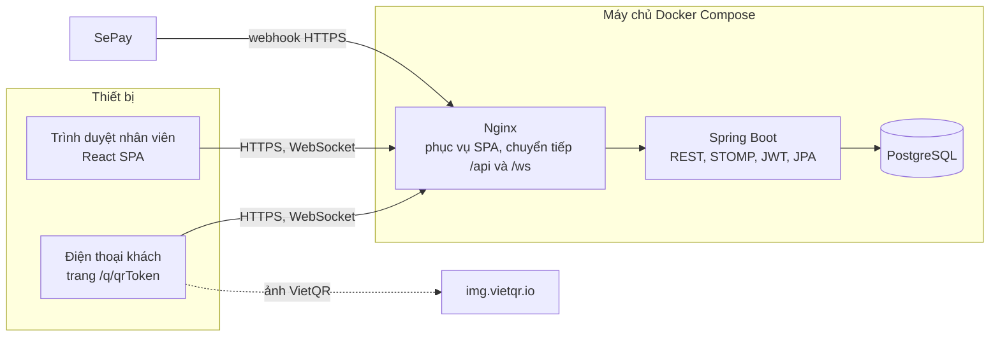
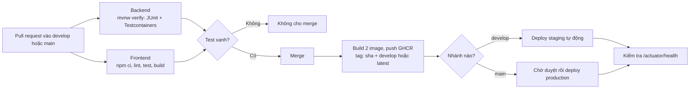

# 9. Kiến trúc và CI/CD

## 9.1 Kiến trúc tổng thể

Một ứng dụng **Spring Boot** duy nhất (monolith chia module) và một ứng dụng **React** dùng chung cho nhân viên và khách. Không tách microservice, vì một nhà hàng không cần.



## 9.2 Công nghệ

| Lớp | Công nghệ | Dùng cho |
|---|---|---|
| Backend | **Java 21, Spring Boot 4.1**: Web MVC, Security, OAuth2 Resource Server (JWT), Data JPA, Validation, WebSocket, Actuator | API, phân quyền, realtime |
| Lược đồ CSDL | **Flyway** | Tạo và nâng cấp bảng theo phiên bản |
| Tài liệu API | springdoc-openapi (Swagger UI) | Xem và thử API |
| CSDL | **PostgreSQL 17** | Lưu dữ liệu, ràng buộc toàn vẹn |
| Frontend | **React 19, TypeScript, Vite**, Ant Design, React Router, TanStack Query, @stomp/stompjs | Giao diện nhân viên và khách |
| Test | JUnit 5, MockMvc, **Testcontainers (PostgreSQL)**; Vitest | Test tự động |
| Đóng gói | Docker (multi-stage), Docker Compose, Nginx | Chạy giống nhau ở máy dev và máy chủ |
| CI/CD | **GitHub Actions**, GitHub Container Registry (GHCR) | Build, test, đóng image, triển khai |

## 9.3 Cấu trúc mã nguồn

```text
.
├── backend/                         Spring Boot (Maven Wrapper)
│   └── src/main/java/vn/khoibep/rms/
│       ├── common/                  exception/ (lỗi chung), realtime/ (sự kiện), security/ (người đăng nhập,
│       │                            giới hạn tần suất), util/
│       ├── config/                  Security, JWT, WebSocket
│       ├── auth/  employee/         đăng nhập, nhân viên, hồ sơ và lương
│       ├── menu/  table/            thực đơn, bàn và QR
│       ├── order/                   đơn, món, bếp, khách QR
│       ├── payment/                 thanh toán, VietQR, webhook SePay
│       ├── inventory/  report/  settings/
│       ├── schedule/  attendance/   xếp ca, chấm công
│       ├── leave/  payroll/         nghỉ phép, bảng lương
│       └── resources/db/migration/  Flyway V1 (bảng), V2 (dữ liệu mẫu), V3 → V7 (nhân sự), V8 (món chờ lâu), V9 (khách gọi nhân viên), V10 (đổi tên quán)
├── frontend/                        React + Vite
│   └── src/ app/ (định tuyến, khung trang), shared/ (API, realtime, định dạng), features/<module>/
├── scripts/check-erd.mjs            so ERD với migration (database-first)
├── perf/                            kiểm thử tải k6, dữ liệu bán hàng 6 tháng để thử
├── docker-compose.yml               chạy toàn bộ ở máy dev
├── deploy/docker-compose.prod.yml   chạy trên máy chủ bằng image từ GHCR
└── .github/                         ci-cd.yml (pipeline), codeql.yml, load-test.yml (chạy tay), dependabot.yml
```

Mỗi module nghiệp vụ là một package, bên trong chia theo lớp. Ví dụ module `order`:

```text
order/
├── controller/   OrderController, GuestOrderController (API trang QR), ServiceRequestController
├── service/      OrderService, OrderItemService, GuestOrderService, ServiceRequestService
├── repository/   OrderRepository, OrderItemRepository, ServiceRequestRepository
├── entity/       Order, OrderItem, ServiceRequest
├── dto/          OrderDtos (các record vào, ra của API)
└── enums/        OrderStatus, OrderType, ItemStatus, ItemSource, ServiceRequestType
```

- **controller/** nhận request, kiểm tra quyền bằng `@PreAuthorize`.
- **service/** giữ quy tắc nghiệp vụ, mở giao dịch (`@Transactional`). Các lớp tính toán riêng cũng nằm ở đây, ví dụ `PayCalculator`, `PaymentReference`, `QrTokenGenerator`.
- **repository/** là Spring Data JPA.
- **entity/** là các bảng của module, **dto/** là dữ liệu vào ra của API, **enums/** là các trạng thái và loại.
- Module nào có thành phần chạy lúc khởi động thì thêm **config/**, ví dụ `employee/config/DemoAccountsInitializer`.

Module không có bảng riêng thì bỏ các thư mục không dùng: `auth` và `report` chỉ có `controller/`, `service/`, `dto/`. Test tích hợp đặt ở gốc module (`order/OrderFlowIntegrationTest`); test đơn vị đặt cạnh class nó kiểm tra (`order/enums/ItemStatusTest`).

`ArchitectureTest` (ArchUnit) giữ cấu trúc này khi cả nhóm cùng viết code; đặt sai chỗ thì CI đỏ, kèm tên class sai:
- Controller, service, repository, entity, enum, DTO phải nằm đúng thư mục con của lớp mình.
- Chỉ gọi xuống: controller không dùng thẳng repository, không ai gọi controller, repository và entity không gọi service.
- Entity và enum không dùng DTO, vì dữ liệu không nên phụ thuộc vào cách API định dạng yêu cầu và trả lời.

Frontend chia theo cùng các module đó, để phần việc của mỗi người (CSDL, backend, frontend) mang cùng một tên:

```text
frontend/src/
├── main.tsx, index.css
├── app/          App.tsx (định tuyến), StaffLayout.tsx (khung trang nhân viên)
├── shared/       api/ (client, types), realtime/useRealtime, utils/format
├── test/         setup.ts
└── features/
    ├── order/    pages/ (OrderPage, KitchenPage, GuestPage), components/, hooks/useCart, utils/sound
    ├── payment/  pages/CashierPage, components/TransferQr
    ├── payroll/  pages/PayrollPage, utils/payroll
    └── ...       auth, table, settings, menu, inventory, report, employee, schedule, attendance, leave
```

- Mỗi feature chỉ có các thư mục nó cần: `pages/`, `components/`, `hooks/`, `utils/`, `context/`.
- Import trong cùng feature dùng đường dẫn tương đối (`../utils/payroll`); import sang chỗ khác dùng alias `@/` trỏ vào `src/` (`@/shared/api/client`, `@/features/attendance/utils/attendance`).
- Test đặt cạnh file nó kiểm tra (`features/payroll/utils/payroll.test.ts`).

## 9.4 Bảo mật

- Mật khẩu băm **BCrypt**. Đăng nhập trả **JWT HS256** có hạn 12 giờ. Khoá bí mật lấy từ biến môi trường `APP_JWT_SECRET`.
- Mỗi request kiểm tra nhân viên **còn hoạt động** (BR-03).
- API công khai chỉ gồm `/api/public/**`, `/api/auth/login`, `/api/webhooks/sepay`, `/ws`, `/actuator/health`.
- Actuator chỉ mở `health` (công khai), `info` và `metrics` (chỉ ADMIN). Nginx chỉ chuyển tiếp `/actuator/health`, nên từ Internet không gọi được các endpoint còn lại.
- Webhook kiểm tra `Authorization: Apikey <SEPAY_API_KEY>` bằng phép so sánh thời gian hằng.
- Giới hạn tần suất (Bucket4j, lưu trong bộ nhớ của server): mỗi tên đăng nhập thử tối đa 10 lần mỗi phút (BR-31); trang QR của mỗi bàn gửi tối đa 10 lần mỗi phút và giữ tối đa 30 món chờ xác nhận (BR-30). Quá giới hạn thì trả 429 kèm `Retry-After`. Không giới hạn theo IP: sau Nginx, IP đầu tiên trong `X-Forwarded-For` do client tự gửi được, còn khách trong quán lại dùng chung một IP Wi-Fi.
- Khi triển khai thật phải có **HTTPS** vì SePay chỉ gọi được địa chỉ công khai. Có thể đặt Caddy hoặc Cloudflare Tunnel trước Nginx.
- Quét lỗ hổng tự động, kết quả ở tab **Security** của GitHub:
  - Dependabot mở PR cập nhật thư viện mỗi tuần vào `develop`.
  - CodeQL phân tích mã Java và TypeScript ở mỗi PR và mỗi tuần.
  - Trivy quét 2 image sau mỗi lần build.

## 9.5 Triển khai

| Môi trường | Nhánh | Cách chạy | Ghi chú |
|---|---|---|---|
| Máy dev | bất kỳ | `docker compose up --build` rồi mở `http://localhost:8080` | Có tài khoản demo |
| Staging | `develop` | `deploy/docker-compose.prod.yml` trong `~/khoibep-rms-staging`, image tag theo commit | Tự deploy, có thể bật tài khoản demo để cả nhóm thử |
| Production | `main` | `deploy/docker-compose.prod.yml` trong `~/khoibep-rms` | Deploy sau khi có người duyệt |

Bí mật để trong tệp `.env` trên máy chủ, **không đưa vào Git**. Biến chính: `POSTGRES_PASSWORD`, `APP_JWT_SECRET`, `SEPAY_API_KEY`, `APP_PUBLIC_BASE_URL` (địa chỉ in trong QR bàn), `HTTP_PORT`, `APP_DEMO_ACCOUNTS_ENABLED`.

**Sao lưu (P0-04).** Dịch vụ `backup` trong `deploy/docker-compose.prod.yml` chạy `pg_dump` mỗi đêm lúc `BACKUP_HOUR` giờ Việt Nam (mặc định 3 giờ):
- Bản sao lưu nằm trong thư mục `backups/` cạnh file compose, giữ `BACKUP_KEEP` bản mới nhất (mặc định 7).
- `restore.sh --check` khôi phục thử vào một CSDL tạm, in số dòng từng bảng rồi xoá CSDL tạm, không đụng dữ liệu thật.
- `restore.sh` không có `--check` thì khôi phục thật, có hỏi xác nhận trước.
- Thỉnh thoảng nên chép thư mục `backups/` ra ngoài máy chủ: mất máy chủ là mất luôn bản sao lưu nằm trên đó.

**Log, số liệu và cảnh báo (P3-05, NFR-11).**
- Trên staging và production, backend ghi log dạng JSON theo chuẩn ECS (Elastic Common Schema), bật bằng biến `LOGGING_STRUCTURED_FORMAT_CONSOLE=ecs` trong `deploy/docker-compose.prod.yml`. Mỗi dòng là một đối tượng JSON có `@timestamp`, `log.level`, `log.logger`, `message`, nên lọc được bằng `jq` hoặc đưa thẳng vào công cụ gom log. Máy dev giữ log dạng chữ cho dễ đọc.
- `/actuator/metrics` cho các số liệu Spring Boot tự đo: `http.server.requests` (số request và thời gian trả lời theo đường dẫn và mã trả về), `jvm.memory.used`, `hikaricp.connections.active`... Chỉ ADMIN gọi được và Nginx không chuyển tiếp, nên phải hỏi từ trong mạng Docker của máy chủ. Lệnh mẫu ở README.
- Cảnh báo webhook (BR-32): SePay gửi lại một webhook lỗi sau 1, 2, 4, 7, 12, 20 và 33 phút kể từ lần đầu. Với ngưỡng 3 lần liên tiếp, webhook hỏng thì khoảng 2 phút sau màn hình thu ngân hiện cảnh báo; một lần lỗi thoáng qua mà lần gửi lại thành công thì không báo. Lúc bắt đầu đợt lỗi, backend ghi thêm một dòng log `ERROR`.
- Server không thấy được lỗi kết nối (SePay không gọi tới nơi), nên khi tạo webhook trên my.sepay.vn nên bật cả bước **Cảnh báo** của SePay. SePay báo khi cả 8 lần gửi đều lỗi, tức sau khoảng 33 phút.

## 9.6 Nhánh và pipeline CI/CD

Mô hình nhánh: `feature/<tên>` → PR vào `develop` → PR vào `main`. Cả `develop` và `main` được bảo vệ: không push thẳng, chỉ merge khi test xanh.



| Bước | Làm gì | Chặn merge nếu lỗi |
|---|---|---|
| Backend | So ERD với migration (`scripts/check-erd.mjs`), biên dịch, chạy test đơn vị và test tích hợp với PostgreSQL thật, đo độ phủ bằng JaCoCo (dưới 70% số dòng là lỗi) | Có |
| Frontend | Kiểm tra kiểu (TypeScript), ESLint, Vitest (cả test component), build | Có |
| E2E | Dựng cả ứng dụng bằng Docker Compose, chạy kịch bản nghiệm thu bằng Playwright trên Chromium | Có |
| CodeQL | Phân tích tĩnh mã Java và TypeScript (workflow `codeql.yml`) | Không, chỉ báo ở tab Security |
| Image | Build image multi-stage, đẩy lên GHCR, gắn tag theo commit; Trivy quét lỗ hổng CRITICAL, HIGH đã có bản vá | Không, chỉ báo ở tab Security |
| Deploy | Chạy khi bật biến `DEPLOY_ENABLED`. Environment `staging` không cần duyệt; `production` cần người duyệt | — |
| Quay lại bản cũ | Chạy lại job deploy của lần chạy tốt gần nhất (dùng image của commit đó) | — |

## 9.7 Chiến lược kiểm thử

| Mức | Công cụ | Nội dung chính |
|---|---|---|
| Đơn vị | JUnit 5 | Chuyển trạng thái món (BR-07), dò mã thanh toán trong nội dung chuyển khoản (BR-15), công thức lương (BR-26) |
| Tích hợp | Spring Boot Test + MockMvc + Testcontainers | Gọi món, QR và xác nhận, bếp, tiền mặt, chuyển khoản và webhook, cảnh báo webhook lỗi liên tiếp, phân quyền (cả quyền xem số liệu Actuator), kho, xếp ca, chấm công, nghỉ phép, bảng lương. Test chấm công đặt giờ bằng một `Clock` giả |
| Frontend | Vitest | Định dạng tiền, nhãn trạng thái, giờ công, bảng lương xuất Excel |
| Component | Vitest + Testing Library, trình duyệt giả lập jsdom | Chọn món vào giỏ (tổng tiền, bớt món, ghi chú, món hết, đổi nhóm), giỏ tối đa 50 phần mỗi món (BR-06), mã VietQR, nhãn trạng thái món, phiếu in 80 mm (BR-33) |
| Độ phủ | JaCoCo | Backend phải chạy tới ≥ 70% số dòng, thấp hơn thì CI đỏ. Con số in ở trang kết quả của lần chạy CI, báo cáo HTML ở artifact `backend-coverage` |
| Kiến trúc | ArchUnit (`ArchitectureTest`) | Mỗi class nằm đúng thư mục con của lớp mình, và chỉ gọi xuống các lớp dưới (mục 9.3) |
| E2E | Playwright, chạy trong CI | Kịch bản nghiệm thu ở [§1.5](01-tam-nhin-du-an.md#15-tiêu-chí-nghiệm-thu): khách QR, phục vụ, bếp, chuyển khoản, bàn trống; phân quyền; trang "Của tôi" |
| Tải | k6 (`perf/load-test.js`), workflow `load-test.yml` chạy tay ở tab Actions | NFR-02: 30 người trong 2 phút (14 khách gọi món QR, 10 phục vụ, 3 bếp, 2 thu ngân, 1 quản lý xem báo cáo 30 ngày), sau khi nạp 6 tháng bán hàng. Đạt khi p95 < 500 ms và dưới 1% request lỗi |
| Nghiệm thu | 2 trình duyệt + 1 điện thoại | Kịch bản ở [§1.5](01-tam-nhin-du-an.md#15-tiêu-chí-nghiệm-thu), làm tay khi demo |
