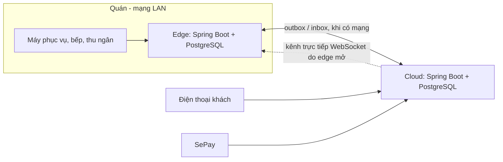

# 12. Thiết kế mở rộng: nhiều chi nhánh và chạy khi mất mạng

Đây là việc **P4-05, chỉ thiết kế, không làm trong đồ án** ([tài liệu 10](10-ke-hoach-phat-trien.md), ưu tiên Won't). Tài liệu nói bản core hiện tại phải đổi những gì để chạy cho một chuỗi quán, và để quán vẫn bán được khi mất Internet. Phân tích đầy đủ có trong bản mở rộng ([`../docs/04-thiet-ke-he-thong/01-kien-truc.md`](../docs/04-thiet-ke-he-thong/01-kien-truc.md)): máy chủ tại quán, ADR-01 → ADR-14, kịch bản QAS-1 → QAS-10. Ở đây chỉ chắt lại phần áp vào mã đang có.

## 12.1 Điểm xuất phát: bản core

| Thành phần | Bản core hôm nay | Giới hạn khi có nhiều quán hoặc mất mạng |
|---|---|---|
| Máy chủ | Một máy chủ trên Internet cho một quán | Mất Internet là cả quán dừng |
| Khoá chính | `bigint` tự tăng do CSDL cấp | Hai nơi cùng cấp số thì trùng |
| Dữ liệu theo quán | Không có khái niệm quán; `restaurant_settings` chỉ một dòng | Không tách được bàn, đơn, két, kho của từng quán |
| Realtime | STOMP, broker trong bộ nhớ của máy chủ | Chỉ đúng khi mọi thiết bị nối vào cùng một máy |
| Giới hạn tần suất | Bucket4j trong bộ nhớ | Nhiều máy chủ thì mỗi máy đếm riêng |
| Thanh toán | Webhook SePay gọi thẳng máy chủ, khớp theo mã `KB` + 8 ký tự | Phải biết khoản tiền thuộc quán nào |
| Thuế, giá | Thuế suất theo **ngày hiệu lực** (BR-45), giá món một bảng | Thuế theo ngày đã dùng lại được khi đồng bộ |

## 12.2 Nhiều chi nhánh

Làm trước, vì không cần phần cứng mới: vẫn một máy chủ trên Internet, nhưng dữ liệu tách theo quán.

**Dữ liệu.**
- Thêm bảng `outlet` (mã quán ngắn, tên, địa chỉ, tài khoản nhận tiền). `restaurant_settings` chuyển thành thông tin của từng quán.
- Thêm `outlet_id` vào dữ liệu thuộc quán:
  - Bán hàng: `dining_table`, `orders`, `payment`, `bank_transaction`, `reservation`, `einvoice`.
  - Tiền và kho: `cash_shift`, `inventory_item`, `stock_movement`, `goods_receipt`.
  - Nhân sự: `work_shift`, `shift_assignment`, `attendance`.
- Index bắt đầu bằng `outlet_id`.
- Dùng chung toàn chuỗi: thực đơn, loại thuế và thuế suất, khách hàng, nhà cung cấp, nhân viên. Thêm bảng `outlet_item_state` cho giá riêng và hết món theo từng quán.
- Migration: tạo quán số 1, gán mọi dữ liệu cũ cho quán này, rồi mới đặt `NOT NULL`. Đây là cách `V13` đã làm khi chuyển bàn của đơn sang `order_table`.

**Quyền.**
- Bảng `employee_outlet` cho biết nhân viên làm ở quán nào. Quản lý chuỗi được nhiều quán.
- JWT mang quán đang chọn. Mọi truy vấn lọc theo quán đó ở tầng service, có test ArchUnit hoặc test tích hợp chặn quên lọc.
- Có thể thêm Row Level Security của PostgreSQL làm lớp chặn thứ hai.

**Thanh toán.**
- Mã thanh toán và mã booking có thêm mã quán, ví dụ `KBDDA` + 6 ký tự, để webhook biết khoản tiền thuộc quán nào.
- Mỗi quán có tài khoản nhận tiền và API key SePay riêng. Webhook vẫn vào một địa chỉ, rồi chuyển theo API key.

**Realtime.** Kênh thành `/topic/outlet/{id}/staff`. Khi chạy nhiều máy chủ backend, broker trong bộ nhớ thay bằng broker relay (RabbitMQ), giới hạn tần suất chuyển sang Redis.

**Báo cáo.** Mọi báo cáo có thêm bộ lọc quán và bản tổng chuỗi. View `v_order_item_cost` thêm `outlet_id`.

## 12.3 Chạy khi mất mạng

Theo ADR-01 → ADR-04 của bản mở rộng, **mỗi quán có một máy chủ tại quán (edge)**: một mini PC chạy chính ứng dụng Spring Boot này với profile `edge`, kèm PostgreSQL riêng. Máy chủ trên Internet (cloud) chạy profile `cloud`.

**Mỗi loại dữ liệu chỉ có một nơi ghi** (ADR-03), nên gần như không có xung đột:

| Dữ liệu | Nơi ghi | Đi về đâu |
|---|---|---|
| Đơn, món, giảm giá, khoản thu tiền mặt, ca két, chấm công tại quán | Edge | Lên cloud qua outbox để báo cáo |
| Thực đơn, giá, loại thuế và thuế suất, nhân viên, cài đặt | Cloud | Xuống edge, có số phiên bản; edge chỉ áp bản mới hơn |
| Xác nhận chuyển khoản từ SePay | Cloud | Xuống edge để đóng bill |
| Hoá đơn điện tử, kho, phiếu nhập, bảng lương, báo cáo | Cloud | Không cần chạy offline |
| Booking | Cloud; edge đánh dấu khách tới | Bản ghi đến sau thắng, có ghi nhật ký |

**Khoá và chống trùng** (ADR-04):
- Các bảng giao dịch đổi khoá từ `bigint` tự tăng sang **UUIDv7** do edge hoặc máy cầm tay sinh. Khoá này đồng thời là khoá idempotency, nên gửi lại một yêu cầu không tạo bản ghi thứ hai.
- Số hiển thị cho người dùng có dạng `<mã quán>-<ngày>-<số>`, do edge cấp.
- Đây là thay đổi lớn nhất: mọi khoá ngoại, DTO và URL đang dùng `Long`.

**Khi mất Internet, vẫn chạy:**
- Gọi món, màn hình bếp, ra món, chuyển và ghép bàn.
- Thu tiền mặt, ca két, giảm giá trong hạn mức.
- Đăng nhập: edge giữ bản sao tài khoản và **số phiên bản token** (BR-41).

**Khi mất Internet, tạm dừng:**
- **VietQR:** khoản chuyển khoản ở trạng thái *chưa xác nhận*, không tính vào tiền đã nhận cho tới khi xác nhận ngân hàng về tới edge. Thu ngân vẫn xác nhận tay được như BR-17, có ghi nhật ký.
- **Khách gọi món qua QR** (ADR-09): điện thoại khách đi qua cloud, nên khi kênh cloud ↔ edge đứt quá 60 giây, trang QR báo tạm dừng và từ chối đơn mới. Đơn không được xếp hàng để giao sau, nên bếp không bao giờ nhận đơn đến muộn.
- **Máy cầm tay mất Wi-Fi giữa chừng** (ADR-14): món đang nhập chỉ là bản nháp trong IndexedDB. Khi có mạng lại, máy **không tự gửi**; nhân viên quyết gửi hay huỷ.

**Thay đổi cụ thể so với mã hiện tại:**

| Chỗ | Thay đổi |
|---|---|
| `config` | Profile `edge` và `cloud`; mỗi mô-đun khai báo chạy ở đâu |
| Migration | Khoá UUIDv7 cho bảng giao dịch; bảng `outbox`, `inbox`; số phiên bản cho dữ liệu chủ |
| `payment` | Trạng thái *chưa xác nhận* cho VietQR khi mất mạng; webhook nhận ở cloud rồi chuyển xuống edge |
| `order` (QR khách) | Đơn QR vào cloud rồi chuyển xuống edge qua kênh trực tiếp, chờ xác nhận ≤ 5 giây |
| Frontend | App nhân viên thành PWA, giữ bản nháp trong IndexedDB; tự nối lại và lấy sự kiện bị lỡ theo số thứ tự |
| Triển khai | Mini PC ở quán chạy Docker Compose, tự kéo bản mới ngoài giờ phục vụ (ADR-12); cloud giữ cách deploy hiện tại ([tài liệu 11](11-trien-khai-van-hanh.md)) |

## 12.4 Lộ trình nếu làm

| Bước | Nội dung | Kiểm chứng |
|---|---|---|
| 1 | Nhiều chi nhánh trên một máy chủ (mục 12.2) | Hai quán dùng chung thực đơn, bàn, két và báo cáo tách riêng; nhân viên quán A không thấy dữ liệu quán B |
| 2 | Khoá UUIDv7 và idempotency cho bảng giao dịch, vẫn một máy chủ | Gửi lại cùng yêu cầu 100 lần chỉ tạo một bản ghi |
| 3 | Edge cho một quán thử; đồng bộ dữ liệu chủ xuống, giao dịch lên | Ngắt Internet 30 phút, 500 đơn giả lập, 0 bản ghi trùng (S4, QAS-1, QAS-3) |
| 4 | Kênh khách qua cloud; VietQR *chưa xác nhận* khi mất mạng | Đơn QR bị từ chối ngay khi mất kết nối, không có đơn đến muộn (QAS-6) |

Mỗi bước vẫn theo quy trình làm tính năng ở mục 10.5: tài liệu, ERD, migration, code, test, rồi mới PR.

## 12.5 Rủi ro

| Rủi ro | Ảnh hưởng | Cách giảm |
|---|---|---|
| Đổi khoá sang UUID chạm vào mọi bảng và API | Dễ hỏng luồng đang chạy | Làm sau khi có E2E đủ rộng; đổi từng nhóm bảng, giữ cả hai khoá trong một thời gian |
| Edge hỏng phần cứng | Quán dừng | Máy dự phòng, sao lưu sang cloud; thay máy trong ≤ 2 giờ (NFR-13 bản mở rộng) |
| Lệch giờ giữa edge và cloud | Thuế suất, báo cáo theo ngày sai | NTP trên edge; trạng thái theo thứ tự ghi, không so giờ (như cách sửa BR-44) |
| Chi phí phần cứng và vận hành | Mini PC, UPS, 4G dự phòng mỗi quán | Chỉ làm bước 3 → 4 khi chuỗi thật sự cần bán lúc mất mạng |
