# 14. Hướng dẫn sử dụng theo vai trò

Tài liệu này là việc P5-02 ([tài liệu 10](10-ke-hoach-phat-trien.md)). Ảnh chụp ngày 02/10/2026 trên dữ liệu mẫu: thực đơn và bàn của quán mẫu, cùng một buổi sáng có vài bàn đang ăn, một đơn GrabFood và hai booking.

Hệ thống chạy trên trình duyệt, không cần cài app:
- Nhân viên dùng máy tính, máy tính bảng hoặc điện thoại, mở địa chỉ của quán (ví dụ `https://khoibep.example.vn`).
- Khách chỉ cần quét mã QR trên bàn.

| Vai trò | Màn hình | Mục |
|---|---|---|
| Phục vụ | Sơ đồ bàn, trang đơn, đặt bàn | 14.2 |
| Bếp | Màn hình bếp | 14.3 |
| Thu ngân | Thu ngân | 14.4 |
| Khách | Trang gọi món qua QR | 14.5 |
| Quản lý | Mọi màn hình trên, cộng các trang quản lý | 14.6 |
| Quản trị | Mọi màn hình, cộng nhân viên, bảng lương, cài đặt | 14.7 |
| Mọi nhân viên | Của tôi | 14.8 |

## 14.1 Đăng nhập và thanh trên cùng

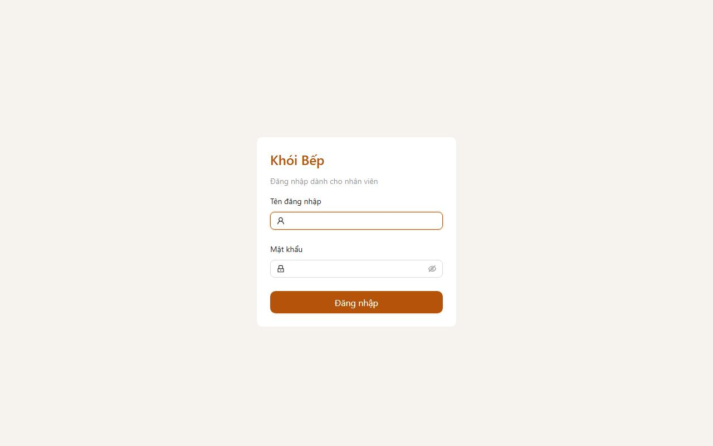

1. Nhập tên đăng nhập và mật khẩu, bấm **Đăng nhập**.
2. Hệ thống mở màn hình của vai trò: phục vụ vào sơ đồ bàn, bếp vào màn hình bếp, thu ngân vào quầy thu ngân, quản lý và quản trị vào báo cáo.

Thử sai một tên đăng nhập quá 10 lần mỗi phút thì phải chờ, hệ thống báo số giây còn lại.

Thanh trên cùng có:
- Menu bên trái: chỉ hiện những trang vai trò đó được dùng. Trên điện thoại, menu gập lại sau nút ☰.
- **Khách gọi** (chuông, phục vụ) và **Duyệt giảm giá** (quản lý): số trên nút là số việc đang chờ.
- **Chạm để bật âm báo**: trình duyệt chỉ cho phát âm thanh sau khi người dùng chạm một lần. Bật trên máy phục vụ và màn hình bếp.
- Chấm **Trực tuyến** cho biết máy đang nhận cập nhật ngay; chữ "Đang kết nối lại" là mạng chập chờn.
- Nút chìa khoá: đổi mật khẩu, hoặc **đăng xuất mọi thiết bị** khi mất điện thoại. Đổi mật khẩu thì các máy khác phải đăng nhập lại.

## 14.2 Phục vụ

### Sơ đồ bàn

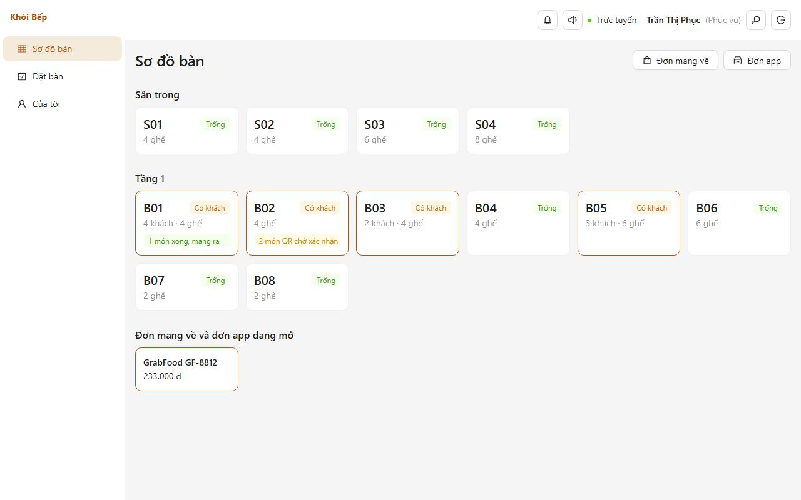

- Bàn trống có nhãn xanh **Trống**. Bàn có khách có nhãn cam **Có khách**, viền thẻ cam, kèm số khách.
- Nhãn vàng "2 món QR chờ xác nhận": khách vừa gọi qua QR, cần xác nhận.
- Nhãn xanh "1 món xong, mang ra": bếp đã làm xong.
- Bấm bàn trống, nhập số khách, bấm **Mở bàn**. Bấm bàn có khách để mở đơn của bàn đó.
- **Đơn mang về** tạo đơn không có bàn. **Đơn app** tạo đơn GrabFood hoặc ShopeeFood (xem bên dưới). Các đơn này nằm ở cuối trang.

### Trang đơn

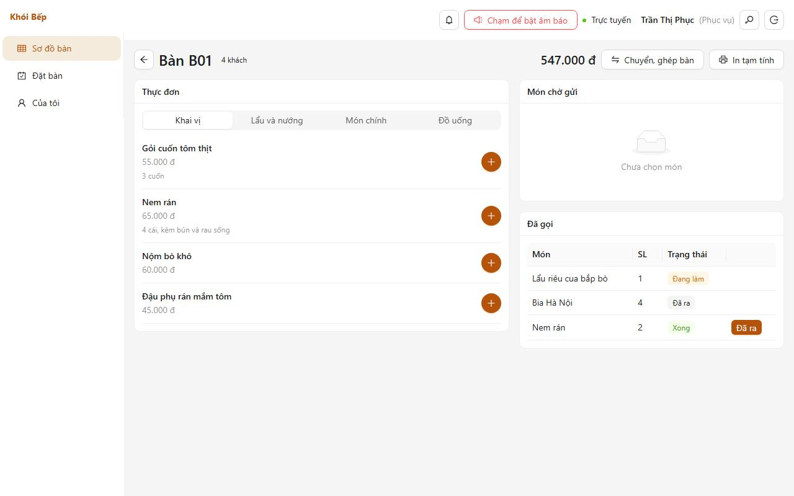

1. Chọn món ở **Thực đơn**: bấm nhóm món, bấm **+**. Món hết bị khoá.
2. Kiểm tra ở **Món chờ gửi**: sửa số lượng, thêm ghi chú (ví dụ "ít cay"), rồi bấm **Gửi bếp**.
3. **Đã gọi** cho biết trạng thái từng món: Chờ làm → Đang làm → Xong → Đã ra.
4. Món **Xong**: mang ra rồi bấm **Đã ra**.
5. **Huỷ** món: món Chờ làm thì phục vụ huỷ được. Món Đang làm hoặc Xong thì phải là quản lý, và phải ghi lý do. Món đã ra không huỷ được.

Các việc khác trên trang đơn:
- Khi khách gọi qua QR, trang đơn hiện thanh vàng: kiểm tra món rồi bấm **Xác nhận tất cả**, hoặc **Từ chối** từng món kèm lý do (khách thấy lý do).
- **Chuyển, ghép bàn**: chọn lại các bàn của đơn. Thêm bàn là ghép, đổi bàn là chuyển; bill giữ nguyên.
- **In tạm tính**: in phiếu khổ 80 mm cho khách xem trước khi trả.

### Đơn app giao hàng

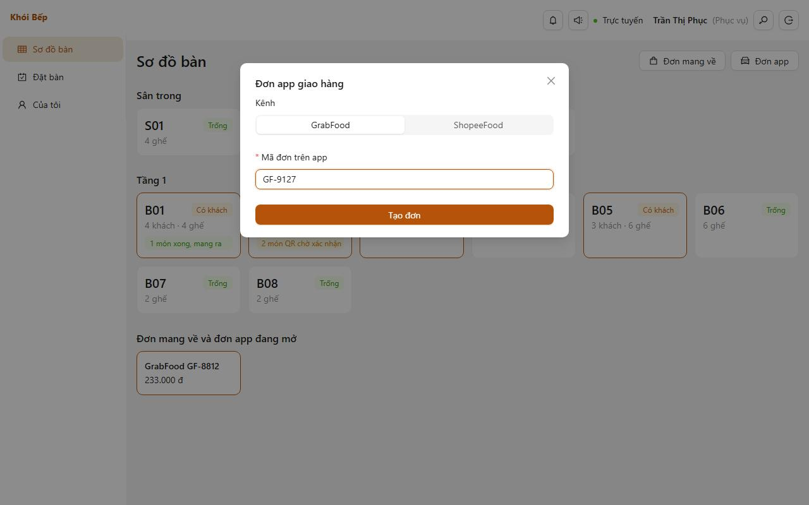

1. Bấm **Đơn app**, chọn **GrabFood** hoặc **ShopeeFood**, nhập **mã đơn trên app**, bấm **Tạo đơn**. Mã đã nhập trong cùng kênh thì hệ thống báo trùng và không tạo đơn.
2. Trang đơn chỉ hiện món app đó bán, theo giá app. Chọn món và **Gửi bếp** như đơn thường.
3. Khi mọi món đã xong, bấm **Giao shipper**. App đã thu tiền của khách, nên đơn đóng và doanh thu ghi theo kênh; thu ngân không thu đơn này.

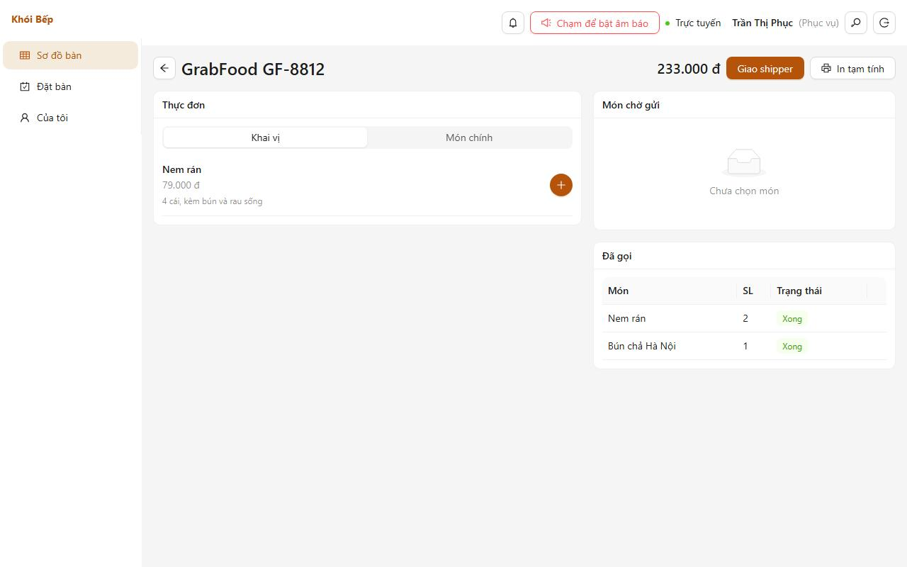

### Đặt bàn

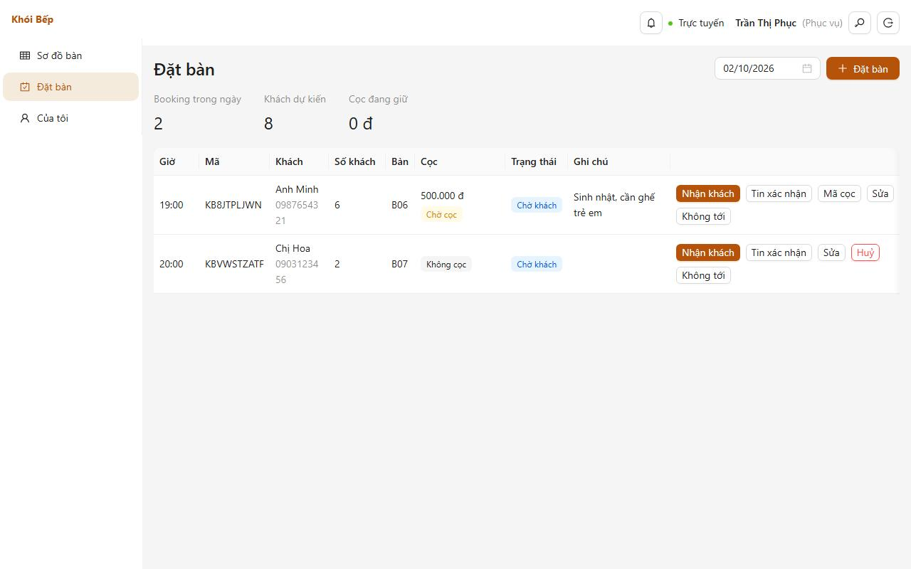

1. Bấm **Đặt bàn**, nhập tên, số điện thoại, giờ, số khách, bàn dự kiến, tiền cọc. Hệ thống cấp mã dạng `KB…`.
2. **Tin xác nhận**: sao chép nội dung gửi cho khách qua Zalo hoặc SMS, rồi đánh dấu đã gửi.
3. **Mã cọc**: hiện mã VietQR có đúng số tiền cọc. Khách chuyển xong thì cọc tự được xác nhận.
4. Khách tới: bấm **Nhận khách**, chọn bàn. Đơn mở ra, bill tự trừ cọc đã nhận.
5. **Huỷ** hoặc **Không tới**: booking đóng, cọc đã nhận vẫn giữ.

## 14.3 Bếp

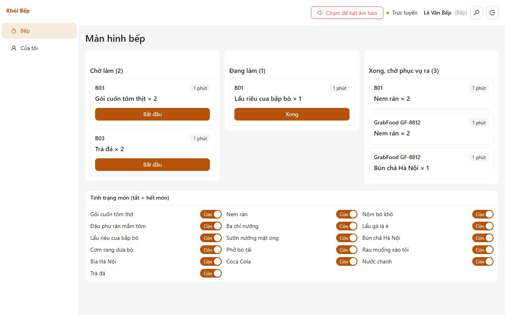

- Ba cột: **Chờ làm**, **Đang làm**, **Xong, chờ phục vụ ra**. Món chờ lâu nhất ở trên.
- Bấm **Bắt đầu** khi bắt tay làm, **Xong** khi làm xong. Máy phục vụ kêu và sơ đồ bàn hiện "món xong".
- Mỗi món hiện số phút đã chờ. Quá ngưỡng (đặt ở Cài đặt, mặc định 15 phút) thì số phút chuyển đỏ.
- Đơn app hiện kênh và mã đơn, ví dụ "GrabFood GF-8812", thay cho số bàn.
- **Tình trạng món**: gạt về **Hết** khi hết nguyên liệu. Món biến khỏi trang của khách ngay, và bị khoá trên máy phục vụ.

## 14.4 Thu ngân

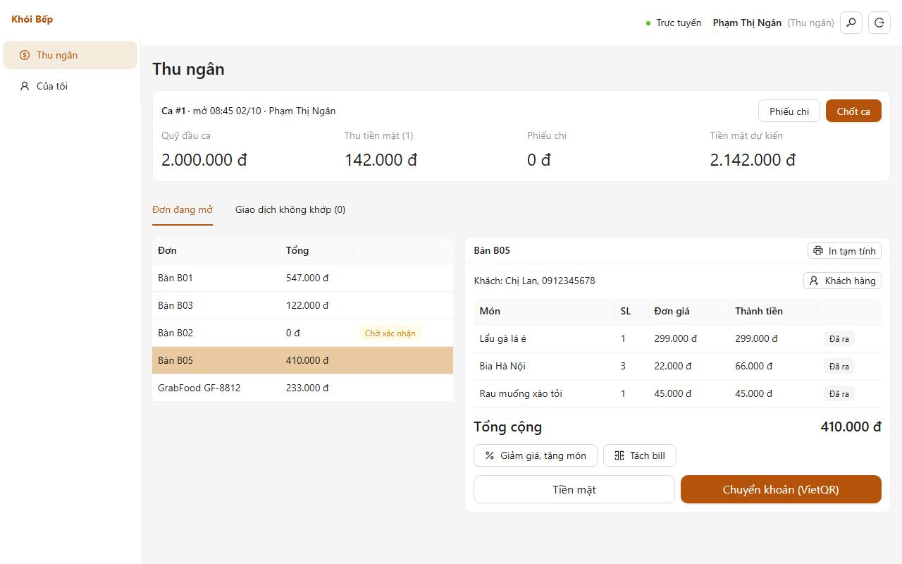

**Ca két.** Đầu ca bấm **Mở ca**, nhập quỹ đầu ca; chưa mở ca thì không thu được tiền mặt. Trong ca:
- **Phiếu chi** cho khoản tiền mặt lấy ra khỏi két. Trên 300.000 đ thì quản lý lập.
- Cuối ca bấm **Chốt ca**, nhập số tiền đếm được. Lệch với "Tiền mặt dự kiến" thì phải ghi lý do.

**Tính tiền.**
1. Chọn đơn ở **Đơn đang mở**. Bill hiện món, giảm giá, cọc đã trừ và tổng cộng.
2. **Tiền mặt**: nhập tiền khách đưa, hoặc bấm số gợi ý. Màn hình hiện tiền thối, bấm **Xác nhận đã thu**.
3. **Chuyển khoản (VietQR)**:
   - Khách quét mã bằng app ngân hàng. Tiền về là bill tự đóng, thường trong vài giây.
   - Khách báo đã chuyển mà bill không đóng: kiểm tra tiền về trong app ngân hàng, rồi bấm **Xác nhận tay**.
4. Đơn còn món khách gửi chưa xác nhận, hoặc còn khoản giảm giá chờ quản lý duyệt, thì chưa thu được.

**Tách bill.** Bấm **Tách bill**, chọn một trong ba cách. Thu từng phần bằng tiền mặt hoặc VietQR; bill đóng khi thu đủ.
- **Chia đều**: nhập số người.
- **Theo món**: tick món của người trả.
- **Số tiền**: nhập tay.

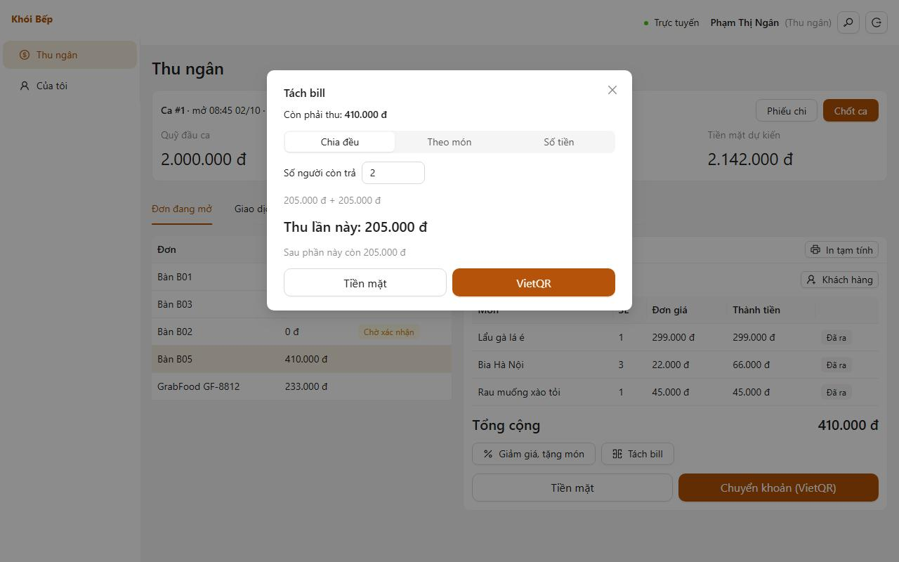

**Việc khác:**
- **Gắn khách**: nhập số điện thoại khách quen để xem số lần ghé, tổng chi. Ghi khách đồng ý hay từ chối nhận tin. Đã gắn thì nút đổi thành **Khách hàng**.
- **Giảm giá, tặng món**: luôn chọn lý do. Trong 10% tiền món và tới 150.000 đ thì có hiệu lực ngay; quá mức thì chờ quản lý duyệt.
- Thu xong: **In phiếu thanh toán**. Khách lấy hoá đơn công ty thì bấm **Hoá đơn công ty**, nhập tên, mã số thuế, địa chỉ, email.
- **Giao dịch không khớp**: tiền về sai số tiền hoặc không có mã. Đối chiếu với khách rồi xác nhận tay.
- Thanh đỏ "Chuyển khoản đang không tự xác nhận": SePay lỗi liên tiếp. Trong lúc đó, kiểm tra tiền về trong app ngân hàng, xác nhận tay, và báo quản lý.

## 14.5 Khách gọi món qua QR

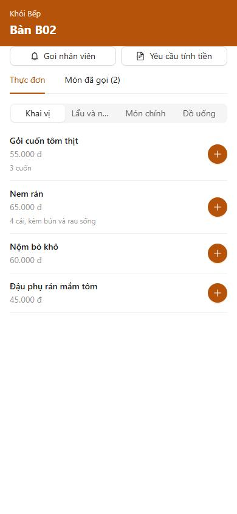 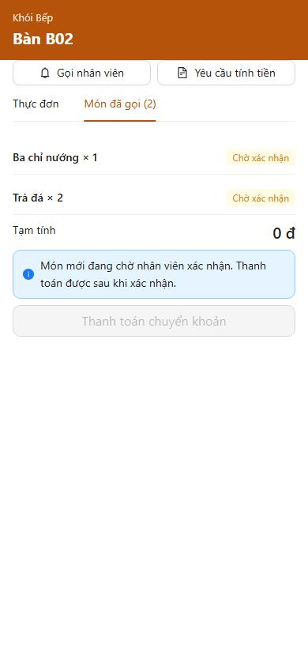

1. Quét mã QR trên bàn bằng camera điện thoại. Trang mở ngay, có tên bàn, không cần đăng nhập.
2. Ở **Thực đơn**, bấm **+** để chọn món, rồi gửi. Món hiện "Chờ xác nhận" cho tới khi nhân viên xác nhận; bị từ chối thì thấy lý do.
3. **Món đã gọi** cho biết món nào đang làm, đã xong. Trang tự cập nhật, không cần tải lại.
4. **Gọi nhân viên**, **Yêu cầu tính tiền**: máy phục vụ kêu, một người nhận việc.
5. **Thanh toán chuyển khoản**: bấm khi không còn món chờ xác nhận, quét mã VietQR bằng app ngân hàng. Tiền về thì trang hiện "Đã thanh toán".

## 14.6 Quản lý

Quản lý dùng được mọi màn hình của phục vụ, bếp, thu ngân, cộng các trang dưới đây.

**Thực đơn.**
- Danh mục và món. Giá món **đã gồm VAT**.
- Mỗi món có **loại thuế** (ví dụ "Ăn uống" 8%, "Rượu, bia" 10%) và **giá app** cho GrabFood, ShopeeFood; bỏ trống là không bán trên app đó.
- **Định lượng**: lượng từng nguyên liệu cho một phần, để kho tự trừ khi món vào bếp.
- Thẻ **Loại thuế**: thêm loại thuế; **Đổi** đặt thuế suất mới từ một ngày (ví dụ 10% từ 01/01/2027). Bill thanh toán từ ngày đó tự dùng thuế suất mới.

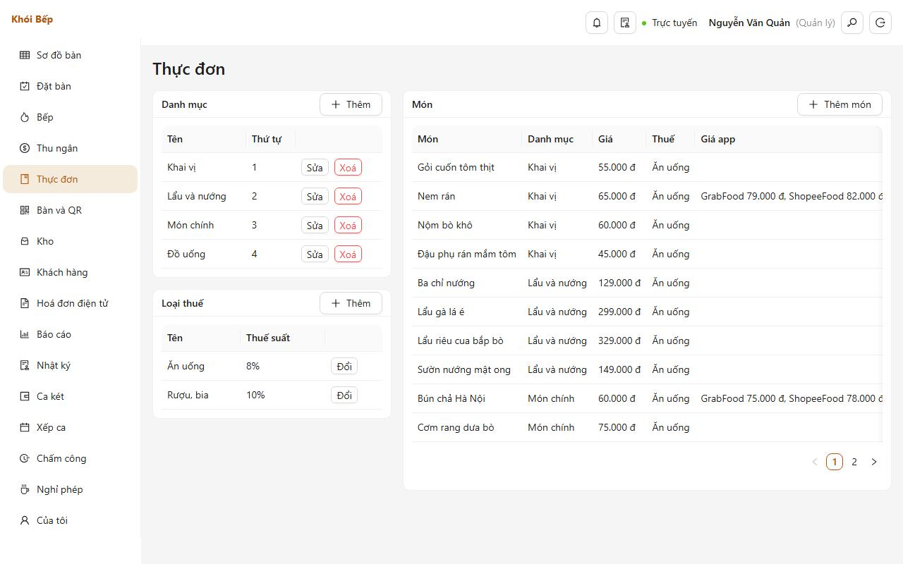

**Bàn và QR.**
- **Thêm bàn**.
- **Xem QR** để in thẻ đặt trên bàn.
- **Tạo lại QR** khi thẻ bị chụp lại hoặc lộ; thẻ cũ hết hiệu lực ngay.

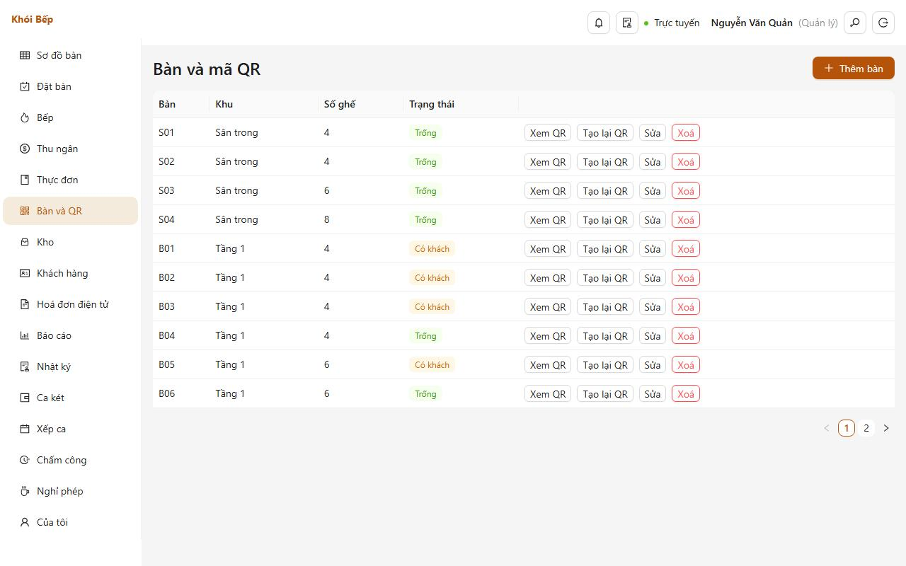

**Kho.**
- Tab **Nguyên liệu**: **Nhập**, **Xuất** (không vượt tồn), **Kiểm kê** (nhập số thực tế), **Lịch sử**. Nhãn "Sắp hết" khi tồn tới mức tối thiểu.
- **Phiếu nhập**: hàng nhập theo nhà cung cấp, có giá, để tính giá vốn.
- **Nhà cung cấp**.
- **Tiêu hao**: nguyên liệu đã dùng theo khoảng ngày.

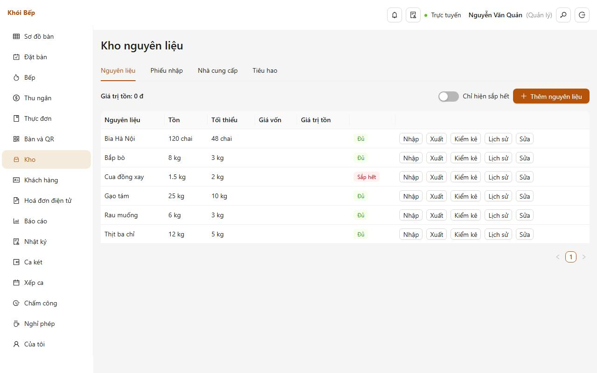

**Báo cáo.** Chọn khoảng ngày. Có các phần:
- Doanh thu theo ngày.
- Theo phương thức: tiền mặt, chuyển khoản, cọc, GrabFood, ShopeeFood.
- Top 10 món bán chạy.
- Lãi gộp theo món.
- Ngoại lệ (huỷ món, giảm giá, xác nhận tay) theo loại và theo người.

**Xuất Excel** tải cả báo cáo.

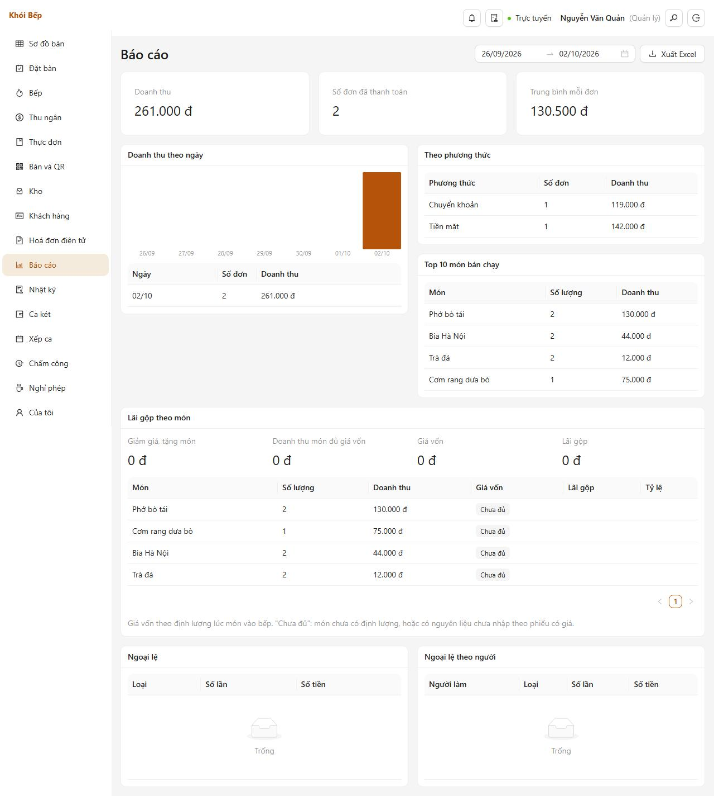

**Nhật ký.** Mọi lần huỷ món, xác nhận tay, đổi giá, giảm giá: ai làm, lúc nào, lý do. Nhật ký chỉ thêm, không ai sửa hay xoá được.

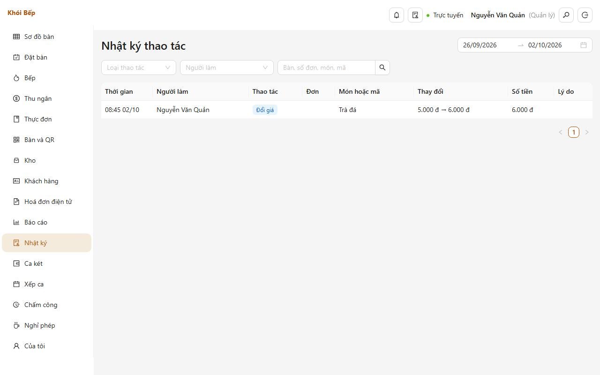

**Ca két.** Các ca đã mở và chốt: quỹ đầu ca, tiền mặt thu, phiếu chi, dự kiến, thực đếm, chênh lệch và lý do.

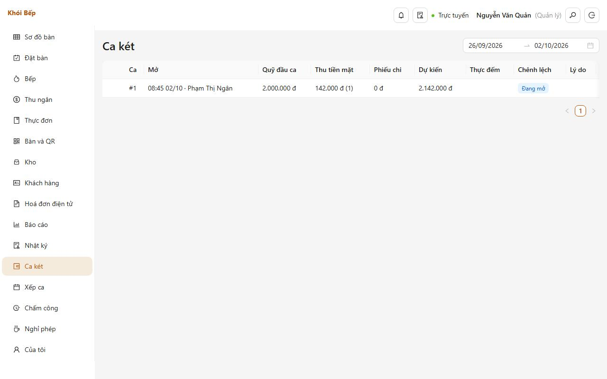

**Xếp ca.**
- **Ca mẫu** tạo các ca, ví dụ Ca sáng 07:00–15:00.
- Ở mỗi ô nhân viên và ngày, chọn **+ Xếp ca**.
- **Chép tuần trước** sao chép cả tuần.
- Nhân viên xem lịch của mình ở trang "Của tôi".

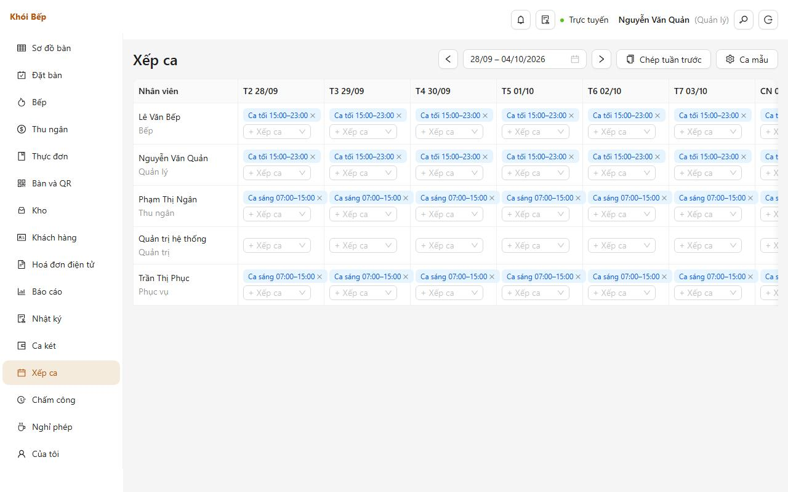

**Chấm công.**
- Giờ vào, ra của từng người; đi muộn, về sớm tự tính.
- Quên chấm thì **Thêm bản ghi**, chấm sai thì **Sửa**. Cả hai đều bắt buộc ghi lý do.

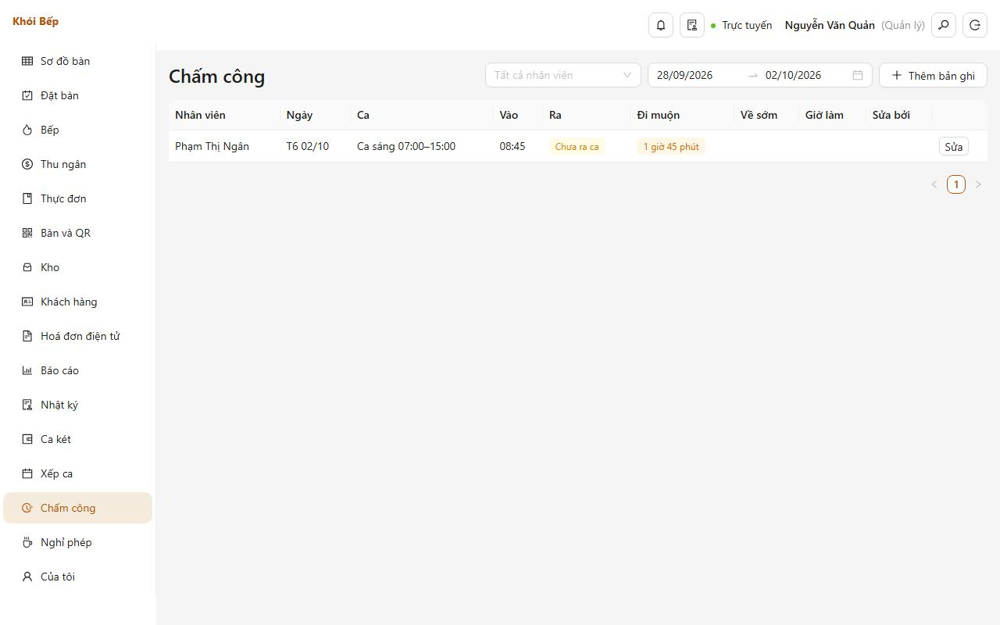

**Nghỉ phép.** Tab **Chờ duyệt**: **Duyệt** thì các ca đã xếp trong ngày nghỉ được gỡ; **Từ chối** thì ghi lý do.

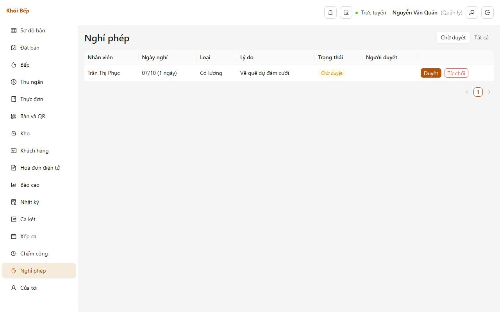

**Khách hàng.**
- Tìm theo số điện thoại hoặc tên.
- Bấm một khách để xem các lần ghé, đặt bàn, sửa tên và ghi chú, ghi đồng ý hoặc từ chối nhận tin.

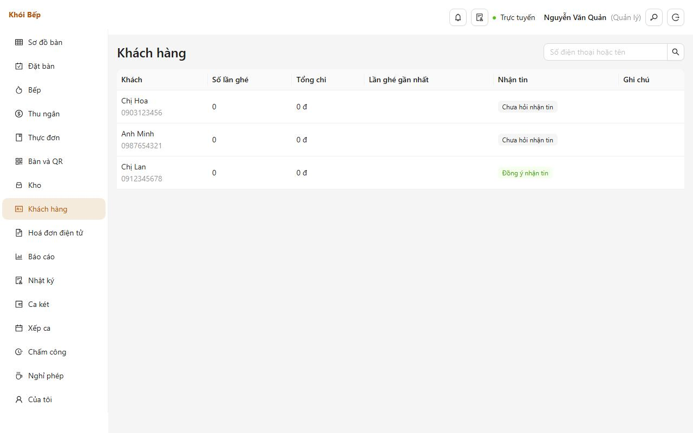

**Hoá đơn điện tử.** Mỗi bill thu đủ có sẵn dữ liệu hoá đơn: dòng hàng, thuế theo từng thuế suất, người mua.
1. Chọn khoảng ngày, mở một dòng để xem chi tiết.
2. **Người mua**: sửa thông tin công ty nếu thu ngân chưa ghi.
3. **Xuất file MISA** tải tệp Excel các hoá đơn chưa có số. Kế toán nhập tệp vào MISA meInvoice và phát hành.
4. **Ghi số**: nhập ký hiệu (ví dụ 1C26MKB) và số hoá đơn MISA đã cấp. Hoá đơn chuyển "Đã có số"; từ đây sửa người mua thì làm trên MISA.

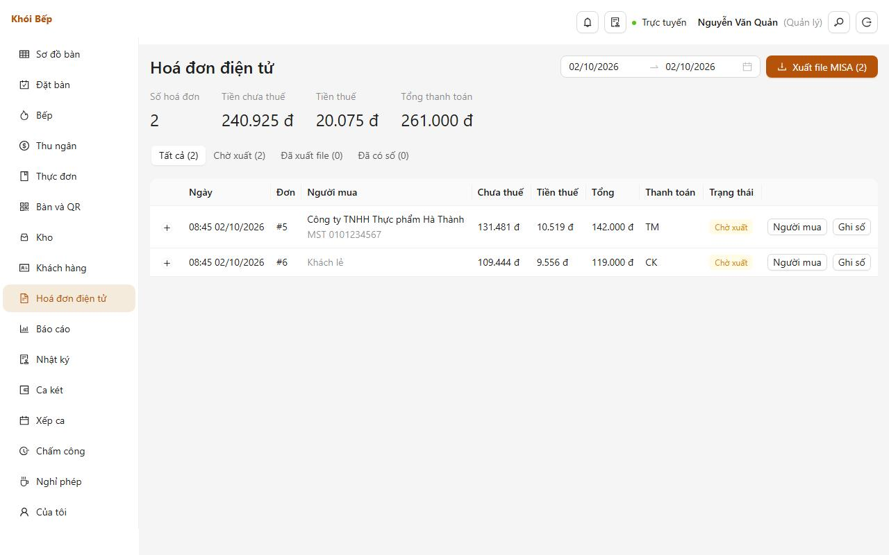

**Duyệt giảm giá.** Nút duyệt trên thanh trên cùng hiện các khoản giảm giá vượt hạn mức. Bấm **Duyệt** hoặc **Từ chối**; bill chỉ thu được khi không còn khoản chờ.

## 14.7 Quản trị

**Nhân viên.**
- **Thêm nhân viên**: họ tên, tên đăng nhập, vai trò, mật khẩu.
- **Hồ sơ, lương**: điện thoại, ngày vào làm, hình thức và mức lương.
- **Đặt lại mật khẩu**, **Khoá**.
- **Cho nghỉ việc**: tài khoản bị khoá, hồ sơ vẫn giữ. Nhân viên không bị xoá.

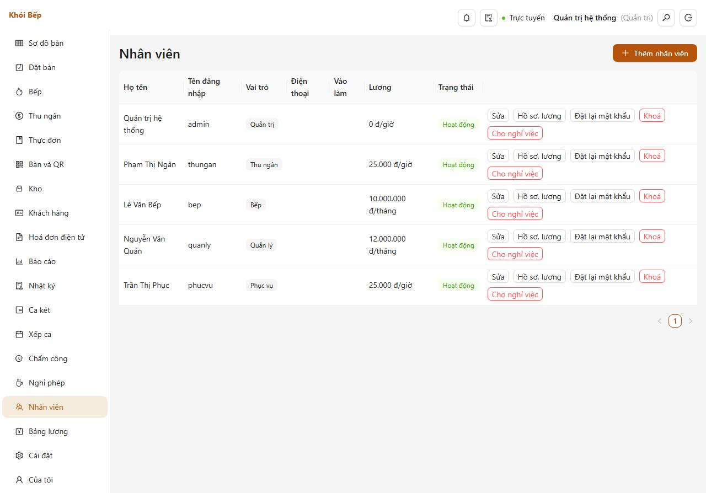

**Bảng lương.**
1. **Tạo bảng lương** cho một tháng. Lương tính từ chấm công.
2. Thêm thưởng, phạt từng người, bấm **Tính lại** khi cần.
3. **Chốt**: nhân viên xem được phiếu lương của mình.
4. **Xuất Excel**.

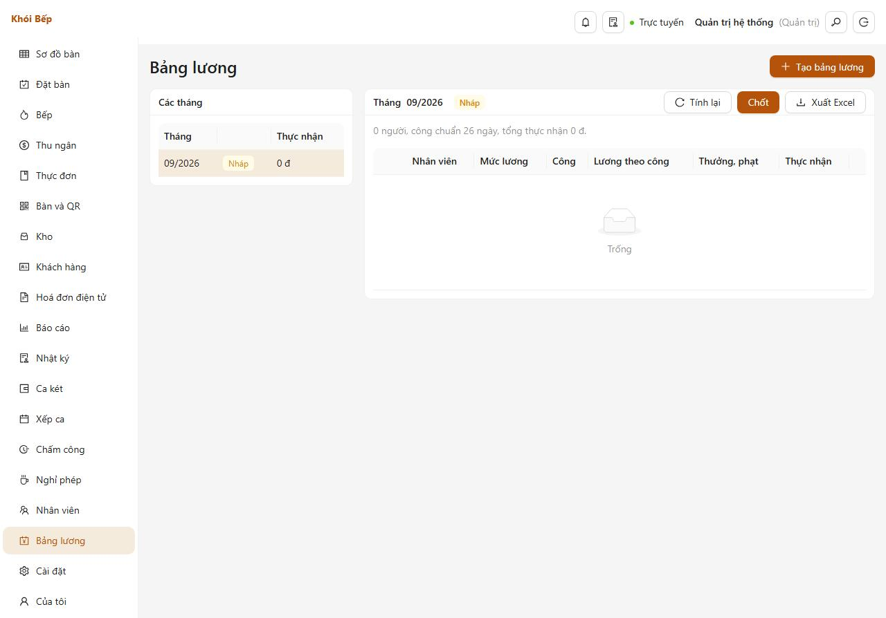

**Cài đặt.**
- **Nhà hàng**: tên, địa chỉ, điện thoại, in trên phiếu.
- **Tài khoản nhận chuyển khoản (VietQR)**: ngân hàng, số tài khoản, tên chủ tài khoản. Sai thông tin này thì khách chuyển nhầm.
- **Bếp**: số phút để một món bị coi là chờ lâu.

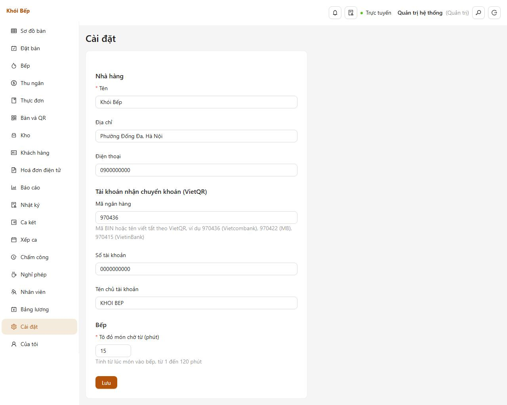

## 14.8 Của tôi (mọi nhân viên)

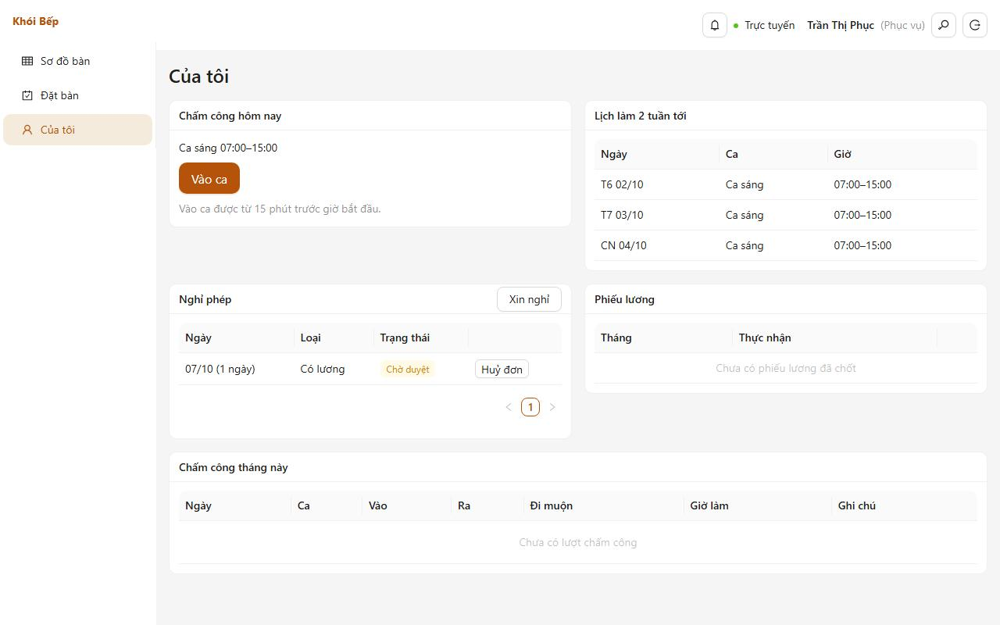

- **Chấm công hôm nay**: bấm **Vào ca** khi bắt đầu, **Ra ca** khi về.
- **Lịch làm 2 tuần tới**.
- **Nghỉ phép**: **Xin nghỉ** chọn ngày, loại, lý do. Đơn chưa duyệt thì **Huỷ đơn** được.
- **Phiếu lương** các tháng đã chốt, và **chấm công tháng này**.
