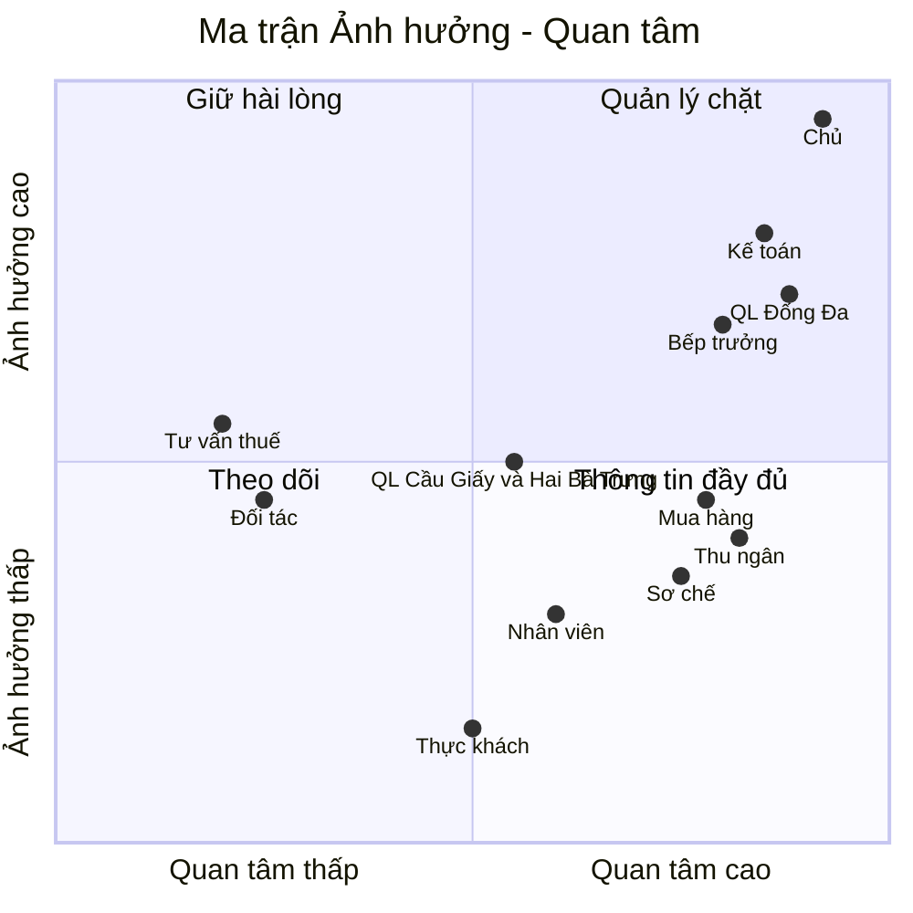
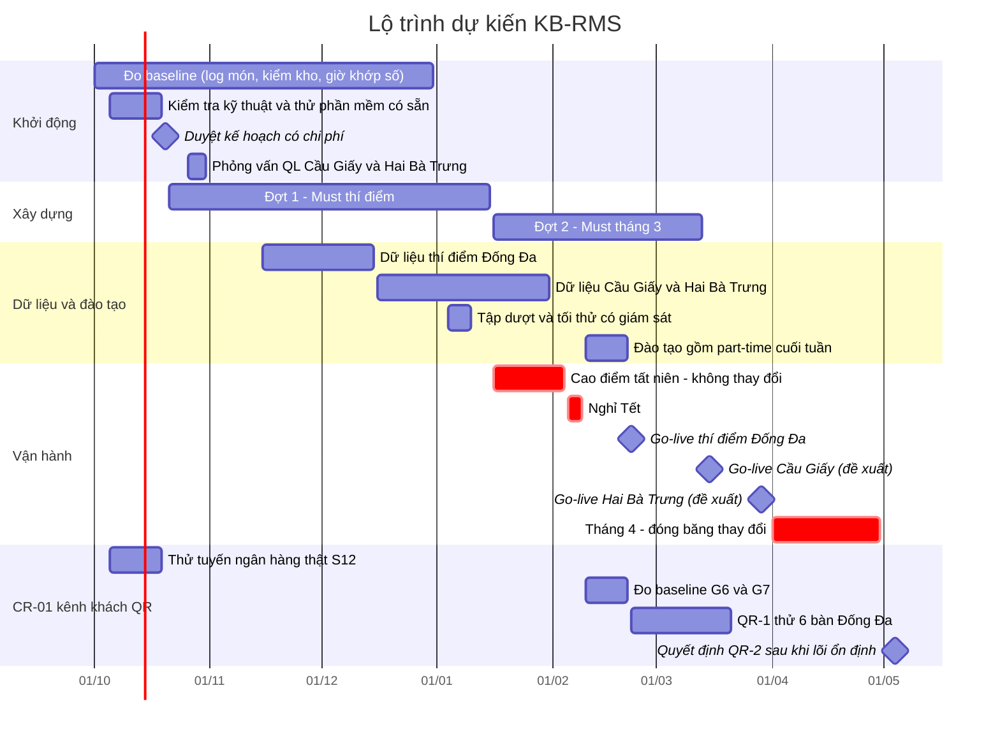

# BRD — Phần 1: Tổng quan dự án

| Mục | Nội dung |
|---|---|
| Dự án | Hệ thống quản lý chuỗi nhà hàng **Khói Bếp** (gọi tắt: **KB-RMS**) |
| Khách hàng | Công ty TNHH Khói Bếp: 3 quán tại Hà Nội. Đại diện: chị Mai Anh (chủ) |
| Phiên bản | 1.0, ngày 29/09/2026 |
| Trạng thái | **Baseline yêu cầu đã được khách xác nhận** (Buổi 6). **CR-01** (khách gọi món qua QR, trạng thái realtime, tự thanh toán) được **duyệt đưa vào thiết kế** (Buổi 10). Việc **duyệt xây dựng** còn chờ kiểm tra kỹ thuật 2 tuần có kèm chi phí |
| Công nghệ bắt buộc | **Spring Boot (Java) · React · PostgreSQL · CI/CD đầy đủ** (yêu cầu của nhóm dự án, DEC-26) |
| Nguồn | Biên bản [02-bien-ban-phong-van.en.md](../01-thu-thap-yeu-cau/02-bien-ban-phong-van.en.md), tóm tắt [03-tom-tat-phong-van.md](../01-thu-thap-yeu-cau/03-tom-tat-phong-van.md) |
| Phương pháp | Skill `business-problem-framing`, `stakeholder-analysis`, `requirements-elicitation`, `moscow-prioritisation` (repo 45ck/business-analysis-skills) |

> Ghi chú: khách hàng là **giả lập** do Codex đóng vai, sau khi đã khảo sát thực tế ngành F&B Việt Nam. Toàn bộ số liệu là của khách giả lập, không phải số liệu thị trường.

---

## 1. Bối cảnh doanh nghiệp

- **Mô hình:** món Việt ăn chung, đồ nướng than, lẩu theo set. Khoảng 85 mục menu. Có bán bia và nước.
- **Quy mô:** 3 quán, tổng 66 bàn, khoảng 264 chỗ ngồi. Khoảng 275–310 lượt khách/ngày thường, 455–500 lượt vào ngày cuối tuần đông. Mở cửa 10:30–22:30 mỗi ngày.
- **Kênh bán:** tại chỗ 75–80%, mang về ~5%, còn lại qua GrabFood và ShopeeFood.
- **Nhân sự:** dưới 50 người cố định và khoảng 7 part-time. Khối chung gồm chủ, kế toán, điều phối mua hàng, 2 nhân viên sơ chế.
- **Pháp lý:** công ty TNHH, thuế GTGT khấu trừ. HĐĐT xuất qua **MISA meInvoice** cho mọi giao dịch. Công nợ quản lý trên phần mềm kế toán MISA.
- **Công cụ hiện tại:**
  - POS365, mỗi quán một tài khoản riêng.
  - Phiếu order giấy.
  - Nhóm Zalo.
  - Excel.
  - Sổ tay đặt bàn và sổ chuyển hàng sơ chế.
  - QR chuyển khoản in sẵn, máy quẹt thẻ rời, tablet riêng cho từng app giao hàng.

## 2. Phát biểu vấn đề

> **Chủ và đội ngũ vận hành** cần *order đến bếp chính xác, biết tiền thực thu và tiêu hao kho của từng quán ngay trong đêm*.
> Nhưng họ bị cản trở bởi *quy trình nhiều nguồn dữ liệu (giấy, POS rời từng quán, Zalo, lời nói), tiền nhận không gắn với bill, và chuyển kho sơ chế ghi tay*.
> Hậu quả là *sót hoặc trùng món khoảng 2–3 lần/tuần, kế toán mất 2–3 giờ/ngày khớp số, chênh lệch kho ước 6–8%, chủ chỉ có số liệu vào hôm sau*.

### 2.1 Triệu chứng và nguyên nhân gốc

| Triệu chứng | Nguyên nhân gốc | Loại | Nguồn |
|---|---|---|---|
| Sót hoặc trùng món gọi thêm | Order đi qua 4 kênh (giấy, POS, Zalo, hô miệng); thu ngân **nhập lại** phiếu; món thêm in thành phiếu rời | [F] | S1-Q4, S2-C1, S3-K2 |
| | Không có trạng thái món chung giữa sảnh, bếp và quầy | [I] | S2-M8 |
| | Mất mạng thì nhập bù, không biết phiếu nào đã in, dẫn tới in trùng | [F] | S2-M7 |
| Khó khớp tiền | QR tĩnh không có số tiền và mã bill; **1 tài khoản thu chung cho 3 quán** | [F] | S2-C3, S4-F3 |
| | Thanh toán kết hợp ghi vào một phương thức; cọc bị tính thành doanh thu lần hai | [F] | S4-F4 |
| | Tiền app về trễ và đã trừ phí; chốt két bằng ảnh gửi Zalo | [F] | S4-F3, S2-C5 |
| Chênh lệch kho khó giải thích | Chưa có định lượng chuẩn; đơn vị không thống nhất (kg, túi, hộp) | [F] | S3-K7, S3-P1 |
| | Chuyển kho ghi sổ tay và Zalo; hao hỏng, bữa nhân viên, bia khuyến mãi ghi không đủ | [F] | S3-P2, K8, U5 |
| | Mua gấp bằng tiền mặt không báo mua hàng; ký nhận trước khi kiểm | [F] | S3-U2, U3 |
| Chủ thấy số liệu trễ | 3 POS rời, tổng hợp tay bằng Excel | [F] | S1-Q6 |
| Căng thẳng giữa quản lý, kế toán, thu ngân và bếp | Chính sách giảm giá và huỷ món **không có văn bản**; không có cơ chế duyệt nhanh | [F] | S1-Q3, S2-M4, M5 |

## 3. Mục tiêu và chỉ số thành công

Nguồn: S1-Q9, S2-M8, S5-A (đã sửa). Baseline đo từ tháng 10 đến tháng 12/2026.

| Mã | Mục tiêu | Baseline hiện tại | Đích | Đo bằng | Thời điểm | Người đo |
|---|---|---|---|---|---|---|
| G1 | Mỗi quán có bức tranh doanh thu và thanh toán **sau giờ đóng cửa cùng đêm**, khoản chưa rõ hiện trung thực | Hôm sau hoặc lâu hơn | Cùng đêm. Tiền app đối soát sau vẫn chấp nhận | Dashboard của chủ | Từ ngày thí điểm | Chủ |
| G2 | Giảm **thời gian thao tác tay** của kế toán khi khớp số | 2–3 giờ/ngày | **< 1 giờ/ngày sau khi triển khai toàn chuỗi** (không áp cho thí điểm). Dời khoản chưa rõ sang hôm sau không tính là tiết kiệm | Kế toán tự bấm giờ, báo cáo hằng tháng | Tháng 4/2027 | Hạnh |
| G3 | Giảm món **sót và trùng**, tính cả lỗi phát hiện trước khi khách phàn nàn | ~2–3 lần/tuần (ước lượng) | Giảm rõ rệt so với baseline. Đích số cụ thể chốt sau khi có baseline | Sổ ghi lỗi món có nguyên nhân | Từ 10/2026 | Lan |
| G4 | Chênh lệch kho bia và thịt ưu tiên, **so cùng đơn vị**, đã tính hao hụt sơ chế đo được và hao hỏng đã ghi | ~6–8% (ước lượng) | < 3% | Báo cáo chênh lệch ~15 mặt hàng | Sau khi triển khai | Minh, Thảo, Đức |
| G5 | **Tối thứ 6 bình thường, nhân viên chọn dùng thiết bị** thay cho giấy (giấy chỉ dùng khi sự cố thật) | Dùng giấy 100% | Không có phiếu giấy ngoài sự cố | Quan sát buổi thử và tuần đầu | Thí điểm | Lan |
| G6 | *(CR-01)* Khách **thực sự dùng QR để gọi thêm** ở 6 bàn thí điểm; so món sót hoặc trùng với sổ của Lan | Chưa có (đo 1–2 tuần, TR-12) | ~**1/4 món gọi thêm** ở 6 bàn đến từ QR sau 1 tháng. Đây là **mục tiêu học hỏi**, không ép khách | Chỉ số QR (FR-GST-21) | QR-1 + 1 tháng | Lan, Mai Anh |
| G7 | *(CR-01)* Khách tự thanh toán nhanh hơn | 5–10 phút lúc đông (**đo lại** 1–2 tuần) | ~**3 phút** từ "tính tiền" tới xác nhận; **ghi riêng** các ca ngân hàng xác nhận chậm | Chỉ số QR (FR-GST-21) | Sau khi bật tự thanh toán | Huy |

## 4. Phạm vi

### 4.1 Trong phạm vi, theo giai đoạn

Nguồn: S4-O10, S5-C, S6-R8. Chi tiết yêu cầu nằm ở [SRS](../03-dac-ta-yeu-cau/01-yeu-cau-chuc-nang.md).

| Nhóm năng lực | Thí điểm Đống Đa | Toàn chuỗi (≤ 31/03/2027) |
|---|---|---|
| Sơ đồ bàn, trạng thái bàn; gọi món trên máy cầm tay đi thẳng xuống bếp và bill | Must | Must |
| Phiếu bếp theo khu (**giữ phiếu in**) và màn hình trạng thái hỗ trợ | Must | Must |
| Huỷ món, giảm giá có lý do, hạn mức, lịch sử | Must | Must |
| Tách bill, gộp bill, chuyển bàn | Must | Must |
| Tiền mặt, thẻ, ví, thanh toán kết hợp | Must | Must |
| Mở ca, chốt ca, đếm két, giao ca | Must | Must |
| Chạy khi mất Internet (offline trong quán) | Must | Must |
| Đơn app **nhập tay** kèm mã đơn app | Must | Must |
| Quản lý hết món tại sảnh; cập nhật app thủ công có nhắc việc | Must | Must |
| Dashboard của chủ cùng đêm | Must | Must |
| Dữ liệu bán hàng và người mua **đủ tin cậy cho kế toán xuất HĐĐT** trên meInvoice | Must (quy trình đang chạy) | Must |
| Giữ món / gọi ra món (hold & fire) | Should | Must |
| Đặt bàn kèm tiền cọc | Should | Must |
| QR động theo bill, tự xác nhận (tuỳ ngân hàng có cho truy cập không) | Should | Should |
| Định lượng và tiêu hao lý thuyết cho **mặt hàng ưu tiên** | Should | Must |
| Sản xuất sơ chế và chuyển kho | Should | Must |
| Kiểm kê và chênh lệch ~15 mặt hàng ưu tiên | Should | Must |
| Khớp thanh toán (tiền mặt, ngân hàng, thẻ; nhập tay bảng kê app) | Should | Must |
| Menu và giá tập trung: theo quán, theo kênh, bảng giá lễ có ngày hiệu lực | Should | Must |
| Xuất dữ liệu sang MISA (đã được kế toán thử) | Should | Must |
| Danh sách chờ | Could | Should |
| Danh sách khách hàng / ưu đãi, tích điểm đơn giản | Could (danh sách cơ bản) | Should |
| Mua hàng: đề xuất → đơn mua → nhận hàng | Could | Should |
| Liên kết trạng thái hết món lên app | — | Should |
| Xuất HĐĐT qua kết nối nhà cung cấp đã kiểm chứng | Could | Should |
| Kết nối trực tiếp app giao hàng | — | Could (khi có quyền truy cập và biết chi phí) |
| *(CR-01)* **QR-1**: 6 bàn Đống Đa; khách gọi **thêm** qua QR sau order đầu của nhân viên; nhân viên xác nhận mọi đơn; mã ngồi bàn; trạng thái trung thực; công tắc tạm dừng | Should (tuỳ duyệt mua và xây) | Should |
| *(CR-01)* **Tự thanh toán** cả bill đã chốt, ngân hàng tự xác nhận (chỉ bật sau khi thử tuyến ngân hàng thật) | Should (có điều kiện) | Should |
| *(CR-01)* **QR-2**: tự nhận món thêm thông thường, tự gọi từ món đầu, tách tự thanh toán, mở rộng số bàn | — | Could (chủ quyết riêng sau khi lõi ổn định) |

### 4.2 Ngoài phạm vi (Won't, lần này không làm)

- Chấm công và tính lương. Có thể xuất danh sách ca sau này, nhưng không làm nguồn tính lương.
- **Công nợ nhà cung cấp**: vẫn ở MISA. Hệ thống chỉ ghi nhận đặt, nhận, từ chối, chuyển và xuất dữ liệu.
- Website đặt món riêng (đặt từ xa). *Gọi món bằng QR **tại bàn** đã được đưa vào phạm vi qua CR-01.*
- Camera nhận diện đĩa ra khỏi bếp.
- Tính năng nhượng quyền.
- Lập báo cáo lãi lỗ đầy đủ: hoàn thiện ở phần mềm kế toán; hệ thống chỉ cấp số liệu bán hàng và kho.

## 5. Phương án giải pháp

| Tiêu chí (trọng số) | PA1: Phần mềm có sẵn + Excel | PA2: Hệ thống riêng, dùng dịch vụ sẵn có (QR ngân hàng, HĐĐT, xuất MISA) | PA3: Kết hợp (POS có sẵn + back-office riêng) |
|---|---|---|---|
| Giải quyết vấn đề #1 order → bếp (25%) | Tốt | Tốt | Tốt |
| Giải quyết #2 khớp tiền, cọc (25%) | Yếu: vẫn Excel | Tốt | Trung bình: phụ thuộc dữ liệu POS xuất ra |
| Giải quyết #3 sơ chế, chuyển kho, hao hụt (20%) | Yếu | Tốt | Tốt |
| Kiểm soát hạn mức, duyệt dự phòng 3 phút (10%) | Hạn chế | Tốt | Trung bình |
| Chi phí và rủi ro tiến độ (20%) | Thấp | **Cao nhất**: cần phạm vi chặt | Trung bình: 2 hệ thống phải đồng bộ |

**Quyết định của khách (S5-D5):** chọn **PA2 có điều kiện**. Trước khi duyệt xây dựng:
1. **Kiểm tra kỹ thuật và giá trong 2 tuần:**
   - ngân hàng có cho truy cập thông báo giao dịch để xác nhận QR không;
   - máy in, mạng LAN và cơ chế offline;
   - định dạng dữ liệu cho MISA và meInvoice;
   - báo giá phần cứng, UPS và 4G dự phòng.
2. **Thử một phần mềm có sẵn cho phần sảnh:** nếu có sản phẩm đáp ứng phần gọi món, bếp, bill và chia sẻ được dữ liệu tin cậy, thì **không xây lại** phần đó.
3. **Kế hoạch có chi phí nằm trong ngân sách.** Chi phí biến đổi phải được ước tính theo mức dùng dự kiến, không chỉ liệt kê tên.

> Tài liệu thiết kế trong bộ này mô tả **PA2 đầy đủ**, để làm cơ sở cho bước kiểm tra kỹ thuật. Nếu kết quả thử chọn phần mềm có sẵn cho phần sảnh, thì module Sảnh/Bếp/Bill trong thiết kế chuyển thành **lớp tích hợp**, còn mô hình dữ liệu và các module back-office giữ nguyên.

## 6. Bên liên quan

Nguồn: skill `stakeholder-register`, `power-interest-grid`.

| ID | Bên liên quan | Vai trò với dự án | Mối quan tâm chính | Ảnh hưởng | Quan tâm | Chiến lược |
|---|---|---|---|---|---|---|
| SH01 | Mai Anh, chủ | Nhà tài trợ, quyết định cuối | Số liệu cùng đêm; kiểm soát giảm giá; ngân sách; không gián đoạn phục vụ | Cao | Cao | Quản lý chặt |
| SH02 | Lê Mỹ Hạnh, kế toán | Chủ quy trình tài chính và HĐĐT | Khớp số; lý do và người duyệt cho mọi điều chỉnh; dữ liệu sạch; xuất MISA | Cao | Cao | Quản lý chặt |
| SH03 | Trần Ngọc Lan, quản lý Đống Đa | Chủ vận hành quán thí điểm | Tốc độ giờ đông; quyền xử lý khách tại chỗ | Cao | Cao | Quản lý chặt; đồng thiết kế |
| SH04 | Võ Thanh Đức, bếp trưởng Đống Đa | Người dùng chính phiếu bếp, định lượng | Phiếu đúng; thay đổi không bị giấu; bảo mật công thức; không bị quy lỗi vô căn cứ | Cao (quyết định thiết bị bếp) | Cao | Quản lý chặt; đồng thiết kế |
| SH05 | Phạm Quốc Huy, thu ngân Đống Đa | Người dùng chính thanh toán và két | Bớt nhập lại; bớt khớp CK vô danh; ít thao tác | Trung bình | Cao | Thông tin đầy đủ; thử nghiệm |
| SH06 | Lê Thu Thảo, trưởng sơ chế | Người dùng sản xuất và chuyển kho | Ghi được hàng rò, hỏng; đơn vị thống nhất | Trung bình | Cao | Thông tin đầy đủ |
| SH07 | Nguyễn Quang Minh, điều phối mua hàng | Chủ dữ liệu mặt hàng và nhà cung cấp | Truy vết nhận / dùng / chuyển; mua gấp minh bạch | Trung bình | Cao | Thông tin đầy đủ |
| SH08 | Quản lý Cầu Giấy và Hai Bà Trưng | Người dùng giai đoạn triển khai | Mạng yếu ở Cầu Giấy; phòng riêng và sân thượng ở Hai Bà Trưng | Trung bình | Trung bình | **Chưa phỏng vấn** (xem Buổi 7) |
| SH09 | Phục vụ, đầu bếp, part-time | Người dùng cuối | Nhanh, dễ, được đào tạo (cả người chỉ làm cuối tuần) | Thấp từng người, **cao khi cả tập thể** (quyết định có dùng hay không) | Trung bình | Đào tạo; thử tối đông |
| SH10 | Tư vấn thuế | Xác nhận thuế suất và thời hạn lưu trữ | Tuân thủ | Trung bình | Thấp | Giữ hài lòng |
| SH11 | Đối tác: Vietcombank, MISA, GrabFood, ShopeeFood, nhà cung cấp | Tích hợp, dữ liệu vào | Điều khoản thương mại, quyền truy cập | Trung bình | Thấp | Theo dõi qua kiểm tra kỹ thuật |
| SH12 | Thực khách | Người thụ hưởng, chủ thể dữ liệu cá nhân; **từ CR-01 là người dùng trực tiếp kênh QR** (tác nhân A11) | Phục vụ nhanh, đúng; gọi thêm và thanh toán không phải chờ; quyền riêng tư; **không bị lừa bởi QR giả** | Thấp | Trung bình | Thử với khách thật ở QR-1; xin đồng ý tiếp thị riêng |

## 7. Giả định và ràng buộc

Nguồn: skill `assumptions-constraints-log`, template `assumptions-and-constraints-template.md`.

### 7.1 Giả định

| ID | Giả định | Ảnh hưởng nếu sai | Khả năng sai | Cách kiểm chứng | Người chịu trách nhiệm |
|---|---|---|---|---|---|
| ASM-01 | Trong thí điểm, HĐĐT vẫn xuất trên MISA meInvoice; hệ thống chỉ cung cấp dữ liệu | Phải làm tích hợp HĐĐT sớm hơn | Thấp | Khách đã xác nhận (S5-A1) | Hạnh |
| ASM-02 | Ngân hàng hoặc một dịch vụ trung gian cho phép nhận thông báo giao dịch để xác nhận QR | Không tự xác nhận QR được; G2 khó đạt | Trung bình | Kiểm tra kỹ thuật 2 tuần | BA/Tech lead |
| ASM-03 | GrabFood và ShopeeFood chưa kết nối trực tiếp; nhân viên nhập đơn kèm mã đơn app | Nếu kết nối được thì bớt nhập tay | Thấp | Kiểm tra quyền truy cập đối tác | Mai Anh |
| ASM-04 | Thuế suất từng món do kế toán và tư vấn thuế cung cấp trước go-live | Sai thuế trên hóa đơn | Trung bình | Duyệt danh mục trước 15/12 | Hạnh |
| ASM-05 | Máy quẹt thẻ vẫn là thiết bị rời của ngân hàng; hệ thống ghi nhận giao dịch thẻ, không điều khiển máy | Nếu cần tích hợp máy thẻ thì thêm chi phí | Thấp | Hợp đồng ngân hàng | Hạnh |
| ASM-06 | Thiết bị của quán dùng chung theo ca, mỗi người đăng nhập bằng PIN riêng | Nếu dùng máy cá nhân thì có rủi ro bảo mật | Thấp | S5-N7 | Lan |
| ASM-07 | Dữ liệu gốc (menu, đơn vị, sơ đồ bàn, thuế) được làm sạch đúng hạn | Báo cáo đẹp nhưng sai | **Cao** | Mốc dữ liệu 15/12 và 31/01 | Minh, Hạnh, Lan |

### 7.2 Ràng buộc

| ID | Ràng buộc | Loại | Cứng/Mềm | Nguồn | Tác động thiết kế |
|---|---|---|---|---|---|
| CON-01 | Ngân sách xây dựng và đưa vào dùng 350–500 triệu; **trần tuyệt đối 600 triệu** (chủ nói rõ ở Buổi 9). CR-01 được cộng thêm 50–80 triệu **chỉ khi** tổng vẫn ≤ 600 triệu | Tài chính | Cứng | S1-Q11, S9-O4 | Phạm vi MVP chặt; dùng lại dịch vụ có sẵn; QR-2 hoãn đầu tiên nếu thiếu |
| CON-02 | Chi phí cố định cho hosting và hỗ trợ 3 quán 8–12 triệu/tháng; chi phí biến đổi tách riêng, phải ước tính | Tài chính | Mềm | S5-N8, S6-R7 | Kiến trúc tiết kiệm; hạ tầng đám mây nhỏ |
| CON-03 | Thí điểm go-live ~22/02/2027 (dời để tránh tất niên và Tết); toàn chuỗi xong trước 31/03/2027; **không thay đổi vào tháng 4** | Tiến độ | Cứng | S1-Q10, S7-Q1 | Phát hành theo giai đoạn; bật tính năng theo từng quán |
| CON-04 | Phải chạy tiếp khi mất Internet ≥ 4 giờ (nếu còn điện) | Kỹ thuật | Cứng | S5-N2, S6-R6 | Máy chủ tại quán, LAN, UPS, 4G dự phòng |
| CON-05 | Giữ phiếu bếp in trong thí điểm | Vận hành | Cứng | S5-C1 | Hỗ trợ cả máy in và màn hình bếp |
| CON-06 | HĐĐT theo NĐ 254/2026 (hiệu lực 01/07/2026), xuất qua nhà cung cấp; không xoá hóa đơn đã phát hành | Pháp lý | Cứng | S4-F2 | Tách bill và HĐĐT; lưu dữ liệu người mua |
| CON-07 | Dữ liệu cá nhân theo Luật Bảo vệ dữ liệu cá nhân và NĐ 356/2025; phải có đồng ý trước khi tiếp thị | Pháp lý | Cứng | S4-O4, S5-N5 | Lưu trạng thái đồng ý, cho từ chối nhận tin |
| CON-08 | Lưu dữ liệu bán hàng, hóa đơn, kho **≥ 10 năm** (chờ tư vấn xác nhận), truy xuất và xuất được | Pháp lý | Cứng | S4-F11 | Chính sách lưu trữ, lưu trữ lạnh, xuất dữ liệu |
| CON-09 | Ưu tiên hosting tại Việt Nam, **phải có báo giá**, không loại phương án khác trước khi hiểu tác động | Hạ tầng | Mềm | S5-N5 | So sánh phương án hosting |
| CON-10 | Công nợ nhà cung cấp và lương nằm ngoài hệ thống | Phạm vi | Cứng | S4-F7, F9 | Chỉ xuất dữ liệu |
| CON-11 | **Công nghệ bắt buộc**: Java Spring Boot (backend), React (frontend), PostgreSQL, CI/CD đầy đủ | Kỹ thuật | Cứng | DEC-26 | [Kiến trúc §11](../04-thiet-ke-he-thong/01-kien-truc.md), [Mã nguồn và CI/CD](../04-thiet-ke-he-thong/07-ma-nguon-va-cicd.md) |
| CON-12 | CR-01 chỉ **thí điểm ở 6 bàn** Đống Đa (QR-1); tự thanh toán chỉ bật sau khi thử tuyến ngân hàng thật; chi phí cố định thêm ≤ 1–2 triệu/tháng | Phạm vi, tài chính | Cứng | S10-Q1, Q2, C1 | Công tắc tính năng theo bàn; adapter tuyến ngân hàng |

## 8. Rủi ro

| ID | Rủi ro | Khả năng | Tác động | Giảm thiểu | Người chịu trách nhiệm |
|---|---|---|---|---|---|
| RSK-01 | **Nhân viên quay lại dùng giấy** vì thao tác chậm giờ đông | Trung bình | Cao | Thiết kế ít chạm (N1); thử tối thứ 6 và 7 thật; đào tạo cả part-time cuối tuần | Lan |
| RSK-02 | Dữ liệu gốc bẩn khiến báo cáo sai | Cao | Cao | Mốc làm sạch dữ liệu 15/12 và 31/01; công cụ kiểm tra trùng lặp | Minh, Hạnh |
| RSK-03 | Ngân hàng hoặc app không cho kết nối, hoặc phí cao | Trung bình | Trung bình | Kiểm tra 2 tuần; phương án thủ công có mã bill | Tech lead |
| RSK-04 | Phạm vi Must quá lớn so với ngân sách và 4 tháng | Cao | Cao | MoSCoW chặt; thử phần mềm có sẵn cho phần sảnh; phát hành theo giai đoạn | BA, Mai Anh |
| RSK-05 | Mất điện hoặc mạng lúc đông; máy in hỏng tối thứ 6 | Trung bình | Cao | UPS, 4G, máy dự phòng; kịch bản sự cố và phiếu giấy đánh số (S6-R9) | Lan |
| RSK-06 | Go-live thí điểm trùng cao điểm tất niên và Tết 2027 | ~~Cao~~ | Cao | **Đã xử lý (S7-Q1):** go-live dời sang ~22/02/2027; tháng 1 chỉ tập dượt | Mai Anh |
| RSK-10 | Sau khi dời go-live, chỉ còn **~5 tuần** giữa thí điểm và hạn triển khai toàn chuỗi 31/03, trong khi các hạng mục Must tháng 3 (d, k, p, q, s, u, v, z) phải xong | Cao | Cao | Làm song song đợt 2 từ tháng 1; bật tính năng theo từng quán; chủ **không ép** go-live Cầu Giấy và Hai Bà Trưng nếu thí điểm lộ lỗi nghiêm trọng (S7-Q1) | Mai Anh, Tech lead |
| RSK-11 | *(CR-01)* **QR giả dán đè** dẫn khách tới trang thanh toán lừa đảo | Trung bình | Cao | Thẻ chống bóc dán, kiểm tra mỗi lần mở bàn; chỉ thanh toán trên tên miền của quán, hiện tên công ty (BR-53) | Lan |
| RSK-12 | *(CR-01)* Khách gọi nhanh hơn sức bếp | Trung bình | Trung bình | Nhân viên xác nhận và điều nhịp (BR-42, 43) | Đức, Lan |
| RSK-13 | *(CR-01)* Ngân hàng xác nhận chậm khiến khách trả lần hai | Trung bình | Trung bình | Không gợi ý trả lại; thu ngân kiểm tra tài khoản trước (BR-51) | Huy |
| RSK-14 | *(CR-01)* Thí điểm tháng 2 gánh quá nhiều thay đổi | Cao | Cao | Chỉ 6 bàn; công tắc tắt QR tức thì; QR-2 hoãn (BR-56) | Mai Anh |
| RSK-15 | *(CR-01)* Nhân viên bỏ bê bàn dùng QR | Trung bình | Trung bình | Hàng chờ xác nhận và gọi nhân viên có đồng hồ; đào tạo (TR-15) | Lan |
| RSK-16 | *(CR-01)* Mở QR bằng Zalo hoặc trình duyệt trong app thì deeplink ngân hàng không chạy | Trung bình | Trung bình | Thử S11, S12; luôn có "lưu ảnh QR" và "nhờ nhân viên" | Tech lead |
| RSK-07 | Quy định thuế và HĐĐT tiếp tục thay đổi | Trung bình | Trung bình | Để nhà cung cấp HĐĐT lo tuân thủ; thuế suất là dữ liệu cấu hình | Hạnh |
| RSK-08 | Báo cáo chênh lệch kho bị dùng để quy lỗi người vô căn cứ | Trung bình | Trung bình | Báo cáo tách nguyên nhân theo loại giao dịch; so cùng đơn vị (G4) | Mai Anh |
| RSK-09 | Phụ thuộc vào vài người chủ chốt (Lan, Hạnh) | Trung bình | Trung bình | Tài liệu hướng dẫn theo vai trò; đào tạo người dự phòng | Mai Anh |

## 9. Lộ trình dự kiến

Nguồn: S1-Q10, S5-D9, D10, S7-Q1, Q2. Ngày go-live của Cầu Giấy và Hai Bà Trưng là **đề xuất của BA**, chưa được khách chốt.

| Mốc | Ngày | Điều kiện đạt |
|---|---|---|
| M1 Duyệt xây dựng | ~20/10/2026 | Có kết quả kiểm tra kỹ thuật 2 tuần; kế hoạch có chi phí cố định và biến đổi đã ước tính theo mức dùng |
| M-D1 Dữ liệu thí điểm | 15/12/2026 | Sơ đồ bàn Đống Đa (Lan), menu và đơn vị (Minh cùng bếp), thuế suất (Hạnh) đã được duyệt |
| M-T Tối thử có giám sát | Đầu 01/2027 | Chạy song song giấy; **thử cả tình huống khôi phục sau mất mạng**, gồm phiếu đã in ngay trước khi mất mạng (S6-R6) |
| M2 Go-live thí điểm | ~22/02/2027 | Nhân viên đã được đào tạo; có kịch bản xử lý sự cố; UPS và 4G đã lắp |
| M3, M4 Go-live Cầu Giấy và Hai Bà Trưng | ≤ 31/03/2027 | Thí điểm không còn lỗi nghiêm trọng về gọi món và thanh toán (chủ **không ép** nếu chưa đạt) |
| Q-1 Bật QR-1 ở 6 bàn | Cùng hoặc sau M2 | Đã duyệt mua và xây phần CR-01; đã đào tạo (TR-15); thẻ QR đã kiểm tra (TR-16). **Tự thanh toán** chỉ bật khi đạt TR-11 |
| Q-2 Quyết định QR-2 | Sau tháng 4 | Có 1–2 tuần số liệu QR-1; lõi đã ổn định ở cả 3 quán; chủ quyết riêng |
