# BRD — Phần 2: Quy trình nghiệp vụ hiện tại (As-is) và mục tiêu (To-be)

> Phương pháp: skill `process-modelling-and-improvement`, `as-is-process-investigator`, `to-be-process-designer`, `process-model-spec`.
> Các mã `FR-…` tham chiếu tới [SRS](../03-dac-ta-yeu-cau/01-yeu-cau-chuc-nang.md), mã `BR-…` tới [sổ quy tắc](03-quy-tac-nghiep-vu.md).
> Ô đỏ trong sơ đồ as-is là **điểm đau** đã được khách xác nhận.

## Danh sách quy trình

| Mã | Quy trình | Người thực hiện chính | Có sơ đồ |
|---|---|---|---|
| P1 | Phục vụ tại bàn: đón khách → gọi món → bếp → ra món → thanh toán | Phục vụ, thu ngân, bếp | As-is + To-be |
| P2 | Huỷ, đổi món, giảm giá, tặng món (có duyệt) | Quản lý, bếp, chủ | To-be |
| P3 | Thanh toán và xác nhận chuyển khoản | Thu ngân, quản lý | To-be |
| P4 | Mở ca, giao ca, chốt ca, đối chiếu két | Thu ngân, quản lý | To-be |
| P5 | Đặt bàn, tiền cọc, tiệc | Quản lý | To-be |
| P6 | Đơn mang về và app giao hàng | Phục vụ quầy, thu ngân | To-be |
| P7 | Sơ chế chung và chuyển kho | Sơ chế, quản lý | To-be |
| P8 | Mua hàng và nhận hàng | Điều phối mua hàng, người nhận | To-be |
| P9 | Kiểm kê và chênh lệch kho | Quản lý, bếp, mua hàng | To-be |
| P10 | Sự cố mất mạng và khôi phục | Mọi người trong quán | To-be |
| P11 | Khớp số hằng ngày | Kế toán | To-be |
| P12 | Khách gọi thêm món qua QR, nhân viên xác nhận (CR-01) | Khách, phục vụ | To-be |
| P13 | Khách tự thanh toán chuyển khoản (CR-01) | Khách, thu ngân | To-be |

---

## P1. Phục vụ tại bàn

### P1 As-is

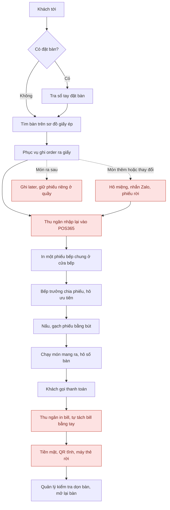

**Điểm đau** (S1-Q4, Q7; S2-C1, C2, C3; S3-K2):
- Order có **4 nguồn** khác nhau: giấy, POS, Zalo, lời nói. Thu ngân là "cổ chai" vì phải nhập lại mọi thứ.
- Món thêm in thành phiếu rời, bếp phải tự ghép với phiếu đầu. "Later" không có nghĩa rõ ràng.
- Sót hoặc trùng món khoảng 2–3 lần/tuần.
- Tách bill theo món làm tay. Chuyển bàn thì sơ đồ giấy và POS lệch nhau.
- QR tĩnh không có số tiền và mã bill.

### P1 To-be

```mermaid
flowchart LR
    subgraph PV["Phục vụ - máy cầm tay"]
        A1["Mở bàn, gắn booking nếu có"] --> A2["Chọn món, size, tuỳ chọn, dị ứng"]
        A2 --> A3{"Giữ món?"}
        A3 -->|Không| A4["Gửi bếp"]
        A3 -->|Có| A5["Giữ, bấm gọi ra món sau"]
        A5 --> A4
    end
    subgraph HT["Máy chủ tại quán"]
        B1["Định tuyến theo khu chế biến"] --> B2["In phiếu khu và hiện màn hình bếp"]
        B3["Cập nhật bill ngay lập tức"]
    end
    subgraph BEP["Bếp"]
        C1["Bắt đầu làm"] --> C2["Xong, đặt ở pass"]
    end
    subgraph TN["Thu ngân"]
        D1["Tách, gộp bill"] --> D2["Tiền mặt, QR động, thẻ, ví"]
        D2 --> D3["Đóng bill, dữ liệu cho HĐĐT"]
    end
    A4 --> B1
    A4 --> B3
    B2 --> C1
    C2 --> E1["Chạy món xác nhận đã mang ra"]
    E1 --> D1
```

**Thay đổi chính:**
- Phục vụ gọi món ngay tại bàn, order đi **cùng lúc** tới bếp và bill. **Bỏ bước thu ngân nhập lại** (FR-ORD-01, FR-KIT-01).
- Món thêm hiện **trong ngữ cảnh cả bàn** (FR-ORD-02). Có **giữ món / gọi ra món** thay cho chữ "later" (FR-ORD-04).
- Trạng thái món chung cho sảnh, bếp và quầy (FR-KIT-03, FR-KIT-04, FR-ORD-10).
- Vẫn **giữ phiếu in** trong thí điểm (CON-05).

---

## P2. Huỷ, đổi món, giảm giá, tặng món (To-be)

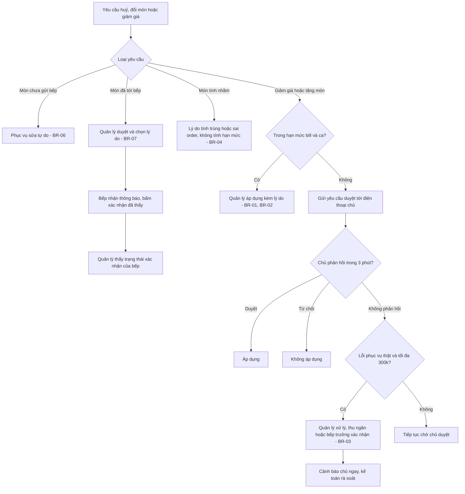

- **Hạn mức:** ≤ 10% bill và ≤ 150.000đ/bill; trần 600.000đ/ca/quản lý (BR-01, BR-02).
- **Lý do** chọn từ danh mục; chọn "Khác" thì phải ghi chú (BR-05).
- **Nhật ký:** ai làm, ai duyệt, lúc nào, giá trị trước và sau (FR-AUD-01).

---

## P3. Thanh toán và xác nhận chuyển khoản (To-be)

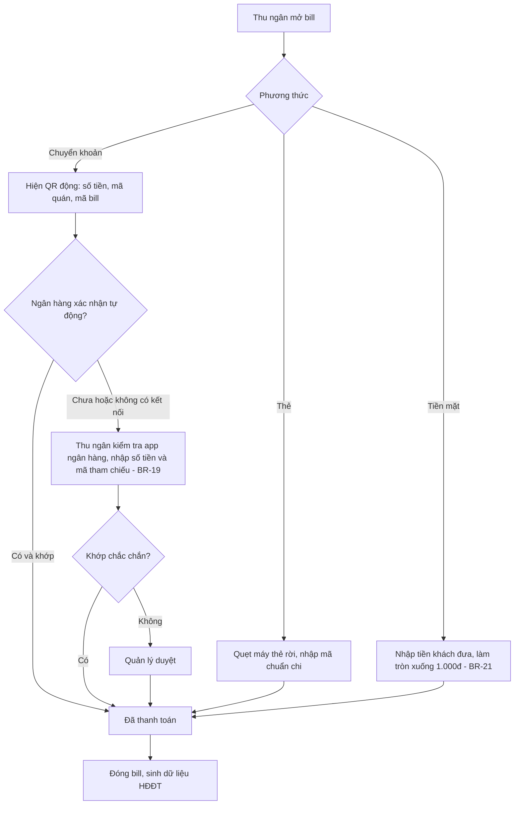

- **Một bill có thể trả bằng nhiều phương thức** (thanh toán kết hợp). Tổng các phần tách phải bằng tổng bill. Không làm tròn từng phần (BR-21).
- **Khi offline:** thẻ và QR chỉ được ghi "dự định, chưa xác nhận" (BR-20). Xem P10.
- **Ảnh chụp màn hình không bao giờ là bằng chứng thanh toán.**

---

## P4. Mở ca, giao ca, chốt ca (To-be)

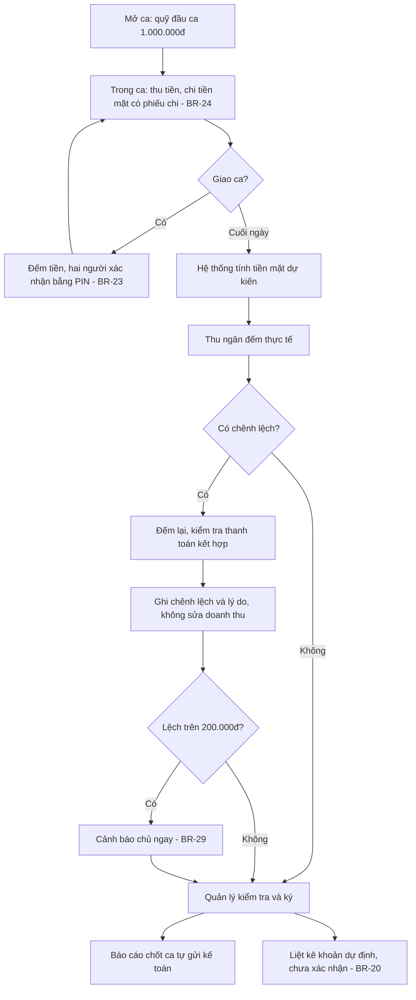

**Tiền mặt dự kiến** = quỹ đầu ca + thu tiền mặt − tiền thối − phiếu chi − hoàn tiền mặt − khoản làm tròn đã ghi.

Thay thế cách cũ là chụp phiếu chốt két gửi Zalo (FR-SHF-04, FR-SHF-06).

---

## P5. Đặt bàn, tiền cọc, tiệc (To-be)

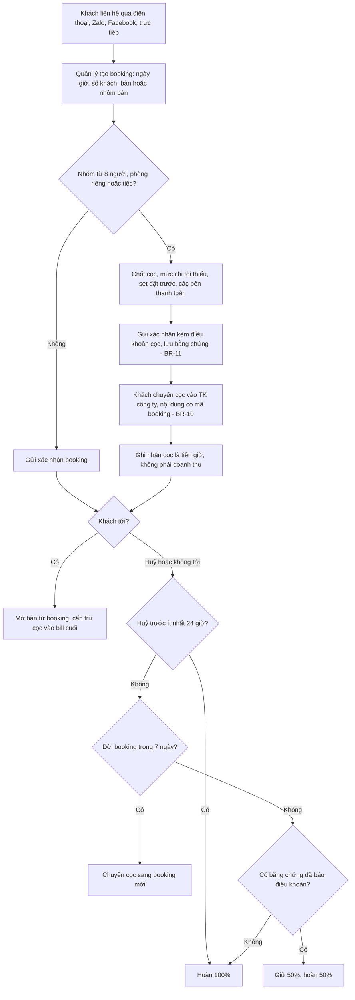

- **Tiệc** (S8-Q3): nhiều bàn hoặc phòng riêng; số khách có lịch sử thay đổi; set đặt trước kèm **giờ ra đồ nướng và lẩu**; **danh sách chuẩn bị gửi bếp từ hôm trước**; nhiều bên thanh toán, mỗi bên thông tin HĐ riêng (FR-RSV-07, FR-RSV-08, BR-26).
- **Khách trễ:** gọi điện sau 15 phút, giữ bàn khoảng 20 phút (tham số FR-RSV-09).

---

## P6. Đơn mang về và app giao hàng (To-be)

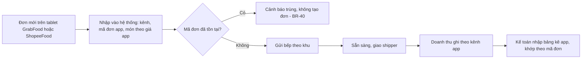

- **Thí điểm:** nhân viên nhập tay (Must). Kết nối trực tiếp với app là Could (FR-DLV-05).
- **Hết món:** hệ thống **nhắc cập nhật từng app** cho tới khi có người xác nhận đã cập nhật (FR-KIT-06, BR-18).

---

## P7. Sơ chế chung và chuyển kho (To-be)

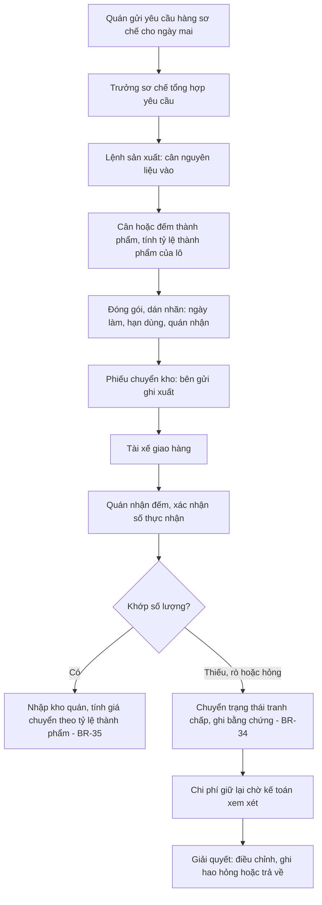

- **Thay cho** nhóm Zalo và sổ tay (S3-P2).
- **Đơn vị chuẩn:** mỗi mặt hàng có đơn vị cơ sở (g, ml, cái) và quy đổi túi, hộp → đơn vị cơ sở (FR-INV-01).
- **Quán cho quán mượn** dùng cùng cơ chế phiếu chuyển (FR-PRP-04).

---

## P8. Mua hàng và nhận hàng (To-be)

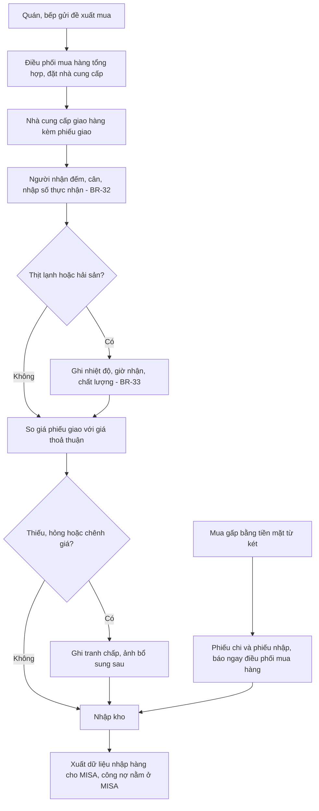

- **Thí điểm:** chỉ bắt buộc phần **nhận hàng** cho các mặt hàng ưu tiên, để có số liệu chênh lệch kho. Quy trình đề xuất → đơn mua đầy đủ là Could (thí điểm) và Should (toàn chuỗi).
- **Không quản lý công nợ** nhà cung cấp (CON-10).

---

## P9. Kiểm kê và chênh lệch kho (To-be)

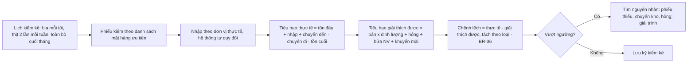

- Danh sách **~15 mặt hàng ưu tiên** (S3-A1): phần bò, phần heo, gà, hải sản đắt tiền, nước lẩu cốt, 2 sốt chính, hộp ướp và sốt từ sơ chế, bia theo nhãn (2 loại bán chạy), nước ngọt chai, két vỏ.
- **Trước khi báo cáo chênh lệch có ý nghĩa**, cần thống nhất đơn vị và **một lần kiểm kê đầu kỳ đáng tin** (S5-C2).

---

## P10. Sự cố mất mạng và khôi phục (To-be)

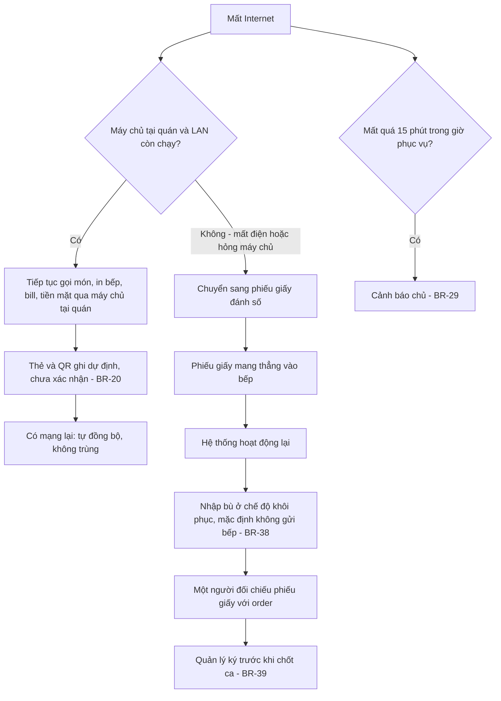

- **Bài học từ sự cố tháng 8 ở Cầu Giấy** (S8-T1): khi nhập bù phiếu giấy, máy in bếp tự in lại phiếu, dẫn tới 2 món bị nấu lần hai. Chế độ khôi phục **mặc định không gửi bếp** để chặn lỗi này.
- **Với máy chủ tại quán và 4G dự phòng**, mất đường Internet (loại sự cố hay gặp nhất ở Cầu Giấy) **không còn phải chuyển sang giấy**. Giấy chỉ dùng khi mất điện quá thời gian lưu điện của UPS, hoặc máy chủ tại quán hỏng.

---

## P11. Khớp số hằng ngày của kế toán (To-be)

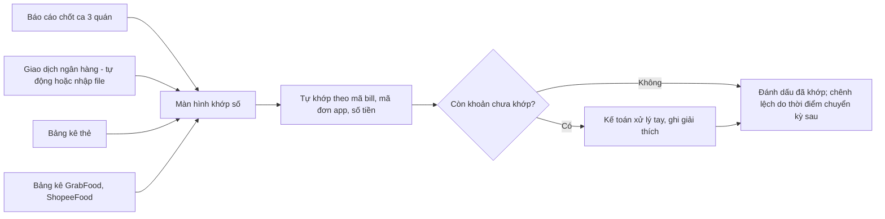

- **"Khớp"** nghĩa là giải thích được mỗi giao dịch bán và mỗi khoản tiền **đúng một lần**, kể cả chênh lệch do thời điểm (S4-F4). Không ép tổng ngân hàng bằng tổng doanh thu trong ngày.
- **Tài khoản thu chung cho 3 quán**, nên nội dung QR phải có **mã quán và mã bill** (FR-BIL-09).

---

## P12. Khách gọi thêm món qua QR, nhân viên xác nhận (To-be, CR-01)

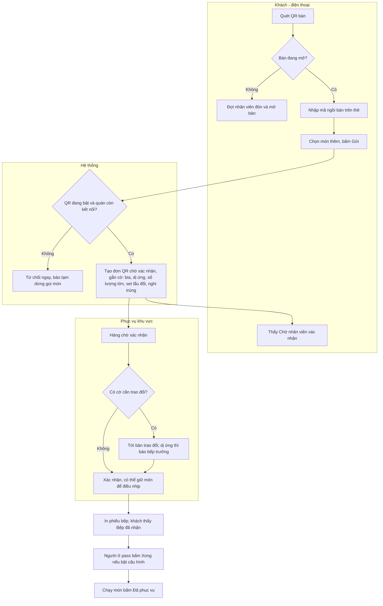

- **QR-1:** nhân viên luôn nhận **order đầu**; QR chỉ dùng cho **món thêm**; **mọi đơn QR** chờ xác nhận (BR-42); món ăn dừng lúc 21:45 (BR-46).
- **Khách chỉ rút lại món khi món còn chờ xác nhận** (BR-45). Sau đó áp dụng quy trình P2.
- **Mất kết nối** giữa quán và cloud: QR tự tạm dừng; đơn gửi trong lúc đó **không bao giờ được giao sau** (BR-55).

---

## P13. Khách tự thanh toán chuyển khoản (To-be, CR-01)

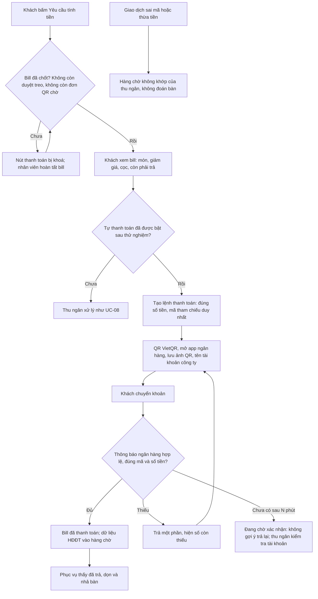

- **QR-1 chỉ trả cả bill.** Tách bill, tiền mặt, thẻ đều qua thu ngân (BR-48).
- **Chỉ bật khi đã thử tuyến ngân hàng thật** (BR-59, TR-11).
- **Chống lừa đảo:** thanh toán chỉ trên tên miền của quán, hiện tên công ty; thẻ QR được kiểm tra mỗi lần mở bàn (BR-53).

---

## Phân tích chênh lệch As-is → To-be (Gap analysis)

| # | As-is | To-be | Thay đổi | Yêu cầu | Mục tiêu |
|---|---|---|---|---|---|
| 1 | Order giấy, thu ngân nhập lại | Gọi món trên máy cầm tay, đi thẳng tới bếp và bill | Hệ thống + thiết bị + đào tạo | FR-ORD-01, FR-KIT-01 | G3, G5 |
| 2 | Món thêm qua Zalo, hô miệng, phiếu rời | Món thêm trong ngữ cảnh bàn, trạng thái chung | Hệ thống | FR-ORD-02, FR-KIT-03 | G3 |
| 3 | "Later" không rõ nghĩa | Giữ món, gọi ra món | Hệ thống + quy ước | FR-ORD-04 | G3 |
| 4 | Huỷ món không báo bếp | Huỷ có duyệt, bếp xác nhận | Hệ thống + quy tắc | FR-ORD-06, FR-KIT-05 | G3 |
| 5 | Giảm giá không có chính sách viết | Hạn mức, lý do, duyệt từ xa, dự phòng | Chính sách + hệ thống | FR-BIL-04, FR-BIL-05 | G1, G2 |
| 6 | QR tĩnh, khớp tay | QR động theo bill và xác nhận ngân hàng | Tích hợp (tuỳ ngân hàng) | FR-BIL-09, FR-INT-01 | G2 |
| 7 | Chốt két chụp ảnh gửi Zalo | Chốt ca trên hệ thống, báo cáo tự gửi | Hệ thống | FR-SHF-04, FR-SHF-06 | G1, G2 |
| 8 | Cọc ghi sổ, lẫn tài khoản cá nhân | Sổ cọc gắn booking, cấn trừ, quy tắc huỷ | Chính sách + hệ thống | FR-RSV-03, FR-RSV-04, FR-RSV-05 | G2 |
| 9 | Sơ chế ghi sổ tay, Zalo | Lệnh sản xuất, phiếu chuyển có xác nhận | Hệ thống + đơn vị chuẩn | FR-PRP-02, FR-PRP-03 | G4 |
| 10 | Không có định lượng chuẩn | Định lượng cho mặt hàng ưu tiên | Dữ liệu + hệ thống | FR-INV-03, FR-INV-04 | G4 |
| 11 | Hết món báo miệng, quên tắt trên app | Chặn trên sảnh ngay, nhắc từng app | Hệ thống | FR-ORD-07, FR-KIT-06 | G3 |
| 12 | Mất mạng thì dùng giấy, nhập bù bị trùng | Máy chủ tại quán, chế độ khôi phục không gửi bếp | Hạ tầng + hệ thống | FR-OFF-01, FR-OFF-04 | G3, G5 |
| 13 | Chủ có số liệu hôm sau | Dashboard cùng đêm, cảnh báo | Hệ thống | FR-RPT-01, FR-RPT-04 | G1 |
| 14 | Menu và giá sửa riêng từng POS, từng app | Menu tập trung, giá theo kênh, bảng giá lễ | Hệ thống + quy trình duyệt | FR-MNU-07, FR-MNU-08, FR-MNU-09 | G1 |
| 15 | Khách phải chờ phục vụ rảnh mới gọi thêm được (CR-01) | Khách gọi thêm qua QR, nhân viên xác nhận | Hệ thống + thẻ QR + mã ngồi bàn + đào tạo | FR-GST-02–10 | G6 |
| 16 | Khách chờ 5–10 phút để tính tiền lúc đông (CR-01) | Khách tự trả cả bill đã chốt, ngân hàng tự xác nhận | Tích hợp tuyến ngân hàng (tuỳ kết quả thử) | FR-GST-13–17 | G7 |
