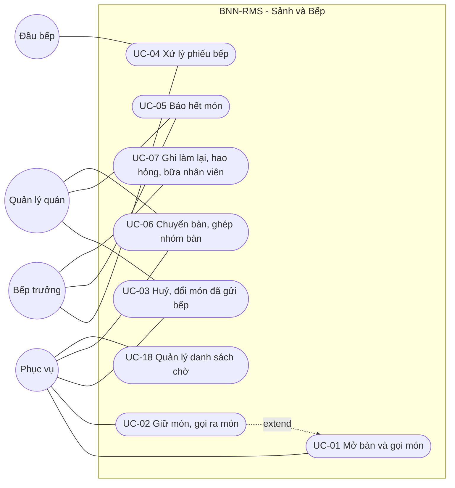
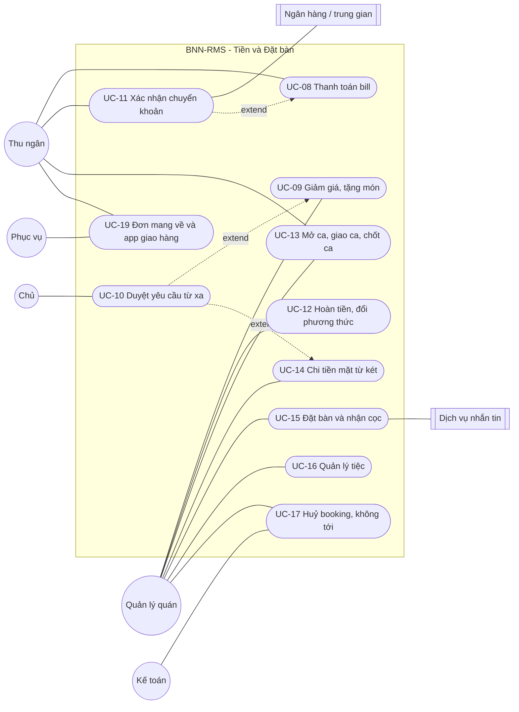
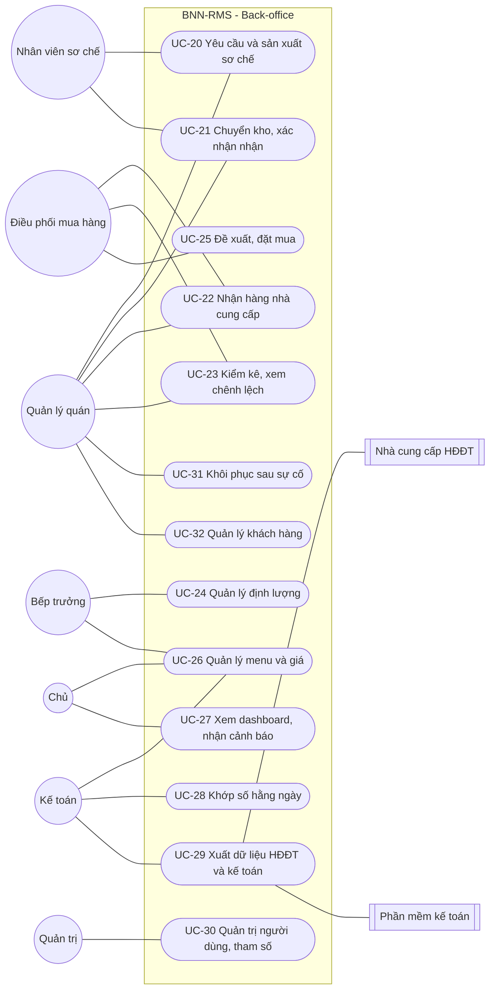
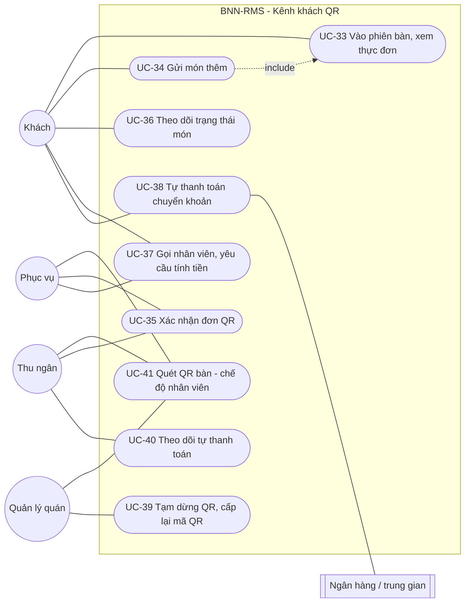

# SRS — Phần 3: Mô hình Use Case

> Phương pháp: skill `use-case-modeler`, `use-case-description-writer`, `use-case-specification`, `edge-case-elicitor`.
> Sơ đồ use case vẽ bằng Mermaid **flowchart**: Mermaid chưa có kiểu sơ đồ use case chuẩn UML. Quy ước:
> - hình tròn là **tác nhân**;
> - hình bo tròn là **use case**;
> - khung là **ranh giới hệ thống**;
> - nét đứt là quan hệ `include` hoặc `extend`.

## 1. Tác nhân

| Mã | Tác nhân | Loại | Mô tả | Người thật trong dự án |
|---|---|---|---|---|
| A01 | Chủ | Người | Duyệt giá, duyệt vượt hạn mức, xem mọi số liệu | Mai Anh |
| A02 | Kế toán | Người | Khớp số, HĐĐT, xuất MISA, duyệt điều chỉnh tài chính | Lê Mỹ Hạnh |
| A03 | Quản lý quán | Người | Vận hành quán, duyệt huỷ món và giảm giá trong hạn mức, đặt bàn, chốt ca | Lan, Thanh, Quyên |
| A04 | Thu ngân | Người | Bill, thanh toán, két | Huy |
| A05 | Phục vụ | Người | Đón khách, gọi món, chạy món, trực app giao hàng | ~7 người/quán + part-time |
| A06 | Bếp trưởng | Người | Điều phối ra món, báo hết món, định lượng, xác nhận dị ứng | Đức |
| A07 | Đầu bếp | Người | Nấu tại khu chế biến, cập nhật trạng thái món | 3–4 người/quán |
| A08 | Nhân viên sơ chế | Người | Sản xuất bán thành phẩm, chuyển kho | Thảo và 1 người |
| A09 | Điều phối mua hàng | Người | Đặt nhà cung cấp, theo dõi nhận hàng | Minh |
| A10 | Quản trị hệ thống | Người | Cấu hình, thiết bị, người dùng | Nhà cung cấp phần mềm hoặc chủ |
| A11 | Khách (CR-01) | Người | Quét QR bàn, gọi món thêm, xem trạng thái món và bill, gọi nhân viên, tự thanh toán. **Không có tài khoản** | Thực khách tại 6 bàn thí điểm (QR-1) |
| E01 | Ngân hàng / dịch vụ trung gian | Hệ thống | Thông báo giao dịch vào tài khoản thu | Vietcombank |
| E02 | Nhà cung cấp HĐĐT | Hệ thống | Phát hành HĐĐT | MISA meInvoice |
| E03 | Phần mềm kế toán | Hệ thống | Nhận file xuất | MISA |
| E04 | App giao hàng | Hệ thống | Nguồn đơn giao hàng (hiện nhập tay) | GrabFood, ShopeeFood |
| E05 | Dịch vụ nhắn tin | Hệ thống | Gửi xác nhận booking | Zalo / SMS |
| E06 | Đồng hồ hệ thống | Hệ thống | Kích hoạt hết hạn duyệt, nhắc giữ món, cảnh báo | — |

## 2. Sơ đồ use case

### 2.1 Gói Sảnh và Bếp

### 2.2 Gói Thu ngân, Tiền, Đặt bàn, Kênh bán

### 2.3 Gói Kho, Sơ chế, Mua hàng, Báo cáo, Quản trị

### 2.4 Gói Kênh khách QR (CR-01)

## 3. Danh sách use case

| ID | Use case | Tác nhân chính | Mục tiêu | TĐ | TC | FR chính |
|---|---|---|---|---|---|---|
| UC-01 | Mở bàn và gọi món | Phục vụ | Order tới bếp và bill chính xác ngay lần đầu | M | M | FR-TBL-01–03, 06, FR-ORD-01–03, 05, 08, 10, FR-OFF-06 |
| UC-02 | Giữ món, gọi ra món | Phục vụ | Món ra đúng lúc | S | M | FR-ORD-04 |
| UC-03 | Huỷ, đổi món đã gửi bếp | Phục vụ, quản lý | Thay đổi tới bếp và được bếp xác nhận | M | M | FR-ORD-06, FR-KIT-05 |
| UC-04 | Xử lý phiếu bếp | Đầu bếp, bếp trưởng | Nấu đúng, đúng thứ tự | M | M | FR-KIT-01–04, 08–10 |
| UC-05 | Báo hết món | Bếp trưởng, quản lý | Không nhận order món đã hết, trên mọi kênh | M | M | FR-ORD-07, FR-KIT-06, FR-DLV-06 |
| UC-06 | Chuyển bàn, ghép nhóm bàn | Phục vụ, quản lý | Khách đổi chỗ mà bill không bị tách lẻ | M | M | FR-TBL-04, 05 |
| UC-07 | Ghi làm lại, hao hỏng, bữa nhân viên | Bếp trưởng | Tiêu hao có giải thích | S | M | FR-KIT-07, FR-ORD-09, 11, FR-INV-07 |
| UC-08 | Thanh toán bill | Thu ngân | Thu đúng tiền, đủ dữ liệu HĐ | M | M | FR-BIL-01–03, 07, 08, 11, 12, 17, FR-RSV-04, FR-MNU-10 |
| UC-09 | Giảm giá, tặng món | Quản lý | Xử lý khách nhanh trong hạn mức | M | M | FR-BIL-04, 06 |
| UC-10 | Duyệt yêu cầu từ xa | Chủ | Duyệt vượt hạn mức; có dự phòng khi không trả lời | M | M | FR-BIL-05, FR-AUD-03 |
| UC-11 | Xác nhận chuyển khoản | Thu ngân / ngân hàng | Chỉ coi là đã trả khi tiền về thật | M | M | FR-BIL-09, 10, FR-INT-01 |
| UC-12 | Hoàn tiền, đổi phương thức | Quản lý, thu ngân | Điều chỉnh có kiểm soát | M | M | FR-BIL-13, 14 |
| UC-13 | Mở ca, giao ca, chốt ca | Thu ngân, quản lý | Két khớp, chênh lệch có giải thích | M | M | FR-SHF-01, 03–06 |
| UC-14 | Chi tiền mặt từ két | Quản lý | Chi gấp có chứng từ | M | M | FR-SHF-02, FR-PUR-05 |
| UC-15 | Đặt bàn và nhận cọc | Quản lý | Giữ bàn, cọc đúng tài khoản | S | M | FR-RSV-01–03, 06, 09, FR-INT-06 |
| UC-16 | Quản lý tiệc | Quản lý | Tiệc nhiều bàn, set, nhiều bên trả tiền | S | M | FR-RSV-07, 08, FR-BIL-16 |
| UC-17 | Huỷ booking, không tới | Quản lý, kế toán | Xử lý cọc đúng điều khoản | S | M | FR-RSV-05 |
| UC-18 | Quản lý danh sách chờ | Phục vụ | Khách chờ được gọi đúng lượt | C | S | FR-RSV-10 |
| UC-19 | Đơn mang về và app giao hàng | Phục vụ quầy, thu ngân | Đơn app có trong số liệu, không trùng | M | M | FR-DLV-01–03, 05, FR-MNU-11 |
| UC-20 | Yêu cầu và sản xuất sơ chế | Quản lý, sơ chế | Sản xuất đúng nhu cầu, đo tỷ lệ thành phẩm | S | M | FR-PRP-01, 02 |
| UC-21 | Chuyển kho, xác nhận nhận | Sơ chế, quản lý | Truy vết được mọi luân chuyển | S | M | FR-PRP-03–06 |
| UC-22 | Nhận hàng nhà cung cấp | Người nhận, mua hàng | Nhập đúng số kiểm, đúng giá | S | M | FR-PUR-04, 06, FR-INV-09, 10 |
| UC-23 | Kiểm kê, xem chênh lệch | Quản lý, mua hàng | Chênh lệch giải thích được theo nguyên nhân | S | M | FR-INV-01, 02, 04–06, 08 |
| UC-24 | Quản lý định lượng | Bếp trưởng | Định lượng cho mặt hàng ưu tiên, bảo mật công thức | S | M | FR-INV-03 |
| UC-25 | Đề xuất, đặt mua | Quản lý, mua hàng | Đặt hàng có căn cứ | C | S | FR-PUR-01–03, 07, 08 |
| UC-26 | Quản lý menu và giá | Chủ, kế toán, bếp trưởng | Một menu có kiểm soát cho mọi quán và kênh | S | M | FR-MNU-01–09 |
| UC-27 | Xem dashboard, nhận cảnh báo | Chủ, quản lý | Nắm tình hình cùng đêm | M | M | FR-RPT-01, 02, 04, 06–09, FR-GST-21 |
| UC-28 | Khớp số hằng ngày | Kế toán | Giải thích mọi khoản đúng một lần | S | M | FR-RPT-03, 05, FR-DLV-04, FR-AUD-04 |
| UC-29 | Xuất dữ liệu HĐĐT và kế toán | Kế toán | Không nhập tay lại | M | M | FR-BIL-15, FR-INT-02–05, FR-PRP-07 |
| UC-30 | Quản trị người dùng, tham số | Quản trị, chủ | Cấu hình đúng, có lịch sử | M | M | FR-ADM-01–08, FR-AUD-01 |
| UC-31 | Khôi phục sau sự cố | Thu ngân, quản lý | Không nấu trùng, không mất bill | M | M | FR-OFF-01–05 |
| UC-32 | Quản lý khách hàng | Quản lý | Danh sách khách chung, có đồng ý | C | S | FR-CUS-01–05 |
| UC-33 | Vào phiên bàn, xem thực đơn (CR-01) | Khách | Vào đúng bàn một cách an toàn | S | S | FR-GST-02–04, 26 |
| UC-34 | Gửi món thêm (CR-01) | Khách | Gọi thêm không phải chờ phục vụ tới | S | S | FR-GST-05, 09, 20, 22, 23 |
| UC-35 | Xác nhận đơn QR (CR-01) | Phục vụ (thu ngân dự phòng) | Chỉ đơn hợp lệ tới bếp, đúng nhịp | S | S | FR-GST-06–08, 25 |
| UC-36 | Theo dõi trạng thái món (CR-01) | Khách | Biết món tới đâu, không bị thông tin sai | S | S | FR-GST-10 |
| UC-37 | Gọi nhân viên, yêu cầu tính tiền (CR-01) | Khách, phục vụ | Được hỗ trợ nhanh | S | S | FR-GST-11 |
| UC-38 | Tự thanh toán chuyển khoản (CR-01) | Khách, ngân hàng (E01) | Trả đúng bill, không phải ra quầy | S | S | FR-GST-13–15, 17, 18, 24 |
| UC-39 | Tạm dừng QR, cấp lại mã QR bàn (CR-01) | Quản lý | Chủ động dừng khi có sự cố hoặc nghi gian lận | S | S | FR-GST-01, 12 |
| UC-40 | Theo dõi tự thanh toán, xử lý ngoại lệ (CR-01) | Thu ngân, kế toán | Không mất tiền, không bắt khách trả hai lần | S | S | FR-GST-16, 19 |
| UC-41 | Quét QR bàn ở chế độ nhân viên (CR-02) | Phục vụ, thu ngân, quản lý | Mở đúng bàn, đúng nhóm, nhanh, cả khi mất Internet | M | M | FR-TBL-07–09, FR-BIL-18 |

---

## 4. Đặc tả chi tiết các use case chính

### UC-01 Mở bàn và gọi món

| Mục | Nội dung |
|---|---|
| Mục tiêu | Order của bàn tới đúng khu bếp và vào bill **ngay lần đầu**, không qua bước nhập lại |
| Tác nhân chính | Phục vụ |
| Tác nhân phụ | Máy chủ tại quán, máy in bếp, màn hình bếp |
| Kích hoạt | Khách ngồi vào bàn, hoặc khách gọi thêm món |
| Tiền điều kiện | Phục vụ đã đăng nhập bằng PIN trên máy của quán; ca đã mở; menu có hiệu lực |
| Hậu điều kiện thành công | Các dòng order ở trạng thái **Đã gửi**; phiếu in hoặc hiện ở đúng khu; bill cập nhật; nhật ký ghi người gửi và thời điểm |

**Luồng chính**
1. Phục vụ chọn bàn trống trên sơ đồ, nhập số khách. Nếu bàn có booking thì hệ thống gợi ý gắn booking.
2. Hệ thống mở **lượt phục vụ** cho bàn, trạng thái bàn chuyển sang *Đang phục vụ*.
3. Phục vụ chọn món, size, số lượng, tuỳ chọn, ghi chú. Hệ thống **ẩn hoặc khoá món đã hết**.
4. Phục vụ bấm **Gửi**.
5. Hệ thống gán **mã duy nhất** cho từng dòng order, định tuyến theo khu chế biến, **in phiếu** tại khu và đẩy lên màn hình bếp trong ≤ 3 giây.
6. Hệ thống cập nhật bill tạm tính của bàn.
7. Phục vụ theo dõi trạng thái món của bàn (đang làm, xong chờ mang ra).

**Luồng thay thế**
- **A1 – Gọi thêm món:** ở bước 3 bàn đã có order. Hệ thống gắn dòng mới vào cùng order; phiếu ghi **MÓN THÊM** kèm số bàn.
- **A2 – Giữ món:** ở bước 3 phục vụ đánh dấu *Giữ* cho món hoặc lượt món (UC-02). Bếp thấy món nhưng **chưa làm**.
- **A3 – Dị ứng:** ở bước 3 phục vụ chọn chất gây dị ứng và ghi nguyên văn lời khách. Hệ thống **nhắc phục vụ trao đổi trực tiếp với bếp trưởng**. Phiếu hiện dị ứng **nổi bật ở đầu phiếu**. Bếp trưởng bấm **đã xem** (BR-37).
- **A4 – Sửa trước khi gửi:** trước bước 4, phục vụ sửa hoặc xoá tự do (BR-06).
- **A5 – Set có đổi thành phần:** phiếu in danh sách thành phần và dòng đổi.

**Luồng ngoại lệ**
- **E1 – Máy cầm tay mất liên lạc với máy chủ tại quán** (sửa theo CR-02, S12-V10):
  - Món được giữ là **bản nháp CHƯA GỬI** màu nổi và **không tự gửi** khi có kết nối lại. Máy cũng **không mở được bàn mới**.
  - Phục vụ chuyển sang **phiếu giấy đánh số**.
  - Khi có kết nối lại, phục vụ xem bản nháp: chọn **Gửi** nếu món chưa được làm bằng phiếu giấy, hoặc **Huỷ bản nháp**. Mã dòng order vẫn chống trùng (FR-OFF-06, BR-68).
- **A6 – Mở bàn bằng quét QR** (CR-02): ở bước 1, phục vụ quét thẻ QR của bàn bằng app nhân viên thay cho việc tìm bàn trên sơ đồ. Chi tiết ở UC-41.
- **E2 – Máy in khu bị lỗi:** hệ thống chuyển sang **máy in dự phòng** (theo cấu hình) và cảnh báo quản lý. Màn hình bếp vẫn nhận phiếu.
- **E3 – Món vừa hết** giữa bước 3 và bước 4: hệ thống từ chối dòng đó, báo phục vụ chọn món khác.
- **E4 – Mất Internet:** không ảnh hưởng, vì luồng chạy trong LAN qua máy chủ tại quán (FR-OFF-01).

**Quy tắc:** BR-06, BR-18, BR-37. **Ghi chú:** mục tiêu thử nghiệm ≤ 4 chạm cho luồng A1 (NFR-01).

### UC-03 Huỷ, đổi món đã gửi bếp

| Mục | Nội dung |
|---|---|
| Mục tiêu | Mọi thay đổi với món đã tới bếp **được bếp biết và xác nhận**; bill đúng; có lý do và người duyệt |
| Tác nhân chính | Phục vụ (yêu cầu), quản lý (duyệt) |
| Tác nhân phụ | Bếp trưởng hoặc đầu bếp (xác nhận) |
| Kích hoạt | Khách đổi ý, sai món, gọi trùng, món lỗi |
| Tiền điều kiện | Dòng order đã ở trạng thái Đã gửi hoặc sau đó |
| Hậu điều kiện | Dòng order *Đã huỷ* hoặc *Đã thay thế*; phiếu huỷ đã in; bếp đã xác nhận; nhật ký đầy đủ |

**Luồng chính**
1. Phục vụ chọn dòng món, chọn **Huỷ** hoặc **Đổi**, chọn lý do (BR-05).
2. Hệ thống hiện trạng thái hiện tại của món (chờ, đang làm, xong) và gửi **yêu cầu duyệt** tới quản lý quán.
3. Quản lý duyệt trên máy của mình (PIN).
4. Hệ thống gửi **thông báo thay đổi** tới khu bếp: hiện nổi bật trên màn hình và **in phiếu HUỶ hoặc THAY THẾ**.
5. Đầu bếp hoặc bếp trưởng bấm **Đã thấy thay đổi**.
6. Hệ thống cập nhật bill và hiện cho quản lý **"Bếp đã xác nhận lúc hh:mm"**.

**Luồng thay thế**
- **A1 – Món đã bắt đầu làm hoặc đã xong:** ở bước 5 bếp chọn thêm *Đã làm, bỏ đi* hoặc *Dùng lại được*. Nếu bỏ đi thì ghi **hao hỏng** (FR-KIT-07).
- **A2 – Món tính nhầm (tính trùng):** lý do "tính trùng"; không tính vào hạn mức giảm giá (BR-04).
- **A3 – Khách phàn nàn sau khi ăn:** chuyển sang UC-09 (quản lý xử lý trong hạn mức, BR-08).

**Luồng ngoại lệ**
- **E1 – Bếp chưa xác nhận sau N phút:** hệ thống nhắc lại tại bếp và báo quản lý (không tự coi là đã xác nhận).
- **E2 – Quản lý từ chối:** món giữ nguyên; phục vụ được báo.

**Quy tắc:** BR-05, BR-07, BR-04, BR-08.

### UC-04 Xử lý phiếu bếp

| Mục | Nội dung |
|---|---|
| Mục tiêu | Bếp làm đúng món, đúng thứ tự; sảnh biết món đã xong |
| Tác nhân chính | Đầu bếp, bếp trưởng (điều phối ra món) |
| Kích hoạt | Có phiếu mới, phiếu thêm, phiếu thay đổi, hoặc lệnh gọi ra món |
| Tiền điều kiện | Khu chế biến có máy in và/hoặc màn hình đang chạy |
| Hậu điều kiện | Món ở trạng thái *Xong*, rồi *Đã mang ra* |

**Luồng chính**
1. Phiếu in tại khu và hiện trên màn hình theo thứ tự thời gian, **gom theo bàn**.
2. Đầu bếp bấm **Bắt đầu** (trạng thái *Đang làm*).
3. Đầu bếp bấm **Xong** và đặt món ở pass.
4. Bếp trưởng xem **màn hình điều phối**: món nào của bàn nào đã đủ để ra cùng lúc.
5. Người chạy món mang ra và bấm **Đã mang ra** trên máy cầm tay.

**Luồng thay thế**
- **A1 – Món đang giữ:** món hiện mờ kèm nhãn **GIỮ**. Khi có lệnh gọi ra món thì phiếu **GỌI RA** được in.
- **A2 – Bếp trưởng đổi thứ tự ưu tiên** (bàn có trẻ em, món đang giữ chân cả bàn): kéo phiếu lên đầu.
- **A3 – Thời gian thử nghiệm chỉ dùng phiếu in:** bước 2–3 có thể bỏ qua; người chạy món vẫn xác nhận ở bước 5.

**Luồng ngoại lệ**
- **E1 – Món chờ quá ngưỡng:** hệ thống đổi màu phiếu và báo quản lý (FR-KIT-08).
- **E2 – Thiếu nguyên liệu giữa chừng:** chuyển sang UC-05 (báo hết món).

### UC-08 Thanh toán bill

| Mục | Nội dung |
|---|---|
| Mục tiêu | Thu đúng số tiền bằng các phương thức khách chọn; bill đóng với đủ dữ liệu HĐ |
| Tác nhân chính | Thu ngân |
| Tác nhân phụ | Quản lý (duyệt khi cần), ngân hàng (E01) |
| Kích hoạt | Khách yêu cầu thanh toán |
| Tiền điều kiện | Bill có ít nhất một dòng; không còn dòng ở trạng thái *Chưa gửi* |
| Hậu điều kiện | Bill *Đã đóng*; các khoản thanh toán được ghi; dòng làm tròn (nếu có); bản ghi dữ liệu HĐĐT vào hàng chờ; bàn chuyển sang *Đang dọn* |

**Luồng chính**
1. Thu ngân mở bill của bàn hoặc nhóm bàn; hệ thống hiện món, giảm giá, thuế, **cọc cấn trừ** (nếu có booking).
2. Thu ngân hỏi thông tin HĐ: khách lẻ (mặc định) hoặc công ty (tên, MST, địa chỉ, email).
3. Thu ngân chọn phương thức và số tiền cho từng phần (có thể nhiều phương thức).
4. Tiền mặt: nhập tiền khách đưa; hệ thống **làm tròn xuống 1.000đ** trên số tiền cuối, ghi dòng làm tròn, tính tiền thối.
5. Thẻ: thu ngân quẹt trên máy thẻ rời, nhập **mã chuẩn chi**.
6. Chuyển khoản: xem UC-11.
7. Khi tổng tiền đã nhận bằng số phải trả, hệ thống **đóng bill**, in bill, đưa dữ liệu vào hàng chờ HĐĐT.

**Luồng thay thế**
- **A1 – Tách bill** (chia đều, theo món, theo số tiền): mỗi phần là một **bill con**; tổng các phần bằng tổng bill **chính xác từng đồng** (BR-21).
- **A2 – Gộp bill** nhiều bàn trước khi thanh toán.
- **A3 – Tiệc nhiều bên trả tiền:** mỗi bên một bill con với thông tin HĐ riêng (BR-26).
- **A4 – Có giảm giá:** chuyển sang UC-09 trước bước 3.

**Luồng ngoại lệ**
- **E1 – Offline:** thẻ và QR ghi *Dự định, chưa xác nhận*. Bill ở trạng thái *Chờ xác nhận thanh toán*, hiện ở chốt ca (BR-20).
- **E2 – Khách về chưa trả:** chuyển bill sang *Khách nợ*, ghi sự việc (FR-BIL-17).
- **E3 – Khách trả trùng** (chuyển khoản rồi lại quẹt thẻ): ghi khoản thừa, tạo **yêu cầu hoàn** cho kế toán (UC-12).

### UC-09 Giảm giá, tặng món (kèm UC-10 Duyệt từ xa)

| Mục | Nội dung |
|---|---|
| Mục tiêu | Quản lý xử lý khách nhanh trong hạn mức; vượt hạn mức thì chủ duyệt; có dự phòng khi chủ không trả lời |
| Tác nhân chính | Quản lý |
| Tác nhân phụ | Chủ (UC-10), thu ngân hoặc bếp trưởng (người xác nhận thứ hai) |
| Kích hoạt | Khách phàn nàn, chờ lâu, khuyến mãi |
| Tiền điều kiện | Bill đang mở |
| Hậu điều kiện | Giảm giá được áp hoặc từ chối; có lý do, người làm, người duyệt; tổng đã dùng trong ca được cập nhật |

**Luồng chính**
1. Quản lý chọn giảm giá (% hoặc số tiền, theo món hoặc cả bill) và lý do.
2. Hệ thống tính: mức trên bill ≤ min(10% bill, 150.000đ)? tổng trong ca của quản lý này ≤ 600.000đ?
3. Nếu **trong hạn mức**: hệ thống áp dụng và ghi nhật ký.

**Luồng thay thế**
- **A1 – Vượt hạn mức:** hệ thống tạo **yêu cầu duyệt** gửi điện thoại chủ (UC-10), đếm ngược 3 phút.
  - **A1a:** chủ **duyệt** thì áp dụng.
  - **A1b:** chủ **từ chối** thì không áp dụng.
  - **A1c:** **hết 3 phút** không phản hồi và quản lý chọn *Lỗi phục vụ thật* với mức ≤ 300.000đ. Hệ thống yêu cầu **người xác nhận thứ hai** (thu ngân hoặc bếp trưởng) nhập PIN, áp dụng, **cảnh báo chủ ngay**, đưa vào danh sách kế toán rà soát (BR-03).
- **A2 – Xoá món tính nhầm:** không tính hạn mức (BR-04).

**Luồng ngoại lệ**
- **E1 – Mất Internet:** không gửi được yêu cầu duyệt. Nếu vượt hạn mức thì chỉ được dùng nhánh A1c sau 3 phút (thời gian tính từ lúc tạo yêu cầu); cảnh báo gửi ngay khi có mạng lại.
- **E2 – Lý do "Khác"** mà không ghi chú: hệ thống không cho lưu.

### UC-11 Xác nhận chuyển khoản

| Mục | Nội dung |
|---|---|
| Mục tiêu | Chỉ ghi nhận đã trả khi **tiền thật đã về**; khớp được với bill |
| Tác nhân chính | Thu ngân; ngân hàng hoặc dịch vụ trung gian (E01) |
| Tác nhân phụ | Quản lý |
| Kích hoạt | Khách chọn trả bằng chuyển khoản |
| Tiền điều kiện | Bill hoặc bill con có số tiền phải trả |
| Hậu điều kiện | Khoản thanh toán *Đã xác nhận*, có mã tham chiếu ngân hàng |

**Luồng chính** (khi có kết nối thông báo ngân hàng)
1. Thu ngân chọn *Chuyển khoản*. Hệ thống hiện **QR động**: số tiền chính xác, nội dung `BNN <mã quán> <mã bill>`.
2. Khách quét và chuyển.
3. Hệ thống nhận thông báo giao dịch, khớp theo mã bill và số tiền, đánh dấu **Đã xác nhận**.

**Luồng thay thế**
- **A1 – Không có kết nối ngân hàng, hoặc thông báo chưa về:** thu ngân kiểm tra tiền về trên app ngân hàng tại quầy, nhập **số tiền và mã tham chiếu**, đánh dấu đã xác nhận (BR-19).
- **A2 – Khớp không chắc** (thiếu mã bill, hai khoản cùng số tiền): thu ngân đánh dấu *Cần duyệt*; quản lý duyệt.
- **A3 – Khách chuyển sai số tiền:** ghi phần thiếu hoặc thừa, xử lý phần còn lại bằng phương thức khác, hoặc tạo yêu cầu hoàn.

**Luồng ngoại lệ**
- **E1 – Khách chỉ đưa ảnh chụp màn hình:** hệ thống **không có** lựa chọn xác nhận bằng ảnh. Thanh toán giữ ở *Chưa xác nhận*.
- **E2 – Offline:** ghi *Dự định, chưa xác nhận* (BR-20).
- **E3 – Giao dịch ngân hàng không khớp bill nào:** đưa vào hàng chờ của kế toán (UC-28).

### UC-13 Mở ca, giao ca, chốt ca

| Mục | Nội dung |
|---|---|
| Mục tiêu | Tiền trong két khớp số dự kiến; chênh lệch có lý do; kế toán nhận báo cáo tự động |
| Tác nhân chính | Thu ngân |
| Tác nhân phụ | Quản lý |
| Kích hoạt | Đầu ca, giao ca trưa và tối, cuối ngày |
| Tiền điều kiện | Có két được gán cho quầy |
| Hậu điều kiện | Ca *Đã chốt*, quản lý đã ký; báo cáo gửi kế toán |

**Luồng chính**
1. **Mở ca:** thu ngân nhập quỹ đầu ca (mặc định 1.000.000đ); quản lý xác nhận.
2. Trong ca: thu tiền (UC-08) và chi (UC-14).
3. **Giao ca:** hai thu ngân (hoặc thu ngân và quản lý) cùng đếm, **cả hai nhập PIN**.
4. **Chốt ca:** hệ thống tính **tiền mặt dự kiến** = quỹ + thu tiền mặt − thối − phiếu chi − hoàn tiền mặt − khoản làm tròn.
5. Thu ngân nhập số đếm thực tế (tuỳ chọn theo mệnh giá).
6. Hệ thống hiện chênh lệch và danh sách khoản **dự định, chưa xác nhận**.
7. Quản lý kiểm tra và ký bằng PIN; báo cáo tự gửi kế toán.

**Luồng thay thế**
- **A1 – Có chênh lệch:** bắt buộc đếm lại và ghi lý do. Lệch > 200.000đ thì cảnh báo chủ ngay (BR-29).
- **A2 – Có sự cố trong ngày:** bắt buộc hoàn tất **danh sách đối chiếu khôi phục** (UC-31) trước bước 7.

**Luồng ngoại lệ**
- **E1 – Sửa số đếm sau khi đã chốt:** cần lý do và người duyệt; giữ bản ghi gốc (BR-27).
- **E2 – Còn bill mở hoặc chưa xác nhận thanh toán:** hệ thống cảnh báo, không cho chốt nếu chưa xử lý hoặc chưa chuyển trạng thái rõ ràng.

### UC-15 Đặt bàn và nhận cọc

| Mục | Nội dung |
|---|---|
| Mục tiêu | Giữ bàn đúng; cọc vào đúng tài khoản; có bằng chứng điều khoản |
| Tác nhân chính | Quản lý |
| Tác nhân phụ | Khách (ngoài hệ thống), dịch vụ nhắn tin (E05), ngân hàng (E01) |
| Kích hoạt | Khách gọi điện, nhắn Zalo hoặc Facebook, hoặc hẹn trực tiếp |
| Hậu điều kiện | Booking *Đã xác nhận*; cọc (nếu có) *Đã nhận* và gắn booking |

**Luồng chính**
1. Quản lý tạo booking: tên, số điện thoại, ngày giờ, số khách, bàn hoặc nhóm bàn dự kiến, ghi chú. Hệ thống sinh **mã booking**.
2. Nếu nhóm từ 8 người, phòng riêng hoặc tiệc: quản lý nhập mức cọc (và mức chi tối thiểu, set đặt trước nếu có).
3. Hệ thống tạo **tin xác nhận** gồm điều khoản cọc và huỷ (BR-11) cùng thông tin chuyển khoản vào **tài khoản công ty**, nội dung có mã booking.
4. Tin được gửi (tự động hoặc nhân viên gửi theo mẫu); hệ thống **lưu nội dung và thời điểm**.
5. Khi tiền cọc về: xác nhận như UC-11; cọc chuyển sang *Đã nhận*, **không ghi là doanh thu**.

**Luồng thay thế**
- **A1 – Cọc vào tài khoản cá nhân của chủ:** ghi ngoại lệ, bắt buộc nhập chứng từ chuyển về tài khoản công ty; nhắc kế toán (BR-12).
- **A2 – Khách tới:** mở bàn từ booking; cọc tự cấn trừ khi thanh toán.
- **A3 – Huỷ hoặc không tới:** UC-17.

### UC-19 Đơn mang về và app giao hàng

| Mục | Nội dung |
|---|---|
| Mục tiêu | Mọi đơn app đều có trong số liệu và tới bếp, **không nhập trùng** |
| Tác nhân chính | Phục vụ trực quầy, thu ngân |
| Kích hoạt | Có đơn mới trên tablet GrabFood hoặc ShopeeFood, hoặc khách mua mang về |
| Hậu điều kiện | Đơn trong hệ thống với **mã đơn app**; doanh thu ghi theo kênh |

**Luồng chính**
1. Nhân viên chọn kênh (GrabFood, ShopeeFood).
2. Nhập **mã đơn app** (bắt buộc). Hệ thống kiểm tra trùng.
3. Chọn món theo **bảng giá app** (dùng ánh xạ món, FR-MNU-11).
4. Gửi bếp; theo dõi trạng thái tới khi *Đã giao shipper*.

**Luồng ngoại lệ**
- **E1 – Mã đơn đã tồn tại:** cảnh báo, không tạo đơn mới (BR-40).
- **E2 – Món trong đơn đã hết:** hệ thống báo để nhân viên liên hệ khách qua app; nhắc cập nhật hết món trên app (UC-05).
- **E3 – Đơn bị huỷ trên app:** chuyển *Đã huỷ* kèm lý do; nếu bếp đã làm thì ghi hao hỏng.

### UC-21 Chuyển kho, xác nhận nhận

| Mục | Nội dung |
|---|---|
| Mục tiêu | Trả lời được câu hỏi *"đã nhận chưa, đã dùng chưa, hay chuyển đi rồi?"* cho mọi luân chuyển |
| Tác nhân chính | Nhân viên sơ chế (gửi), quản lý hoặc đầu bếp quán nhận (nhận) |
| Tác nhân phụ | Kế toán (xem xét tranh chấp) |
| Kích hoạt | Có lệnh chuyển theo yêu cầu (UC-20), cho mượn giữa quán, hoặc trả về |
| Hậu điều kiện | Phiếu *Đã nhận* (tồn kho hai bên cập nhật, giá chuyển được tính) hoặc *Tranh chấp* |

**Luồng chính**
1. Bên gửi tạo phiếu chuyển: mặt hàng, số lượng theo đơn vị đóng gói (hệ thống quy đổi về đơn vị cơ sở), lô, hạn dùng.
2. Bên gửi xác nhận xuất. Tồn kho bên gửi giảm; hàng ở trạng thái *Đang chuyển*.
3. Bên nhận đếm và nhập **số thực nhận** từng dòng.
4. Nếu khớp: bên nhận xác nhận. Tồn kho bên nhận tăng; **giá chuyển** tính theo tỷ lệ thành phẩm của lô (BR-35).

**Luồng thay thế**
- **A1 – Thiếu, rò, hỏng:** bên nhận ghi chênh lệch và lý do. Phiếu chuyển *Tranh chấp*; phần chênh lệch **không tính chi phí** cho bên nhận (BR-34); bằng chứng (ảnh) bổ sung sau.
- **A2 – Trả về:** tạo phiếu chuyển ngược.

**Luồng ngoại lệ**
- **E1 – Bên nhận không xác nhận** trong ngày: nhắc quản lý quán nhận và trưởng sơ chế.

### UC-22 Nhận hàng nhà cung cấp

| Mục | Nội dung |
|---|---|
| Mục tiêu | Nhập kho đúng số kiểm, đúng giá; có bằng chứng khi tranh chấp |
| Tác nhân chính | Người nhận (quản lý, đầu bếp, trưởng sơ chế) |
| Tác nhân phụ | Điều phối mua hàng |
| Kích hoạt | Nhà cung cấp giao hàng |
| Hậu điều kiện | Phiếu nhận *Đã xác nhận*; tồn kho và giá vốn cập nhật; chênh lệch được đánh dấu |

**Luồng chính**
1. Người nhận chọn nhà cung cấp (và đơn mua nếu có).
2. Nhập **số lượng thực nhận** từng mặt hàng (bắt buộc) và **giá trên phiếu giao**.
3. Với thịt lạnh và hải sản: nhập **nhiệt độ đo được** và giờ nhận (BR-33).
4. Hệ thống so giá với giá thoả thuận và **đánh dấu chênh lệch**.
5. Người nhận xác nhận; tồn kho và giá vốn cập nhật; điều phối mua hàng thấy ngay.

**Luồng thay thế**
- **A1 – Thiếu, hỏng, bị từ chối:** ghi số chấp nhận và số từ chối kèm lý do; ảnh bổ sung sau (BR-32); tạo tranh chấp với nhà cung cấp (FR-PUR-06).
- **A2 – Tài xế giục ký:** vẫn **không** xác nhận được khi chưa nhập số kiểm; có thể lưu nháp rồi hoàn tất sau.

### UC-23 Kiểm kê, xem chênh lệch

| Mục | Nội dung |
|---|---|
| Mục tiêu | Chênh lệch kho **giải thích được theo nguyên nhân**, so cùng đơn vị |
| Tác nhân chính | Quản lý, đầu bếp, điều phối mua hàng |
| Kích hoạt | Lịch kiểm kê (bia mỗi tối, thịt 2 lần/tuần, toàn bộ cuối tháng) |
| Hậu điều kiện | Kỳ kiểm kê *Đã chốt*; báo cáo chênh lệch sẵn sàng |

**Luồng chính**
1. Hệ thống tạo phiếu kiểm theo danh sách và lịch.
2. Người kiểm nhập số đếm theo đơn vị thực tế (thùng, chai, túi, kg); hệ thống quy đổi.
3. Hệ thống tính: tiêu hao thực tế, tiêu hao giải thích được (bán × định lượng, hỏng, bữa nhân viên, khuyến mãi, chuyển kho), chênh lệch.
4. Báo cáo hiện chênh lệch **tách theo loại giao dịch**; mặt hàng vượt ngưỡng được đánh dấu.

**Luồng thay thế**
- **A1 – Có giải trình:** người kiểm ghi nguyên nhân (thiếu phiếu, chuyển chưa ghi...). Nếu cần điều chỉnh kho thì phải có người duyệt (BR-27).

**Luồng ngoại lệ**
- **E1 – Chưa có kiểm kê đầu kỳ đáng tin:** báo cáo hiện cảnh báo "chưa có baseline", không hiện % chênh lệch (S5-C2).

### UC-31 Khôi phục sau sự cố

| Mục | Nội dung |
|---|---|
| Mục tiêu | Sau sự cố **không nấu trùng, không mất bill**, đối chiếu xong trước khi chốt ca |
| Tác nhân chính | Thu ngân, quản lý |
| Kích hoạt | Hệ thống tại quán hoạt động lại sau khi đã phải chuyển sang phiếu giấy |
| Tiền điều kiện | Có phiếu giấy đánh số lập trong thời gian sự cố |
| Hậu điều kiện | Mọi phiếu giấy đã nhập; không phiếu nào bị in lại cho bếp nếu món đã làm; quản lý đã ký |

**Luồng chính**
1. Quản lý bật **chế độ khôi phục** cho khoảng thời gian sự cố.
2. Thu ngân nhập từng phiếu giấy (số phiếu, bàn, món). Cờ mặc định là **"Đã phục vụ, không gửi bếp"** (BR-38).
3. Với món **chưa làm**, thu ngân đổi cờ thành *Gửi bếp*. Hệ thống yêu cầu **xác nhận hai bước**.
4. Hệ thống lập **danh sách đối chiếu**: phiếu giấy ↔ order ↔ bill.
5. Người được chỉ định đối chiếu từng dòng; quản lý **ký trước khi chốt ca** (BR-39).

**Luồng ngoại lệ**
- **E1 – Phiếu đã in trước sự cố và cũng có trong phiếu giấy:** hệ thống phát hiện trùng theo bàn, món và thời gian; hiện để người đối chiếu quyết định.
- **E2 – Đồng bộ từ máy cầm tay** (hàng đợi cục bộ) về sau: mã dòng order đảm bảo không tạo trùng (FR-ORD-08).

### UC-34 Khách gửi món thêm (CR-01)

| Mục | Nội dung |
|---|---|
| Mục tiêu | Khách gọi thêm món từ điện thoại mà món vẫn đi đúng bill, đúng nhịp bếp |
| Tác nhân chính | Khách |
| Tác nhân phụ | Phục vụ (UC-35), cloud, máy chủ tại quán |
| Kích hoạt | Khách muốn gọi thêm trong bữa |
| Tiền điều kiện | Bàn đang mở và QR đang bật; khách đã vào phiên bằng mã ngồi bàn (UC-33); trước giờ gọi cuối |
| Hậu điều kiện | Đơn QR ở trạng thái **Chờ nhân viên xác nhận**, hiện trong hàng chờ của phục vụ khu vực |

**Luồng chính**
1. Khách chọn món, size, số lượng, ghi chú; bấm **Gửi**.
2. Trang khách gửi đơn kèm **mã idempotency** lên cloud.
3. Cloud kiểm tra: phiên còn hạn, bàn đang mở, QR không tạm dừng, món còn bán, trong giờ gọi, không vượt giới hạn gửi.
4. Cloud chuyển đơn xuống máy chủ tại quán **qua kênh trực tiếp** và chờ máy chủ báo đã nhận.
5. Máy chủ tại quán tạo **đơn QR chờ xác nhận**, gắn cờ theo BR-43 và BR-44, đẩy vào hàng chờ của phục vụ khu vực.
6. Khách thấy trạng thái **Chờ nhân viên xác nhận**.

**Luồng thay thế**
- **A1 – Rút lại món:** trước khi được xác nhận, khách bấm **Rút lại** (BR-45).
- **A2 – Có ghi chú dị ứng:** trang hiện "nhân viên sẽ tới trao đổi với bạn". Đơn bị giữ theo BR-43.
- **A3 – Tiệc phòng riêng:** trước khi quản lý xác nhận set đặt trước, trang hiện "vui lòng trao đổi với quản lý" (BR-58).

**Luồng ngoại lệ**
- **E1 – Máy chủ tại quán không phản hồi trong N giây, hoặc đang mất kết nối:** cloud **từ chối đơn ngay**, trang hiện "tạm dừng gọi món, vui lòng gọi nhân viên". Đơn **không được lưu để giao sau** (BR-55).
- **E2 – Quá giờ gọi cuối:** món ăn bị khoá; đồ uống chai vẫn gọi được tới lệnh gọi cuối (BR-46).
- **E3 – Gửi lại do mạng chập chờn:** mã idempotency đảm bảo không tạo đơn trùng.

### UC-35 Xác nhận đơn QR (CR-01)

| Mục | Nội dung |
|---|---|
| Mục tiêu | Chỉ đơn hợp lệ, đúng nhịp mới tới bếp; phát hiện đơn lạ hoặc trùng |
| Tác nhân chính | Phục vụ khu vực (thu ngân dự phòng) |
| Kích hoạt | Có đơn QR mới trong hàng chờ |
| Hậu điều kiện | Đơn **được xác nhận**, tạo lượt gửi món (nguồn: QR) và in phiếu bếp; hoặc **bị từ chối** kèm lý do |

**Luồng chính**
1. Hàng chờ hiện đơn (bàn, món, điện thoại gửi, thời gian chờ), các cờ **luôn chờ người** và **nghi trùng**.
2. Phục vụ xem đơn. Nếu cần (bia, dị ứng, set lẩu, "ra sau") thì tới bàn trao đổi.
3. Phục vụ bấm **Xác nhận** (có thể đánh dấu **giữ món** để điều nhịp).
4. Máy chủ tại quán tạo lượt gửi món như UC-01 bước 5. Khách thấy **Bếp đã nhận**.

**Luồng thay thế**
- **A1 – Nghi trùng:** phục vụ hỏi khách rồi xác nhận một hoặc cả hai (BR-44).
- **A2 – Dị ứng:** phục vụ đánh dấu **đã trao đổi với khách**, rồi bếp trưởng bấm **đã xem** (BR-37).
- **A3 – Từ chối:** chọn lý do; khách thấy "nhân viên đã từ chối, vui lòng gọi nhân viên".

**Luồng ngoại lệ**
- **E1 – Chờ quá 1 phút:** đơn tô nổi, báo thu ngân (dự phòng) và quản lý.

### UC-38 Khách tự thanh toán chuyển khoản (CR-01)

| Mục | Nội dung |
|---|---|
| Mục tiêu | Khách trả **đúng cả bill đã chốt** bằng chuyển khoản, hệ thống tự xác nhận, không phải ra quầy |
| Tác nhân chính | Khách |
| Tác nhân phụ | Ngân hàng hoặc trung gian (E01), thu ngân (UC-40), phục vụ (nhả bàn) |
| Tiền điều kiện | Tự thanh toán đã được bật sau thử nghiệm (BR-59); khách đã yêu cầu tính tiền; bill **đã chốt** (BR-48) |
| Hậu điều kiện | Bill **đã thanh toán**; khoản thanh toán có mã giao dịch ngân hàng; dữ liệu HĐĐT vào hàng chờ; phục vụ được báo để nhả bàn |

**Luồng chính**
1. Khách mở **Bill**: thấy món, giảm giá đã duyệt, cọc, **còn phải trả**.
2. (Tuỳ chọn) Khách nhập thông tin HĐ công ty và xem lại (BR-54).
3. Khách bấm **Thanh toán chuyển khoản**. Hệ thống tạo **lệnh thanh toán** đúng số còn phải trả, mã tham chiếu duy nhất, có hạn.
4. Trang hiện QR VietQR, nút **Mở app ngân hàng**, nút **Lưu ảnh QR**, **tên và số tài khoản công ty**.
5. Khách chuyển khoản.
6. Tuyến ngân hàng gửi thông báo. Hệ thống **xác thực chữ ký**, khớp mã và số tiền, đánh dấu **đã xác nhận**.
7. Máy chủ tại quán ghi khoản thanh toán và đóng bill. Khách thấy "Đã nhận thanh toán"; phục vụ thấy bàn **đã trả**, dọn và nhả bàn.

**Luồng thay thế**
- **A1 – Trả thiếu:** bill thành **trả một phần**, trang hiện số còn thiếu (BR-49).
- **A2 – Muốn trả tiền mặt, thẻ, hoặc tách bill:** khách bấm **Gọi nhân viên**; thu ngân xử lý như UC-08.

**Luồng ngoại lệ**
- **E1 – Chưa có xác nhận sau N phút:** trang giữ "đang chờ ngân hàng xác nhận", **không gợi ý trả lại**. Thu ngân thấy lệnh ở trạng thái *chờ xác nhận* và **kiểm tra tài khoản công ty** trước khi làm gì khác (BR-51).
- **E2 – Khách rời đi khi còn chờ:** bill vẫn mở, báo quản lý; xác nhận đến sau khớp vào đúng bill.
- **E3 – Trả thừa hoặc trả trùng:** ghi khoản thừa, tạo việc **hoàn về tài khoản gốc** (BR-50).
- **E4 – Tiền về sai mã tham chiếu:** vào hàng chờ **không khớp** của thu ngân; hệ thống **không tự gán** cho bàn nào.

### UC-41 Quét QR bàn ở chế độ nhân viên (CR-02)

| Mục | Nội dung |
|---|---|
| Mục tiêu | Nhân viên dùng **cùng thẻ QR** với khách để **mở đúng bàn, đúng nhóm**, nhanh hơn dò sơ đồ, **kể cả khi mất Internet** |
| Tác nhân chính | Phục vụ (mở bàn, gọi hộ, xác nhận đơn QR), thu ngân (mở bill), quản lý (quyết bàn đã đặt, chuyển nhóm) |
| Tác nhân phụ | Máy chủ tại quán (giải mã thẻ, là nơi ghi duy nhất) |
| Kích hoạt | Đón khách, gọi thêm, xác nhận đơn QR, chuyển nhóm, tính tiền |
| Tiền điều kiện | Nhân viên đã đăng nhập PIN trên **thiết bị của quán**; bàn có thẻ QR của quán này |
| Hậu điều kiện | App mở đúng bàn và nhóm; nhật ký ghi **cách chọn bàn** (quét hoặc chọn tay) |

**Luồng chính** (đón khách vãng lai ở bàn trống)
1. Phục vụ bấm **Quét** trên app nhân viên và đưa camera vào thẻ QR.
2. App gửi token tới **máy chủ tại quán**. Máy chủ tìm bàn và trả về **tên bàn, khu, trạng thái**, ví dụ "SÂN TRONG C3 · TRỐNG".
3. Phục vụ đối chiếu tên trên màn hình với thẻ và bàn thật, nhập **số khách**, bấm **Mở bàn**.
4. Máy chủ tại quán mở lượt phục vụ. Nếu là bàn thí điểm thì sinh **mã ngồi bàn mới** để ghi lên thẻ đưa khách.
5. Phục vụ gọi món đầu như UC-01 (món vào bếp ngay; phiếu ghi tên phục vụ, BR-69).

**Luồng thay thế**
- **A1 – Bàn đang có khách:** app mở **nhóm hiện tại**: bill, món, **đơn QR đang chờ**. Phục vụ gọi thêm hộ, hoặc xác nhận đơn QR ngay tại bàn (FR-GST-25). **Không có** nút mở nhóm thứ hai.
- **A2 – Bàn đã đặt:** app hiện **giờ đặt và tên booking**. Muốn cho khách vãng lai ngồi thì **quản lý phải duyệt**.
- **A3 – Bàn đang dọn:** app chặn, báo "chờ quản lý đánh dấu sẵn sàng".
- **A4 – Chuyển nhóm:** quét bàn cũ, rồi quét bàn đích (một hoặc nhiều bàn). App hiện **mọi bàn bị ảnh hưởng**. Bàn đích phải **trống hoặc đã thuộc chính nhóm đó**. Xác nhận xong thì bill và QR đi theo nhóm; **thẻ cũ ngừng nhận đơn** của nhóm (BR-65).
- **A5 – Thu ngân quét:** mở **bill hiện tại của nhóm** (mọi bàn, cọc, giảm giá); thu ngân **đọc lại số bàn và số tiền**. Quét không bao giờ đánh dấu đã trả (BR-66).
- **A6 – Thẻ mất, hỏng hoặc không đọc được:** chọn bàn trên **sơ đồ**. Nhật ký ghi **"chọn tay"** (BR-63).

**Luồng ngoại lệ**
- **E1 – Thẻ của quán khác:** app báo "thẻ không thuộc quán này" (BR-62).
- **E2 – Mất Internet:** vẫn chạy bình thường, vì máy chủ tại quán tự giải mã thẻ.
- **E3 – Máy mất liên lạc với máy chủ tại quán:** **không mở được bàn**; app báo dùng phiếu giấy đánh số (BR-68).
- **E4 – Thẻ bị tráo** (tên trên thẻ khác tên trên màn hình): phục vụ dừng lại, báo quản lý; quản lý kiểm tra và **cấp lại thẻ** nếu cần (FR-GST-01).

---

## 5. Câu hỏi mở từ mô hình use case

| # | Câu hỏi | Người trả lời |
|---|---|---|
| 1 | UC-03-E1: sau bao nhiêu phút bếp chưa xác nhận thì báo quản lý? | Đức, Lan |
| 2 | UC-16: khi tiệc không đạt mức chi tối thiểu thì xử lý thế nào? (OI-02) | Quyên, chủ |
| 3 | UC-13-E2: có cho chốt ca khi còn bill "khách nợ" không? | Hạnh |
| 4 | UC-01-E2: có cần máy in dự phòng riêng cho từng khu không, hay dùng chung? (OI-10) | Đức, khảo sát hiện trường |
| 5 | UC-38-E1: lệnh thanh toán hết hạn sau bao nhiêu phút? Khách có được tạo lệnh mới khi lệnh cũ còn chờ không? | Huy, Hạnh (thử ở TR-11) |
| 6 | UC-33: đưa mã ngồi bàn bằng thẻ viết tay, phiếu in ở quầy đón, hay thẻ xoay vòng? (OI-25) | Lan |
