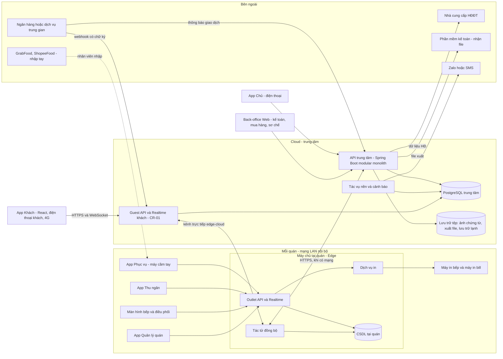
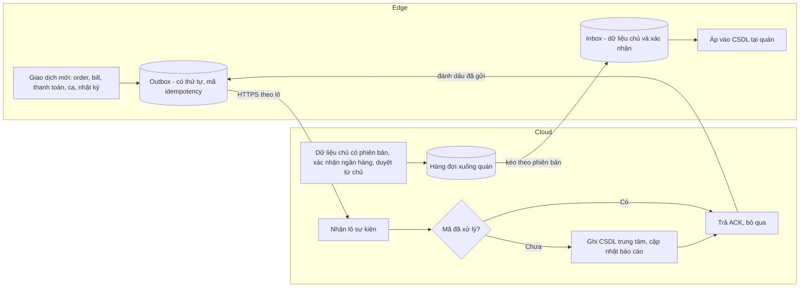
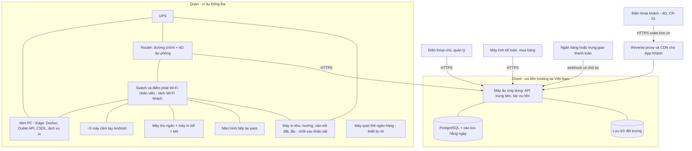

# Thiết kế — Phần 1: Kiến trúc hệ thống

> Phương pháp: skill `layered-architecture-designer`, `monolith-vs-modular-monolith-reviewer`, `quality-attribute-scenario-writer`, `integration-boundary-mapper`, `deployment-view-writer`, `adr-writer` (45ck/software-architecture-skills), `deployment-diagram-drafter` (45ck/uml-analysis-modelling-skills).
> Thiết kế này dành cho **PA2** (hệ thống riêng). Nếu bước thử phần mềm có sẵn (TR-03) chọn một sản phẩm cho phần sảnh, thì khối **Outlet Ops** ở mục 3 trở thành **lớp tích hợp**; các khối back-office và mô hình dữ liệu giữ nguyên.

## 1. Yếu tố chi phối kiến trúc

| # | Yếu tố | Nguồn | Hệ quả thiết kế |
|---|---|---|---|
| D1 | **Mất Internet vẫn phải bán hàng ≥ 4 giờ**, không trùng phiếu | NFR-08, FR-OFF-01…06 | **Máy chủ tại mỗi quán** (edge); đồng bộ bất đồng bộ; mã định danh sinh tại chỗ |
| D2 | Phiếu bếp ≤ 3 giây, mạng trong quán | NFR-02 | Order không đi vòng qua cloud; **in qua LAN** |
| D3 | Kiểm soát giảm giá, huỷ món: hạn mức, duyệt từ xa, dự phòng 3 phút, nhật ký không sửa được | BR-01…07, 27 | Mô-đun **Phê duyệt và Nhật ký** dùng chung; chạy được cả khi offline |
| D4 | Tiền: QR động, xác nhận ngân hàng, khớp số | BR-19, 20, FR-INT-01 | Mô-đun **Thanh toán và Đối soát** ở cloud; trạng thái "chưa xác nhận" ở quán |
| D5 | Chuỗi nhiều quán, bếp sơ chế chung, quán thứ 4 | NFR-25, FR-PRP | Dữ liệu **phân vùng theo quán**; menu và tham số **tập trung ở cloud** |
| D6 | Ngân sách 350–500 triệu (trần 600 triệu); vận hành cố định 8–12 triệu/tháng | CON-01, 02 | **Modular monolith**, một backend Java, một CSDL; không dùng microservices |
| D7 | Tích hợp chưa chắc chắn (ngân hàng, app giao hàng, HĐĐT) | ASM-02, 03 | **Cổng tích hợp (adapter)** thay thế được; có phương án thủ công |
| D8 | Lưu trữ ≥ 10 năm, xuất dữ liệu, dữ liệu cá nhân | NFR-18, 20, 21 | Lưu trữ lạnh; xuất CSV; lưu đồng ý và nhật ký truy cập |
| D9 | *(CR-01)* Khách gọi món, xem trạng thái, tự thanh toán **trên mạng di động của khách** | FR-GST, BR-41…60 | **Kênh khách đi qua cloud**; edge vẫn là nơi ghi duy nhất; **từ chối ngay** khi quán mất kết nối (không xếp hàng); tuyến ngân hàng dạng adapter |
| D10 | **Công nghệ bắt buộc**: Spring Boot, React, PostgreSQL, CI/CD đầy đủ | CON-11, NFR-43…46 | Java 21 + Spring Boot 3 (Spring Modulith); React + TypeScript (Vite, PWA); PostgreSQL 16 + Flyway; GitHub Actions |
| D11 | *(CR-02)* **Nhân viên quét cùng thẻ QR với khách** để mở bàn, và việc này **phải chạy khi mất Internet** | FR-TBL-07, 08, BR-62…68 | **Edge tự giải mã token QR** (băm token được đồng bộ xuống edge như dữ liệu chủ); app nhân viên cần **HTTPS trong LAN** để dùng camera (NFR-48) |

## 2. Kịch bản thuộc tính chất lượng

| # | Nguồn kích hoạt | Tác nhân kích thích | Môi trường | Phản hồi | Đo lường |
|---|---|---|---|---|---|
| QAS-1 Sẵn sàng | Nhà mạng | Đứt Internet 40 phút | Tối thứ 7, 19:30, Cầu Giấy | Gọi món, in bếp, bill, tiền mặt chạy qua máy chủ tại quán; 4G dự phòng tự bật cho chức năng cloud | 0 phút gián đoạn gọi món; 0 bản ghi trùng sau đồng bộ |
| QAS-2 Hiệu năng | Phục vụ | Gửi món thêm | 5 máy cầm tay cùng gửi | Phiếu in đúng khu | ≤ 3 giây (P95) |
| QAS-3 Toàn vẹn | Thu ngân | Nhập bù 12 phiếu giấy sau khi máy chủ tại quán mất điện | Sau sự cố | Không in lại phiếu bếp (mặc định) | 0 món bị nấu lần hai |
| QAS-4 Kiểm soát | Quản lý | Giảm giá 250.000đ khi chủ không trả lời | Mất Internet | Nhánh dự phòng sau 3 phút, người xác nhận thứ hai, cảnh báo gửi ngay khi có mạng | 100% lượt dự phòng có trong danh sách rà soát |
| QAS-5 Khả năng sửa đổi | Kế toán | Thuế suất đổi từ 01/01/2027 | Vận hành | Đổi bằng cấu hình | 0 lần phát hành phần mềm |
| QAS-6 Toàn vẹn (CR-01) | Khách | Gửi món qua QR khi quán đang mất kết nối | Tối đông, Cầu Giấy | Cloud **từ chối ngay** và báo tạm dừng; không lưu để giao sau | 0 đơn "đến muộn" ở bếp sau khi có mạng lại |
| QAS-7 Hiệu năng (CR-01) | Ngân hàng hoặc trung gian | Gửi thông báo giao dịch hợp lệ | Giờ đông | Khớp lệnh, đóng bill, đẩy trạng thái tới khách và phục vụ | ≤ 10 giây (P95) phía hệ thống |
| QAS-8 Bảo mật (CR-01) | Người ngoài | Dùng ảnh chụp QR bàn để gửi đơn từ xa, hoặc dò dữ liệu bàn khác | Bất kỳ lúc nào | Chặn: bàn phải đang mở + mã ngồi bàn + nhân viên xác nhận; kênh realtime phân quyền theo phiên | 0 đơn giả tới bếp; 0 dữ liệu bàn khác bị lộ |
| QAS-9 Sẵn sàng (CR-02) | Phục vụ | Quét thẻ QR để mở bàn khi đường Internet của Cầu Giấy bị đứt | Tối đông | Edge giải mã thẻ trong LAN, mở bàn bình thường | 0 lần phải chuyển sang giấy chỉ vì mất Internet |
| QAS-10 Toàn vẹn (CR-02) | Máy cầm tay | Mất Wi-Fi giữa lúc nhập món, rồi có lại sau khi quán đã dùng phiếu giấy | Tối đông | Món chỉ là **bản nháp**; không tự gửi; nhân viên quyết gửi hay huỷ | **0 phiếu bếp "bất ngờ"** sau khi khôi phục |

## 3. Kiến trúc tổng thể (Edge + Cloud)

**Nguyên tắc:**
1. **Mọi thiết bị trong quán chỉ nói chuyện với máy chủ tại quán.** Nhờ vậy khi mất Internet, hành vi của thiết bị không đổi.
2. **Máy chủ tại quán là nơi ghi duy nhất** cho giao dịch của quán đó (lượt phục vụ, order, phiếu bếp, bill, thanh toán, ca). **Cloud là nơi ghi duy nhất** cho dữ liệu chủ (menu, giá, người dùng, tham số) và nghiệp vụ back-office (kho, sơ chế, mua hàng, đối soát). Vì mỗi loại dữ liệu chỉ có một nơi ghi, **gần như không có xung đột đồng bộ**.
3. **Một mã nguồn, hai chế độ triển khai** (edge, cloud). Đây là một ứng dụng Spring Boot chạy với hai **profile**: `edge` và `cloud`. Profile edge chỉ bật các mô-đun vận hành quán.
4. *(CR-01)* **Điện thoại khách không bao giờ nói chuyện trực tiếp với máy chủ tại quán.** Khách đi qua **Guest API ở cloud**. Cloud chuyển đơn xuống edge qua **kênh trực tiếp** (WebSocket do edge chủ động mở ra ngoài, nên không cần mở cổng ở quán). **Edge vẫn là nơi ghi duy nhất** của đơn và bill. Nếu kênh trực tiếp mất, cloud **từ chối đơn ngay** (BR-55).
5. *(CR-02)* **Một thẻ QR, hai đường đi:**
   - Thẻ chứa URL `https://order.bnn.vn/t/<token>`.
   - **Camera hoặc Zalo** mở URL đó, tức là đi đường khách qua cloud.
   - **App nhân viên** tự đọc token và hỏi **máy chủ tại quán**, tức là đi đường nhân viên trong LAN, chạy được khi mất Internet. Edge chỉ giữ **băm của token**.

## 4. Mô-đun (modular monolith) và nơi chạy

| Mô-đun | Trách nhiệm | Chạy ở | Nguồn yêu cầu | Khi mất Internet |
|---|---|---|---|---|
| **Identity & Access** | Người dùng, PIN, vai trò, phạm vi quán, thiết bị | Cloud (gốc); edge (bản sao để xác thực) | FR-ADM-02…04 | Đăng nhập PIN vẫn chạy (bản sao) |
| **Catalog & Pricing** | Món, size, tuỳ chọn, set, khu chế biến, bảng giá theo kênh và ngày | Cloud (gốc); edge (bản sao) | FR-MNU | Dùng bản sao gần nhất |
| **Outlet Ops** | Sơ đồ bàn, lượt phục vụ, order, định tuyến, phiếu bếp, trạng thái món, hết món | **Edge** | FR-TBL, ORD, KIT | Chạy đầy đủ |
| **Billing & Cash** | Bill, tách, gộp, giảm giá, thanh toán, làm tròn, ca, két, phiếu chi | **Edge** | FR-BIL, SHF | Chạy; thẻ và QR ở trạng thái "chưa xác nhận" |
| **Approvals & Audit** | Hàng đợi duyệt, dự phòng, nhật ký không sửa được | Edge + Cloud | FR-AUD, BR-01…03, 27 | Dự phòng 3 phút; nhật ký lưu tại chỗ rồi đồng bộ |
| **Recovery** | Chế độ khôi phục, danh sách đối chiếu | **Edge** | FR-OFF-04, 05 | Chạy |
| **Sync** | Outbox/inbox, idempotency, trạng thái kết nối | Edge + Cloud | FR-OFF-02, 03 | Xếp hàng chờ |
| **Payments & Reconciliation** | QR động, nhận thông báo ngân hàng, khớp, bảng kê thẻ và app | Cloud | FR-BIL-09, INT-01, RPT-05, DLV-04 | Không khả dụng; dùng xác nhận thủ công |
| **Reservations & Events** | Booking, tiệc, cọc, danh sách chờ | Cloud (gốc); edge (bản sao booking trong ngày) | FR-RSV | Xem booking trong ngày; đánh dấu khách tới |
| **Inventory & Recipes** | Hàng kho, đơn vị, định lượng, tiêu hao, kiểm kê, chênh lệch | Cloud | FR-INV | Phiếu kiểm lưu trên thiết bị, gửi sau |
| **Prep & Transfers** | Yêu cầu, lệnh sản xuất, phiếu chuyển, giá chuyển | Cloud | FR-PRP | Như trên |
| **Purchasing & Receiving** | Nhà cung cấp, đề xuất, đơn mua, nhận hàng, tranh chấp | Cloud | FR-PUR | Như trên |
| **Customers & Consent** | Khách, đồng ý, lịch sử, ưu đãi | Cloud | FR-CUS | — |
| **Reporting & Alerts** | Dashboard, báo cáo, cảnh báo, tín hiệu sống của quán | Cloud | FR-RPT, NFR-29 | Cảnh báo "mất kết nối" do **cloud** phát hiện |
| **Integrations** | Adapter ngân hàng, HĐĐT, xuất MISA, nhắn tin, (sau này) app giao hàng | Cloud | FR-INT | Xếp hàng chờ |
| **Guest Ordering** *(CR-01)* | QR bàn, mã ngồi bàn, phiên khách, nhận đơn QR, trạng thái cho khách, gọi nhân viên, công tắc QR | Cloud (cửa vào của khách); **Edge** (hàng chờ xác nhận, tạo lượt gửi món) | FR-GST-01…12, 20…23 | **Tạm dừng**, cloud từ chối đơn mới |
| **Guest Payments** *(CR-01)* | Lệnh thanh toán, adapter tuyến ngân hàng (`PaymentProvider`), xác thực webhook, khớp, trả trùng, hoàn | Cloud; kết quả đẩy xuống edge để đóng bill | FR-GST-13…19, 24 | Xác nhận lưu ở cloud; bill đóng khi edge kết nối lại (BR-51) |

## 5. Mô hình đồng bộ Edge ↔ Cloud

- **Mã định danh:** mọi bản ghi giao dịch dùng **UUIDv7** sinh tại thiết bị hoặc edge. Đây cũng là **khoá idempotency** (FR-ORD-08). Mã hiển thị cho người dùng (số bill, số phiếu) có dạng `<mã quán>-<ngày>-<số thứ tự>`, do edge cấp.
- **Thứ tự:** mỗi edge có một **số thứ tự tăng dần** cho sự kiện gửi lên; cloud xử lý theo thứ tự trong từng quán.
- **Dữ liệu chủ đi xuống:** có **số phiên bản**; edge chỉ áp phiên bản mới hơn. Giá và thuế theo **ngày hiệu lực**, nên edge offline vẫn tự áp bảng giá lễ đúng ngày (FR-MNU-08, NFR-23).
- **Máy cầm tay ↔ edge:** kết nối WebSocket. Khi kết nối lại, máy gửi **số thứ tự cuối đã nhận** để lấy các sự kiện bị lỡ.
- *(Sửa theo CR-02)* Món nhập lúc máy **mất liên lạc với edge** được giữ trong IndexedDB dưới dạng **bản nháp CHƯA GỬI**, và **không bao giờ tự gửi** khi có kết nối lại (ADR-14, BR-68). Nhân viên chủ động bấm **Gửi** hoặc **Huỷ bản nháp**. Mã idempotency vẫn chống trùng khi bấm Gửi nhiều lần. Máy mất liên lạc với edge **không mở được bàn mới**, vì mở bàn cần edge xác nhận để tránh hai nhóm cho một bàn.
- **Xung đột:** không có sửa đè, vì giao dịch là **chỉ thêm** (điều chỉnh là bản ghi mới, FR-AUD-02). Trường hợp duy nhất có hai nơi cùng ghi là trạng thái booking (cloud sửa booking, edge đánh dấu khách tới). Trường hợp này xử lý bằng quy tắc **sự kiện đến sau thắng, có ghi nhật ký**, và được xem lại trong kiểm tra cuối ngày.
- *(CR-01)* **Kênh trực tiếp edge ↔ cloud cho khách:**
  - Ngoài đồng bộ theo lô, edge **chủ động mở** một kết nối WebSocket (STOMP) tới cloud và giữ nó bằng nhịp tim 15 giây.
  - Đơn QR đi **cloud → edge** qua kênh này, và cloud **chờ edge xác nhận đã nhận** trong ≤ 5 giây. Quá thời gian thì đơn bị **từ chối**, không lưu để gửi lại (BR-55).
  - Trạng thái món, bill và thanh toán đi **edge → cloud → điện thoại khách**.
  - Nhịp tim mất quá 60 giây thì cloud đặt quán vào trạng thái **QR tạm dừng** và cảnh báo quản lý (AC-52).

## 6. Tích hợp

| Tích hợp | Thí điểm | Toàn chuỗi | Cơ chế | Phương án thủ công | Câu hỏi mở |
|---|---|---|---|---|---|
| Ngân hàng (thông báo giao dịch) | Should (tuỳ ngân hàng cho truy cập) | Should | Webhook hoặc API của ngân hàng, hoặc dịch vụ trung gian đọc biến động số dư (ứng viên cần đánh giá, ví dụ PayOS, SePay, Casso) | Thu ngân xác nhận có mã tham chiếu (FR-BIL-10) | OI-08 |
| QR động | Should | Should | Chuẩn VietQR (NAPAS); nội dung ASCII ≤ 25 ký tự, ví dụ `BNN DDA 7K3F2Q` | QR tĩnh có mã bill in trên bill | OI-08 |
| HĐĐT | Xuất file theo mẫu nhập của MISA meInvoice (Must) | API nhà cung cấp (Should) | Hàng chờ HĐ → file hoặc API → nhập lại số HĐ | Kế toán nhập tay như hiện tại | Tài liệu API và mẫu nhập của nhà cung cấp |
| Phần mềm kế toán | File Excel theo mẫu nhập của MISA (Should) | Must, **đã được kế toán thử** | Xuất theo kỳ | — | Mẫu nhập chứng từ bán hàng và mua hàng |
| Nhắn tin | Mẫu tin để nhân viên gửi và ghi nhận | Zalo ZNS hoặc SMS | Adapter nhắn tin | Nhân viên gửi Zalo thủ công theo mẫu | Chi phí mỗi tin (biến đổi) |
| App giao hàng | Nhập tay | Could: kết nối | Adapter đối tác | Nhập tay + nhập bảng kê | OI-09 |
| Máy in | ESC/POS qua TCP 9100 | Như thí điểm | Dịch vụ in trên edge, mỗi lệnh in có mã; in lại thì ghi **IN LẠI** | Máy in dự phòng | In tiếng Việt có dấu (OI-10) |
| *(CR-01)* Tuyến xác nhận tự thanh toán | Should (chỉ bật sau TR-11) | Should | Interface `PaymentProvider` với các adapter: **Vietcombank** (nếu ngân hàng cung cấp), **payOS** (SDK `vn.payos:payos-java`, link thanh toán và webhook có chữ ký), **SePay** hoặc **Casso** (webhook biến động tài khoản), **Manual** (thu ngân xác nhận). Chọn bằng cấu hình | Thu ngân xác nhận có mã tham chiếu | OI-24 |
| *(CR-01)* Deeplink app ngân hàng | Should | Should | Nút "Mở app ngân hàng" dùng deeplink của nhà cung cấp tuyến thanh toán (nếu có); luôn có "Lưu ảnh QR" | Nhờ nhân viên | OI-28 |

## 7. Triển khai (Deployment)

| Nút | Vai trò | Ghi chú |
|---|---|---|
| Mini PC edge | Chạy Outlet API, CSDL tại quán, dịch vụ in, tác tử đồng bộ | Ổ SSD; **có máy dự phòng** để thay trong ≤ 2 giờ (NFR-13) |
| Router 4G dự phòng | Tự chuyển đường truyền | NFR-10 |
| UPS | Lưu điện cho edge, router, máy in bếp | NFR-09 |
| Wi-Fi nhân viên | Mạng riêng cho thiết bị, tách Wi-Fi khách | NFR-15; khảo sát bàn mặt tiền Cầu Giấy (OI-11) |
| Máy in | ESC/POS mạng | Số lượng chốt sau khảo sát bếp (OI-10) |
| *(CR-01)* Reverse proxy + CDN cho App Khách | Phục vụ trang khách tĩnh (React build), chống tấn công từ chối dịch vụ, giới hạn tốc độ | Tên miền riêng cho khách, ví dụ `order.bnn.vn` (OI-29) |
| *(CR-01)* Thẻ QR bàn | Thẻ in chống bóc dán ở 6 bàn thí điểm | Kiểm tra mỗi lần mở bàn (TR-16) |

## 8. Bảo mật

- **Xác thực:**
  - Thiết bị của quán được **ghép cặp** với edge bằng mã một lần và nhận token thiết bị.
  - Nhân viên đăng nhập bằng **PIN** (lưu dạng băm, khoá sau nhiều lần sai) và nhận phiên ngắn.
  - Tài khoản web của chủ và kế toán dùng mật khẩu và **xác thực 2 lớp**.
- **Phân quyền:** vai trò và phạm vi quán **kiểm tra ở cả edge và cloud** (không tin client).
- **Nhật ký:** chỉ thêm, không có API sửa hoặc xoá. Mỗi bản ghi chứa băm của bản trước (chuỗi băm) để phát hiện can thiệp (NFR-16).
- **Dữ liệu cá nhân:**
  - Thu thập tối thiểu; lưu đồng ý (FR-CUS-02).
  - Ghi nhật ký truy cập dữ liệu khách.
  - Công thức sốt được coi là **dữ liệu mật** (chỉ bếp trưởng và chủ xem).
- **Đường truyền:** TLS ở mọi kết nối ra Internet; Wi-Fi nhân viên WPA2/WPA3 tách Wi-Fi khách.
- *(CR-01)* **Kênh khách:**
  - **Token QR bàn:** 128 bit sinh bằng `SecureRandom`; CSDL chỉ lưu **băm** của token. In lại thẻ đồng nghĩa với **cấp token mới**, token cũ mất hiệu lực.
  - **Mã ngồi bàn:** sinh khi mở bàn, lưu dạng băm, khoá sau 5 lần sai trong 15 phút.
  - **Phiên khách:** cookie `HttpOnly`, `Secure`, `SameSite=Lax`, hết hạn trượt 30 phút. Mọi API khách **chỉ trả dữ liệu của phiên đó**.
  - **Realtime:** STOMP xác thực ở CONNECT (JWT nhân viên hoặc token phiên khách), **phân quyền ở SUBSCRIBE**: khách chỉ đăng ký được `/topic/guest.{sessionId}`.
  - **Chống lạm dụng:** giới hạn tốc độ theo phiên và theo IP (Bucket4j); CSP chặt; HSTS.
  - **Webhook thanh toán:** kiểm tra chữ ký HMAC, khoá idempotency theo mã giao dịch, **đối chiếu số tiền thực nhận**. Endpoint webhook tách riêng, chỉ nhận từ nguồn đã khai báo.
  - **Chống QR giả:** trang thanh toán chỉ trên tên miền của quán, hiện tên công ty và số tài khoản (BR-53).
- *(CR-02)* **Nhân viên quét QR:**
  - Chỉ **thiết bị đã ghép cặp** với edge và **nhân viên đã đăng nhập PIN** mới dùng được chế độ nhân viên. Trên điện thoại cá nhân hay trình duyệt thường, URL chỉ mở trang khách.
  - Edge **từ chối** token không thuộc quán mình.
  - Mọi lần mở bàn đều ghi **cách chọn** (quét hoặc chọn tay) vào nhật ký.
  - **HTTPS trong LAN:** edge có chứng chỉ cho tên nội bộ, ví dụ `dda.edge.bnn.vn` trỏ IP LAN. Chứng chỉ được gia hạn qua ACME DNS-01 khi có mạng. Phương án dự phòng là CA nội bộ cài trên thiết bị của quán (NFR-48).

## 9. Kế hoạch kiểm tra kỹ thuật 2 tuần (TR-03)

| # | Câu hỏi cần trả lời | Cách làm | Tiêu chí đạt | Kết quả bàn giao |
|---|---|---|---|---|
| S1 | Có nhận được thông báo giao dịch của tài khoản thu Vietcombank không (API ngân hàng hay dịch vụ trung gian)? Chi phí? Độ trễ? | Làm việc với ngân hàng và 1–2 dịch vụ trung gian; chuyển thử | Giao dịch thử tự khớp với bill; độ trễ và chi phí được đo | Khuyến nghị và chi phí tháng (OI-08) |
| S2 | QR động hiện đúng số tiền và nội dung trên các app ngân hàng phổ biến? | Sinh QR, quét bằng 5 app ngân hàng | 5/5 app hiện đúng | Mẫu QR |
| S3 | In tiếng Việt có dấu, ≤ 3 giây, không in trùng? | Thử với máy in hiện có và 1 mẫu máy in khu | Đạt NFR-02; phiếu đọc được | Danh sách máy in đề xuất (OI-10) |
| S4 | Offline và đồng bộ không trùng? | Nguyên mẫu edge với 3 máy; ngắt Internet và Wi-Fi; 500 order giả lập | 0 bản ghi trùng; đạt QAS-1, QAS-3 | Báo cáo thử |
| S5 | Màn hình bếp dùng được ở bếp Đống Đa? | Khảo sát cùng bếp trưởng: nhiệt, dầu mỡ, dây điện, vị trí | Bếp trưởng đồng ý vị trí và số thiết bị | Sơ đồ bố trí bếp |
| S6 | Wi-Fi phủ bàn mặt tiền Cầu Giấy? | Đo sóng, đề xuất điểm phát | Tín hiệu ổn định tại mọi bàn | Sơ đồ điểm phát (OI-11) |
| S7 | Mẫu nhập của MISA meInvoice và MISA kế toán? | Lấy mẫu và tài liệu API; thử với kế toán | Kế toán nhập thử thành công 1 ngày dữ liệu | Đặc tả file xuất |
| S8 | **Thử phần mềm có sẵn cho phần sảnh** | Chạy 10 tình huống then chốt (bên dưới) trên 1–2 sản phẩm; kiểm tra khả năng xuất hoặc API dữ liệu | Đạt ≥ 9/10 **và** xuất được dữ liệu chi tiết (dòng bán, thanh toán, huỷ có lý do) | Quyết định xây hay tích hợp phần sảnh (OI-13) |
| S9 | Hosting tại Việt Nam so với phương án khác | Lấy 2–3 báo giá cùng cấu hình | So sánh chi phí, sao lưu, tuân thủ | Bảng so sánh (OI-12) |
| S10 | **Kế hoạch có chi phí** | Ước lượng công sức theo mô-đun và giai đoạn; báo giá phần cứng; chi phí tháng cố định và biến đổi theo mức dùng dự kiến | Nằm trong CON-01, CON-02; có phương án cắt giảm | Hồ sơ trình duyệt (M1) |
| S11 | *(CR-01)* Trang khách dùng được trên điện thoại thật? | Nguyên mẫu React: quét bằng camera iOS, Android và **Zalo**; nhập mã ngồi bàn; gửi món; xem trạng thái | Chạy trên ≥ 5 dòng máy và trong Zalo; đạt NFR-35 | Báo cáo tương thích (RSK-16) |
| S13 | *(CR-02)* **Quét QR bằng app nhân viên** trong điều kiện thật | Nguyên mẫu PWA + thư viện đọc QR trên máy cầm tay của quán; HTTPS trong LAN với chứng chỉ nội bộ; thử **ban đêm**, thẻ ẩm, bị dĩa che; **ngắt Internet**; ngắt Wi-Fi giữa lúc nhập món để thử bản nháp | ≤ 2 giây (P90); camera chạy khi mất Internet; **0 phiếu bếp bất ngờ** sau khôi phục (QAS-10) | Mẫu thẻ, vị trí đặt thẻ, cấu hình TLS (TR-17, OI-31, 32) |
| S12 | *(CR-01)* **Tuyến ngân hàng thật** cho tự thanh toán | Xin văn bản Vietcombank; thử 1–2 trung gian (payOS, SePay hoặc Casso) với tài khoản thử; thử **deeplink** trên các app ngân hàng phổ biến | Webhook có chữ ký, khớp đúng mã và số tiền; đo độ trễ; rõ chi phí tháng, dữ liệu và cách thu hồi quyền (BR-60) | Khuyến nghị tuyến và chi phí (OI-24, OI-28) |

**10 tình huống then chốt cho S8:**
1. Món thêm đi đúng khu, ghi MÓN THÊM.
2. Huỷ món đã tới bếp, có quản lý duyệt và bếp xác nhận.
3. Hạn mức theo bill và ca, duyệt từ xa, dự phòng 3 phút.
4. Tách bill theo món chính xác từng đồng.
5. Chuyển 2 bàn sang 3 bàn giữ một bill.
6. Offline 30 phút vẫn in bếp, không trùng.
7. Nhập bù không in lại phiếu bếp.
8. QR động vào tài khoản thu chung, tự xác nhận.
9. Cọc là khoản giữ và được cấn trừ.
10. Xuất dữ liệu dòng bán, thanh toán, huỷ có lý do.

## 10. Cấu trúc chi phí cần báo giá

**Chưa có số tiền.** Số tiền là đầu ra của S10. Chủ yêu cầu chi phí biến đổi phải được **ước tính theo mức dùng dự kiến** (S6-R7).

| Nhóm | Hạng mục | Loại | Cơ sở ước tính mức dùng |
|---|---|---|---|
| Phần cứng (một lần, từng quán) | Mini PC edge (+ 1 máy dự phòng cho chuỗi), UPS, router 4G, điểm phát Wi-Fi, ~5 máy cầm tay, màn hình bếp, máy in khu, lắp đặt | Một lần | Kết quả khảo sát S3, S5, S6 |
| Cố định hằng tháng | Máy ảo, CSDL và sao lưu, lưu trữ đối tượng, tên miền và TLS, giám sát, gói hỗ trợ 10:00–23:30 | Cố định | **Mục tiêu 8–12 triệu/tháng cho 3 quán** |
| Biến đổi | Số HĐĐT/tháng (≈ số bill), tin Zalo/SMS (≈ số booking), phí dịch vụ trung gian ngân hàng, gói data 4G, phí thẻ (theo hợp đồng ngân hàng), hoa hồng app (theo dõi, không phải chi phí hệ thống) | Theo mức dùng | Số bill và booking đo trong baseline (TR-01) |
| *(CR-01)* Một lần | Phát triển kênh khách QR-1 và tự thanh toán; thẻ QR chống bóc dán (6 bàn và dự phòng); thử nghiệm S11, S12 | Một lần | **Trần +50–80 triệu**, tổng dự án ≤ 600 triệu (CON-01) |
| *(CR-01)* Cố định | Reverse proxy/CDN cho trang khách; gói dịch vụ tuyến ngân hàng (nếu theo tháng) | Cố định | **Trần +1–2 triệu/tháng**, tổng cố định ~12 triệu |
| *(CR-01)* Biến đổi | Phí theo giao dịch của tuyến ngân hàng hoặc cổng thanh toán (nếu có) | Theo mức dùng | Số bill tự thanh toán dự kiến ở 6 bàn |

## 11. Công nghệ (bắt buộc: Spring Boot · React · PostgreSQL · CI/CD)

> Cập nhật 30/09/2026 theo **yêu cầu bắt buộc của nhóm dự án** (DEC-26, CON-11). Thay cho đề xuất Node.js/NestJS trước đó. Cách tổ chức mã nguồn và pipeline chi tiết ở [07-ma-nguon-va-cicd.md](07-ma-nguon-va-cicd.md).

| Lớp | Công nghệ | Vai trò trong BNN-RMS | Học từ repo tham khảo |
|---|---|---|---|
| Ngôn ngữ, nền tảng backend | **Java 21 LTS, Spring Boot 3.x** (Maven) | Một ứng dụng, hai profile `edge` và `cloud` | numa, Plato, order_by_qr |
| Ranh giới mô-đun | **Spring Modulith** (package theo mô-đun ở §4; kiểm tra phụ thuộc bằng test `ApplicationModules.verify()`); sự kiện miền nội bộ `ApplicationEventPublisher` | Giữ modular monolith sạch (ADR-02) | restaurant-pos (KDS theo sự kiện) |
| API | Spring Web MVC (REST), **springdoc-openapi** sinh đặc tả OpenAPI để frontend **sinh client TypeScript** | Hợp đồng API kiểm tra được trong CI | — |
| Realtime | **Spring WebSocket + STOMP** (simple broker ở edge; ở cloud dùng simple broker, sau này có thể chuyển relay khi nhiều máy chủ) | Phiếu bếp, trạng thái món, hàng chờ QR, trạng thái cho khách | order_by_qr (xác thực CONNECT, phân quyền SUBSCRIBE) |
| Bảo mật | **Spring Security**: JWT cho nhân viên (đăng nhập PIN trên thiết bị đã ghép cặp); token phiên khách; phân quyền theo vai trò và phạm vi quán; **Bucket4j** giới hạn tốc độ | NFR-14, NFR-38 | — |
| Truy cập dữ liệu | **Spring Data JPA** (Hibernate) cho nghiệp vụ; **JdbcTemplate** hoặc truy vấn SQL gốc cho báo cáo; **Flyway** cho migration | PostgreSQL ở edge và cloud dùng **cùng một lược đồ** | Plato, restaurant-pos (Flyway) |
| CSDL | **PostgreSQL 16** | Xem [CSDL](03-co-so-du-lieu.md) | — |
| Tác vụ nền | `@Scheduled` + **ShedLock** (khoá trên PostgreSQL) cho hết hạn lệnh thanh toán, nhắc duyệt, lưu trữ lạnh | Không cần Redis ở giai đoạn đầu (D6) | order_by_qr (dọn giao dịch treo) |
| Tích hợp ngoài | Spring `RestClient` + **Resilience4j** (retry, circuit breaker); SDK **`vn.payos:payos-java`** nếu chọn payOS | Tuyến ngân hàng, HĐĐT, nhắn tin | payOS demo |
| In | Thư viện ESC/POS cho Java (ví dụ escpos-coffee) qua TCP 9100, chạy ở edge | Phiếu bếp, bill | — |
| Frontend | **React 18+ + TypeScript + Vite**; **TanStack Query** (gọi API); **@stomp/stompjs** (realtime); **Workbox/vite-plugin-pwa + IndexedDB** (hàng đợi offline cho máy cầm tay) | 3 app: `staff` (phục vụ, thu ngân, bếp, quản lý), `guest` (khách QR, bundle nhỏ), `backoffice` (chủ, kế toán, mua hàng, sơ chế) | user7121 (tách customer-app), TruongDx2004 (màn hình chờ thanh toán) |
| Kiểm thử | JUnit 5, **Testcontainers (PostgreSQL)**, Spring Modulith test; Vitest + React Testing Library; **Playwright** E2E | NFR-44, NFR-46 | nazrul-ancala (E2E bếp, thanh toán) |
| Quan sát | Spring Boot **Actuator**, **Micrometer + Prometheus + Grafana**, log JSON | Giám sát edge, nhịp tim, cảnh báo | — |
| Đóng gói, triển khai | **Docker** (image cho backend và 3 app frontend), **Docker Compose** ở edge và cloud; ảnh lưu ở **GHCR** | NFR-45 | user7121, order_by_qr |
| CI/CD | **GitHub Actions**: CI cho mọi PR; release; staging tự động; production có duyệt; cập nhật edge theo lịch | NFR-44…46 | user7121, order_by_qr, TruongDx2004 |

## 12. Quyết định kiến trúc (ADR)

| ADR | Quyết định | Lý do | Hệ quả | Trạng thái |
|---|---|---|---|---|
| ADR-01 | **Edge + Cloud**: mỗi quán có máy chủ tại quán | NFR-08, NFR-02; sự cố tháng 8 ở Cầu Giấy | Thêm phần cứng; cần giám sát edge; mất Internet không làm dừng quán | Đề xuất (chốt sau S4) |
| ADR-02 | **Modular monolith** bằng Spring Boot + **Spring Modulith**, một mã nguồn, hai profile triển khai (`edge`, `cloud`) | Ngân sách và đội nhỏ (D6); công nghệ bắt buộc (D10) | Ranh giới mô-đun được **kiểm tra tự động trong CI**; tách dịch vụ sau nếu cần | Đề xuất |
| ADR-03 | **Mỗi dữ liệu chỉ có một nơi ghi** (edge: giao dịch quán; cloud: dữ liệu chủ, back-office) | Tránh xung đột đồng bộ | Back-office không chạy offline (chấp nhận được, vì không nằm trong NFR-08) | Đề xuất |
| ADR-04 | **Outbox, UUIDv7, idempotency** | FR-ORD-08, FR-OFF-03 | Mọi API ghi phải nhận mã idempotency | Đề xuất |
| ADR-05 | **Không xây** HĐĐT, công nợ, lương; **tích hợp hoặc xuất file** | CON-10, S4-F7, F9, S5-C3 | Phụ thuộc định dạng của nhà cung cấp | Đã chốt với khách |
| ADR-06 | **Tiền là số nguyên VND**; làm tròn chỉ khi trả tiền mặt, trên số tiền cuối | BR-21, NFR-22 | Thuật toán chia bill phân bổ phần dư theo từng đồng | Đã chốt với khách |
| ADR-07 | **Giao dịch chỉ thêm**; điều chỉnh là bản ghi mới; nhật ký có chuỗi băm | BR-27, NFR-16 | Báo cáo phải tổng hợp theo sự kiện | Đề xuất |
| ADR-08 | **Tách Bill và HĐĐT** thành hai đối tượng | BR-25, I25 | Vòng đời và quyền khác nhau; có hàng chờ HĐ | Đề xuất |
| ADR-09 | *(CR-01)* **Kênh khách đi qua cloud**; edge vẫn là nơi ghi duy nhất; **cloud chờ edge xác nhận đã nhận** đơn, quá thời gian thì **từ chối** (không xếp hàng giao sau) | D9, BR-55, QAS-6 | Mất kết nối thì QR tạm dừng; không bao giờ có đơn "đến muộn" ở bếp | Đề xuất |
| ADR-10 | *(CR-01)* **Lệnh thanh toán có mã tham chiếu duy nhất** + interface `PaymentProvider` (strategy) cho nhiều tuyến; chỉ tin **webhook có chữ ký** và đúng số tiền | BR-49, BR-60, NFR-39 | Đổi tuyến ngân hàng bằng cấu hình; thêm được Vietcombank nếu ngân hàng cung cấp | Đề xuất (chốt sau S12) |
| ADR-11 | **Công nghệ bắt buộc**: Java 21 + Spring Boot 3, React + TypeScript, PostgreSQL 16 | CON-11 | Thay đề xuất NestJS trước đó; frontend chia 3 app | Đã chốt (nhóm dự án) |
| ADR-12 | **CI/CD bằng GitHub Actions**, image trên GHCR, staging tự động, production cần duyệt, **edge cập nhật kiểu kéo (pull)** theo lịch ngoài giờ phục vụ | NFR-44…46, NFR-30 | Không cần mở cổng vào quán; rollback bằng tag image | Đề xuất |
| ADR-13 | *(CR-02)* **Một thẻ QR cho hai chế độ**: đường khách đi qua cloud; đường nhân viên **giải mã tại edge**. Băm token được đồng bộ xuống edge | D11, BR-62, QAS-9 | Nhân viên quét được khi mất Internet; phải cấu hình HTTPS trong LAN | Đề xuất (chốt sau S13) |
| ADR-14 | *(CR-02)* **Không tự gửi lại** món khi máy cầm tay có kết nối trở lại; chỉ giữ **bản nháp** để nhân viên quyết. **Mở bàn cần edge xác nhận** | BR-68, QAS-10, S12-V10 | Thay cách "hàng đợi tự gửi" cũ; thêm một thao tác cho nhân viên nhưng không còn phiếu bếp bất ngờ | Đã chốt với khách |
