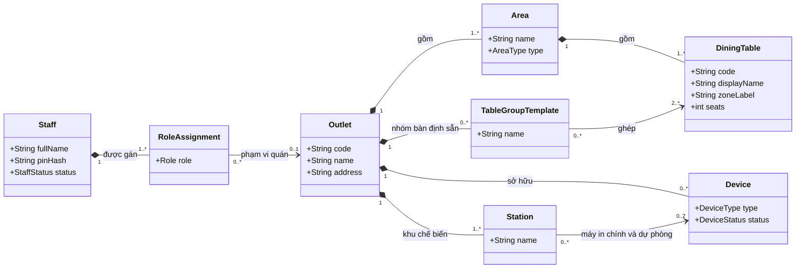
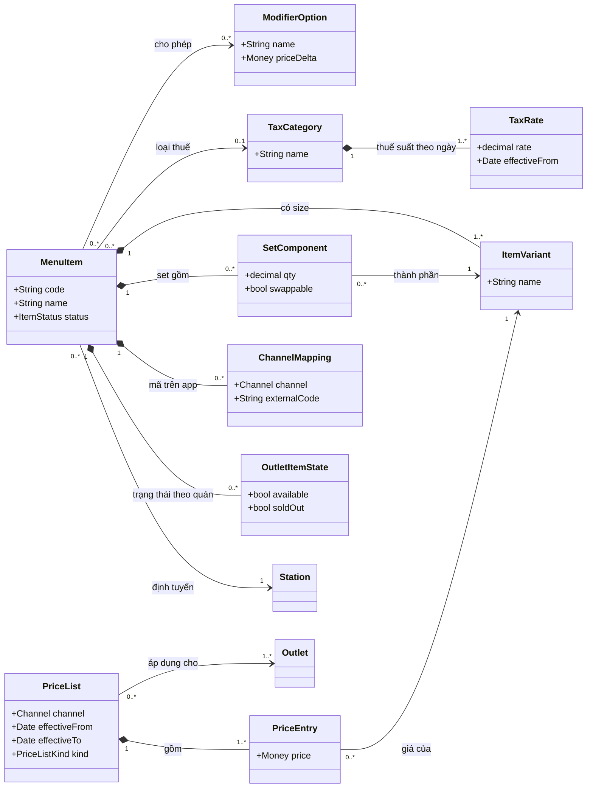
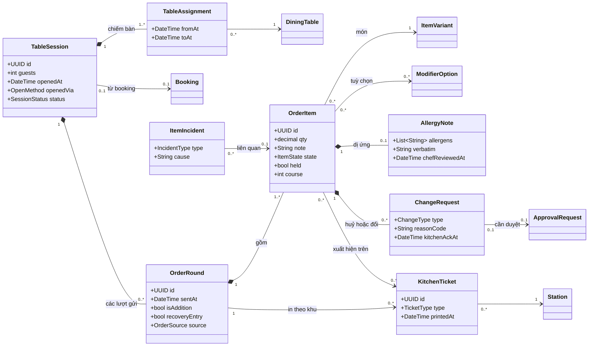
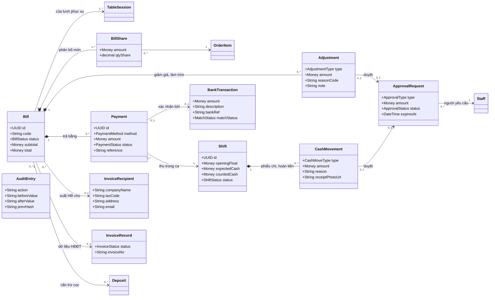
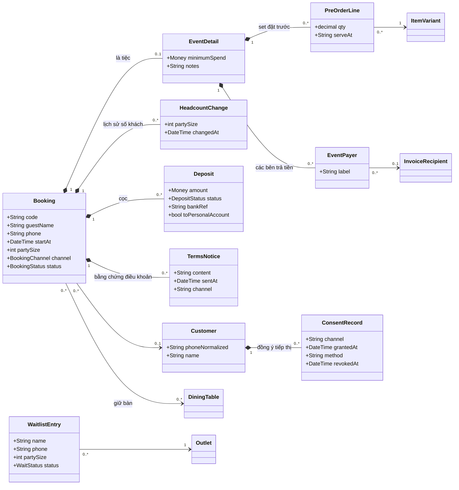
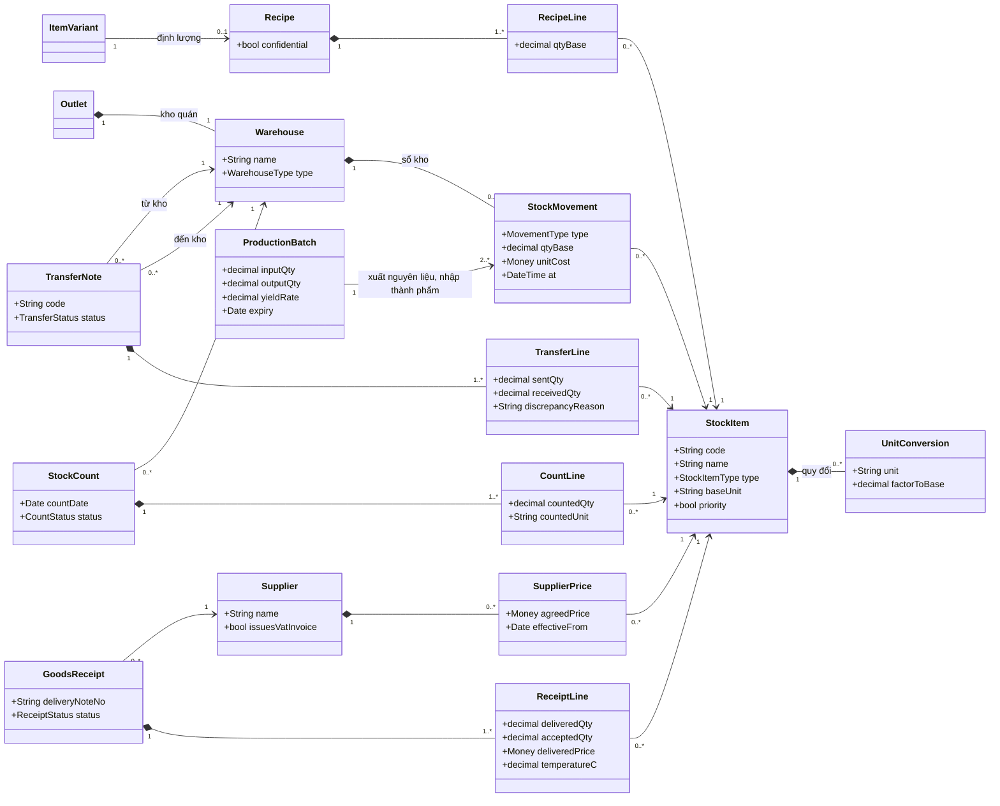
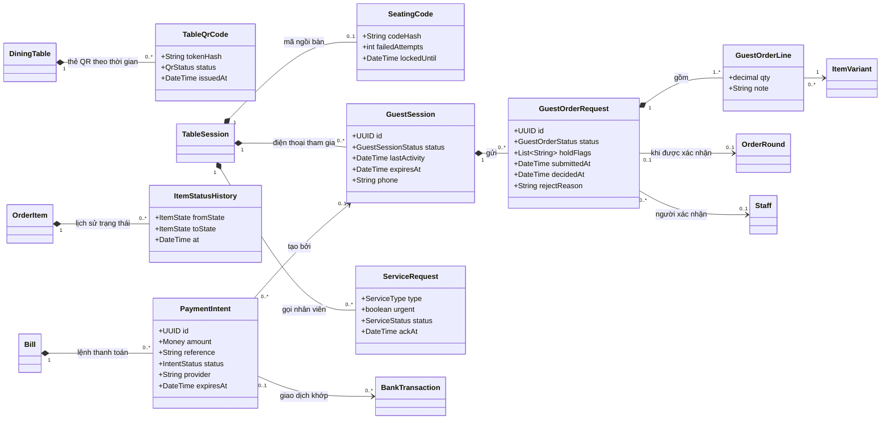

# Thiết kế — Phần 2: Mô hình miền (Domain Class Model)

> Phương pháp: skill `domain-class-modeler`, `multiplicity-checker`, `boundary-control-entity-mapper`, `domain-vs-design-model-differentiator` (45ck/uml-analysis-modelling-skills).
> Đây là **mô hình phân tích**: chỉ mô tả khái niệm nghiệp vụ, thuộc tính chính và quan hệ, **chưa** đưa chi tiết cài đặt. Tên lớp dùng tiếng Anh để khớp với mã nguồn sau này; bảng từ vựng ở mục 6.
> `Money` là **số nguyên VND** (ADR-06). `UUID` sinh tại thiết bị hoặc edge (ADR-04).

## 1. Tổ chức, truy cập, thực đơn

- `MenuItem → TaxCategory` có bội số `0..1` vì món **mới đề xuất** chưa có loại thuế. Ràng buộc INV-10 chặn bán món chưa có loại thuế.
- `PriceList.kind` gồm: chuẩn, lễ hoặc Tết, set tiệc. Bảng giá có ngày hiệu lực và **kênh** (FR-MNU-07, 08).

## 2. Phục vụ và bếp

- **Lượt phục vụ** (`TableSession`) tách khỏi **bàn**. Một lượt chiếm **nhiều bàn** theo thời gian (`TableAssignment`), nên chuyển từ N bàn sang M bàn **không phá bill** (FR-TBL-05, I31).
- `OrderRound.recoveryEntry = true` là lượt nhập bù sau sự cố, **mặc định không tạo phiếu bếp**. Vì vậy `OrderRound → KitchenTicket` có bội số `0..*` (BR-38).
- `KitchenTicket.type` gồm: MỚI, THÊM, THAY THẾ, HUỶ, GỌI RA, IN LẠI.

## 3. Bill, thanh toán, ca, phê duyệt

- **Tách bill** = nhiều `Bill` cùng tham chiếu một lượt phục vụ. `BillShare` phân bổ **từng món** (hoặc một phần món) cho từng bill. **Gộp bill** = một `Bill` tham chiếu nhiều lượt phục vụ.
- `Adjustment.type` gồm: giảm giá, tặng món, xoá món tính nhầm, **làm tròn tiền mặt**, cấn trừ cọc.
- `Payment.status` gồm: DỰ ĐỊNH (chưa xác nhận), ĐÃ XÁC NHẬN, CẦN DUYỆT, TỪ CHỐI, ĐÃ HOÀN (xem [máy trạng thái](04-tuong-tac-trang-thai.md)).
- `InvoiceRecord` là **dữ liệu HĐĐT**, tách khỏi `Bill` (ADR-08). Vòng đời gồm: chờ xuất → đã xuất file hoặc gửi API → đã phát hành (có số HĐ) → điều chỉnh do kế toán thực hiện.

## 4. Đặt bàn, tiệc, khách hàng

## 5. Kho, sơ chế, mua hàng

- **Bếp sơ chế là một `Warehouse` riêng** (loại: sơ chế), đặt tại Đống Đa, **không** gộp vào kho quán Đống Đa (FR-INV-02).
- **Sổ kho (`StockMovement`) chỉ thêm, không sửa.** Mọi con số tồn kho đều tính từ sổ kho. `MovementType` gồm: nhập mua, xuất chuyển, nhận chuyển, bán (tính theo định lượng), hao hỏng, bữa nhân viên, khuyến mãi, bể vỡ, điều chỉnh, sản xuất (xuất nguyên liệu), sản xuất (nhập thành phẩm).
- **Két và vỏ ký cược** là `StockItem` loại "vật chứa" (FR-INV-09).

## 5b. Kênh khách QR và tự thanh toán (CR-01)

- **Mỗi thẻ QR là một bản ghi** (`TableQrCode`). Cấp lại thẻ thì bản cũ chuyển **REVOKED** (BR-53).
- **Đơn QR tách khỏi lượt gửi món.** `GuestOrderRequest` chỉ sinh ra `OrderRound` (nguồn: QR) khi **được xác nhận** (BR-42). Nhờ vậy đơn bị từ chối hoặc rút lại **không bao giờ** chạm tới bếp.
- **`ItemStatusHistory`** (học từ order_by_qr) cho phép vẽ **dòng thời gian trạng thái** cho khách (FR-GST-10) và đo thời gian.
- **Một lệnh thanh toán** có thể nhận **nhiều giao dịch** (trả thiếu rồi trả tiếp, hoặc trả trùng). Giao dịch **không khớp** thì không gắn lệnh nào (BR-49).

## 6. Ràng buộc luôn phải đúng (invariants)

| Mã | Ràng buộc | Lớp | Quy tắc |
|---|---|---|---|
| INV-01 | Tổng `BillShare.amount` của một `OrderItem` = thành tiền của món đó (chính xác từng đồng) | BillShare | BR-21 |
| INV-02 | Bill chỉ được **đóng** khi: tổng thanh toán ĐÃ XÁC NHẬN + cọc cấn trừ = tổng bill − giảm giá − làm tròn | Bill | BR-19, BR-20 |
| INV-03 | `Adjustment` loại giảm giá hoặc tặng món do quản lý tạo: ≤ min(10% × bill, 150.000đ) **và** tổng trong ca ≤ 600.000đ, **nếu không** thì phải có `ApprovalRequest` ở trạng thái ĐÃ DUYỆT hoặc DỰ PHÒNG | Adjustment | BR-01, 02, 03 |
| INV-04 | `OrderItem` ở trạng thái đã gửi trở đi: **không sửa trực tiếp**; mọi thay đổi đi qua `ChangeRequest` có duyệt và `kitchenAckAt` | OrderItem | BR-07 |
| INV-05 | `Payment` chuyển khoản ở trạng thái ĐÃ XÁC NHẬN phải có `reference` (mã ngân hàng) hoặc liên kết `BankTransaction` | Payment | BR-19 |
| INV-06 | `Deposit` **không bao giờ** tạo doanh thu; chỉ được cấn trừ, hoàn, giữ lại (theo BR-11) hoặc chuyển sang booking khác | Deposit | BR-10, 11 |
| INV-07 | `TransferLine.receivedQty ≤ sentQty`. Khi chênh lệch thì phiếu ở trạng thái TRANH CHẤP; **giá chuyển chỉ tính trên phần đã chấp nhận** | TransferNote | BR-34 |
| INV-08 | `GoodsReceipt` chỉ được xác nhận khi **mọi dòng có `acceptedQty`**, và dòng thịt lạnh hoặc hải sản có `temperatureC` | GoodsReceipt | BR-32, 33 |
| INV-09 | `StockMovement`, `AuditEntry`: **chỉ thêm**. `AuditEntry.prevHash` = băm của bản ghi trước | — | BR-27, NFR-16 |
| INV-10 | `MenuItem` chỉ được bán khi có `TaxCategory` **và** giá đã được chủ duyệt | MenuItem | BR-15 |
| INV-11 | `OrderRound.recoveryEntry = true` ⇒ không tạo `KitchenTicket`, trừ khi được xác nhận lần hai | OrderRound | BR-38 |
| INV-12 | Ca chỉ được chốt khi: không còn bill mở; danh sách đối chiếu khôi phục (nếu có) đã được ký; mọi phiếu chi đã có chứng từ | Shift | BR-24, 39 |
| INV-13 | `GuestSession` chỉ được tạo khi `TableSession` đang mở, QR của bàn đang bật, và mã ngồi bàn đúng. Phiên **hết hiệu lực** khi bill đóng hoặc bàn được mở cho nhóm mới | GuestSession | BR-41, 56, 57 |
| INV-14 | `GuestOrderRequest` chỉ sinh `OrderRound` khi trạng thái **ĐÃ XÁC NHẬN** bởi một `Staff` (QR-1). Đơn có `holdFlags` (BR-43) **không bao giờ** được tự nhận, kể cả ở QR-2 | GuestOrderRequest | BR-42, 43 |
| INV-15 | Nếu edge không xác nhận **đã nhận** đơn QR trong 5 giây thì đơn chuyển **TỪ CHỐI (mất kết nối)**. **Không** có trạng thái "chờ giao lại" | GuestOrderRequest | BR-55 |
| INV-16 | `PaymentIntent` chỉ được tạo khi bill **đã chốt**. `amount` = số còn phải trả lúc tạo; `reference` là duy nhất; mỗi bill có **tối đa 1** lệnh đang hoạt động | PaymentIntent | BR-48 |
| INV-17 | Khoản tự thanh toán chỉ **ĐÃ XÁC NHẬN** khi `BankTransaction` có chữ ký hợp lệ, `reference` khớp, và số tiền được đối chiếu. Tiền vượt số còn phải trả được ghi **thừa** hoặc **trùng** để hoàn | Payment, PaymentIntent | BR-49, 50 |
| INV-18 | *(CR-02)* Mỗi `DiningTable` có **tối đa một** `TableAssignment` đang hiệu lực, tức tối đa một nhóm đang ngồi. Chuyển nhóm chỉ tới bàn **trống hoặc đã thuộc chính nhóm đó** | TableAssignment | BR-64, 65 |
| INV-19 | *(CR-02)* `TableSession` chỉ được tạo khi **edge xác nhận**; `openedVia` ∈ {`SCAN`, `MANUAL`} luôn được ghi | TableSession | BR-63, 68 |
| INV-20 | *(CR-02)* Bản nháp trên máy cầm tay **không phải** `OrderRound`. `OrderRound` chỉ sinh ra khi nhân viên **chủ động bấm Gửi** và edge nhận. `source` ∈ {`STAFF`, `GUEST_QR`, `RECOVERY`} | OrderRound | BR-68, 69 |

## 7. Ánh xạ Boundary / Control / Entity

| Use case | Boundary (giao diện) | Control (điều phối) | Entity |
|---|---|---|---|
| UC-01 Mở bàn và gọi món | Màn hình sơ đồ bàn; màn hình gọi món (máy cầm tay); phiếu bếp in; màn hình bếp | OrderService (nhận lệnh gửi, kiểm tra hết món); RoutingService (định tuyến theo khu); PrintService; SyncOutbox | TableSession, TableAssignment, OrderRound, OrderItem, AllergyNote, KitchenTicket, OutletItemState |
| UC-03 Huỷ, đổi món đã gửi bếp | Màn hình yêu cầu huỷ; màn hình duyệt của quản lý; thông báo và phiếu HUỶ ở bếp | ChangeRequestService; ApprovalService; KitchenNotifier | ChangeRequest, ApprovalRequest, OrderItem, KitchenTicket, AuditEntry |
| UC-08 Thanh toán bill | Màn hình bill; màn hình thanh toán; màn hình QR; bill in | BillingService; SplitCalculator (phân bổ từng đồng); CashRoundingPolicy; PaymentConfirmationService; InvoiceQueueService | Bill, BillShare, Adjustment, Payment, InvoiceRecipient, InvoiceRecord, Shift |
| UC-09 Giảm giá | Màn hình giảm giá; thông báo đẩy tới chủ | DiscountPolicy (hạn mức bill và ca); ApprovalService (đếm ngược 3 phút, dự phòng); AlertService | Adjustment, ApprovalRequest, AuditEntry |
| UC-21 Chuyển kho | Phiếu chuyển (web hoặc tablet); màn hình xác nhận nhận | TransferService; TransferCostingPolicy (theo tỷ lệ thành phẩm) | TransferNote, TransferLine, StockMovement, ProductionBatch |
| UC-34 Khách gửi món thêm (CR-01) | App Khách: G-02 thực đơn, G-03 món đã chọn | GuestOrderService (cloud); EdgeRelay (kênh trực tiếp); GuestOrderIntake (edge); RateLimiter | GuestSession, GuestOrderRequest, GuestOrderLine |
| UC-35 Xác nhận đơn QR (CR-01) | PV-09 hàng chờ xác nhận | GuestOrderConfirmationService; HoldFlagPolicy; DuplicateDetector | GuestOrderRequest, OrderRound, KitchenTicket |
| UC-38 Tự thanh toán (CR-01) | G-06 bill, G-07 thanh toán, TN-07 theo dõi | PaymentIntentService; `PaymentProvider` (adapter); WebhookVerifier; PaymentMatcher | PaymentIntent, BankTransaction, Payment, Bill |
| UC-41 Quét QR bàn, chế độ nhân viên (CR-02) | PV-10 màn hình quét và kết quả | TableScanService (edge: giải mã token, kiểm tra trạng thái); TableOpeningService; GroupMoveService; SeatingCodeGenerator | DiningTable, TableQrCode, TableSession, TableAssignment, SeatingCode, AuditEntry |

## 8. Từ vựng lớp ↔ thuật ngữ nghiệp vụ

| Lớp | Thuật ngữ nghiệp vụ |
|---|---|
| Outlet / Area / DiningTable | Quán / Khu / Bàn |
| TableGroupTemplate | Nhóm bàn định sẵn (ví dụ khu quây 4 bàn ở Cầu Giấy) |
| Station | Khu chế biến |
| TableSession / TableAssignment | Lượt phục vụ / Bàn đang chiếm |
| OrderRound / OrderItem | Lượt gửi món / Dòng món |
| KitchenTicket | Phiếu bếp |
| ChangeRequest | Yêu cầu huỷ hoặc đổi món |
| Bill / BillShare | Bill (hoá đơn tạm tính) / Phần phân bổ món trên bill |
| Adjustment | Điều chỉnh (giảm giá, tặng món, làm tròn, cấn trừ cọc) |
| Payment | Khoản thanh toán |
| InvoiceRecord / InvoiceRecipient | Dữ liệu HĐĐT / Thông tin người mua trên HĐ |
| Shift / CashMovement | Ca / Phiếu chi, hoàn tiền mặt |
| ApprovalRequest / AuditEntry | Yêu cầu duyệt / Nhật ký |
| Booking / EventDetail / Deposit / TermsNotice | Đặt bàn / Chi tiết tiệc / Tiền cọc / Bằng chứng điều khoản |
| StockItem / Warehouse / StockMovement | Hàng kho / Kho / Sổ kho |
| Recipe / RecipeLine | Định lượng |
| ProductionBatch / TransferNote | Lô sản xuất sơ chế / Phiếu chuyển kho |
| GoodsReceipt / StockCount | Phiếu nhận hàng / Phiếu kiểm kê |
| TableQrCode / SeatingCode | Thẻ QR bàn / Mã ngồi bàn (CR-01) |
| GuestSession / GuestOrderRequest | Phiên khách / Đơn QR chờ xác nhận (CR-01) |
| ServiceRequest | Yêu cầu gọi nhân viên, tính tiền (CR-01) |
| PaymentIntent | Lệnh thanh toán (CR-01) |
| ItemStatusHistory | Lịch sử trạng thái món |
