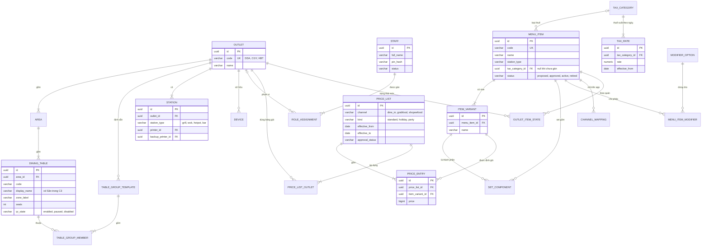
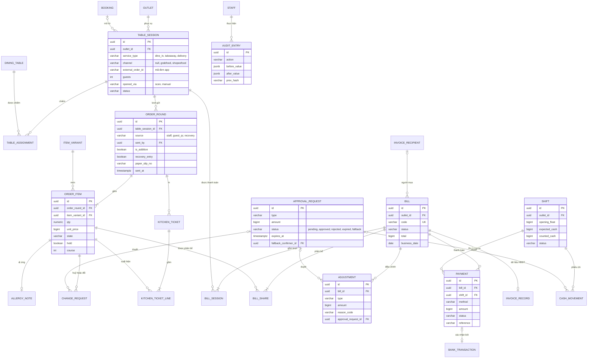
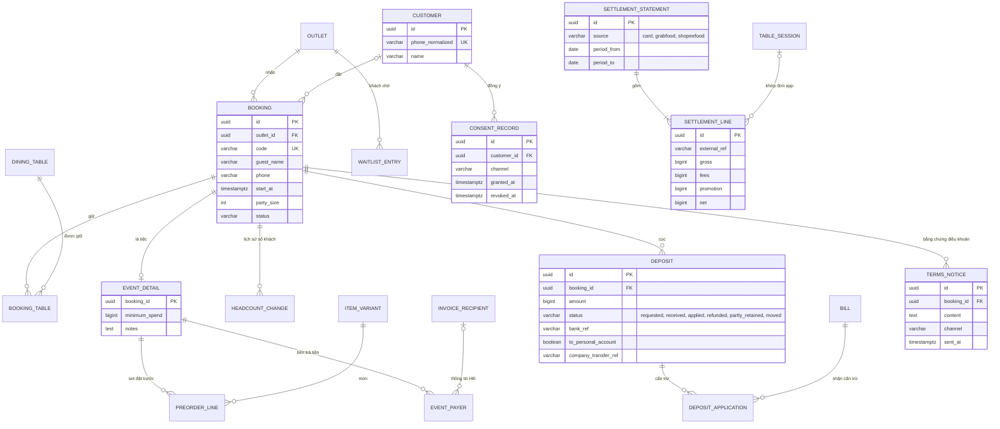
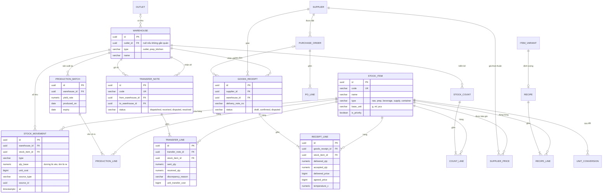
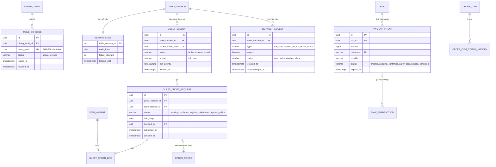

# Thiết kế — Phần 3: Cơ sở dữ liệu

> Phương pháp: skill `entity-model-designer`, `schema-normalizer`, `index-suggestion-writer`, `transaction-boundary-checker` (45ck/backend-persistence-skills).
> Hệ quản trị: **PostgreSQL** ở cả edge và cloud (ADR-02). Sơ đồ ERD vẽ bằng Mermaid `erDiagram`. Kiểu dữ liệu chi tiết ở từ điển dữ liệu (mục 6).

## 1. Quy ước

| Quy ước | Nội dung |
|---|---|
| Tên | `snake_case`, số ít (`order_item`) |
| Khoá chính | `id uuid`, là **UUIDv7** sinh tại thiết bị hoặc edge; đồng thời là khoá idempotency (ADR-04) |
| Phân vùng theo quán | Mọi bảng giao dịch có `outlet_id`; edge chỉ lưu dữ liệu quán của mình |
| Tiền | `bigint`, đơn vị **đồng** (ADR-06). Không dùng `float` |
| Số lượng | `numeric(12,3)`, theo **đơn vị cơ sở** (g, ml, cái) |
| Thời gian | `timestamptz`; `business_date date` cho báo cáo theo ngày kinh doanh (mốc chuyển ngày 04:00) |
| Kiểm toán | Mọi bảng giao dịch có `created_at`, `created_by` (staff), `device_id` |
| Không xoá | Bảng giao dịch **không có DELETE**. Chỉ chuyển trạng thái hoặc thêm bản ghi điều chỉnh (ADR-07) |
| Trạng thái | Cột `text` kèm `CHECK` theo danh sách giá trị (dễ đồng bộ hơn enum của PostgreSQL) |
| Migration | **Flyway** (Spring Boot): `db/migration/V{n}__{mo_ta}.sql`; view báo cáo là `R__{ten}.sql`. **Cùng một lược đồ** cho edge và cloud. Chỉ **mở rộng rồi thu hẹp** (expand/contract), không đổi tên hay xoá cột trong cùng một lần phát hành (NFR-45) |
| Ánh xạ JPA | Entity theo mô-đun Spring Modulith; khoá UUIDv7 sinh ở ứng dụng (không dùng `SERIAL`); `@Version` cho khoá lạc quan ở bảng có sửa trạng thái (bill, shift, guest_order_request) |

## 2. ERD — Tổ chức và thực đơn

## 3. ERD — Phục vụ, bill, thanh toán, ca

## 4. ERD — Đặt bàn, tiệc, khách hàng, đối soát

## 5. ERD — Kho, sơ chế, mua hàng

## 5b. ERD — Kênh khách QR và tự thanh toán (CR-01)

- **Công tắc QR** (BR-56) là cột `qr_state` (`enabled`, `paused`, `disabled`) trên `outlet`, `area` và `dining_table`. Trạng thái hiệu lực là trạng thái **chặt nhất** trong ba cấp.
- Giờ gọi cuối, ngưỡng số lượng, cửa sổ nghi trùng, bật hay tắt trạng thái "Xong" là **tham số** trong `rule_parameter` (FR-ADM-06).
- `order_round` có thêm cột `source` (`staff`, `guest_qr`, `recovery`) và `guest_order_request_id` (null được, duy nhất).
- `bank_transaction` có thêm các cột:
  - `provider`, `provider_txn_id`, `signature_verified`;
  - `match_status` (`matched`, `partial`, `unmatched`, `excess`, `duplicate`);
  - `payment_intent_id` (null được).

**Bổ sung theo CR-02** (nhân viên quét QR bàn):
- `dining_table.display_name` và `zone_label` là tên in trên thẻ và hiện chữ lớn khi quét (ví dụ "Sân trong C3"). Hai giá trị phải **khớp với sơ đồ bàn** (BR-61, BR-64).
- `table_session.opened_via` (`scan`, `manual`) ghi cách mở bàn. Chọn tay được lưu để quản lý biết thẻ nào hay hỏng (BR-63).
- `order_round.sent_by` là nhân viên bấm **Gửi**, được in trên phiếu bếp cùng `source` (BR-69).
- **Bản nháp chưa gửi chỉ nằm trong IndexedDB** của máy cầm tay, **không có bảng** trên edge (INV-20, BR-68).
- `table_qr_code` được đồng bộ xuống edge như dữ liệu chủ, nhưng **chỉ gồm băm token** (ADR-13).

**Tệp bằng chứng** (ảnh hoá đơn, ảnh hàng hỏng, phiếu giao) lưu ở **lưu trữ đối tượng**. Bảng `evidence_file` (`id`, `owner_type`, `owner_id`, `object_key`, `uploaded_by`, `uploaded_at`) liên kết tệp với phiếu chi, phiếu nhận, phiếu chuyển. Vì có thể **bổ sung sau** nên việc thiếu tệp không chặn nghiệp vụ (BR-32), trừ phiếu chi khi chốt ca (BR-24).

**Bảng đồng bộ** (edge và cloud):
- `outbox_event` (edge): `id uuid PK`, `outlet_id`, `seq bigint`, `aggregate_type`, `aggregate_id`, `event_type`, `payload jsonb`, `created_at`, `sent_at`. Ràng buộc duy nhất (`outlet_id`, `seq`).
- `inbox_event` (cloud): `event_id uuid PK`, `outlet_id`, `seq`, `processed_at`. Dùng để **bỏ qua sự kiện trùng**.
- `master_data_version` (edge): phiên bản dữ liệu chủ đã áp dụng.

## 6. Từ điển dữ liệu — các bảng quan trọng

### 6.1 `order_item`

| Cột | Kiểu | Ràng buộc | Mô tả |
|---|---|---|---|
| id | uuid | PK | UUIDv7 do máy cầm tay sinh; khoá idempotency |
| outlet_id | uuid | FK, NOT NULL | Quán |
| order_round_id | uuid | FK, NOT NULL | Lượt gửi |
| item_variant_id | uuid | FK, NOT NULL | Món và size |
| qty | numeric(12,3) | > 0 | Số lượng |
| unit_price | bigint | ≥ 0 | Giá tại thời điểm gọi, lấy từ bảng giá có hiệu lực theo kênh |
| tax_category_id | uuid | FK, NOT NULL | Chụp lại loại thuế tại thời điểm gọi |
| modifiers | jsonb | | Tuỳ chọn đã chọn (tên, giá cộng thêm) |
| note | varchar(200) | | Ghi chú |
| state | text | CHECK | draft, held, sent, in_progress, ready, served, void_requested, voided, replaced |
| held | boolean | default false | Đang giữ, chờ gọi ra món |
| course | smallint | | Lượt món |
| created_at, created_by, device_id | | NOT NULL | Kiểm toán |

### 6.2 `bill`

| Cột | Kiểu | Ràng buộc | Mô tả |
|---|---|---|---|
| id | uuid | PK | |
| outlet_id | uuid | FK | |
| code | varchar(20) | UNIQUE (outlet_id, code) | Mã hiển thị, ví dụ `DDA-270222-0042`; phiên bản rút gọn dùng trong nội dung QR |
| parent_bill_id | uuid | FK, null | Bill gốc khi tách |
| status | text | CHECK | open, settling, awaiting_confirmation, paid, closed, receivable (khách nợ), refunded_partial |
| subtotal, discount_total, rounding_total, deposit_applied, total | bigint | | Tổng (VND) |
| invoice_recipient_id | uuid | FK, null | Người mua trên HĐ; null là khách lẻ |
| business_date | date | NOT NULL | Ngày kinh doanh |
| closed_at, closed_by | | | |

### 6.3 `payment`

| Cột | Kiểu | Ràng buộc | Mô tả |
|---|---|---|---|
| id | uuid | PK | |
| bill_id | uuid | FK | |
| shift_id | uuid | FK | Ca thu |
| method | text | CHECK | cash, bank_transfer, card, ewallet |
| amount | bigint | > 0 | Số tiền |
| tendered | bigint | | Tiền khách đưa (tiền mặt) |
| status | text | CHECK | intended, confirmed, needs_approval, rejected, refunded |
| reference | varchar(64) | bắt buộc khi transfer ở trạng thái confirmed | Mã tham chiếu ngân hàng hoặc mã chuẩn chi thẻ |
| bank_transaction_id | uuid | FK, null | Liên kết khi tự khớp |
| confirmed_by, approved_by | uuid | FK, null | |

### 6.4 `adjustment`

| Cột | Kiểu | Ràng buộc | Mô tả |
|---|---|---|---|
| id | uuid | PK | |
| bill_id | uuid | FK | |
| order_item_id | uuid | FK, null | Khi giảm giá hoặc tặng một món |
| type | text | CHECK | discount, comp, miss_charge_removal, cash_rounding, deposit_offset |
| amount | bigint | > 0 | Luôn dương; làm **giảm** số phải trả |
| reason_code | text | NOT NULL, trừ `cash_rounding` | Theo danh mục lý do |
| note | varchar(300) | bắt buộc khi `reason_code = other` | |
| counts_toward_limit | boolean | | false với `miss_charge_removal` (BR-04) |
| approval_request_id | uuid | FK, null | |

### 6.5 `deposit`

| Cột | Kiểu | Ràng buộc | Mô tả |
|---|---|---|---|
| id | uuid | PK | |
| booking_id | uuid | FK | |
| amount | bigint | > 0 | |
| status | text | CHECK | requested, received, applied, refunded, partly_retained, moved |
| received_via | text | | bank_transfer, cash |
| bank_ref | varchar(64) | | |
| to_personal_account | boolean | default false | Ngoại lệ BR-12 |
| company_transfer_ref | varchar(64) | bắt buộc khi to_personal_account = true | Chứng từ chuyển về tài khoản công ty |
| retained_amount, refunded_amount | bigint | | Kết quả theo BR-11 |
| terms_notice_id | uuid | FK, null | Bằng chứng điều khoản; null thì hoàn 100% |

### 6.6 `stock_movement` (sổ kho — chỉ thêm)

| Cột | Kiểu | Ràng buộc | Mô tả |
|---|---|---|---|
| id | uuid | PK | |
| warehouse_id, stock_item_id | uuid | FK | |
| type | text | CHECK | purchase_in, transfer_out, transfer_in, sale_theoretical, waste, staff_meal, promo_in, promo_out, breakage, adjustment, production_consume, production_output |
| qty_base | numeric(14,3) | ≠ 0 | Dương là vào kho, âm là ra kho |
| unit_cost | bigint | | Giá vốn đơn vị cơ sở |
| source_type, source_id | text, uuid | | Chứng từ gốc |
| reason_code | text | | Bắt buộc với waste, adjustment, breakage |
| at | timestamptz | | |

### 6.7 `transfer_line`

| Cột | Kiểu | Ràng buộc | Mô tả |
|---|---|---|---|
| sent_qty | numeric(12,3) | > 0 | Theo đơn vị cơ sở (đã quy đổi từ hộp, túi) |
| received_qty | numeric(12,3) | 0 ≤ received_qty ≤ sent_qty | Bên nhận nhập |
| discrepancy_reason | text | bắt buộc khi received_qty < sent_qty | thiếu, rò, hỏng, sai hàng |
| unit_transfer_cost | bigint | | Giá nguyên liệu sống ÷ tỷ lệ thành phẩm của lô (BR-35) |
| cost_status | text | | charged, held_for_review (BR-34) |

### 6.8 `receipt_line`

| Cột | Kiểu | Ràng buộc | Mô tả |
|---|---|---|---|
| delivered_qty, accepted_qty | numeric(12,3) | NOT NULL khi xác nhận | BR-32 |
| rejected_reason | text | bắt buộc khi accepted_qty < delivered_qty | |
| delivered_price, agreed_price | bigint | | `agreed_price` lấy từ supplier_price có hiệu lực |
| price_variance_flag | boolean | tính = delivered_price ≠ agreed_price | |
| temperature_c | numeric(4,1) | bắt buộc với hàng lạnh | BR-33; ngưỡng ở OI-01 |
| received_at | timestamptz | | |

### 6.9 `approval_request`

| Cột | Kiểu | Ràng buộc | Mô tả |
|---|---|---|---|
| type | text | CHECK | discount_over_limit, shift_cap, void_after_kitchen, paid_out_over_limit, refund, payment_method_change, uncertain_transfer, stock_adjustment, cash_count_edit |
| amount | bigint | | |
| requested_by | uuid | FK | |
| approver_role | text | | owner, manager, accountant |
| status | text | CHECK | pending, approved, rejected, expired, fallback |
| expires_at | timestamptz | | Tạo lúc + 3 phút cho yêu cầu duyệt giảm giá (BR-03) |
| fallback_confirmer_id | uuid | FK, null | Người xác nhận thứ hai |
| decided_by, decided_at | | | |

### 6.10 `audit_entry` (chỉ thêm)

| Cột | Kiểu | Ràng buộc | Mô tả |
|---|---|---|---|
| id | uuid | PK | |
| outlet_id | uuid | | |
| actor_id, device_id | uuid | | |
| action | text | | Ví dụ `bill.discount.applied` |
| entity_type, entity_id | text, uuid | | |
| before_value, after_value | jsonb | | |
| reason_code, note | text | | |
| approved_by | uuid | | |
| prev_hash, hash | char(64) | | Chuỗi băm SHA-256 (NFR-16) |
| at | timestamptz | | |

### 6.11 `guest_order_request` (CR-01)

| Cột | Kiểu | Ràng buộc | Mô tả |
|---|---|---|---|
| id | uuid | PK | Do trang khách sinh; là khoá idempotency |
| guest_session_id, table_session_id | uuid | FK, NOT NULL | Điện thoại gửi, lượt phục vụ |
| status | text | CHECK | `pending`, `confirmed`, `rejected`, `withdrawn`, `rejected_offline` |
| hold_flags | jsonb | | Ví dụ `["alcohol","allergy","large_qty","set_changed","serve_later","possible_duplicate"]` (BR-43, 44) |
| allergy_verbatim | varchar(300) | | Nguyên văn ghi chú dị ứng của khách |
| decided_by | uuid | FK staff, null | Người xác nhận hoặc từ chối |
| reject_reason | text | bắt buộc khi `rejected` | |
| submitted_at, decided_at | timestamptz | | Để đo thời gian chờ xác nhận (FR-GST-21) |
| version | int | | Khoá lạc quan (hai nhân viên cùng bấm) |

### 6.12 `payment_intent` (CR-01)

| Cột | Kiểu | Ràng buộc | Mô tả |
|---|---|---|---|
| id | uuid | PK | |
| bill_id | uuid | FK, NOT NULL | |
| amount | bigint | > 0 | Số còn phải trả lúc tạo (INV-16) |
| reference | varchar(25) | UNIQUE | ASCII, ví dụ `KB DDA 7K3F2Q`, dùng làm nội dung chuyển khoản |
| provider | text | | `vietcombank`, `payos`, `sepay`, `casso`, `manual` (ADR-10) |
| provider_ref | varchar(64) | | Mã lệnh phía nhà cung cấp (nếu có) |
| status | text | CHECK | `created`, `awaiting`, `confirmed`, `partly_paid`, `expired`, `cancelled` |
| paid_amount | bigint | ≥ 0 | Tổng đã khớp |
| guest_session_id | uuid | FK, null | Khách tạo lệnh |
| expires_at | timestamptz | | Lệnh hết hạn thì được dọn bằng tác vụ `@Scheduled` (hỏi ở UC-38 câu 5) |

### 6.13 `table_qr_code`, `seating_code`, `guest_session` (CR-01)

| Bảng | Cột quan trọng | Ghi chú |
|---|---|---|
| table_qr_code | `token_hash` UNIQUE, `status` | Token gốc chỉ xuất hiện **một lần** khi in thẻ; CSDL chỉ giữ băm |
| seating_code | `code_hash`, `failed_attempts`, `locked_until` | Một mã cho mỗi lượt phục vụ; khoá sau 5 lần sai trong 15 phút |
| guest_session | `cookie_token_hash` UNIQUE, `expires_at`, `phone` (tuỳ chọn), `marketing_consent_id` (tuỳ chọn) | Dữ liệu phiên (không phải giao dịch) xoá sau 30 ngày (NFR-40) |

## 7. Index gợi ý

| Bảng | Index | Phục vụ |
|---|---|---|
| order_item | (order_round_id); (outlet_id, state) WHERE state IN ('sent','in_progress','ready') | Màn hình bếp, món chờ |
| kitchen_ticket | (outlet_id, printed_at DESC) | Màn hình điều phối |
| table_session | UNIQUE (channel, external_order_id) WHERE external_order_id IS NOT NULL | **Chặn trùng đơn app (BR-40)** |
| bill | (outlet_id, business_date); UNIQUE (outlet_id, code) | Báo cáo ngày, tra cứu |
| payment | (bill_id); (shift_id, status) | Chốt ca, khoản chưa xác nhận |
| bank_transaction | (match_status, received_at); (description) dùng trigram | Tự khớp và khớp tay |
| adjustment | (bill_id); (created_by, business_date) | Tính hạn mức theo ca (BR-02) |
| stock_movement | (warehouse_id, stock_item_id, at) | Tồn kho, chênh lệch |
| transfer_note | (to_warehouse_id, status) | Phiếu chờ nhận, tranh chấp |
| deposit | (booking_id); (status) | Sổ cọc |
| audit_entry | (entity_type, entity_id); (actor_id, at) | Tra cứu lịch sử |
| customer | UNIQUE (phone_normalized) | Chống trùng khách |
| outbox_event | UNIQUE (outlet_id, seq); (sent_at) WHERE sent_at IS NULL | Đồng bộ |
| guest_order_request | (table_session_id, status) WHERE status = 'pending'; (submitted_at) | Hàng chờ xác nhận, đo thời gian (CR-01) |
| payment_intent | UNIQUE (reference); **UNIQUE (bill_id) WHERE status IN ('created','awaiting','partly_paid')** | Khớp giao dịch; **mỗi bill tối đa 1 lệnh đang hoạt động** (INV-16) |
| bank_transaction | UNIQUE (provider, provider_txn_id); (match_status) WHERE match_status IN ('unmatched','excess','duplicate') | **Chống xử lý trùng webhook**; hàng chờ của thu ngân |
| table_qr_code | UNIQUE (token_hash); (dining_table_id) WHERE status = 'active' | Tra token khi quét. *(CR-02)* Bảng có **bản sao ở edge** (chỉ băm), để app nhân viên quét được khi mất Internet (ADR-13) |
| guest_session | UNIQUE (cookie_token_hash); (table_session_id, status) | |
| service_request | (table_session_id, status) WHERE status <> 'done' | Gọi nhân viên đang mở |
| table_assignment | **UNIQUE (dining_table_id) WHERE to_at IS NULL** | *(CR-02)* **Mỗi bàn tối đa một nhóm đang ngồi** (INV-18). Hai máy quét cùng lúc cũng không mở được nhóm thứ hai |

## 8. Ranh giới giao dịch

| Thao tác | Trong một giao dịch CSDL | Ghi chú |
|---|---|---|
| Gửi món | order_round + order_item + kitchen_ticket + outbox_event | In **sau khi commit**; lệnh in có mã, nên in lại không tạo phiếu mới |
| Đóng bill | bill (status) + payment + adjustment (làm tròn) + invoice_record + outbox_event | Kiểm tra INV-02 trước khi commit |
| Duyệt giảm giá | approval_request + adjustment + audit_entry | |
| Chốt ca | shift + audit_entry + outbox_event | Kiểm tra INV-12 |
| Xác nhận nhận chuyển kho | transfer_line + stock_movement (vào) + cập nhật cost_status | Phía gửi đã ghi stock_movement (ra) lúc gửi |

## 9. Lưu trữ dài hạn (NFR-20)

- Bảng giao dịch lớn (`order_item`, `bill`, `payment`, `stock_movement`, `audit_entry`) được **phân vùng theo tháng** ở cloud.
- Dữ liệu **quá 2 năm** được xuất sang lưu trữ đối tượng (định dạng cột, có kèm bản CSV) và gỡ khỏi CSDL nóng. Có công cụ **nạp lại theo khoảng thời gian** khi cần tra cứu (≤ 1 ngày làm việc).
- Edge chỉ giữ dữ liệu **90 ngày gần nhất**; nguồn chính thức là cloud.
