# Thiết kế — Phần 4: Sơ đồ tuần tự và máy trạng thái

> Phương pháp: skill `sequence-diagram-builder`, `state-model-builder`, `scenario-to-uml-transformer`, `model-consistency-checker` (45ck/uml-analysis-modelling-skills).
> Tên participant khớp với [kiến trúc](01-kien-truc.md). Tên lớp và trạng thái khớp với [mô hình miền](02-mo-hinh-lop.md).

## A. Sơ đồ tuần tự

### SD-01 Gửi món, có idempotency (UC-01)

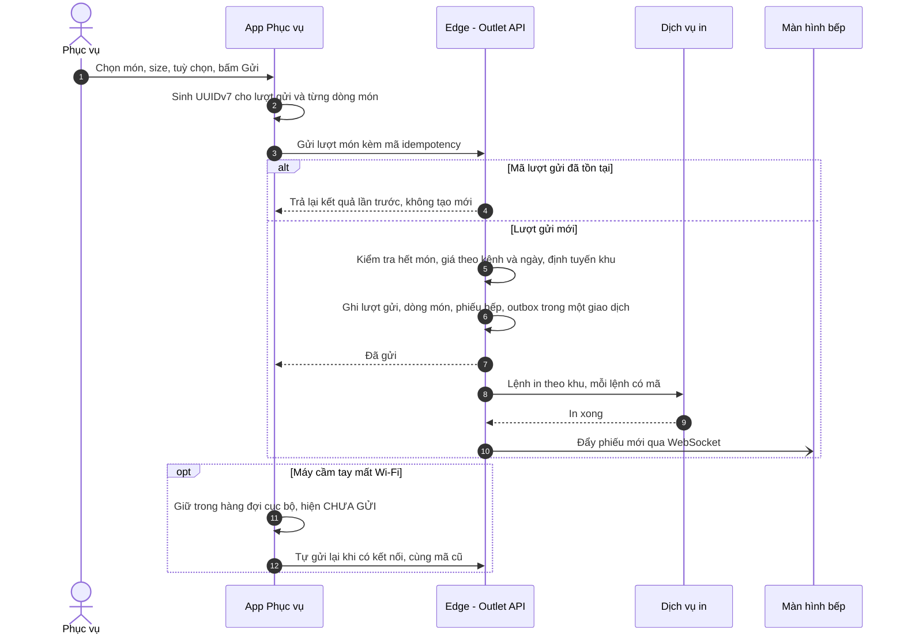
```mermaid
sequenceDiagram
    autonumber
    actor PV as Phục vụ
    participant HH as App Phục vụ
    participant E as Edge - Outlet API
    participant P as Dịch vụ in
    participant K as Màn hình bếp
    PV->>HH: Chọn món, size, tuỳ chọn, bấm Gửi
    HH->>HH: Sinh UUIDv7 cho lượt gửi và từng dòng món
    HH->>E: Gửi lượt món kèm mã idempotency
    alt Mã lượt gửi đã tồn tại
        E-->>HH: Trả lại kết quả lần trước, không tạo mới
    else Lượt gửi mới
        E->>E: Kiểm tra hết món, giá theo kênh và ngày, định tuyến khu
        E->>E: Ghi lượt gửi, dòng món, phiếu bếp, outbox trong một giao dịch
        E-->>HH: Đã gửi
        E->>P: Lệnh in theo khu, mỗi lệnh có mã
        P-->>E: In xong
        E-)K: Đẩy phiếu mới qua WebSocket
    end
    opt Máy cầm tay mất Wi-Fi
        HH->>HH: Giữ trong hàng đợi cục bộ, hiện CHƯA GỬI
        HH->>E: Tự gửi lại khi có kết nối, cùng mã cũ
    end
```

### SD-02 Huỷ món đã tới bếp (UC-03)

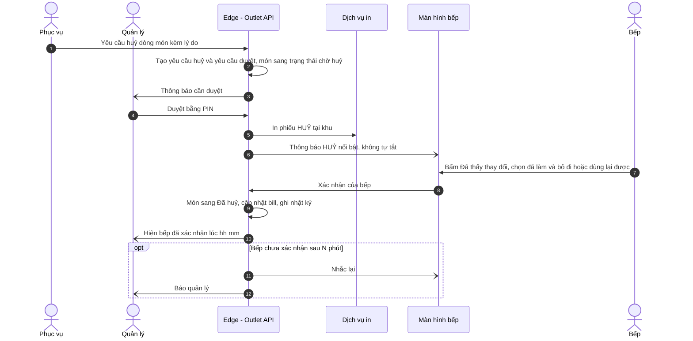
```mermaid
sequenceDiagram
    autonumber
    actor PV as Phục vụ
    actor QL as Quản lý
    participant E as Edge - Outlet API
    participant P as Dịch vụ in
    participant K as Màn hình bếp
    actor B as Bếp
    PV->>E: Yêu cầu huỷ dòng món kèm lý do
    E->>E: Tạo yêu cầu huỷ và yêu cầu duyệt, món sang trạng thái chờ huỷ
    E-)QL: Thông báo cần duyệt
    QL->>E: Duyệt bằng PIN
    E->>P: In phiếu HUỶ tại khu
    E-)K: Thông báo HUỶ nổi bật, không tự tắt
    B->>K: Bấm Đã thấy thay đổi, chọn đã làm và bỏ đi hoặc dùng lại được
    K->>E: Xác nhận của bếp
    E->>E: Món sang Đã huỷ, cập nhật bill, ghi nhật ký
    E-)QL: Hiện bếp đã xác nhận lúc hh mm
    opt Bếp chưa xác nhận sau N phút
        E-)K: Nhắc lại
        E-)QL: Báo quản lý
    end
```

### SD-03 Giảm giá vượt hạn mức: duyệt từ xa và dự phòng 3 phút (UC-09, UC-10)

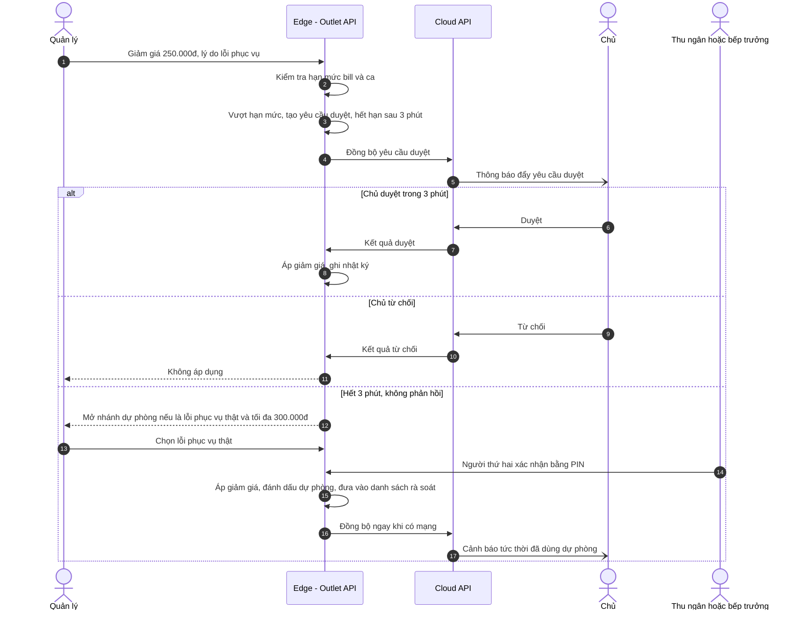
```mermaid
sequenceDiagram
    autonumber
    actor QL as Quản lý
    participant E as Edge - Outlet API
    participant C as Cloud API
    actor CH as Chủ
    actor X as Thu ngân hoặc bếp trưởng
    QL->>E: Giảm giá 250.000đ, lý do lỗi phục vụ
    E->>E: Kiểm tra hạn mức bill và ca
    E->>E: Vượt hạn mức, tạo yêu cầu duyệt, hết hạn sau 3 phút
    E->>C: Đồng bộ yêu cầu duyệt
    C-)CH: Thông báo đẩy yêu cầu duyệt
    alt Chủ duyệt trong 3 phút
        CH->>C: Duyệt
        C->>E: Kết quả duyệt
        E->>E: Áp giảm giá, ghi nhật ký
    else Chủ từ chối
        CH->>C: Từ chối
        C->>E: Kết quả từ chối
        E-->>QL: Không áp dụng
    else Hết 3 phút, không phản hồi
        E-->>QL: Mở nhánh dự phòng nếu là lỗi phục vụ thật và tối đa 300.000đ
        QL->>E: Chọn lỗi phục vụ thật
        X->>E: Người thứ hai xác nhận bằng PIN
        E->>E: Áp giảm giá, đánh dấu dự phòng, đưa vào danh sách rà soát
        E->>C: Đồng bộ ngay khi có mạng
        C-)CH: Cảnh báo tức thời đã dùng dự phòng
    end
```

### SD-04 Thanh toán QR động và xác nhận ngân hàng (UC-08, UC-11)

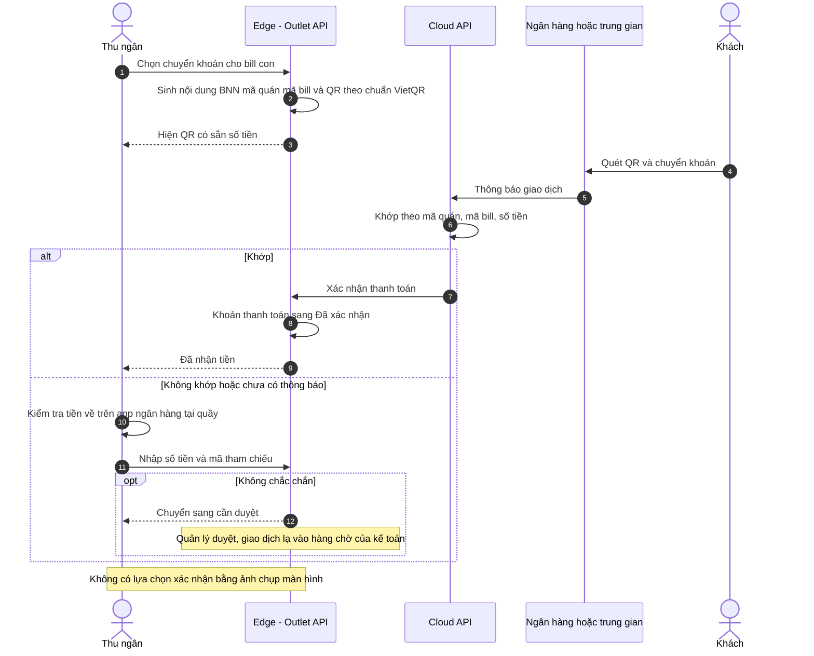
```mermaid
sequenceDiagram
    autonumber
    actor TN as Thu ngân
    participant E as Edge - Outlet API
    participant C as Cloud API
    participant NH as Ngân hàng hoặc trung gian
    actor KH as Khách
    TN->>E: Chọn chuyển khoản cho bill con
    E->>E: Sinh nội dung BNN mã quán mã bill và QR theo chuẩn VietQR
    E-->>TN: Hiện QR có sẵn số tiền
    KH->>NH: Quét QR và chuyển khoản
    NH->>C: Thông báo giao dịch
    C->>C: Khớp theo mã quán, mã bill, số tiền
    alt Khớp
        C->>E: Xác nhận thanh toán
        E->>E: Khoản thanh toán sang Đã xác nhận
        E-->>TN: Đã nhận tiền
    else Không khớp hoặc chưa có thông báo
        TN->>TN: Kiểm tra tiền về trên app ngân hàng tại quầy
        TN->>E: Nhập số tiền và mã tham chiếu
        opt Không chắc chắn
            E-->>TN: Chuyển sang cần duyệt
            Note over E: Quản lý duyệt, giao dịch lạ vào hàng chờ của kế toán
        end
    end
    Note over TN,E: Không có lựa chọn xác nhận bằng ảnh chụp màn hình
```

### SD-05 Đồng bộ sau khi có mạng lại (FR-OFF-03)

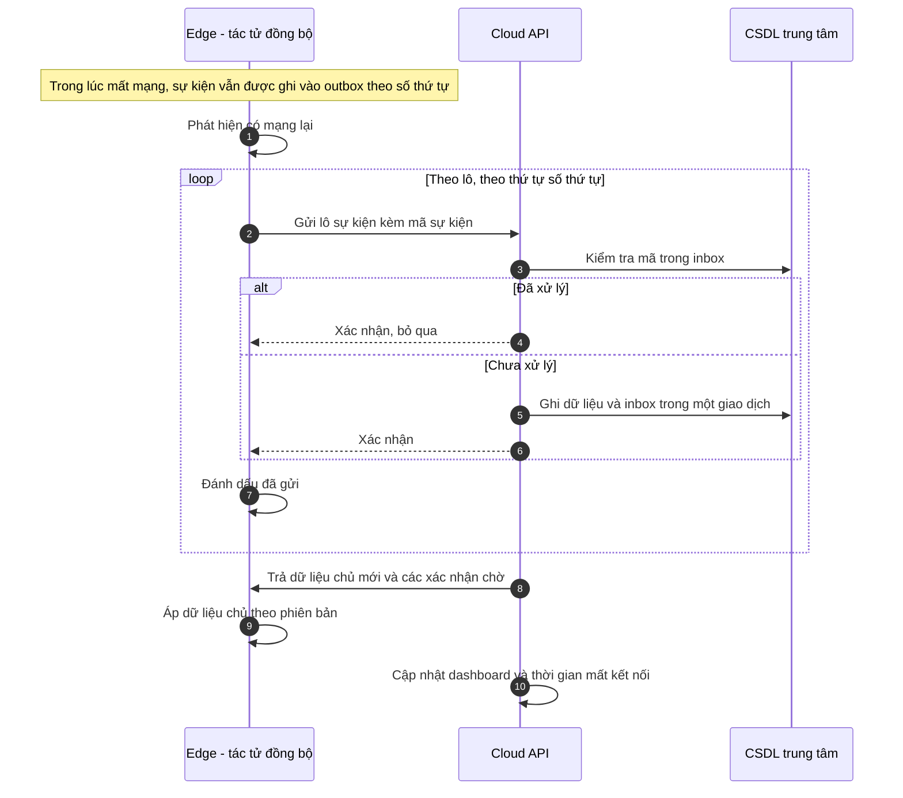
```mermaid
sequenceDiagram
    autonumber
    participant E as Edge - tác tử đồng bộ
    participant C as Cloud API
    participant DB as CSDL trung tâm
    Note over E: Trong lúc mất mạng, sự kiện vẫn được ghi vào outbox theo số thứ tự
    E->>E: Phát hiện có mạng lại
    loop Theo lô, theo thứ tự số thứ tự
        E->>C: Gửi lô sự kiện kèm mã sự kiện
        C->>DB: Kiểm tra mã trong inbox
        alt Đã xử lý
            C-->>E: Xác nhận, bỏ qua
        else Chưa xử lý
            C->>DB: Ghi dữ liệu và inbox trong một giao dịch
            C-->>E: Xác nhận
        end
        E->>E: Đánh dấu đã gửi
    end
    C->>E: Trả dữ liệu chủ mới và các xác nhận chờ
    E->>E: Áp dữ liệu chủ theo phiên bản
    C->>C: Cập nhật dashboard và thời gian mất kết nối
```

### SD-06 Chuyển kho sơ chế có tranh chấp (UC-21)

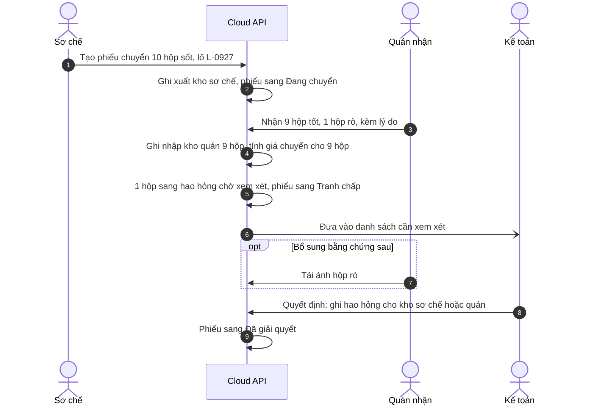
```mermaid
sequenceDiagram
    autonumber
    actor SC as Sơ chế
    participant C as Cloud API
    actor QN as Quán nhận
    actor KT as Kế toán
    SC->>C: Tạo phiếu chuyển 10 hộp sốt, lô L-0927
    C->>C: Ghi xuất kho sơ chế, phiếu sang Đang chuyển
    QN->>C: Nhận 9 hộp tốt, 1 hộp rò, kèm lý do
    C->>C: Ghi nhập kho quán 9 hộp, tính giá chuyển cho 9 hộp
    C->>C: 1 hộp sang hao hỏng chờ xem xét, phiếu sang Tranh chấp
    C-)KT: Đưa vào danh sách cần xem xét
    opt Bổ sung bằng chứng sau
        QN->>C: Tải ảnh hộp rò
    end
    KT->>C: Quyết định: ghi hao hỏng cho kho sơ chế hoặc quán
    C->>C: Phiếu sang Đã giải quyết
```

### SD-07 Chốt ca và cảnh báo (UC-13)

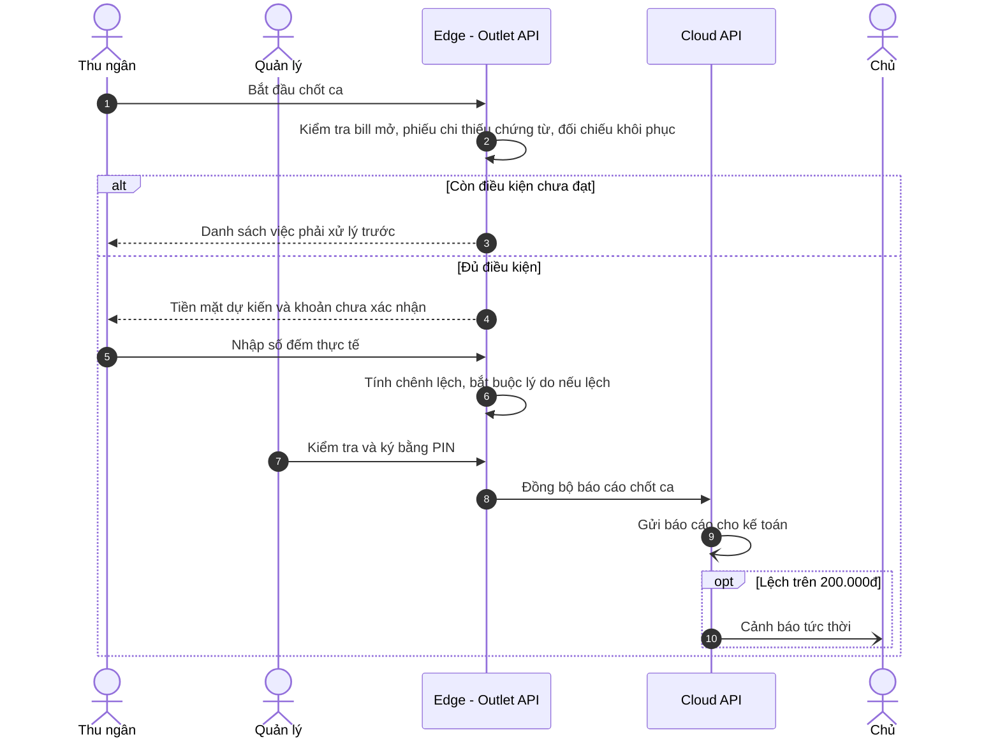
```mermaid
sequenceDiagram
    autonumber
    actor TN as Thu ngân
    actor QL as Quản lý
    participant E as Edge - Outlet API
    participant C as Cloud API
    actor CH as Chủ
    TN->>E: Bắt đầu chốt ca
    E->>E: Kiểm tra bill mở, phiếu chi thiếu chứng từ, đối chiếu khôi phục
    alt Còn điều kiện chưa đạt
        E-->>TN: Danh sách việc phải xử lý trước
    else Đủ điều kiện
        E-->>TN: Tiền mặt dự kiến và khoản chưa xác nhận
        TN->>E: Nhập số đếm thực tế
        E->>E: Tính chênh lệch, bắt buộc lý do nếu lệch
        QL->>E: Kiểm tra và ký bằng PIN
        E->>C: Đồng bộ báo cáo chốt ca
        C-)C: Gửi báo cáo cho kế toán
        opt Lệch trên 200.000đ
            C-)CH: Cảnh báo tức thời
        end
    end
```

### SD-08 Khách gửi món thêm qua QR, nhân viên xác nhận (UC-34, UC-35, CR-01)

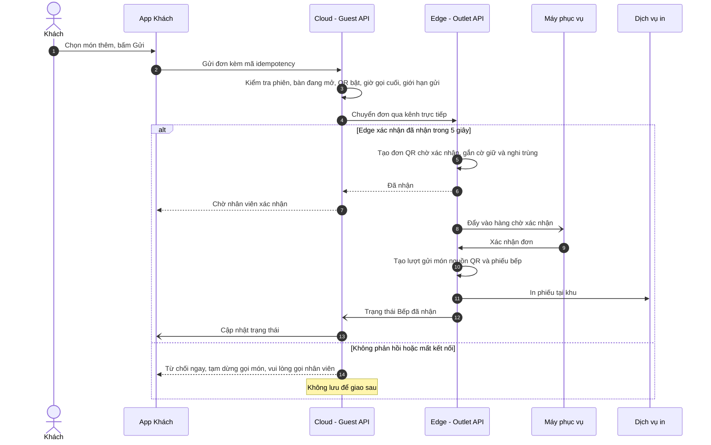
```mermaid
sequenceDiagram
    autonumber
    actor KH as Khách
    participant GA as App Khách
    participant G as Cloud - Guest API
    participant E as Edge - Outlet API
    participant HH as Máy phục vụ
    participant P as Dịch vụ in
    KH->>GA: Chọn món thêm, bấm Gửi
    GA->>G: Gửi đơn kèm mã idempotency
    G->>G: Kiểm tra phiên, bàn đang mở, QR bật, giờ gọi cuối, giới hạn gửi
    G->>E: Chuyển đơn qua kênh trực tiếp
    alt Edge xác nhận đã nhận trong 5 giây
        E->>E: Tạo đơn QR chờ xác nhận, gắn cờ giữ và nghi trùng
        E-->>G: Đã nhận
        G-->>GA: Chờ nhân viên xác nhận
        E-)HH: Đẩy vào hàng chờ xác nhận
        HH->>E: Xác nhận đơn
        E->>E: Tạo lượt gửi món nguồn QR và phiếu bếp
        E->>P: In phiếu tại khu
        E-)G: Trạng thái Bếp đã nhận
        G-)GA: Cập nhật trạng thái
    else Không phản hồi hoặc mất kết nối
        G-->>GA: Từ chối ngay, tạm dừng gọi món, vui lòng gọi nhân viên
        Note over G: Không lưu để giao sau
    end
```

### SD-09 Khách tự thanh toán chuyển khoản (UC-38, CR-01)

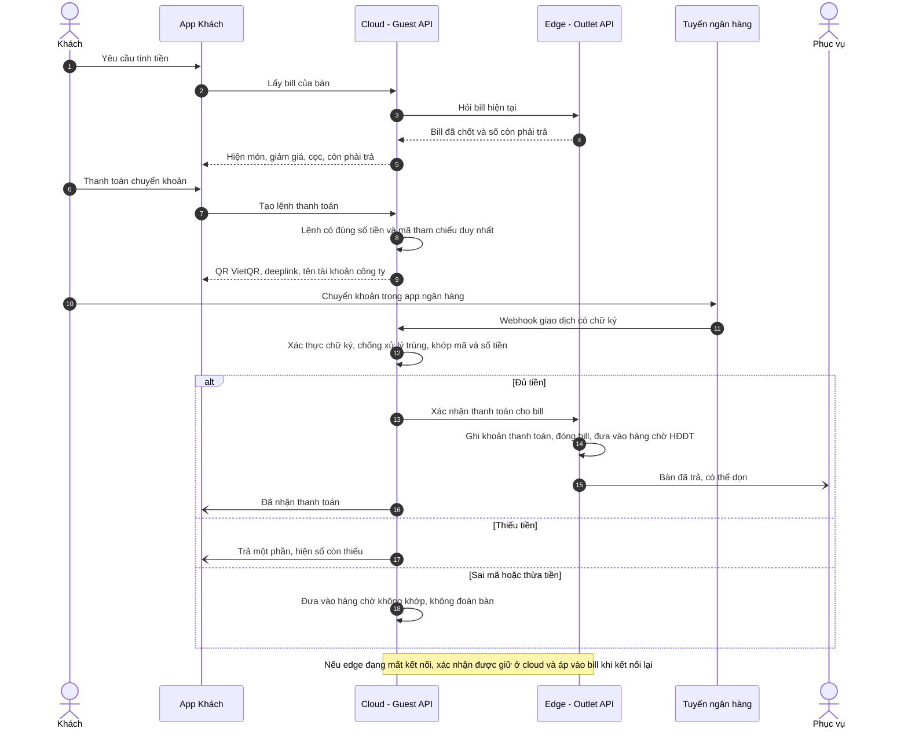
```mermaid
sequenceDiagram
    autonumber
    actor KH as Khách
    participant GA as App Khách
    participant G as Cloud - Guest API
    participant E as Edge - Outlet API
    participant PR as Tuyến ngân hàng
    actor PV as Phục vụ
    KH->>GA: Yêu cầu tính tiền
    GA->>G: Lấy bill của bàn
    G->>E: Hỏi bill hiện tại
    E-->>G: Bill đã chốt và số còn phải trả
    G-->>GA: Hiện món, giảm giá, cọc, còn phải trả
    KH->>GA: Thanh toán chuyển khoản
    GA->>G: Tạo lệnh thanh toán
    G->>G: Lệnh có đúng số tiền và mã tham chiếu duy nhất
    G-->>GA: QR VietQR, deeplink, tên tài khoản công ty
    KH->>PR: Chuyển khoản trong app ngân hàng
    PR->>G: Webhook giao dịch có chữ ký
    G->>G: Xác thực chữ ký, chống xử lý trùng, khớp mã và số tiền
    alt Đủ tiền
        G->>E: Xác nhận thanh toán cho bill
        E->>E: Ghi khoản thanh toán, đóng bill, đưa vào hàng chờ HĐĐT
        E-)PV: Bàn đã trả, có thể dọn
        G-)GA: Đã nhận thanh toán
    else Thiếu tiền
        G-)GA: Trả một phần, hiện số còn thiếu
    else Sai mã hoặc thừa tiền
        G->>G: Đưa vào hàng chờ không khớp, không đoán bàn
    end
    Note over G,E: Nếu edge đang mất kết nối, xác nhận được giữ ở cloud và áp vào bill khi kết nối lại
```

### SD-10 Mất kết nối thì tạm dừng QR (BR-55, CR-01)

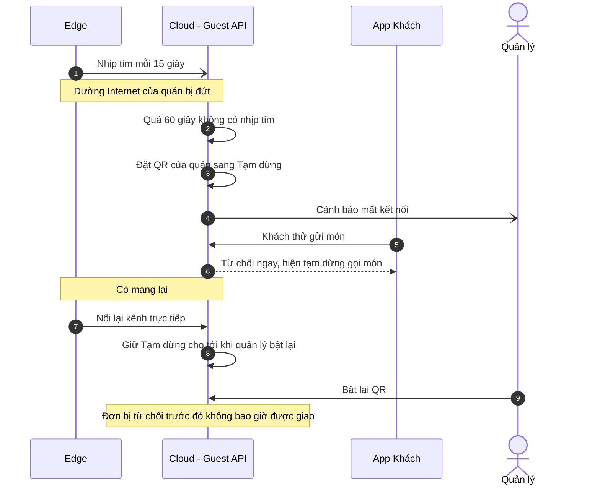
```mermaid
sequenceDiagram
    autonumber
    participant E as Edge
    participant G as Cloud - Guest API
    participant GA as App Khách
    actor QL as Quản lý
    E-)G: Nhịp tim mỗi 15 giây
    Note over E,G: Đường Internet của quán bị đứt
    G->>G: Quá 60 giây không có nhịp tim
    G->>G: Đặt QR của quán sang Tạm dừng
    G-)QL: Cảnh báo mất kết nối
    GA->>G: Khách thử gửi món
    G-->>GA: Từ chối ngay, hiện tạm dừng gọi món
    Note over E,G: Có mạng lại
    E->>G: Nối lại kênh trực tiếp
    G->>G: Giữ Tạm dừng cho tới khi quản lý bật lại
    QL->>G: Bật lại QR
    Note over G: Đơn bị từ chối trước đó không bao giờ được giao
```

- **Quyết định thiết kế (đề xuất):** QR **tự tạm dừng** khi mất kết nối, nhưng **chỉ bật lại bằng tay**. Lý do: quản lý cần báo lại cho khách và chắc rằng nhân viên đã xử lý xong các đơn nhận bằng máy cầm tay hoặc phiếu giấy (S10-R12).

## B. Máy trạng thái

### ST-01 Dòng món (OrderItem)

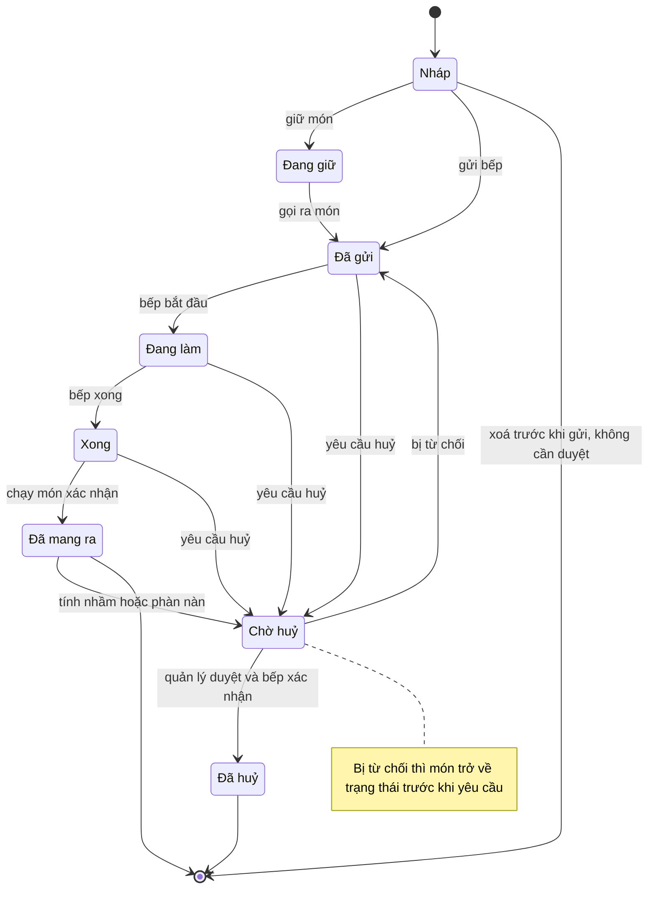
```mermaid
stateDiagram-v2
    state "Nháp" as Draft
    state "Đang giữ" as Held
    state "Đã gửi" as Sent
    state "Đang làm" as InProgress
    state "Xong" as Ready
    state "Đã mang ra" as Served
    state "Chờ huỷ" as VoidRequested
    state "Đã huỷ" as Voided
    [*] --> Draft
    Draft --> Held : giữ món
    Draft --> Sent : gửi bếp
    Held --> Sent : gọi ra món
    Draft --> [*] : xoá trước khi gửi, không cần duyệt
    Sent --> InProgress : bếp bắt đầu
    InProgress --> Ready : bếp xong
    Ready --> Served : chạy món xác nhận
    Sent --> VoidRequested : yêu cầu huỷ
    InProgress --> VoidRequested : yêu cầu huỷ
    Ready --> VoidRequested : yêu cầu huỷ
    Served --> VoidRequested : tính nhầm hoặc phàn nàn
    VoidRequested --> Voided : quản lý duyệt và bếp xác nhận
    VoidRequested --> Sent : bị từ chối
    Served --> [*]
    Voided --> [*]
    note right of VoidRequested : Bị từ chối thì món trở về trạng thái trước khi yêu cầu
```

- **Gác cửa (guard):** chuyển *Chờ huỷ → Đã huỷ* cần **cả** quản lý duyệt **và** bếp xác nhận (BR-07). Món đang *Nháp* thì phục vụ xoá tự do (BR-06).
- **Đổi món** = huỷ món cũ + thêm dòng mới; phiếu in ghi **THAY THẾ**.

### ST-02 Bàn (DiningTable, trạng thái hiển thị)

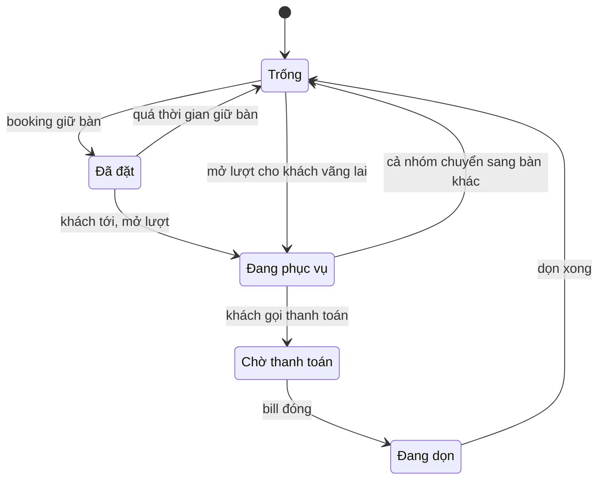
```mermaid
stateDiagram-v2
    state "Trống" as Free
    state "Đã đặt" as Reserved
    state "Đang phục vụ" as Occupied
    state "Chờ thanh toán" as BillRequested
    state "Đang dọn" as Cleaning
    [*] --> Free
    Free --> Reserved : booking giữ bàn
    Reserved --> Occupied : khách tới, mở lượt
    Reserved --> Free : quá thời gian giữ bàn
    Free --> Occupied : mở lượt cho khách vãng lai
    Occupied --> BillRequested : khách gọi thanh toán
    Occupied --> Free : cả nhóm chuyển sang bàn khác
    BillRequested --> Cleaning : bill đóng
    Cleaning --> Free : dọn xong
```

### ST-03 Bill

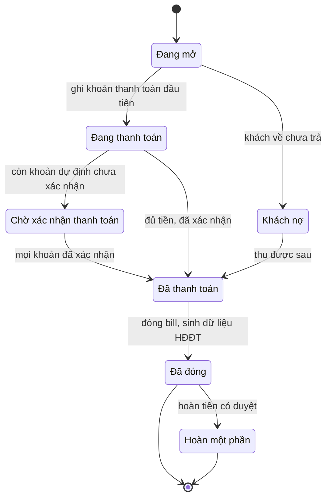
```mermaid
stateDiagram-v2
    state "Đang mở" as Open
    state "Đang thanh toán" as Settling
    state "Chờ xác nhận thanh toán" as Awaiting
    state "Đã thanh toán" as Paid
    state "Đã đóng" as Closed
    state "Khách nợ" as Receivable
    state "Hoàn một phần" as Refunded
    [*] --> Open
    Open --> Settling : ghi khoản thanh toán đầu tiên
    Settling --> Awaiting : còn khoản dự định chưa xác nhận
    Awaiting --> Paid : mọi khoản đã xác nhận
    Settling --> Paid : đủ tiền, đã xác nhận
    Open --> Receivable : khách về chưa trả
    Receivable --> Paid : thu được sau
    Paid --> Closed : đóng bill, sinh dữ liệu HĐĐT
    Closed --> Refunded : hoàn tiền có duyệt
    Closed --> [*]
    Refunded --> [*]
```

### ST-04 Khoản thanh toán (Payment)

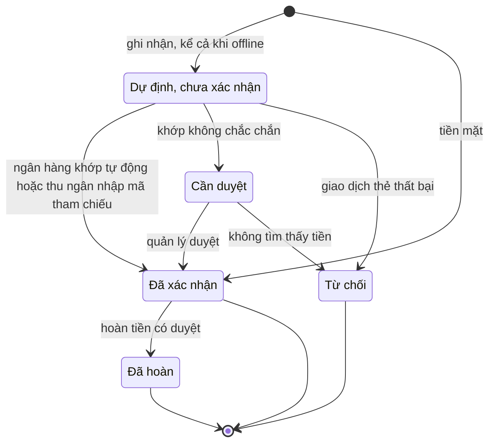
```mermaid
stateDiagram-v2
    state "Dự định, chưa xác nhận" as Intended
    state "Cần duyệt" as NeedsApproval
    state "Đã xác nhận" as Confirmed
    state "Từ chối" as Rejected
    state "Đã hoàn" as RefundedP
    [*] --> Intended : ghi nhận, kể cả khi offline
    [*] --> Confirmed : tiền mặt
    Intended --> Confirmed : ngân hàng khớp tự động hoặc thu ngân nhập mã tham chiếu
    Intended --> NeedsApproval : khớp không chắc chắn
    NeedsApproval --> Confirmed : quản lý duyệt
    NeedsApproval --> Rejected : không tìm thấy tiền
    Intended --> Rejected : giao dịch thẻ thất bại
    Confirmed --> RefundedP : hoàn tiền có duyệt
    Rejected --> [*]
    Confirmed --> [*]
    RefundedP --> [*]
```

### ST-05 Tiền cọc (Deposit)

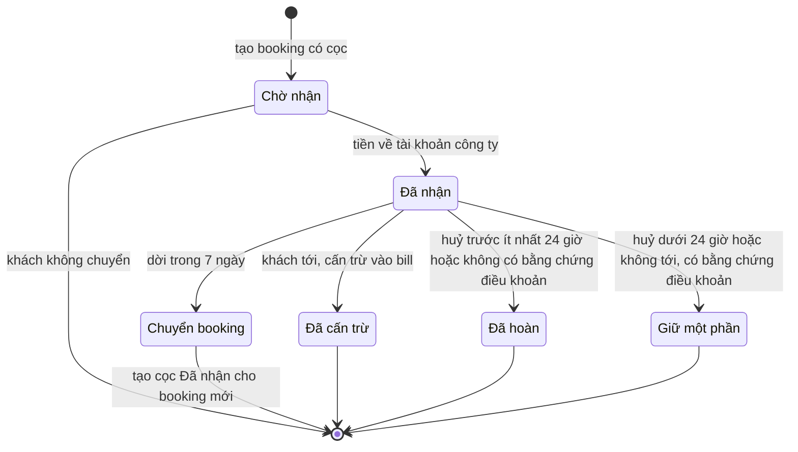
```mermaid
stateDiagram-v2
    state "Chờ nhận" as Requested
    state "Đã nhận" as Received
    state "Đã cấn trừ" as Applied
    state "Đã hoàn" as RefundedD
    state "Giữ một phần" as PartlyRetained
    state "Chuyển booking" as Moved
    [*] --> Requested : tạo booking có cọc
    Requested --> Received : tiền về tài khoản công ty
    Requested --> [*] : khách không chuyển
    Received --> Applied : khách tới, cấn trừ vào bill
    Received --> RefundedD : huỷ trước ít nhất 24 giờ hoặc không có bằng chứng điều khoản
    Received --> PartlyRetained : huỷ dưới 24 giờ hoặc không tới, có bằng chứng điều khoản
    Received --> Moved : dời trong 7 ngày
    Moved --> [*] : tạo cọc Đã nhận cho booking mới
    Applied --> [*]
    RefundedD --> [*]
    PartlyRetained --> [*]
```

- Không trạng thái nào tạo **doanh thu** trực tiếp (INV-06). Phần giữ lại được hạch toán theo cách kế toán duyệt (OI-05).

### ST-06 Phiếu chuyển kho (TransferNote)

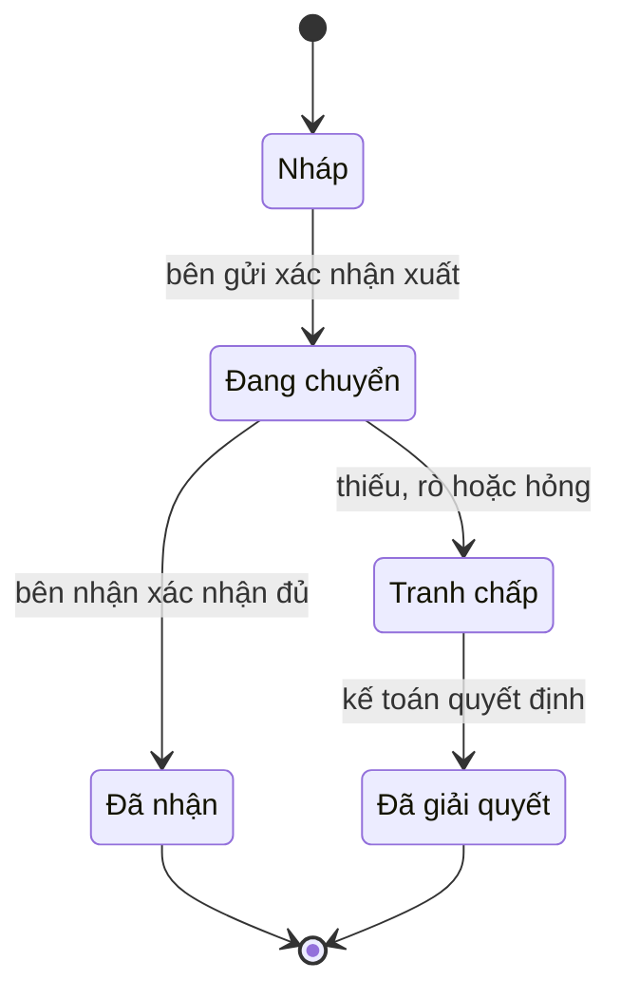
```mermaid
stateDiagram-v2
    state "Nháp" as TDraft
    state "Đang chuyển" as Dispatched
    state "Đã nhận" as TReceived
    state "Tranh chấp" as Disputed
    state "Đã giải quyết" as Resolved
    [*] --> TDraft
    TDraft --> Dispatched : bên gửi xác nhận xuất
    Dispatched --> TReceived : bên nhận xác nhận đủ
    Dispatched --> Disputed : thiếu, rò hoặc hỏng
    Disputed --> Resolved : kế toán quyết định
    TReceived --> [*]
    Resolved --> [*]
```

### ST-07 Ca (Shift)

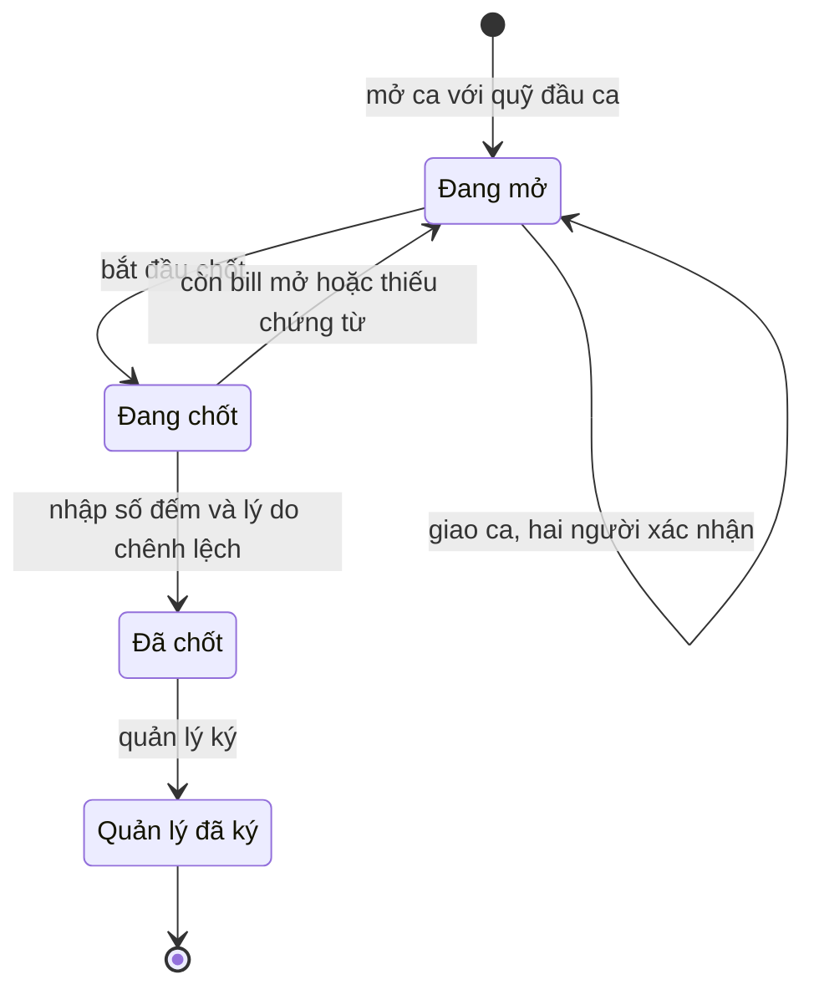
```mermaid
stateDiagram-v2
    state "Đang mở" as SOpen
    state "Đang chốt" as Closing
    state "Đã chốt" as SClosed
    state "Quản lý đã ký" as Verified
    [*] --> SOpen : mở ca với quỹ đầu ca
    SOpen --> SOpen : giao ca, hai người xác nhận
    SOpen --> Closing : bắt đầu chốt
    Closing --> SOpen : còn bill mở hoặc thiếu chứng từ
    Closing --> SClosed : nhập số đếm và lý do chênh lệch
    SClosed --> Verified : quản lý ký
    Verified --> [*]
```

### ST-08 Yêu cầu duyệt (ApprovalRequest)

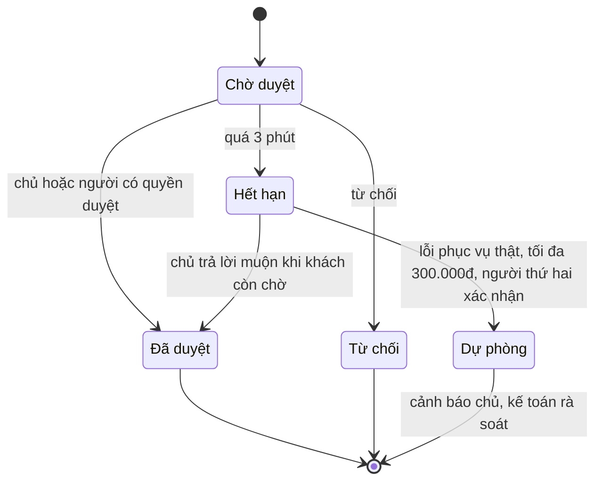
```mermaid
stateDiagram-v2
    state "Chờ duyệt" as Pending
    state "Đã duyệt" as Approved
    state "Từ chối" as ARejected
    state "Hết hạn" as Expired
    state "Dự phòng" as Fallback
    [*] --> Pending
    Pending --> Approved : chủ hoặc người có quyền duyệt
    Pending --> ARejected : từ chối
    Pending --> Expired : quá 3 phút
    Expired --> Approved : chủ trả lời muộn khi khách còn chờ
    Expired --> Fallback : lỗi phục vụ thật, tối đa 300.000đ, người thứ hai xác nhận
    Approved --> [*]
    ARejected --> [*]
    Fallback --> [*] : cảnh báo chủ, kế toán rà soát
```

### ST-09 Đơn QR của khách (GuestOrderRequest, CR-01)

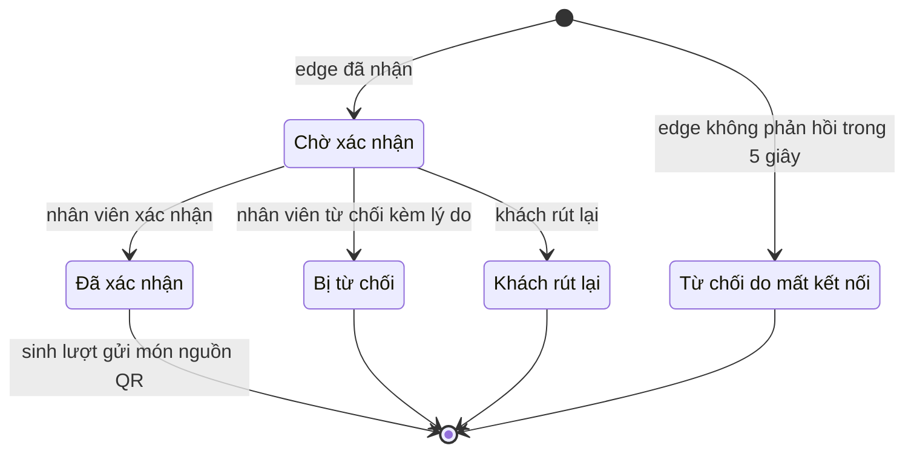
```mermaid
stateDiagram-v2
    state "Chờ xác nhận" as GPending
    state "Đã xác nhận" as GConfirmed
    state "Bị từ chối" as GRejected
    state "Khách rút lại" as GWithdrawn
    state "Từ chối do mất kết nối" as GOffline
    [*] --> GPending : edge đã nhận
    [*] --> GOffline : edge không phản hồi trong 5 giây
    GPending --> GConfirmed : nhân viên xác nhận
    GPending --> GRejected : nhân viên từ chối kèm lý do
    GPending --> GWithdrawn : khách rút lại
    GConfirmed --> [*] : sinh lượt gửi món nguồn QR
    GRejected --> [*]
    GWithdrawn --> [*]
    GOffline --> [*]
```

- **Gác cửa:** ở QR-1, chỉ **nhân viên** được chuyển *Chờ xác nhận → Đã xác nhận* (BR-42). Đơn có cờ giữ (BR-43) cần thêm bước "đã trao đổi với khách" (dị ứng: bếp trưởng xem).
- Khi đơn đã sang *Đã xác nhận*, mọi thay đổi về sau đi theo **ST-01** (món) và BR-07.

### ST-10 Lệnh thanh toán (PaymentIntent, CR-01)

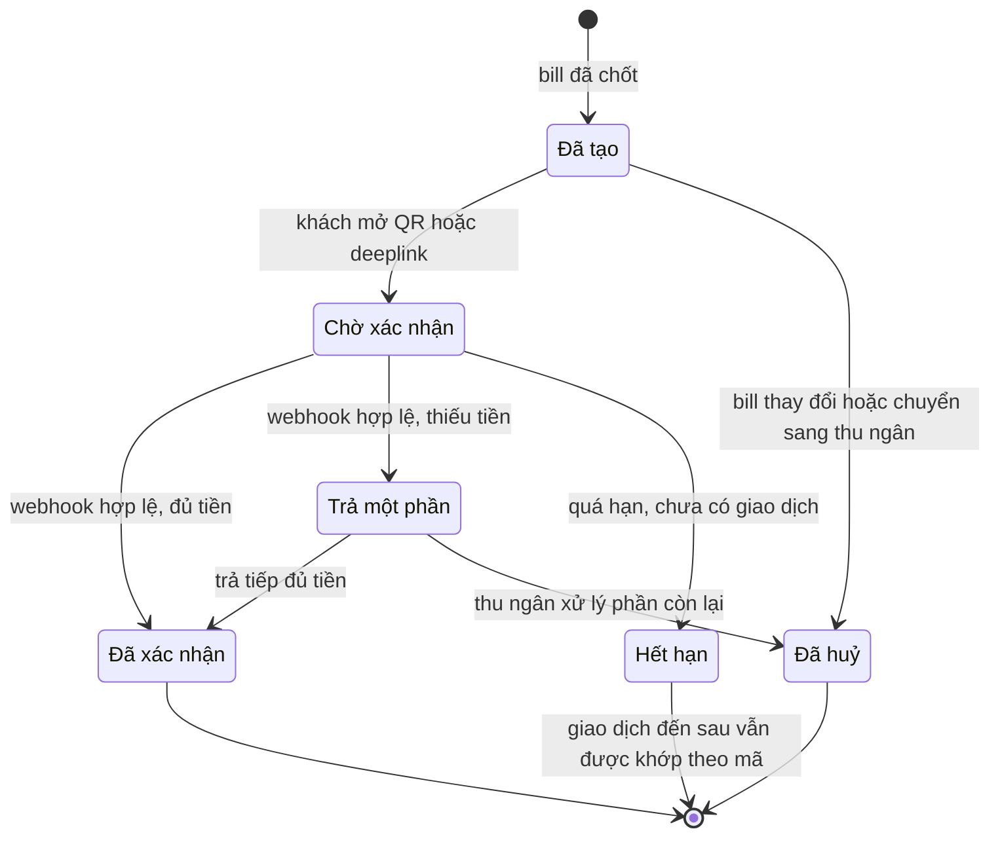
```mermaid
stateDiagram-v2
    state "Đã tạo" as ICreated
    state "Chờ xác nhận" as IAwaiting
    state "Trả một phần" as IPartly
    state "Đã xác nhận" as IConfirmed
    state "Hết hạn" as IExpired
    state "Đã huỷ" as ICancelled
    [*] --> ICreated : bill đã chốt
    ICreated --> IAwaiting : khách mở QR hoặc deeplink
    IAwaiting --> IConfirmed : webhook hợp lệ, đủ tiền
    IAwaiting --> IPartly : webhook hợp lệ, thiếu tiền
    IPartly --> IConfirmed : trả tiếp đủ tiền
    IAwaiting --> IExpired : quá hạn, chưa có giao dịch
    ICreated --> ICancelled : bill thay đổi hoặc chuyển sang thu ngân
    IPartly --> ICancelled : thu ngân xử lý phần còn lại
    IConfirmed --> [*]
    IExpired --> [*] : giao dịch đến sau vẫn được khớp theo mã
    ICancelled --> [*]
```

- **Lệnh hết hạn không có nghĩa là tiền bị bỏ qua.** Giao dịch có đúng mã đến sau vẫn được khớp vào bill, hoặc vào hàng chờ trả trùng nếu bill đã đủ tiền (BR-50, BR-51).

## C. Kiểm tra nhất quán giữa các mô hình

Theo checklist `model-consistency-checklist` của skill `model-consistency-checker`.

| Câu hỏi kiểm tra | Kết quả | Ghi chú |
|---|---|---|
| Mọi tác nhân chính có trong mô hình use case? | ✅ | 10 tác nhân người, 6 hệ thống ngoài |
| Luồng trong use case có trong sơ đồ hoạt động hoặc tuần tự? | ✅ | UC-01 ↔ SD-01; UC-03 ↔ SD-02; UC-09/10 ↔ SD-03; UC-11 ↔ SD-04; UC-21 ↔ SD-06; UC-13 ↔ SD-07; UC-31 ↔ P10 và SD-05 |
| Participant trong sơ đồ tuần tự có lớp hoặc thành phần tương ứng? | ✅ | Edge, Cloud, dịch vụ in ↔ kiến trúc §3; ApprovalRequest, Payment, TransferNote ↔ mô hình miền |
| Bội số hợp lý với tình huống? | ✅ | TableSession–TableAssignment `1..*` cho phép chuyển N→M bàn; Bill–TableSession `1..*` cho phép gộp; OrderRound–KitchenTicket `0..*` cho nhập bù không in |
| Chuyển trạng thái khớp luồng use case? | ✅ | ST-01 khớp BR-06/07; ST-05 khớp BR-11; ST-08 khớp BR-03 |
| Triển khai có mâu thuẫn giả định runtime? | ⚠️ | Offline cần UPS và 4G (NFR-09, NFR-10): **chưa được báo giá** (S10). Nếu không mua UPS thì NFR-08 chỉ còn đúng khi còn điện |
| Mô hình miền có chi tiết cài đặt quá sớm? | ✅ | UUID và Money giữ ở mức khái niệm; chi tiết kiểu dữ liệu nằm ở CSDL |
| Mô hình thiết kế đủ để cài đặt? | ⚠️ | Còn phụ thuộc kết quả S1 (ngân hàng), S7 (định dạng MISA) và OI-10 (số máy in) |
| *(CR-01)* Use case kênh khách có sơ đồ tương ứng? | ✅ | UC-34, 35 ↔ SD-08, ST-09; UC-38 ↔ SD-09, ST-10; BR-55 ↔ SD-10 |
| *(CR-01)* Lớp mới có trong CSDL? | ✅ | TableQrCode, SeatingCode, GuestSession, GuestOrderRequest, ServiceRequest, PaymentIntent, ItemStatusHistory ↔ ERD §5b |
| *(CR-01)* Trạng thái khách thấy khớp với trạng thái món? | ✅ | Khách thấy: *Chờ xác nhận* (ST-09 GPending) → *Bếp đã nhận* (ST-01 Sent) → *Xong* (Ready, nếu bật) → *Đã phục vụ* (Served). Không ánh xạ InProgress (BR-47) |
