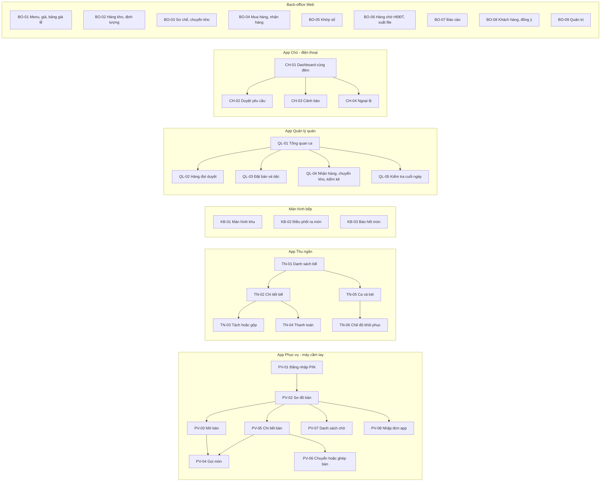
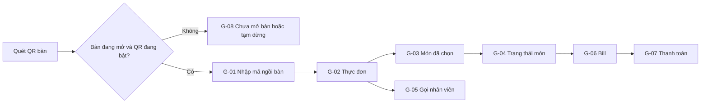

# Thiết kế — Phần 5: Giao diện (sơ đồ màn hình và wireframe)

> Phương pháp: skill `prototype-elicitation` (45ck/business-analysis-skills). Wireframe ở mức **ý tưởng (low-fidelity)** để **thử với người dùng thật** trong tối thử (TR-06). Chưa phải thiết kế đồ hoạ cuối.

## 1. Nguyên tắc giao diện (rút ra từ phỏng vấn)

| # | Nguyên tắc | Nguồn |
|---|---|---|
| UX-1 | **Gọi thêm món ≤ 4 chạm**: mở bàn → chạm món (mặc định size hay gọi) → Gửi. Nút **GỬI** luôn nằm cố định ở đáy màn hình | NFR-01, S4-Z1 |
| UX-2 | **Không giấu thông tin quan trọng**: dị ứng, GIỮ, HUỶ, THAY THẾ hiện ngay trên phiếu và thẻ món, không nằm sau thao tác chạm thêm | S3-K3 |
| UX-3 | **Trạng thái dùng cả màu, chữ và biểu tượng**, không chỉ màu; màn hình bếp có tương phản cao; **không dựa vào âm thanh** | S3-K3, NFR-05 |
| UX-4 | **Luôn hiện trạng thái kết nối** (Internet, máy chủ quán) và các dòng **CHƯA GỬI** | FR-OFF-02, FR-OFF-06 |
| UX-5 | **Lý do là danh sách chọn**; "Khác" mới cần gõ chữ | BR-05 |
| UX-6 | **Duyệt nhanh**: yêu cầu duyệt có **đồng hồ đếm ngược 3 phút**; người duyệt thấy đủ ngữ cảnh (bàn, món, số tiền, lý do, hạn mức còn lại) | BR-03 |
| UX-7 | **Tiếng Việt, đúng thuật ngữ**; tiền có dấu chấm (1.250.000đ); ngày dd/mm/yyyy | NFR-07 |
| UX-8 | Màn hình thu ngân **không có** ô sửa giá và **không có** nút "xác nhận theo ảnh chụp" | BR-16, BR-19 |

## 2. Sơ đồ màn hình theo ứng dụng



| Màn hình | Người dùng | FR chính | UC |
|---|---|---|---|
| PV-02 Sơ đồ bàn | Phục vụ, quản lý | FR-TBL-01, 02 | UC-01 |
| PV-04 Gọi món | Phục vụ | FR-ORD-01–05, 07 | UC-01, 02 |
| PV-05 Chi tiết bàn | Phục vụ | FR-ORD-06, 10 | UC-03 |
| PV-08 Nhập đơn app | Phục vụ trực quầy | FR-DLV-02 | UC-19 |
| TN-03 Tách hoặc gộp | Thu ngân | FR-BIL-02, 03 | UC-08 |
| TN-04 Thanh toán | Thu ngân | FR-BIL-07–12 | UC-08, 11 |
| TN-05 Ca và két | Thu ngân, quản lý | FR-SHF-01–06 | UC-13, 14 |
| TN-06 Chế độ khôi phục | Thu ngân, quản lý | FR-OFF-04, 05 | UC-31 |
| KB-01, KB-02 | Bếp | FR-KIT-02–05, 08 | UC-04 |
| QL-01 Tổng quan ca | Quản lý | FR-RPT-02 | UC-27 |
| QL-02 Hàng đợi duyệt | Quản lý | FR-AUD-03 | UC-03, 09 |
| CH-01 Dashboard | Chủ | FR-RPT-01, 04 | UC-27 |
| CH-02 Duyệt yêu cầu | Chủ | FR-BIL-05 | UC-10 |
| BO-05 Khớp số | Kế toán | FR-RPT-05, FR-DLV-04 | UC-28 |
| *(CR-01)* PV-09 Hàng chờ xác nhận QR | Phục vụ (thu ngân dự phòng) | FR-GST-06–08 | UC-35 |
| *(CR-01)* TN-07 Theo dõi tự thanh toán | Thu ngân | FR-GST-16, 19 | UC-40 |
| *(CR-01)* QL-06 Công tắc QR, cấp lại mã QR | Quản lý | FR-GST-01, 12 | UC-39 |
| *(CR-01)* G-01 … G-08 App Khách | Khách | FR-GST-02–05, 09–11, 13–15, 18 | UC-33, 34, 36–38 |

## 3. Wireframe

### PV-04 Gọi món (máy cầm tay)

```text
┌──────────────────────────────────────────┐
│ ◀ Bàn 12 · 6 khách · 45'     ● LAN  ● NET│  ← trạng thái kết nối (UX-4)
├──────────────────────────────────────────┤
│ [Hay gọi] [Nướng] [Lẩu] [Món Việt] [Uống]│
│ 🔍 Tìm món...                            │
├──────────────────────────────────────────┤
│ Heo nướng       [Nhỏ 150g] [LỚN 250g]  + │  ← chạm size = thêm 1
│ Bò nướng        [Nhỏ]      [Lớn]       + │
│ Lẩu set A (4ng)                   ▸ set  │
│ Mực nướng sa tế            ⛔ HẾT MÓN    │  ← không chọn được (FR-ORD-07)
├──────────────────────────────────────────┤
│ Món sắp gửi (2)                          │
│  1× Heo nướng LỚN   [ít cay]    ✎  🗑    │
│  1× Lẩu set A       ⏸ GIỮ – lượt 2  ✎ 🗑 │  ← giữ món (FR-ORD-04)
│  ⚠ Dị ứng: ĐẬU PHỘNG "khách dị ứng nặng" │  ← nổi bật (FR-ORD-03)
├──────────────────────────────────────────┤
│           [      GỬI BẾP (2)      ]      │  ← luôn cố định ở đáy
└──────────────────────────────────────────┘
```

### PV-02 Sơ đồ bàn

```text
┌──────────────────────────────────────────┐
│ Đống Đa  [Trong nhà] [Sân trong]         │
├──────────────────────────────────────────┤
│  [ 1 ]      [ 2 ●]      [ 3 $]   [ 4 ⏳] │
│  trống     6k·45'     chờ TT   đặt 19:30│
│                                          │
│  [ 5 ●!]    [ 6 ●]      [ 7 ~]   [ 8 ]   │
│  4k·70'     2k·10'     đang dọn  trống  │
│  !món chờ 22'                            │
├──────────────────────────────────────────┤
│ ● đang phục vụ  $ chờ thanh toán  ~ dọn  │
│ ⏳ đã đặt   ! món chờ lâu   ⚠ CHƯA GỬI (1)│
└──────────────────────────────────────────┘
```

### KB-01 Màn hình khu (ví dụ khu Nướng)

```text
┌─ NƯỚNG ───────────────────────────────── 19:42 ─┐
│ ┌ BÀN 12 ─ 3' ──────┐ ┌ BÀN 5 ─ 14' ⚠ ───────┐ │
│ │ ⚠ DỊ ỨNG ĐẬU PHỘNG │ │ 2× Bò nướng LỚN       │ │
│ │  [Đã xem ✔]        │ │    ít cay             │ │
│ │ 1× Heo nướng LỚN   │ │ ── MÓN THÊM 19:40 ──  │ │
│ │    ít cay          │ │ 1× Gà nướng NHỎ       │ │
│ │ [BẮT ĐẦU] [XONG]   │ │ [BẮT ĐẦU]  [XONG]     │ │
│ └────────────────────┘ └───────────────────────┘ │
│ ┌ BÀN 9 ─ ✖ HUỶ ────────────────────────────┐    │
│ │ ✖ HUỶ 1× Bò nướng NHỎ – khách đổi ý        │    │
│ │ Đã bắt đầu? [Chưa – dùng lại] [Đã làm – bỏ]│    │
│ │ [ĐÃ THẤY THAY ĐỔI]                         │    │  ← không tự tắt (FR-KIT-05)
│ └────────────────────────────────────────────┘    │
└──────────────────────────────────────────────────┘
```

### Phiếu bếp in (80mm, ESC/POS)

```text
================================
  NƯỚNG        PHIẾU #DDA-0427
  BÀN 12       19:41   PV: Hoa
================================
  *** DỊ ỨNG: ĐẬU PHỘNG ***
  "khách dị ứng nặng"
--------------------------------
  ++ MÓN THÊM ++
  1 x HEO NƯỚNG (LỚN 250g)
      - ít cay
--------------------------------
  GIỮ: Lẩu set A (chờ gọi ra)
================================
```

### TN-04 Thanh toán

```text
┌───────────────────────────────────────────────┐
│ Bill DDA-270222-0042 · Bàn 7,8,9 (nhóm)       │
│ Tạm tính            3.480.000                 │
│ Giảm giá (chờ lâu)  − 150.000   QL: Lan       │
│ Cọc K-31            −1.000.000                │
│ Còn phải trả        2.330.000                 │
├───────────────────────────────────────────────┤
│ HĐ: ○ Khách lẻ  ● Công ty [Tên][MST][Email]   │
├───────────────────────────────────────────────┤
│ [Tiền mặt] [Chuyển khoản QR] [Thẻ] [Ví]       │
│  QR: 1.330.000  "KB DDA 7K3F2Q" ✔ ĐÃ NHẬN     │
│  Thẻ: 500.000   mã chuẩn chi [______]         │
│  Tiền mặt: 500.000  khách đưa 500.000         │
├───────────────────────────────────────────────┤
│ Đã nhận 2.330.000 / 2.330.000 [ĐÓNG BILL]     │
└───────────────────────────────────────────────┘
  (không có ô sửa giá · không có "xác nhận theo ảnh")
```

### TN-05 Chốt ca

```text
┌───────────────────────────────────────────────┐
│ CHỐT CA TỐI · Huy · Đống Đa · 27/02           │
│ Quỹ đầu ca              1.000.000             │
│ Thu tiền mặt           14.230.000             │
│ Thối lại               − 2.310.000            │
│ Phiếu chi (2)            − 450.000  📎 2/2     │
│ Làm tròn tiền mặt           − 4.000           │
│ Tiền mặt dự kiến       12.466.000             │
│ Đếm thực tế           [12.216.000]            │
│ Chênh lệch               − 250.000  ⚠ >200k   │
│ Lý do [Chọn ▾] ..............                 │
├───────────────────────────────────────────────┤
│ ⚠ Dự định, chưa xác nhận: Thẻ 500.000 (B-0051)│
│ ✔ Đối chiếu khôi phục: không có sự cố         │
├───────────────────────────────────────────────┤
│ [ QUẢN LÝ KÝ (PIN) ]                          │
└───────────────────────────────────────────────┘
```

### CH-01 Dashboard của chủ (điện thoại, cùng đêm)

```text
┌─────────────────────────────┐
│ Hôm nay 27/02 · 23:20       │
│ ⚠ 2 cảnh báo                │
├─────────────────────────────┤
│ ĐỐNG ĐA            ✔ đã chốt│
│ Doanh thu     38.420.000    │
│  sau giảm     37.970.000    │
│ Tiền mặt ✔  QR 21,1tr  Thẻ 6,4tr│
│ App 5,2tr (chưa về tiền)    │
│ Giảm giá 450k · Huỷ 3 món   │
│ Lệch két −250.000 ⚠         │
├─────────────────────────────┤
│ CẦU GIẤY           ✔ đã chốt│
│ ...                         │
├─────────────────────────────┤
│ Chưa giải quyết (3)       ▸ │
│ • Thẻ 500k chưa xác nhận    │
│ • CK 680k chưa khớp bill    │
│ • Phiếu chuyển Hai Bà Trưng tranh chấp│
└─────────────────────────────┘
```

### CH-02 Duyệt yêu cầu (thông báo đẩy)

```text
┌─────────────────────────────┐
│ YÊU CẦU DUYỆT  ⏱ 2:41       │  ← đếm ngược 3 phút (UX-6)
│ Đống Đa · Bàn 5 · QL Lan    │
│ Giảm 250.000 (bill 1.900.000)│
│ Lý do: Chờ lâu              │
│ "Khách chờ lẩu 35 phút"     │
│ Hạn mức còn lại ca: 90.000  │
│ [ TỪ CHỐI ]   [ DUYỆT ]     │
└─────────────────────────────┘
```

## 4. App Khách và màn hình nhân viên cho kênh QR (CR-01)

### 4.1 Nguyên tắc riêng cho App Khách

| # | Nguyên tắc | Nguồn |
|---|---|---|
| UX-9 | **Không cần cài app, không cần đăng nhập**: quét QR, nhập mã ngồi bàn một lần | BR-57, NFR-40 |
| UX-10 | **Nói thật về trạng thái**: không có "đang nấu", không đếm ngược giờ ra món | BR-47 |
| UX-11 | **Luôn có đường lui về nhân viên**: nút "Gọi nhân viên" hiện ở mọi màn hình | S9-L7 |
| UX-12 | **Thanh toán an toàn**: hiện **tên công ty và số tài khoản**; không bao giờ gợi ý "trả lại"; nhắc khách chỉ trả cho đúng tên này | BR-51, BR-53 |
| UX-13 | **Chữ lớn, nút lớn**, dùng được một tay, chạy tốt trong trình duyệt của Zalo | NFR-41, NFR-42 |

### 4.2 Bản đồ màn hình App Khách



### G-02 Thực đơn (điện thoại khách)

```text
┌──────────────────────────────┐
│ Khói Bếp · Bàn 6             │
│ ⏰ Món ăn nhận tới 21:45      │
│ [Nướng] [Lẩu] [Món Việt] [Uống]│
├──────────────────────────────┤
│ 🖼 Heo nướng   Nhỏ 89k  Lớn 139k [+]│
│ 🖼 Bò nướng    Nhỏ 119k Lớn 179k [+]│
│ 🖼 Mực sa tế        ⛔ HẾT MÓN │
│ 🖼 Lẩu set A  👤 gọi qua nhân viên│
│ 🍺 Bia Tiger chai  25k  [+]  │
│    ⓘ Nhân viên sẽ kiểm tra tuổi│
├──────────────────────────────┤
│ [ 🛎 Gọi nhân viên ] [Giỏ (2)]│
└──────────────────────────────┘
```

### G-04 Trạng thái món

```text
┌──────────────────────────────┐
│ Bàn 6 · Món của bàn          │
├──────────────────────────────┤
│ 19:05  2× Nước suối          │
│   ✔ Bếp đã nhận ─ ✔ Đã phục vụ│
│ 19:21  1× Bò nướng lớn  (bạn) │
│   ✔ Bếp đã nhận ─ ○ Đã phục vụ│
│ 19:24  2× Bia Tiger  (Minh)   │
│   ⏳ Chờ nhân viên xác nhận    │
│   [ Rút lại ]                 │
├──────────────────────────────┤
│ Không hiển thị "đang nấu"     │  ← BR-47
│ [ 🛎 Gọi nhân viên ] [ Bill ] │
└──────────────────────────────┘
```

### G-07 Thanh toán chuyển khoản

```text
┌──────────────────────────────┐
│ Thanh toán bàn 6             │
│ Còn phải trả   1.230.000đ    │
│ (đã trừ cọc 1.000.000đ)       │
├──────────────────────────────┤
│       ▓▓▓▓▓▓▓▓▓▓▓▓            │
│       ▓  VietQR   ▓           │
│       ▓▓▓▓▓▓▓▓▓▓▓▓            │
│ Chủ TK: CTY TNHH KHOI BEP        │
│ Số TK: •••• 1234  (Vietcombank)│
│ Nội dung: KB DDA 7K3F2Q       │
│ [ Mở app ngân hàng ]          │
│ [ Lưu ảnh QR ]                │
├──────────────────────────────┤
│ ⏳ Đang chờ ngân hàng xác nhận│
│ Đã chuyển? Vui lòng chờ,      │
│ KHÔNG chuyển lại.             │  ← BR-51
│ [ 🛎 Gọi nhân viên ]          │
└──────────────────────────────┘
```

### PV-09 Hàng chờ xác nhận QR (máy phục vụ)

```text
┌──────────────────────────────────────────┐
│ ĐƠN QR CHỜ XÁC NHẬN (3)                  │
├──────────────────────────────────────────┤
│ Bàn 6 · 0:48 · điện thoại Minh           │
│  2× Bia Tiger chai   🍺 kiểm tra tuổi     │
│  [Từ chối]                 [XÁC NHẬN]    │
├──────────────────────────────────────────┤
│ Bàn 4 · 1:12 ⚠ quá 1 phút                │
│  1× Lẩu set A  ⚠ có thể trùng đơn 19:02   │
│  [Hỏi khách] [Từ chối]     [XÁC NHẬN]    │
├──────────────────────────────────────────┤
│ Bàn 2 · 0:15                              │
│  1× Gà nướng  ⚠ DỊ ỨNG "tôm"             │
│  [Đã trao đổi với khách] → chờ bếp trưởng │
└──────────────────────────────────────────┘
```

### TN-07 Theo dõi tự thanh toán (máy thu ngân)

```text
┌───────────────────────────────────────────────────┐
│ TỰ THANH TOÁN · Đống Đa                           │
├───────────────────────────────────────────────────┤
│ Bàn 6  1.230.000  KB DDA 7K3F2Q ✔ Đã xác nhận     │
│ Bàn 4    980.000  KB DDA 9P2L4X ⏳ Chờ xác nhận 3' │
│                   → Kiểm tra tài khoản trước       │
│ Bàn 2    650.000  KB DDA 2M8K1D ◐ Trả một phần     │
│                   đã nhận 500.000 · thiếu 150.000  │
├───────────────────────────────────────────────────┤
│ KHÔNG KHỚP (1)                                     │
│ 650.000 · nội dung "chuyen khoan an toi" · 20:41   │
│ [Gán cho bill…]  (cần quản lý duyệt)               │
└───────────────────────────────────────────────────┘
```
