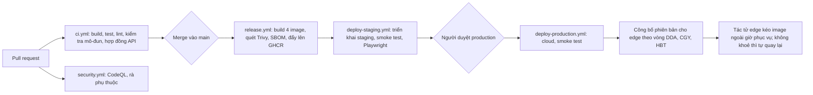

# Thiết kế — Phần 7: Cấu trúc mã nguồn và CI/CD

> Đáp ứng **CON-11**, **NFR-43 … 46**, **ADR-11, ADR-12**. Stack: **Java 21 + Spring Boot 3 · React + TypeScript · PostgreSQL 16 · Docker · GitHub Actions · GHCR**.
> Pattern CI/CD học từ repo tham khảo (user7121, order_by_qr, TruongDx2004), xem [06-tham-khao-repo.md](06-tham-khao-repo.md). YAML trong tài liệu này là **mẫu thiết kế**; phiên bản action và thư viện cần kiểm tra lại khi tạo repo thật.

## 1. Cấu trúc repository (monorepo)

```text
bnn-rms/
├── backend/                         # Spring Boot 3, Java 21, Maven
│   ├── pom.xml
│   └── src/
│       ├── main/java/vn/bnn/rms/
│       │   ├── BnnRmsApplication.java
│       │   ├── identity/            # mỗi thư mục là 1 mô-đun Spring Modulith
│       │   ├── catalog/
│       │   ├── outletops/           # bàn, lượt phục vụ, order, bếp
│       │   ├── billing/             # bill, thanh toán, ca, két
│       │   ├── approvals/           # phê duyệt, nhật ký
│       │   ├── recovery/
│       │   ├── sync/                # outbox/inbox, kênh trực tiếp edge-cloud
│       │   ├── guest/               # CR-01: QR bàn, mã ngồi bàn, phiên khách, đơn QR
│       │   ├── payments/            # CR-01: lệnh thanh toán, PaymentProvider, đối soát
│       │   ├── reservations/
│       │   ├── inventory/
│       │   ├── prep/
│       │   ├── purchasing/
│       │   ├── customers/
│       │   ├── reporting/
│       │   └── integrations/        # HĐĐT, MISA, nhắn tin
│       ├── main/resources/
│       │   ├── application.yml
│       │   ├── application-edge.yml
│       │   ├── application-cloud.yml
│       │   └── db/migration/        # Flyway: V1__baseline.sql, V2__..., R__report_views.sql
│       └── test/java/...            # JUnit 5, Testcontainers, ApplicationModules.verify()
├── frontend/                        # pnpm workspace
│   ├── apps/staff/                  # React PWA: phục vụ, thu ngân, bếp, quản lý (offline queue)
│   ├── apps/guest/                  # React: khách QR (bundle nhỏ, tên miền riêng)
│   ├── apps/backoffice/             # React: chủ, kế toán, mua hàng, sơ chế
│   ├── packages/ui/                 # component dùng chung
│   └── packages/api-client/         # client TypeScript sinh từ OpenAPI
├── e2e/                             # Playwright, bám theo AC
├── deploy/
│   ├── cloud/docker-compose.yml     # backend(profile cloud) + nginx + 3 app tĩnh
│   ├── edge/docker-compose.yml      # backend(profile edge) + postgres + tác tử cập nhật
│   └── nginx/
├── docs/                            # bộ tài liệu phân tích thiết kế này
└── .github/workflows/
    ├── ci.yml
    ├── security.yml
    ├── release.yml
    ├── deploy-staging.yml
    └── deploy-production.yml
```

### 1.1 Bên trong một mô-đun backend

Tổ chức theo **Controller → Service → Repository → Entity** (học từ numa và order_by_qr), kèm ranh giới Spring Modulith:

```text
guest/
├── package-info.java        # @ApplicationModule(allowedDependencies = {"catalog", "sync"})
├── api/                     # REST controller, DTO (record), public event: GuestOrderSubmitted
├── application/             # GuestOrderService, GuestSessionService, HoldFlagPolicy, DuplicateDetector
├── domain/                  # entity JPA: GuestSession, GuestOrderRequest, ...; enum trạng thái + chuyển trạng thái có kiểm tra
└── infrastructure/          # Spring Data repository, adapter, cấu hình STOMP topic
```

- **Mô-đun khác chỉ dùng được** package `api` và **sự kiện miền** được công bố. Test `ApplicationModules.of(BnnRmsApplication.class).verify()` chạy trong CI để chặn phụ thuộc vòng.
- **Profile:** `edge` bật `outletops`, `billing`, `approvals`, `recovery`, `sync`, và phần tiếp nhận đơn QR của `guest`. `cloud` bật tất cả trừ dịch vụ in.

## 2. Quy trình làm việc với mã nguồn

| Chủ đề | Quy ước |
|---|---|
| Nhánh | **Trunk-based**: `main` luôn triển khai được; nhánh tính năng ngắn ngày `feat/...`, `fix/...` |
| Pull request | Bắt buộc 1 người review và **CI xanh**. Nhánh `main` được bảo vệ, không push thẳng |
| Commit | **Conventional Commits** (`feat:`, `fix:`, `chore:`...) để sinh changelog |
| Phiên bản | Tag `vMAJOR.MINOR.PATCH`. Image được gắn tag semver và `sha-<commit>` |
| Migration | Mỗi thay đổi lược đồ là một file Flyway mới, **tương thích ngược** (expand/contract) |
| Hợp đồng API | OpenAPI do springdoc sinh ra. CI **sinh lại client TypeScript** và báo lỗi nếu khác với bản đã commit |

## 3. Môi trường

| Môi trường | Thành phần | Triển khai |
|---|---|---|
| Local | `docker compose` với PostgreSQL, backend (profile edge và cloud), 3 app frontend, dữ liệu mẫu | Lập trình viên |
| CI | Container dịch vụ PostgreSQL và Testcontainers | Mỗi PR |
| Staging | Cloud staging + **1 edge giả lập** (máy ảo) + máy in giả (ghi file) | **Tự động** khi merge `main` |
| Production cloud | Máy ảo cloud (ưu tiên Việt Nam, OI-12) | **Cần duyệt** (GitHub Environment `production`) |
| Edge theo vòng | `edge-dda` (thí điểm) → `edge-cgy` → `edge-hbt` | Edge **tự kéo** image theo lịch, ngoài giờ phục vụ và ngoài lịch đóng băng |

## 4. Pipeline



### 4.1 Cổng chất lượng (không đạt thì không merge hoặc không triển khai)

| Cổng | Công cụ | Ngưỡng | NFR |
|---|---|---|---|
| Build và test backend | `./mvnw -B verify` (JUnit 5, Testcontainers PostgreSQL) | 100% test đạt | NFR-44 |
| Ranh giới mô-đun | Spring Modulith `verify()` | Không vi phạm | NFR-44 |
| Độ phủ | JaCoCo | ≥ 70% dòng ở `billing`, `outletops`, `payments`, `guest` | NFR-44 |
| Frontend | ESLint, `tsc --noEmit`, Vitest, build 3 app | 100% đạt; **bundle app khách ≤ 300 KB gzip** | NFR-35, 44 |
| Hợp đồng API | Sinh client từ OpenAPI rồi `git diff --exit-code` | Không lệch | — |
| Bảo mật mã nguồn | CodeQL (Java, JavaScript/TypeScript), dependency-review | Không có cảnh báo mức High trở lên mới | NFR-44 |
| Bảo mật image | Trivy | **0 lỗ hổng mức Critical** | NFR-44 |
| E2E | Playwright trên staging (AC-01, 05, 08, 15, 25, 43–56) | 100% kịch bản then chốt đạt | NFR-46 |
| Smoke sau triển khai | `/actuator/health/readiness`, vài API chính | Khoẻ trong ≤ 5 phút; không khoẻ thì rollback | NFR-45 |

### 4.2 Mẫu `ci.yml`

```yaml
name: CI
on:
  pull_request:
  push:
    branches: [main]
permissions:
  contents: read
jobs:
  backend:
    runs-on: ubuntu-latest
    defaults: { run: { working-directory: backend } }
    steps:
      - uses: actions/checkout@v4
      - uses: actions/setup-java@v4
        with: { distribution: temurin, java-version: '21', cache: maven }
      - name: Build, unit + integration tests (Testcontainers), module check, coverage
        run: ./mvnw -B verify
      - name: Export OpenAPI spec
        run: ./mvnw -B -Popenapi springdoc-openapi:generate
      - uses: actions/upload-artifact@v4
        with: { name: openapi, path: backend/target/openapi.json }
  frontend:
    runs-on: ubuntu-latest
    needs: backend
    defaults: { run: { working-directory: frontend } }
    steps:
      - uses: actions/checkout@v4
      - uses: pnpm/action-setup@v4
      - uses: actions/setup-node@v4
        with: { node-version: '20', cache: pnpm, cache-dependency-path: frontend/pnpm-lock.yaml }
      - run: pnpm install --frozen-lockfile
      - uses: actions/download-artifact@v4
        with: { name: openapi, path: frontend/packages/api-client }
      - name: Regenerate API client and fail on drift
        run: pnpm --filter api-client generate && git diff --exit-code
      - run: pnpm -r lint && pnpm -r typecheck && pnpm -r test
      - run: pnpm -r build
      - name: Guest bundle budget (NFR-35)
        run: pnpm --filter guest size-check
```

> Lưu ý: bước "export OpenAPI" cần backend chạy để sinh file. Trong repo thật có thể dùng plugin `springdoc-openapi-maven-plugin` gắn vào pha `integration-test`. Đây là chi tiết cài đặt, sẽ chốt khi tạo repo.

### 4.3 Mẫu `deploy-production.yml` (rút gọn)

```yaml
name: Deploy production
on:
  workflow_dispatch:
    inputs:
      version: { description: 'Image tag (vd v1.4.0)', required: true }
jobs:
  cloud:
    runs-on: ubuntu-latest
    environment: production          # yêu cầu người duyệt
    steps:
      - name: Deploy cloud stack
        uses: appleboy/ssh-action@v1
        with:
          host: ${{ secrets.CLOUD_HOST }}
          username: ${{ secrets.CLOUD_USER }}
          key: ${{ secrets.CLOUD_SSH_KEY }}
          script: |
            cd /opt/bnn-rms && export TAG=${{ inputs.version }}
            docker compose pull && docker compose up -d
      - name: Smoke test
        run: curl -fsS --retry 10 --retry-delay 15 https://api.bnn.vn/actuator/health/readiness
  edge-rollout:
    needs: cloud
    runs-on: ubuntu-latest
    environment: production
    steps:
      - name: Publish desired version for pilot ring (edge-dda)
        run: |
          curl -fsS -X PUT https://api.bnn.vn/admin/edge-rings/bt/desired-version \
            -H "Authorization: Bearer ${{ secrets.RELEASE_TOKEN }}" \
            -d '{"version":"${{ inputs.version }}"}'
```

### 4.4 Cập nhật edge (ADR-12)

- Mỗi edge có **tác tử cập nhật** (một container nhỏ) hỏi cloud "phiên bản mong muốn". Như vậy **không cần mở cổng vào quán**.
- Tác tử chỉ cập nhật trong **cửa sổ cho phép** (ví dụ 02:00–09:00) và **không** cập nhật trong lịch đóng băng (tất niên, Tết, tháng 4; NFR-30).
- Cập nhật xong mà kiểm tra sức khoẻ không đạt thì **tự quay lại tag trước**.
- Vòng triển khai: **Đống Đa (thí điểm) → Cầu Giấy → Hai Bà Trưng**. Chuyển vòng sau khi vòng trước chạy ổn ≥ 1 ngày phục vụ.

### 4.5 Rollback và migration

- **Rollback** = triển khai lại tag image trước đó (mục tiêu ≤ 15 phút, NFR-45).
- Migration luôn **tương thích ngược**: thêm cột hoặc bảng trước, chuyển dữ liệu, rồi mới bỏ phần cũ ở một phiên bản sau. Nhờ vậy image cũ vẫn chạy được trên lược đồ mới.
- Sao lưu PostgreSQL **trước mỗi lần triển khai production** và hằng ngày (NFR-19).

## 5. Cấu hình và bí mật

| Loại | Nơi lưu | Ghi chú |
|---|---|---|
| Khoá tuyến ngân hàng, webhook secret | GitHub Environment secret → biến môi trường của cloud | **Chỉ có ở cloud**, không bao giờ xuống edge hay trình duyệt |
| Khoá ký JWT, khoá băm token | Secret của cloud; edge nhận khoá riêng khi ghép cặp | Xoay vòng định kỳ |
| Chuỗi kết nối CSDL | Secret theo môi trường | Không commit `.env` |
| Tham số nghiệp vụ (hạn mức, giờ gọi cuối...) | Bảng `rule_parameter` (FR-ADM-06) | **Không** để trong file cấu hình |

## 6. Quan sát và cảnh báo vận hành

| Tín hiệu | Nguồn | Cảnh báo |
|---|---|---|
| Nhịp tim edge | Kênh trực tiếp edge–cloud | Mất > 60 giây: QR tạm dừng. Mất > 15 phút trong giờ phục vụ: báo chủ (BR-29, BR-55) |
| Tỷ lệ lỗi API, độ trễ P95 | Micrometer → Prometheus | Vượt ngưỡng: báo kỹ thuật |
| Webhook sai chữ ký hoặc thất bại | Mô-đun `payments` | Báo kỹ thuật và kế toán |
| Giao dịch không khớp tồn đọng | Mô-đun `payments` | > 0 lúc chốt ca: hiện trên TN-07 và báo cáo đêm |
| Đơn QR chờ quá 1 phút | Mô-đun `guest` | Tô nổi trên PV-09, báo thu ngân |

## 7. Ánh xạ kiểm thử với tiêu chí chấp nhận

| Tầng | Ví dụ | AC |
|---|---|---|
| Đơn vị (JUnit) | Chia bill phân bổ từng đồng; làm tròn tiền mặt; hạn mức bill và ca; quy tắc cọc | AC-08, 09, 10, 11, 23 |
| Tích hợp (Testcontainers) | Idempotency khi gửi món; outbox và đồng bộ; unique index một lệnh thanh toán mỗi bill; chống xử lý trùng webhook | AC-02, 25, 54, 56 |
| Mô-đun (Spring Modulith) | `guest` không gọi thẳng vào nội bộ `billing` | — |
| E2E (Playwright) | Gọi món → bếp; huỷ có bếp xác nhận; đơn QR chờ xác nhận; tạm dừng QR; tự thanh toán với tuyến ngân hàng giả | AC-01, 05, 45, 51, 54 |
| Bảo mật | Phiên khách không đăng ký được kênh của bàn khác; mã ngồi bàn bị khoá sau 5 lần sai | AC-44, 60 |
